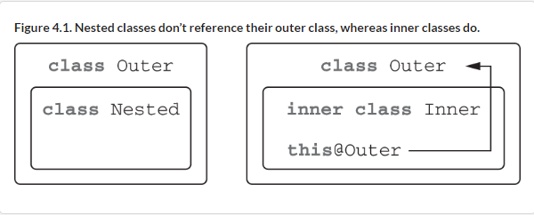
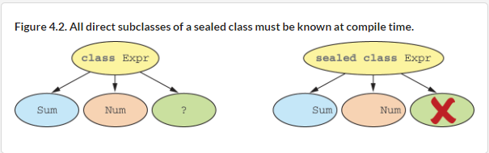

# 4 Classes, objects, and interfaces

::: tip This chapter covers

- Classes and interfaces
- Nontrivial properties and constructors Data classes
- Class delegation
- Using the object keyword

:::


In this chapter, you’ll get a deeper understanding of working with classes and interfaces in Kotlin. You already saw the basic syntax for declaring a class in 2.2. You know how to declare methods and properties, use simple primary constructors (aren’t they nice?), and work with enums. But there’s a lot more to see and learn on the topic!

Kotlin’s classes and interfaces differ a bit from what you might be used to from Java: for example, interfaces can contain property declarations. Kotlin’s declarations are final and public by default. In addition, nested classes aren’t inner by default: they don’t contain an implicit reference to their outer class.

For constructors, the short primary constructor syntax works great for the majority of cases, but Kotlin also comes with full syntax that lets you declare constructors with nontrivial initialization logic. The same works for properties: the concise syntax is nice, but you can easily define your own implementations of accessors.

The Kotlin compiler can generate useful methods to avoid verbosity. Declaring a class as a data class instructs the compiler to generate several standard methods for this class. You can also avoid writing delegating methods by hand, because the delegation pattern is supported natively in Kotlin.

You’ll also get to see Kotlin’s object keyword, that declares a class and also creates an instance of the class. The keyword is used to express singleton objects, companion objects, and object expressions (analogous to Java anonymous classes). Let’s start by talking about classes and interfaces and the details of defining class hierarchies in Kotlin.

## 4.1 Defining class hierarchies

::: details 在本节中，您将了解 Kotlin 中如何定义类层次结构。我们将了解 Kotlin 的可见性和访问修饰符，以及 Kotlin 为它们选择的默认值。您还将了解 seal 修饰符，它限制类的可能子类或接口的实现。

In this section, you’ll take a look at how class hierarchies are defined in Kotlin. We’ll look at Kotlin’s visibility and access modifiers, and which defaults Kotlin chooses for them. You’ll also learn about the sealed modifier, which restricts the possible subclasses of a class, or implementations of an interface.

:::

### 4.1.1 Interfaces in Kotlin

We’ll begin with a look at defining and implementing interfaces. Kotlin interfaces can contain definitions of abstract methods as well as implementations of non-abstract methods. However, they can’t contain any state.

To declare an interface in Kotlin, use the interface keyword instead of class. An interface that indicates that an element is clickable—like a button, or a hyperlink—could look like this:

Listing 4.1. Declaring a simple interface

```kotlin
interface Clickable {
    fun click()
}
```

This declares an interface with a single abstract method named click that doesn’t return any value[3]. All non-abstract classes implementing the interface need to provide an implementation of this method.

To mark a button as Clickable, you put the interface name behind a colon after the class name, and provide an implementation for the click function:

Listing 4.2. Implementing a simple interface

```kotlin
class Button : Clickable {
    override fun click() = println("I was clicked")
}

fun main() {
    Button().click()
    // I was clicked
}
```

Kotlin uses the colon after the class name for both composition (that is, implementing interfaces) and inheritance (that is, subclassing, as you’ll see it in 4.1.2). A class can implement as many interfaces as it wants, but it can extend only one class.

The override modifier is used to mark methods and properties that override those from the superclass or interface. Unlike Java, which uses the @Override annotation, using the override modifier is mandatory in Kotlin. This saves you from accidentally overriding a method if it’s added after you wrote your implementation; your code won’t compile unless you explicitly mark the method as override or rename it.
An interface method can have a default implementation. To do so, you just provide a method body. In this case, you could add a function showOff with a default implementation to the Clickable interface that simply prints some text:

Listing 4.3. Defining a method with a body in an interface

```kotlin
interface Clickable {
    fun click()
    fun showOff() = println("I'm clickable!")
}
```

If you implement this interface, you are forced to provide an implementation for click. You can redefine the behavior of the showOff method, or you can omit it if you’re fine with the default behavior.

Let’s suppose now that another interface also defines a showOff method and has the following implementation for it.

Listing 4.4. Defining another interface implementing the same method

```kotlin
interface Focusable {
    fun setFocus(b: Boolean) =
        println("I ${if (b) "got" else "lost"} focus.")

    fun showOff() = println("I'm focusable!")
}
```

What happens if you need to implement both interfaces in your class? Each of them contains a showOff method with a default implementation; which implementation wins? Neither one wins. Instead, you get the following compiler error if you don’t implement showOff explicitly:

```kotlin
The class 'Button' must override public open fun showOff()
because it inherits many implementations of it.
```

The Kotlin compiler forces you to provide your own implementation.

Listing 4.5. Invoking an inherited interface method implementation

```kotlin
class Button : Clickable, Focusable {
    override fun click() = println("I was clicked")

    override fun showOff() {
        super<Clickable>.showOff()
        super<Focusable>.showOff()
    }
}
```

The `Button` class now implements two interfaces. You implement `showOff()` by calling both implementations that you inherited from supertypes. To invoke an inherited implementation, you use the `super` keyword together with the base type name in angle brackets: `super<Clickable>.showOff()` (a different syntax from Java’s `Clickable.super.showOff()`)

If you only need to invoke one inherited implementation, you can use the expression body syntax, and write this:

```kotlin
override fun showOff() = super<Clickable>.showOff()
```

To verify that everything you’ve read so far is actually true, you can create an instance of your `Button` class and invoke all the inherited methods—the overridden `showOff` and `click` functions, as well as the setFocus function from the `Focusable` interface, which provided a default implementation:

Listing 4.6. Calling inherited and overridden methods

```kotlin
fun main() {
    val button = Button()
    button.showOff()
    // I'm clickable!
    // I'm focusable!
    button.setFocus(true)
    // I got focus.
    button.click()
    // I was clicked.
}
```

::: info **Implementing interfaces with method bodies in Java**

Kotlin compiles each interface with default methods to a combination of a regular interface and a class containing the method bodies as static methods. The interface contains only declarations, and the class contains all the implementations as static methods. Therefore, if you need to implement such an interface in a Java class, you have to define your own implementations of all methods, including those that have method bodies in Kotlin. For example, a JavaButton that implements Clickable needs to provide implementations for both click and showOff, even though Kotlin provides a default implementation for the latter:

Listing 4.7. Calling inherited and overridden methods

```kotlin
class JavaButton implements Clickable {
    @Override
    public void click() {
        System.out.println("I was clicked");
    }

    @Override
    public void showOff() {
        System.out.println("I'm showing off");
    }
}
```

Now that you’ve seen how Kotlin allows you to implement methods defined

in interfaces, let’s look at the second half of that story: overriding members defined in base classes.

### 4.1.2 Open, final, and abstract modifiers: final by default

By default, you can’t create a subclass for a Kotlin class or override any methods from a base class—all classes and methods are final by default.

This sets it apart from Java, where you are allowed to create subclasses of any class and can override any method, unless it has been explicitly marked with the final keyword. Why didn’t Kotlin follow this approach? Because while this is often convenient, it’s also problematic.

The so-called fragile base class problem occurs when modifications of a base class can cause incorrect behavior of subclasses because the changed code of the base class no longer matches the assumptions in its subclasses.

If the class doesn’t provide exact rules for how it should be subclassed (which methods are supposed to be overridden and how), the clients are at risk of overriding the methods in a way the author of the base class didn’t expect. Because it’s impossible to analyze all the subclasses, the base class is "fragile" in the sense that any change in it may lead to unexpected changes of behavior in subclasses.

To protect against this problem, Effective Java by Joshua Bloch (Addison- Wesley, 2008), one of the best-known books on good Java programming style, recommends that you "design and document for inheritance or else prohibit it." This means all classes and methods that aren’t specifically intended to be overridden in subclasses have to be explicitly marked as final.
Kotlin follows this philosophy, making its classes, methods, and properties are final by default.
If you want to allow the creation of subclasses of a class, you need to mark the class with the open modifier. In addition, you need to add the open modifier to every property or method that can be overridden.

Let’s say you want to spice up your user interface beyond a simple button, and create a clickable RichButton. Subclasses of this class should be able to provide their own animations, but shouldn’t be able to break basic behavior such as disabling the button. You could declare the class as follows:

Listing 4.8. Declaring an open class with an open method

```kotlin
open class RichButton : Clickable {
    fun disable() {}
    open fun animate() {}
    override fun click() {}
}
```

This means a subclass of RichButton could in turn look like this:

Listing 4.9. Declaring an open class with an open method

```kotlin
class ThemedButton : RichButton() {
    override fun animate() {}
    override fun click() {}
    override fun showOff() {}
}
```

Note that if you override a member of a base class or interface, the overriding member will also be open by default. If you want to change this and forbid the subclasses of your class from overriding your implementation, you can explicitly mark the overriding member as final.

Listing 4.10. Forbidding an override

```kotlin
open class RichButton : Clickable {
    final override fun click() {}
}
```

::: info Open classes and smart casts

One significant benefit of classes that are final by default is that they enable smart casts in a larger variety of scenarios. As we mentioned in 2.3.6, the compiler can only perform a smart cast (an automatic cast that allows you to access members without further manual casting) for variables which couldn't have changed after the type check.

For a class, this means smart casts can only be used with a class property that is a val and that doesn’t have a custom accessor. This requirement means the property has to be final, because otherwise a subclass could override the property and define a custom accessor, breaking the key requirement of smart casts.

Because properties are final by default, you can use smart casts with most properties without thinking about it explicitly, which improves the expressiveness of your code.

:::

You can also declare a class as `abstract`, making it so the class can’t be instantiated. An abstract class usually contains abstract members that don’t have implementations and must be overridden in subclasses. Abstract members are always open, so you don’t need to use an explicit `open` modifier (just like you don’t need an explicit `open` modifier in an `interface`).

An example for an abstract class would be class which defines the properties of an animation, like the animation speed and number of frames, as well as behavior for running the animation. Since these properties and methods only make sense when implemented by another object, Animated is marked as abstract:

Listing 4.11. Declaring an abstract class

```kotlin
abstract class Animated {
    abstract val animationSpeed: Double
    val keyframes: Int = 20
    open val frames: Int = 60

    abstract fun animate()
    open fun stopAnimating() { }
    fun animateTwice() { }
}
```

4.1lists the access modifiers in Kotlin. The comments in the table are applicable to modifiers in classes; in interfaces, you don’t use final, open, or abstract. A member in an interface is always open ; you can’t declare it as final. It’s abstract if it has no body, but the keyword isn’t required.

Table 4.1. The meaning of access modifiers in a class

| Modifier | Corresponding member                            | Comments                                                                            |
|----------|-------------------------------------------------|-------------------------------------------------------------------------------------|
| final    | Can’t be overridden                             | Used by default for class members                                                   |
| open     | Can be overridden                               | Should be specified explicitly                                                      |
| abstract | Must be overridden                              | Can be used only in abstract classes; abstract members can’t have an implementation |
| override | Overrides a member in a superclass or interface | Overridden member is open by default, if not marked final                           |

Having discussed the modifiers that control inheritance, let’s now take a look at the role visibility modifiers play in Kotlin.

### 4.1.3 Visibility modifiers: public by default

Visibility modifiers help to control access to declarations in your code base. By restricting the visibility of a class’s implementation details, you ensure that you can change them without the risk of breaking code that depends on the class.

Kotlin provides public, protected, and private modifiers which are analogous to their Java counterpart: public declarations are visible everywhere, protected declarations are visible in subclasses, and private declarations are visible inside a class, or, in the case of top-level declarations, visible inside a file.

In Kotlin, not specifying a modifier means the declaration is public.

::: warning Note

Public-by-default differs from what you might know from Java, but it is a convenient convention for application developers. Library authors, on the other hand, usually want to make sure that no parts of their API are accidentally exposed. Hiding a previously public API after the fact would be a breaking change, after all. For this case, Kotlin provides an explicit API mode. In explicit mode, you need to specify the visibility for declarations that would be exposed as a public API, and explicitly specify the type for properties and functions that are part of the public API, as well. Explicit API mode can be enabled using the `-Xexplicit-api={strict|warning}` compiler option or via your build system.

:::

For restricting visibility inside a module, Kotlin provides the visibility modifier `internal`. A module is a set of Kotlin files compiled together. That could be a Gradle source set, a Maven project, or an IntelliJ IDEA module.

::: warning Note

When using Gradle, the test source set can access declarations marked as internal from your main source set.

:::

::: info No package-private in Kotlin

Kotlin doesn’t have the concept of package-private visibility, which is the default visibility in Java. Kotlin uses packages only as a way of organizing code in namespaces; it doesn’t use them for visibility control.

The advantage of internal visibility is that it provides real encapsulation for the implementation details of your module. In Java, the encapsulation can be easily broken, because external code can define classes in the same packages used by your code and thus get access to your package-private declarations.

:::

Kotlin also allows you to use private visibility for top-level declarations, including classes, functions, and properties. Such declarations are visible only in the file where they are declared. This is another useful way to hide the implementation details of a subsystem. 4.2 summarizes all the visibility modifiers.

Table 4.2. Kotlin visibility modifiers

| Modifier         | Class member          | Top-level declaration |
|------------------|-----------------------|-----------------------|
| public (default) | Visible everywhere    | Visible everywhere    |
| internal         | Visible in a module   | Visible in a module   |
| protected        | Visible in subclasses | —                     |
| private          | Visible in a class    | Visible in a file     |

Let’s look at an example. Every line in the `giveSpeech` function tries to violate the visibility rules. It compiles with an error.

Listing 4.12. Using different visibility modifiers

```kotlin
internal open class TalkativeButton {
    private fun yell() = println("Hey!")
    protected fun whisper() = println("Let's talk!")
}

fun TalkativeButton.giveSpeech() {
    yell()

    whisper()
}
```

Kotlin forbids you to reference the less-visible type `TalkativeButton` (`internal`, in this case) from the `public` function `giveSpeech`. This is a case of a general rule that requires all types used in the list of base types and type parameters of a class, or the signature of a method, to be as visible as the class or method itself. This rule ensures that you always have access to all types you might need to invoke the function or extend a class. To solve the problem, you can either make the `giveSpeech` extension function internal or make the `TalkativeButton` class `public`.

Note the difference in behavior for the `protected` modifier in Java and in Kotlin. In Java, you can access a `protected` member from the same package, but Kotlin doesn’t allow that.

In Kotlin, visibility rules are simple, and a protected member is only visible in the class and its subclasses. Also note that extension functions of a class don’t get access to its `private` or `protected` members. This is also why you can’t call the `protected` `whisper` function from the extension function `giveSpeech`.

::: info Kotlin’s visibility modifiers and Java

public, protected, and private modifiers in Kotlin are preserved when compiling to Java bytecode. You use such Kotlin declarations from Java code as if they were declared with the same visibility in Java. The only exception is a private class: it’s compiled to a package-private declaration under the hood (you can’t make a class private in Java).

But, you may ask, what happens with the internal modifier? There’s no direct analogue in Java. Package-private visibility is a totally different thing: a module usually consists of several packages, and different modules may contain declarations from the same package. Thus an internal modifier becomes public in the bytecode.

This correspondence between Kotlin declarations and their Java analogues (or their bytecode representation) explains why sometimes you can access something from Java code that you can’t access from Kotlin. For instance, you can access an internal class or a top-level declaration from Java code in another module, or a protected member from Java code in the same package (similar to how you do that in Java).

But note that the names of internal members of a class are mangled. Technically, internal members can be used from Java, but they look ugly in the Java code. That helps avoid unexpected clashes in overrides when you extend a class from another module, and it prevents you from accidentally using internal classes.

:::

One more difference in visibility rules between Kotlin and Java is that an outer class doesn’t see `private` members of its inner (or nested) classes in Kotlin. Let’s discuss inner and nested classes in Kotlin next and look at an example.

### 4.1.4 Inner and nested classes: nested by default

If you want to encapsulate a helper class or want to keep code close to where it is used, you can declare a class inside another class. However, unlike in Java, Kotlin nested classes don’t have access to the outer class instance, unless you specifically request that. Let’s look at an example showing why this is important.

Imagine you want to define a View element, the state of which can be serialized. It may not be easy to serialize a view, but you can copy all the necessary data to another helper class. You declare the State interface that implements Serializable. The View interface declares getCurrentState and restoreState methods that can be used to save the state of a view.

Listing 4.13. Declaring a view with serializable state

```kotlin
interface State: Serializable

interface View {
    fun getCurrentState(): State
    fun restoreState(state: State) {}
}
```

It’s handy to define a class that saves a button state in the Button class. Let’s see how it can be done in Java (the similar Kotlin code will be shown in a moment).

Listing 4.14. Implementing View in Java with an inner class

```kotlin
/* Java */
public class Button implements View {
    @Override
    public State getCurrentState() {
        return new ButtonState();
    }

    @Override
    public void restoreState(State state) { /*...*/ }

    public class ButtonState implements State { /*...*/ }
}
```

You define the `ButtonState` class that implements the `State` interface and holds specific information for `Button`. In the `getCurrentState` method, you create a new instance of this class. In a real case, you’d initialize `ButtonState` with all necessary data.

What’s wrong with this code? Why do you get a `java.io.NotSerializableException: Button` exception if you try to serialize the state of the declared button? That may look strange at first: the variable you serialize is `state` of the `ButtonState` type, not the `Button` type.

Everything becomes clear when you recall that in Java, when you declare a class in another class, it becomes an inner class by default. The `ButtonState` class in the example implicitly stores a reference to its outer `Button` class. That explains why `ButtonState` can’t be serialized: `Button` isn’t serializable, and the reference to it breaks the serialization of `ButtonState`.

To fix this problem, you need to declare the `ButtonState` class as `static`. Declaring a nested class as `static` removes the implicit reference from that class to its enclosing class.

In Kotlin, the default behavior of inner classes is the opposite of what we’ve just described, as shown next.

Listing 4.15. Implementing View in Kotlin with a nested class

```kotlin
class Button : View {
    override fun getCurrentState(): State = ButtonState()

    override fun restoreState(state: State) { /*...*/ }

    class ButtonState : State { /*...*/ }
}
```

A nested class in Kotlin with no explicit modifiers is the same as a static nested class in Java. To turn it into an inner class so that it contains a reference to an outer class, you use the inner modifier. 4.3 describes the differences in this behavior between Java and Kotlin; and the difference between nested and inner classes is illustrated in 4.1.

Table 4.3. Correspondence between nested and inner classes in Java and Kotlin

| Class A declared within another class B		                  | In Java        | In Kotlin     |
|------------------------------------------------------------|----------------|---------------|
| Nested class (doesn't store a reference to an outer class) | static class A | class A       |
| Inner class (stores a reference to an outer class)         | class A        | inner class A |

Figure 4.1. Nested classes don’t reference their outer class, whereas inner classes do.



The syntax to reference an instance of an outer class in Kotlin also differs from Java. You write this@Outer to access the Outer class from the Inner class:

```kotlin
class Outer {
    inner class Inner {
        fun getOuterReference(): Outer = this@Outer
    }
}
```

You’ve learned the difference between inner and nested classes in Java and in Kotlin. Next, let’s discuss how to create a hierarchy containing a limited number of classes.

### 4.1.5 Sealed classes: defining restricted class hierarchies

Even before this chapter, you’ve already made your first acquaintance with class hierarchies in Kotlin. Recall the expression hierarchy example from 2.3.6, which you used to encode expressions like `(1 + 2) + 4`. The interface `Expr` is implemented by `Num`, which represents a number; and `Sum`, which represents a sum of two expressions. It’s convenient to handle all the possible cases in a `when` expression. But you have to provide the `else` branch to specify what should happen if none of the other branches match:

Listing 4.16. Expressions as interface implementations

```kotlin
interface Expr
class Num(val value: Int) : Expr
class Sum(val left: Expr, val right: Expr) : Expr

fun eval(e: Expr): Int =
    when (e) {
        is Num -> e.value
        is Sum -> eval(e.right) + eval(e.left)
        else ->
            throw IllegalArgumentException("Unknown expression")
    }
```

Because you’re using the `when` construct as an expression (that is, using its return value), it needs to be exhaustive: the Kotlin compiler forces you to check for the default option. In this example, you can’t return something meaningful, so you throw an exception.

Always having to add a default branch isn’t convenient. This can also turn into a problem: if you (or a colleague, or the author of a dependency you use) add a new subclass, the compiler won’t alert you that you’re missing a case. If you forget to add a branch to handle that new subclass, it will simply choose the default branch, which can lead to subtle bugs.

Kotlin comes with a solution to this problem: sealed classes. You mark a superclass with the sealed modifier, and that restricts the possibility of creating subclasses. All direct subclasses of a sealed class must be known at compile time and declared in the same package as the sealed class itself, and all subclasses need to be located within the same module.

Instead of using an interface, you could make Expr a sealed class, and have
Num and Sum subclass it:

Listing 4.17. Expressions as sealed classes

```kotlin
sealed class Expr
class Num(val value: Int) : Expr()
class Sum(val left: Expr, val right: Expr) : Expr()

fun eval(e: Expr): Int =
    when (e) {
        is Num -> e.value
        is Sum -> eval(e.right) + eval(e.left)
    }
```

If you handle all subclasses of a sealed class in a when expression, you don’t need to provide the default branch—the compiler can ensure that you’ve covered all possible branches. Note that the sealed modifier implies that the class is abstract; you don’t need an explicit abstract modifier, and can declare abstract members. The behavior of sealed classes is illustrated in 4.2.

Figure 4.2. All direct subclasses of a sealed class must be known at compile time.



When you use when with sealed classes and add a new subclass, the when expression returning a value fails to compile, which points you to the code that must be changed—for example, when you define a multiplication operator Mul, but don’t handle it in the eval function:

Listing 4.18. Adding a new class to a sealed hierarchy

```kotlin
sealed class Expr
class Num(val value: Int) : Expr()
class Sum(val left: Expr, val right: Expr) : Expr()
class Mul(val left: Expr, val right: Expr): Expr()

fun eval(e: Expr): Int =
    when (e) {
        is Num -> e.value
        is Sum -> eval(e.right) + eval(e.left)
        // ERROR: 'when' expression must be exhaustive,
        // add necessary 'is Mul' branch or 'else' branch instead
    }
```

Besides classes, you can also use the `sealed` modifier to define a `sealed interface`. Sealed interfaces follow the same rules: once the module that contains the sealed interface is compiled, no new implementations for it can be provided:

```kotlin
sealed interface Toggleable {
    fun toggle()
}

class LightSwitch: Toggleable {
    override fun toggle() = println("Lights!")
}

class Camera: Toggleable {
    override fun toggle() = println("Camera!")
}
```

Handling all implementations of a sealed interface in a when statement also means that you do not have to specify an else branch.

As you’ll recall, in Kotlin, you use a colon both to extend a class and to implement an interface:

```kotlin
class Num(val value: Int) : Expr()
class LightSwitch: Toggleable
```

What we have yet to discuss is the meaning of the parentheses after the class name in `Expr()`. We’ll talk about it in the next section, which covers initializing classes in Kotlin.

[3]Technically, it does return a value: Unit, the Kotlin equivalent of Java’s
void. You’ll take a detailed look at it in 8.1.6

## 4.2 Declaring a class with nontrivial constructors or properties

In object-oriented languages, classes can typically have one or more constructors. Kotlin is the same, but makes an important, explicit distinction: it differentiates between a a primary constructor (which is usually the main, concise way to initialize a class and is declared outside of the class body) and a secondary constructor (which is declared in the class body). It also allows

you to put additional initialization logic in initializer blocks. First we’ll look at the syntax of declaring the primary constructor and initializer blocks, and then we’ll explain how to declare several constructors. After that, we’ll talk more about properties.

### 4.2.1 Initializing classes: primary constructor and initializer blocks

In 2.2, you saw how to declare a simple class:

```kotlin
class User(val nickname: String)
```

Typically, all declarations in a class go inside curly braces, so you may wonder why this class is different. It has no curly braces, and instead has only a declaration in parentheses. This block of code surrounded by parentheses is called a primary constructor. It serves two purposes: specifying constructor parameters and defining properties that are initialized by those parameters. Let’s unpack what happens here and look at the most explicit code you can write that does the same thing:

```kotlin
class User constructor(_nickname: String) {
    val nickname: String

    init {
        nickname = _nickname
    }
}
```

In this example, you see two new Kotlin keywords: `constructor` and `init`. The `constructor` keyword begins the declaration of a primary or secondary constructor. The `init` keyword introduces an initializer block. Such blocks contain initialization code that’s executed when the class is created, and are intended to be used together with primary constructors. Because the primary constructor has a constrained syntax, it can’t contain the initialization code; that’s why you have initializer blocks. If you want to, you can declare several initializer blocks in one class.

The underscore in the constructor parameter `_nickname` serves to distinguish the name of the property from the name of the constructor parameter. An alternative possibility is to use the same name and write this to remove the ambiguity: `this.nickname = nickname`.

In this example, you don’t need to place the initialization code in the initializer block, because it can be combined with the declaration of the `nickname` property. You can also omit the `constructor` keyword if there are no annotations or visibility modifiers on the primary constructor. If you apply those changes, you get the following:

```kotlin
class User(_nickname: String) {
    val nickname = _nickname
}
```

This is another way to declare the same class. Note how you can refer to primary constructor parameters in property initializers and in initializer blocks.

The two previous examples declared the property by using the val keyword in the body of the class. If the property is initialized with the corresponding constructor parameter, the code can be simplified by adding the val keyword before the parameter. This replaces the property definition in the class body:

```kotlin
class User(val nickname: String)
```

All these declarations of the User class achieve the same thing, but the last one uses the most concise syntax.

You can declare default values for constructor parameters just as you can for function parameters:

```kotlin
class User(
    val nickname: String,
    val isSubscribed: Boolean = true
)
```

To create an instance of a class, you call the constructor directly, without any extra keywords like new. Let’s demonstrate how our potential users Alice got subscribed to the mailing list by default, Bob and Carol read the terms and conditions carefully and deselected the default option, and Dave is explicitly interested in what our marketing department has to share:

```kotlin
fun main() {
    val alice = User("Alice")
    println(alice.isSubscribed)
    // true
    val bob = User("Bob", false)
    println(bob.isSubscribed)
    // false
    val carol = User("Carol", isSubscribed = false)
    println(carol.isSubscribed)
    // false
    val dave = User(nickname = "Dave", isSubscribed = true)
    println(dave.isSubscribed)
    // true
}
```

::: warning Note

If all the constructor parameters have default values, the compiler generates an additional constructor without parameters that uses all the default values. That makes it easier to use Kotlin with libraries that instantiate classes via parameterless constructors. If you have Java code that needs to call a Kotlin constructor with some default parameters, you can specify the constructor as `@JvmOverloads constructor`. This instructs the compiler to generate the appropriate overloads for use from Java, as discussed in 3.2.2.

:::

If the constructor of a superclass takes arguments, then the primary constructor of your class also needs to initialize them. You can do so by providing the superclass constructor parameters after the superclass reference in the base class list:

```kotlin
open class User(val nickname: String) { /* ... */ }

class SocialUser(nickname: String) : User(nickname) { /* ... */ }
```

If you don’t declare any constructors for a class, a default constructor without parameters that does nothing will be generated for you:

```kotlin
open class Button
```

If you inherit from the Button class and don’t provide any constructors, you have to explicitly invoke the constructor of the superclass even if it doesn’t have any parameters. That’s why you need empty parentheses after the name of the superclass:

```kotlin
class RadioButton: Button()
```

Note the difference with interfaces: interfaces don’t have constructors, so if you implement an interface, you never put parentheses after its name in the supertype list.

If you want to ensure that your class can’t be instantiated by code outside the class itself, you have to make the constructor private. Here’s how you make the primary constructor private:

```kotlin
class Secret private constructor(private val agentName: String) {}
```

Because the Secret class has only a private constructor, code outside the class can’t instantiate it. Later, in 4.4.2, we’ll talk about companion objects, which may be a good place to call such constructors.

::: info Alternatives to private constructors

In Java, you can use a private constructor that prohibits class instantiation to express a more general idea: that the class is a container of static utility members or is a singleton. Kotlin has built-in language features for these purposes. You use top-level functions (which you saw in 3.2.3) as static utilities. To express singletons, you use object declarations, as you’ll see in 4.4.1.

:::

In most real use cases, the constructor of a class is straightforward: it contains no parameters or assigns the parameters to the corresponding properties.
That’s why Kotlin has concise syntax for primary constructors: it works great for the majority of cases. But life isn’t always that easy, so Kotlin allows you to define as many constructors as your class needs. Let’s see how this works.

### 4.2.2 Secondary constructors: initializing the superclass in different ways

Generally speaking, classes with multiple constructors are much less common in Kotlin code than in Java. The majority of situations where you’d need overloaded constructors are covered by Kotlin’s support for default parameter values and named argument syntax.

::: warning Tip

Don’t declare multiple secondary constructors to overload and provide default values for arguments. Instead, specify default values directly.

:::

But there are still situations when multiple constructors are required. The most common one comes up when you need to extend a framework class that provides multiple constructors that initialize the class in different ways. Take for example a Downloader class that’s declared in Java and that has two constructors—one taking a String, the other one a URI as its parameter:

```kotlin
import java.net.URI;

public class Downloader {
    public Downloader(String url) {
        // some code
    }

    public Downloader(URI uri) {
        // some code
    }
}
```

In Kotlin, the same declaration would look as follows:

```kotlin
open class Downloader {
    constructor(url: String?) {
        // some code
    }

    constructor(uri: URI?) {
        // some code
    }
}
```

This class doesn’t declare a primary constructor (as you can tell because there are no parentheses after the class name in the class header), but it declares two secondary constructors. A secondary constructor is introduced using the constructor keyword. You can declare as many secondary constructors as you need.

If you want to extend this class, you can declare the same constructors:

```kotlin
class MyDownloader : Downloader {
    constructor(url: String?) : super(url) {
        // ...
    }
    constructor(uri: URI?) : super(uri) {
        // ...
    }
}
```

Here you define two constructors, each of which calls the corresponding constructor of the superclass using the super() keyword. This is illustrated in 4.3; an arrow shows which constructor is delegated to.

Figure 4.3. Using different superclass constructors


Just as in Java, you also have an option to call another constructor of your own class from a constructor, using the this() keyword. Here’s how this works:

```kotlin
class MyDownloader : Downloader {
    constructor(url: String?) : this(URI(url))
    constructor(uri: URI?) : super(uri)
}
```

You change the MyDownloader class so that one of the constructors delegates to the other constructor of the same class (using this), creating a URI object from the url string, as shown in 4.4. The second constructor continues to call super().

Figure 4.4. Delegating to a constructor of the same class.


If the class has no primary constructor, then each secondary constructor has to initialize the base class or delegate to another constructor that does so.
Thinking in terms of the previous figures, each secondary constructor must have an outgoing arrow starting a path that ends at any constructor of the base class.

The main use case for when you need to use secondary constructors is Java interoperability. But there’s another possible case: when you have multiple ways to create instances of your class, with different parameter lists. We’ll discuss an example in 4.4.2.

We’ve discussed how to define nontrivial constructors. Now let’s turn our attention to nontrivial properties.

### 4.2.3 Implementing properties declared in interfaces

In Kotlin, an interface can contain abstract property declarations. Here’s an example of an interface definition with such a declaration:

```kotlin
interface User {
    val nickname: String
}
```

This means classes implementing the User interface need to provide a way to obtain the value of nickname. The interface doesn’t specify whether the value should be stored in a backing field or obtained through a getter. Therefore, the interface itself doesn’t contain any state. Classes implementing the interface may store the value if they need to, or simply compute it when accessed, as you have seen in 2.2.2.

Let’s look at a few possible implementations for the interface: PrivateUser, who fills in only their nickname; SubscribingUser, who apparently was forced to provide an email to register; and SocialUser, who rashly shared their account ID from a social network. All of these classes implement the abstract property in the interface in different ways.

Listing 4.19. Implementing an interface property

```kotlin
class PrivateUser(override val nickname: String) : User

class SubscribingUser(val email: String) : User {
    override val nickname: String
        get() = email.substringBefore('@')
}

class SocialUser(val accountId: Int) : User {
    override val nickname = getNameFromSocialNetwork(accountId)
}

fun main() {
    println(PrivateUser("test@kotlinlang.org").nickname)
    // test@kotlinlang.org
    println(SubscribingUser("test@kotlinlang.org").nickname)
    // test
}
```

For PrivateUser, you use the concise syntax to declare a property directly in the primary constructor. This property implements the abstract property from User, so you mark it as override.
For SubscribingUser, the nickname property is implemented through a custom getter. This property doesn’t have a backing field to store its value; it has only a getter that calculates a nickname from the email on every invocation.

For SocialUser, you assign the value to the nickname property in its initializer. You use a getNameFromSocialNetwork function that’s supposed to return the name of a Social user given their account ID. (Assume that it’s defined somewhere else.) This function is costly: it needs to establish a connection with Social to get the desired data. That’s why you decide to invoke it once during the initialization phase.

Pay attention to the different implementations of nickname in SubscribingUser and SocialUser. Although they look similar, the property of SubscribingUser has a custom getter that calculates substringBefore on every access, whereas the property in SocialUser has a backing field that stores the data computed during the class initialization.

In addition to abstract property declarations, an interface can contain properties with getters and setters, as long as they don’t reference a backing field. (A backing field would require storing state in an interface, which isn’t allowed.) Let’s look at an example:

```kotlin
interface EmailUser {
    val email: String
    val nickname: String
        get() = email.substringBefore('@')
}
```

This interface contains the abstract property email, as well as the nickname property with a custom getter. The first property must be overridden in subclasses, whereas the second one can be inherited.

::: info When to prefer properties to functions

In 2.2.2, we already briefly touched upon when to declare a function without parameters, or a read-only property with a custom getter. We established that characteristics of a class should generally be declared as a property, and behavior should be declared as methods. There are a few additional stylistic conventions in Kotlin for using read-only properties instead of functions. If the code in question:

1. doesn’t throw exceptions,
2. is cheap to calculate (or cached on the first run), and
3. returns the same result across multiple invocations if the object state hasn’t changed,

prefer a property over a function. Otherwise, consider using a function instead.

:::

Unlike properties implemented in interfaces, properties implemented in classes have full access to backing fields. Let’s see how you can refer to them from accessors.

### 4.2.4 Accessing a backing field from a getter or setter

You’ve seen a few examples of two kinds of properties: properties that store values and properties with custom accessors that calculate values on every access. Now let’s see how you can combine the two and implement a property that stores a value and provides additional logic that’s executed when the value is accessed or modified. To support that, you need to be able to access the property’s backing field from its accessors.

Let’s say you’re building a contact management system that keeps track of User objects, their name, as well as their address. Let’s say you want to log any change of data stored in a property like address. To do so, you declare a mutable property, and execute the additional code on each setter access:

Listing 4.20. Accessing the backing field in a setter

```kotlin
class User(val name: String) {
    var address: String = "unspecified"
        set(value: String) {
            println(
                """
                Address was changed for $name:
                "$field" -> "$value".
                """.trimIndent()
            )
            field = value
        }
}

fun main() {
    val user = User("Alice")
    user.address = "Christoph-Rapparini-Bogen 23"
    // Address was changed for Alice:
    // "unspecified" -> "Christoph-Rapparini-Bogen 23".
}
```

You change a property value as usual by saying user.address = "new value", which invokes its setter under the hood. In this example, the setter is redefined, so the additional logging code is executed (for simplicity, in this case you print it out).

In the body of the setter, you use the special identifier field to access the value of the backing field. In a getter, you can only read the value; and in a setter, you can both read and modify it.

Note that if your getter or setter for a mutable property is trivial, you can choose to define only the accessor where you need custom behavior without redefining the other one. For example, the getter in 4.20 is trivial and only returns the field value, so you don’t need to redefine it.

You may wonder what the difference is between making a property that has a backing field and one that doesn’t. The way you access the property doesn’t depend on whether it has a backing field. The compiler will generate the backing field for the property if you either reference it explicitly or use the default accessor implementation. If you provide custom accessor implementations that don’t use field (for the getter if the property is a val and for both accessors if it’s a mutable property), the compiler understands that the property doesn’t need to store any information itself, so no backing field will be generated. 4.21 illustrates this with a property ageIn2050 that is purely defined in terms of the birthYear of a Person:

Listing 4.21. A property that doesn’t store information itself does not need and has no backing field.

```kotlin
class Person(var birthYear: Int) {
    var ageIn2050
        get() = 2050 - birthYear
        set(value) {
            birthYear = 2050 - value
        }
}
```
Sometimes you don’t need to change the default implementation of an accessor, but you still need to change its visibility. Let’s see how you can do this.

4.2.5Changing accessor visibility

The accessor’s visibility by default is the same as the property’s. But you can change this if you need to, by putting a visibility modifier before the get or set keyword. To see how you can use it, let’s look at an example—a small class called LengthCounter that keeps track of the total length of words that are added to it:

Listing 4.22. Declaring a property with a private setter

```kotlin
class LengthCounter {
    var counter: Int = 0
        private set

    fun addWord(word: String) {
        counter += word.length
    }
}
```

The counter property which holds the total length is public, because it’s part of the API the class provides to its clients. But you need to make sure it’s only modified in the class, because otherwise external code could change it and store an incorrect value. Therefore, you let the compiler generate a getter with the default visibility, and you change the visibility of the setter to private.

Here’s how you can use this class:

```kotlin
fun main() {
    val lengthCounter = LengthCounter()
    lengthCounter.addWord("Hi!")
    println(lengthCounter.counter)
    // 3
}
```

You create an instance of LengthCounter, and then you add a word "Hi!" of length 3. Now the counter property stores 3. As anticipated, attempting to write to the property from outside the class results in a compile-time error:

```kotlin
fun main() {
    lengthCounter.counter = 0
    // Error: Cannot assign to 'counter': the setter is private in 'LengthCounter'
}
```

::: info More about properties later

Later in the book, we’ll continue our discussion of properties. Here are some references:

- The `lateinit` modifier on a non-null property specifies that this property is initialized later, after the constructor is called, which is a common case for some frameworks. This feature will be covered in 7.1.8.

- Lazy initialized properties, as part of the more general _delegated properties_ feature, will be covered in 9.5.

- For compatibility with Java frameworks, you can use annotations that emulate Java features in Kotlin. For instance, the `@JvmField` annotation on a property exposes a `public` field without accessors. You’ll learn more about annotations in **Chapter 12**.

- The `const` modifier makes working with annotations more convenient and lets you use a property of a primitive type or `String` as an annotation argument. **Chapter 12** provides details.

:::

That concludes our discussion of writing nontrivial constructors and properties in Kotlin. Next, you’ll see how to make value-object classes even friendlier, using the concept of data classes.

## 4.3 Compiler-generated methods: data classes and class delegation

The Java platform defines a number of methods that need to be present in many classes and are usually implemented in a mechanical way, such as equals (indicating whether two objects are equal to each other), hashCode (providing a hash code for the object, as required by data structures like hash maps), and toString (returning a textual representation of the object).

Fortunately, IDEs can automate the generation of these methods, so you usually don’t need to write them by hand. But in this case, your codebase still contains boilerplate code that you have to maintain. The Kotlin compiler takes things a step further: it can perform the mechanical code generation behind the scenes, without cluttering your source code files with the results.

You already saw how this works for trivial class constructor and property accessors. Let’s look at more examples of cases where the Kotlin compiler generates typical methods that are useful for simple data classes and greatly simplifies the class-delegation pattern.

### 4.3.1 Universal object methods

All Kotlin classes have several methods you may want to override, just like in Java: toString, equals, and hashCode. Let’s look at what these methods are and how Kotlin can help you generate their implementations automatically. As a starting point, you’ll use a simple Customer class that stores a customer’s name and postal code.

Listing 4.23. Initial declaration of the Customer class

```kotlin
class Customer(val name: String, val postalCode: Int)
```

Let’s see how class instances are represented as strings.

`String representation: toString()`

All classes in Kotlin, just as in Java, provide a way to get a string representation of the class’s objects. This is primarily used for debugging and logging, although you can use this functionality in other contexts as well. By default, the string representation of an object looks like `Customer@5e9f23b4` (the class name and the memory address at which the object is stored), which in practice isn’t very useful. To change this, you need to override the `toString` method.

Listing 4.24. Implementing toString() for Customer

```kotlin
class Customer(val name: String, val postalCode: Int) {
    override fun toString() = "Customer(name=$name, postalCode=$postalCode)"
}
```

Now the representation of a customer looks like this:

```kotlin
fun main() {
    val customer1 = Customer("Alice", 342562)
    println(customer1)
    // Customer(name=Alice, postalCode=342562)
}
```

Much more informative, isn’t it?

`Object equality: equals()`

All computations with the `Customer` class take place outside of it. This class just stores the data; it’s meant to be plain and transparent. Nevertheless, you may have some requirements for the behavior of such a class. For example, suppose you want the objects to be considered equal if they contain the same data:

```kotlin
fun main() {
    val customer1 = Customer("Alice", 342562)
    val customer2 = Customer("Alice", 342562)
    println(customer1 == customer2)
    // false
}
```

You see that the objects aren’t equal. To address this, means you must override equals for the Customer class.

::: info == for equality

In Java, you can use the `==` operator to compare primitive and reference types. If applied to primitive types, Java’s `==` compares values, whereas `==` on reference types compares references. Thus, in Java, there’s the well-known practice of always calling `equals`, and there’s the well-known problem of forgetting to do so.

In Kotlin, the `==` operator is the default way to compare two objects: it compares their values by calling equals under the hood. Thus, if `equals` is overridden in your class, you can safely compare its instances using `==.` For reference comparison, you can use the `===` operator, which works exactly the same as `==` in Java by comparing the object references. In other words, `===` checks whether two references point to the same object in memory.

:::

Let’s look at the changed `Customer` class. In Kotlin, the `equals` function takes the nullable parameter `other` of type `Any`—the superclass of all classes in Kotlin, which you’ll get to know more intimately in 8.1.5:

Listing 4.25. Implementing equals() for Customer

```kotlin
class Customer(val name: String, val postalCode: Int) {
    override fun equals(other: Any?): Boolean {
        if (other == null || other !is Customer)
            return false
        return name == other.name &&
               postalCode == other.postalCode
    }
    override fun toString() = "Customer(name=$name, postalCode=$postalCode)"
}
```

Just to remind you, the `is` check checks whether a value has the specified type, and smart casts `other` to the `Customer` type (it is the analogue of `instanceof` in Java). Like the `!in` operator, which is a negation for the `in` check (we discussed both in 2.4.4), the `!is` operator denotes the negation of the `is` check. Such operators make your code easier to read. In 7, we’ll discuss nullable types in detail and why the condition `other == null || other !is Customer` can be simplified to `other !is Customer`.

Because in Kotlin the `override` modifier is mandatory, you’re protected from accidentally writing `fun equals(other: Customer)`, which would add a new method instead of overriding `equals`. After you override `equals`, you may expect that customers with the same property values are equal. Indeed, the equality check `customer1 == customer2` in the previous example returns `true` now. But if you want to do more complicated things with customers, it doesn’t work. The usual interview question is, "What’s broken, and what’s the problem?" You may say that the problem is that `hashCode` is missing. That is in fact the case, and we’ll now discuss why this is important.

`Hash containers: hashCode()`

The `hashCode` method should be always overridden together with equals. This section explains why.

Let’s create a set with one element: a `customer` named Alice. Then you create a new Customer instance containing the same data and check whether it’s contained in the set. You’d expect the check to return true, because the two instances are equal, but in fact it returns false:

```kotlin
fun main() {
    val processed = hashSetOf(Customer("Alice", 342562))
    println(processed.contains(Customer("Alice", 342562)))
    // false
}
```

The reason is that the Customer class is missing the hashCode method. Therefore, it violates the general hashCode contract: if two objects are equal, they must have the same hash code. The processed set is a HashSet. Values in a HashSet are compared in an optimized way: at first their hash codes are compared, and then, only if their hash codes are equal, the actual values are compared. The hash codes are different for two different instances of the Customer class in the previous example, so the set decides that it doesn’t contain the second object, even though equals would return true. Therefore, if the rule isn’t followed, data structures like HashSet can’t work correctly with such objects.

To fix that, you have to provide an appropriate implementation of hashCode
to the class.

Listing 4.26. Implementing hashCode() for Customer

```kotlin
class Customer(val name: String, val postalCode: Int) {
    /* ... */
    override fun hashCode(): Int = name.hashCode() * 31 + postalCode
}
```

Now you have a class that works as expected in all scenarios—but notice how much code you’ve had to write. Fortunately, the Kotlin compiler can help you by generating all of those methods automatically. Let’s see how you can ask it to do that.

### 4.3.2 Data classes: autogenerated implementations of universal methods

If you want your class to be a convenient holder for your data, you need to override these methods: toString, equals, and hashCode. Usually, the implementations of those methods are straightforward, and IDEs like IntelliJ IDEA can help you generate them automatically and verify that they’re implemented correctly and consistently.

The good news is, you don’t have to generate all of these methods in Kotlin. If you add the modifier data to your class, the necessary methods are automatically generated for you.

Listing 4.27. Customer as a data class

```kotlin
data class Customer(val name: String, val postalCode: Int)
```

Easy, right? Now you have a class that overrides all the standard methods you usually need:

- equals for comparing instances
- hashCode for using them as keys in hash-based containers such as HashMap
- toString for generating string representations showing all the fields in declaration order

The equals and hashCode methods take into account all the properties

declared in the primary constructor. The generated equals method checks that the values of all the properties are equal. The hashCode method returns a value that depends on the hash codes of all the properties. Note that properties that aren’t declared in the primary constructor don’t take part in the equality checks and hash code calculation.

4.28 shows an example to help you believe this magic.

Listing 4.28. The Customer data class has implementations for all standard methods out of the box.

```kotlin
fun main() {
    val c1 = Customer("Sam", 11521)
    val c2 = Customer("Mart", 15500)
    val c3 = Customer("Sam", 11521)
    println(c1)
    // Customer(name=Sam, postalCode=11521)
    println(c1 == c2)
    // false
    println(c1 == c3)
    // true
    println(c1.hashCode())
    // 2580770
}
```

This isn’t a complete list of useful methods generated for `data` classes. The next section reveals one more, and 9.4 fills in the rest.

`Data classes and immutability: the copy() method`

Note that even though the properties of a data class aren’t required to be `val`—you can use `var` as well—it’s strongly recommended that you use only read-only properties, making the instances of the data class immutable. This is required if you want to use such instances as keys in a `HashMap` or a similar container, because otherwise the container could get into an invalid state if the object used as a key was modified after it was added to the container. Immutable objects are also much easier to reason about, especially in multithreaded code: once an object has been created, it remains in its original state, and you don’t need to worry about other threads modifying the object while your code is working with it.

To make it even easier to use data classes as immutable objects, the Kotlin compiler generates one more method for them: a method that allows you to copy the instances of your classes, changing the values of some properties. Creating a copy is usually a good alternative to modifying the instance in place: the copy has a separate lifecycle and can’t affect the places in the code that refer to the original instance. Here’s what the `copy` method would look like if you implemented it manually:

```kotlin
class Customer(val name: String, val postalCode: Int) {
    /* ... */
    fun copy(name: String = this.name,
             postalCode: Int = this.postalCode) =
        Customer(name, postalCode)
}
```

And here’s how the copy method can be used:

```kotlin
fun main() {
    val bob = Customer("Bob", 973293)
    println(bob.copy(postalCode = 382555))
    // Customer(name=Bob, postalCode=382555)
}
```

::: info Kotlin data classes and Java records

In Java 14, records were first introduced. They are conceptually very similar to Kotlin’s data classes, in that they hold immutable groups of values. Records also auto-generate some methods based on its values, such as `toString`, `hashCode` and `equals`. Other convenience functions, like the `copy` method, are absent in records.

Compared to Kotlin data classes, Java records also impose more structural restrictions:

- All properties are required to be `private` and `final`. 
- A record can’t extend a superclass.
- You can’t specify additional properties in the class body.

For interoperability purposes, you can declare record classes in Kotlin by annotating a `data class` with the `@JvmRecord` annotation. In this case, the data class needs to adhere to the same structural restrictions that apply to records.

:::

You’ve seen how the `data` modifier makes value-object classes more convenient to use. Now let’s talk about the other Kotlin feature that lets you avoid IDE-generated boilerplate code: class delegation.

### 4.3.3 Class delegation: using the "by" keyword

A common problem in the design of large object-oriented systems is fragility caused by implementation inheritance. When you extend a class and override some of its methods, your code becomes dependent on the implementation details of the class you’re extending. When the system evolves and the implementation of the base class changes or new methods are added to it, the assumptions about its behavior that you’ve made in your class can become invalid, so your code may end up not behaving correctly.

The design of Kotlin recognizes this problem and treats classes as final by default, as you have seen in 4.1.2. This ensures that only those classes that are designed for extensibility can be inherited from. When working on such a class, you see that it’s open, and you can keep in mind that modifications need to be compatible with derived classes.

But often you need to add behavior to another class, even if it wasn’t designed to be extended. A commonly used way to implement this is known as the Decorator design pattern. The essence of the pattern is that a new class is created, implementing the same interface as the original class and storing the instance of the original class as a field. Methods in which the behavior of the original class doesn’t need to be modified are forwarded to the original class instance.

One downside of this approach is that it requires a fairly large amount of boilerplate code (so much that IDEs like IntelliJ IDEA have dedicated features to generate that code for you). For example, this is how much code you need for a decorator that implements an interface as simple as `Collection`, even when you don’t modify any behavior:

```kotlin
class DelegatingCollection<T> : Collection<T> {
    private val innerList = arrayListOf<T>()

    override val size: Int get() = innerList.size
    override fun isEmpty(): Boolean = innerList.isEmpty()
    override fun contains(element: T): Boolean = innerList.contains(element)
    override fun iterator(): Iterator<T> = innerList.iterator()
    override fun containsAll(elements: Collection<T>): Boolean =
            innerList.containsAll(elements)
}
```

The good news is that Kotlin includes first-class support for delegation as a language feature. Whenever you’re implementing an interface, you can say that you’re delegating the implementation of the interface to another object, using the by keyword. Here’s how you can use this approach to rewrite the previous example:

```kotlin
class DelegatingCollection<T>(
        innerList: Collection<T> = ArrayList<T>()
) : Collection<T> by innerList
```

All the method implementations in the class are gone. The compiler will generate them, and the implementation is similar to that in the DelegatingCollection example. Because there’s little interesting content in the code, there’s no point in writing it manually when the compiler can do the same job for you automatically.

Now, when you need to change the behavior of some methods, you can override them, and your code will be called instead of the generated methods. You can leave out methods for which you’re satisfied with the default implementation of delegating to the underlying instance.

Let’s see how you can use this technique to implement a collection that counts the number of attempts to add an element to it. For example, if you’re performing some kind of deduplication, you can use such a collection to measure how efficient the process is, by comparing the number of attempts to add an element with the resulting size of the collection.

Listing 4.29. Using class delegation

```kotlin
class CountingSet<T>(
        private val innerSet: MutableCollection<T> = HashSet<T>()
) : MutableCollection<T> by innerSet {

    var objectsAdded = 0

    override fun add(element: T): Boolean {
        objectsAdded++
        return innerSet.add(element)
    }

    override fun addAll(elements: Collection<T>): Boolean {
        objectsAdded += elements.size
        return innerSet.addAll(elements)
    }
}

fun main() {
    val cset = CountingSet<Int>()
    cset.addAll(listOf(1, 1, 2))
    println("Added ${cset.objectsAdded} objects, ${cset.size} uniques.")
    // Added 3 objects, 2 uniques.
}
```

As you see, you override the add and addAll methods to increment the count, and you delegate the rest of the implementation of the MutableCollection interface to the container you’re wrapping.

The important part is that you aren’t introducing any dependency on how the underlying collection is implemented. For example, you don’t care whether that collection implements addAll by calling add in a loop, or if it uses a different implementation optimized for a particular case. You have full control over what happens when the client code calls your class, and you rely only on the documented API of the underlying collection to implement your operations, so you can rely on it continuing to work.

You’ve now seen how how the Kotlin compiler can generate useful methods for classes. Let’s proceed to the final big part of Kotlin’s class story: the object keyword and the different situations in which it comes into play.

## 4.4 The "object" keyword: declaring a class and creating an instance, combined

The object keyword comes up in Kotlin in a number of cases, but they all share the same core idea: the keyword defines a class and creates an instance (in other words, an object) of that class at the same time. Let’s look at the different situations when it’s used:

- **_Object declaration_** is a way to define a singleton.
- **_Companion objects_** can contain factory methods and other methods that are related to this class but don’t require a class instance to be called. Their members can be accessed via class name.
- **_Object expressions_** are used instead of Java’s anonymous inner class.

It’s time to discuss these Kotlin features in detail.

### 4.4.1 Object declarations: singletons made easy

A fairly common occurrence in the design of object-oriented systems is a class for which you need only one instance. This is usually implemented using the Singleton pattern in languages like Java: you define a class with a private constructor and a static field holding the only existing instance of the class.

Kotlin provides first-class language support for this using the object declaration feature. The object declaration combines a class declaration and a declaration of a single instance of that class.

For example, you can use an object declaration to represent the payroll of an organization. You probably don’t have multiple payrolls, so—depending on the overall complexity of your application—using an object for could be reasonable:

```kotlin
object Payroll {
    val allEmployees = mutableListOf<Person>()

    fun calculateSalary() {
        for (person in allEmployees) {
            /* ... */
        }
    }
}
```

Object declarations are introduced with the object keyword. An object declaration effectively defines a class and a variable of that class with the same name in a single statement.

Just like a class, an object declaration can contain declarations of properties, methods, initializer blocks, and so on. The only things that aren’t allowed are constructors (either primary or secondary). Unlike instances of regular classes, object declarations are created immediately at the point of definition, not through constructor calls from other places in the code. Therefore, defining a constructor for an object declaration doesn’t make sense. Likewise, it also means that any initial state you want to give to your object declaration needs to be provided as a part of that object’s body.

And just like a variable, an object declaration lets you call methods and access properties by using the object name to the left of the . character:

```kotlin
Payroll.allEmployees.add(Person(/* ... */))

Payroll.calculateSalary()
```
Object declarations can also inherit from classes and interfaces. This is often useful when the framework you’re using requires you to implement an interface, but your implementation doesn’t contain any state. For example, let’s take the Comparator interface. A Comparator implementation receives two objects and returns an integer indicating which of the objects is greater. Comparators almost never store any data, so you usually need just a single Comparator instance for a particular way of comparing objects. That’s a perfect use case for an object declaration.

As a specific example, let’s implement a comparator that compares file paths case-insensitively.

Listing 4.30. Implementing Comparator with an object

```kotlin
object CaseInsensitiveFileComparator : Comparator<File> {
    override fun compare(file1: File, file2: File): Int {
        return file1.path.compareTo(file2.path,
                ignoreCase = true)
    }
}

fun main() {
    println(
        CaseInsensitiveFileComparator.compare(
            File("/User"), File("/user")
        )
    )
    // 0
}
```

You use singleton objects in any context where an ordinary object (an instance of a class) can be used. For example, you can pass this object as an argument to a function that takes a Comparator:

```kotlin
fun main() {
    val files = listOf(File("/Z"), File("/a"))
    println(files.sortedWith(CaseInsensitiveFileComparator))
    // [/a, /Z]
}
```

Here you’re using the sortedWith function, which returns a list sorted according to the specified Comparator.

::: info Singletons and dependency injection

Just like the Singleton pattern, object declarations aren’t always ideal for use in large software systems. They’re great for small pieces of code that have few or no dependencies, but not for large components that interact with many other parts of the system. The main reason is that you don’t have any control over the instantiation of objects, and you can’t specify parameters for the constructors.

This means you can’t replace the implementations of the object itself, or other classes the object depends on, in unit tests or in different configurations of the software system. If you need that ability, you should use regular Kotlin classes and dependency injection.

:::

You can also declare objects in a class. Such objects also have just a single instance; they don’t have a separate instance per instance of the containing class. For example, it’s logical to place a comparator comparing objects of a particular class inside that class.

Listing 4.31. Implementing Comparator with a nested object

```kotlin
data class Person(val name: String) {
    object NameComparator : Comparator<Person> {
        override fun compare(p1: Person, p2: Person): Int =
            p1.name.compareTo(p2.name)
    }
}

fun main() {
    val persons = listOf(Person("Bob"), Person("Alice"))
    println(persons.sortedWith(Person.NameComparator))
    // [Person(name=Alice), Person(name=Bob)]
}
```

::: info Using Kotlin objects from Java

An object declaration in Kotlin is compiled as a class with a static field holding its single instance, which is always named `INSTANCE`. If you implemented the Singleton pattern in Java, you’d probably do the same thing by hand. Thus, to use a Kotlin object from the Java code, you access the static `INSTANCE` field:

```kotlin
/* Java */
CaseInsensitiveFileComparator.INSTANCE.compare(file1, file2);
Person.NameComparator.INSTANCE.compare(person1,  person2)
```

In this example, the `INSTANCE` fields have type `CaseInsensitiveFileComparator` and `NameComparator`, respectively.

:::

Now let’s look at a special case of objects nested inside a class: companion objects.

### 4.4.2 Companion objects: a place for factory methods and static members

Classes in Kotlin can’t have static members. In fact, Kotlin doesn’t have a `static` keyword like Java does. Instead, Kotlin relies on package-level functions (which can replace `static` methods in many situations) and object declarations (which serve to replace `static` methods as well as `static` fields in other cases). In most cases, it’s recommended that you use top-level functions. But top-level functions can’t access `private` members of a class, as illustrated by 4.5. An example of such a function that needs access to private members would be a factory method. Factory methods are responsible for the creation of an object, and as such often need access to its `private` members.

To write a function that can be called without having a class instance but has access to the internals of a class, you can write it as a member of an object declaration inside that class.

Figure 4.5. Private members can’t be used in top-level functions outside of the class.


Exactly one of the object declarations defined in a class can be marked with a special keyword: companion. If you do that, you gain the ability to access the methods and properties of that object directly through the name of the containing class, without specifying the name of the object explicitly. The resulting syntax looks exactly like static method invocation in Java. Here’s a basic example showing the syntax:

```kotlin
class MyClass {
    companion object {
        fun callMe() {
            println("Companion object called")
        }
    }
}

fun main() {
    MyClass.callMe()
    // Companion object called
}
```

It’s important to keep in mind that a companion object belongs to its respective class. You can’t access the companion object’s members on an instance of the class.

This also sets them apart from static members in Java.

```kotlin
fun main() {
    val myObject = MyClass()
    myObject.bar()
    // Error: Unresolved reference: bar
}
```

Remember when we promised you a good place to call a private constructor in 4.2.1? That’s the companion object. The companion object has access to all private members of the class, including the private constructor. That makes it an ideal candidate to implement the Factory pattern.

Let’s look at an example of declaring two constructors and then change it to use factory methods declared in the companion object. We’ll build on 4.19, with SocialUser and SubscribingUser. Previously, these entities were different classes implementing the common interface User. Now you decide to manage with only one class, but to provide different means of creating it.

Listing 4.32. Defining a class with multiple secondary constructors

```kotlin
class User {
    val nickname: String

    constructor(email: String) {
        nickname = email.substringBefore('@')
    }

    constructor(socialAccountId: Int) {
        nickname = getSocialNetworkName(socialAccountId)
    }
}
```

An alternative approach to express the same logic, which may be beneficial for many reasons, is to use factory methods to create instances of the class. The User instance is created through factory methods, not via multiple constructors.

Listing 4.33. Replacing secondary constructors with factory methods

```kotlin
class User private constructor(val nickname: String) {
    companion object {
        fun newSubscribingUser(email: String) =
            User(email.substringBefore('@'))

        fun newSocialUser(accountId: Int) =
            User(getNameFromSocialNetwork(accountId))
    }
}
```

You can invoke the methods of companion object via the class name:

```kotlin
fun main() {
    val subscribingUser = User.newSubscribingUser("bob@gmail.com")
    val socialUser = User.newSocialUser(4)
    println(subscribingUser.nickname)
    // bob
}
```

Factory methods are very useful. They can be named according to their purpose, as shown in the example. In addition, a factory method can return subclasses of the class where the method is declared, as in the example when SubscribingUser and SocialUser are classes. You can also avoid creating new objects when it’s not necessary. For example, you can ensure that every email corresponds to a unique User instance and return an existing instance instead of a new one when the factory method is called with an email that’s already in the cache. But if you need to extend such classes, using several constructors may be a better solution, because companion object members can’t be overridden in subclasses.

### 4.4.3 Companion objects as regular objects

A companion object is a regular object that is declared in a class. Just like other object declarations, it can be named, implement an interface, or have

extension functions or properties. In this section, we’ll look at an example.

Suppose you’re working on a web service for a company’s payroll, and you need to serialize and deserialize objects as JSON. You can place the serialization logic in a companion object.

Listing 4.34. Declaring a named companion object

```kotlin
class Person(val name: String) {
    companion object Loader {
        fun fromJSON(jsonText: String): Person = /* ... */
    }
}

fun main() {
    val person = Person.Loader.fromJSON("""{"name": "Dmitry"}""")
    println(person.name)
    // Dmitry
    val person2 = Person.fromJSON("""{"name": "Brent"}""")
    println(person2.name)
    // Brent
}
```

In most cases, you refer to the companion object through the name of its containing class, so you don’t need to worry about its name. But you can specify a name for it if needed, as in 4.34: companion object Loader.

Regardless of whether you give it a name or not, your class can only have one companion object, and you’ll be able to access its members via the class name. If you omit the name of the companion object, the default name assigned to it is Companion. You’ll see some examples using this name later in 4.3.2, when we talk about companion-object extensions.

You can find a number of such singleton companion objects in the Kotlin standard library as well. For example, the companion object Default for Kotlin’s Random class provides access to the default random number generator:

```kotlin
val chance = Random.nextInt(from = 0, until = 100)
val coin = Random.Default.nextBoolean()
```

**Implementing interfaces in companion objects**

Just like any other object declaration, a companion object can implement interfaces. As you’ll see in a moment, you can use the name of the containing class directly as an instance of an object implementing the interface.

Suppose you have many kinds of objects in your system, including Person. You want to provide a common way to create objects of all types. Let’s say you have an interface JSONFactory for objects that can be deserialized from JSON, and all objects in your system should be created through this factory. You can provide an implementation of that interface for your Person class via the companion object. (This example uses generics that you’ll get to know in Chapter 11, but is hopefully still clear):

Listing 4.35. Implementing an interface in a companion object

```kotlin
interface JSONFactory<T> {
    fun fromJSON(jsonText: String): T
}

class Person(val name: String) {
    companion object : JSONFactory<Person> {
        override fun fromJSON(jsonText: String): Person = /* ... */
    }
}
```

Then, if you have a function that uses an abstract factory to load entities, you can pass the Person object to it.

```kotlin
fun <T> loadFromJSON(factory: JSONFactory<T>): T {
    /* ... */
}

loadFromJSON(Person)
```

Note that the name of the `Person` class is used as an instance of `JSONFactory`.

::: info Kotlin companion objects and static members

The companion object for a class is compiled similarly to a regular object: a static field in a class refers to its instance. If the companion object isn’t

named, it can be accessed through the Companion reference from the Java code:

```kotlin
/* Java */
Person.Companion.fromJSON("...");
```

If a companion object has a name, you use this name instead of `Companion`.

But you may need to work with Java code that requires a member of your class to be static. You can achieve this with the `@JvmStatic` annotation on the corresponding member. If you want to declare a `static` field, use the `@JvmField` annotation on a top-level property or a property declared in an `object`. These features exist specifically for interoperability purposes and are not, strictly speaking, part of the core language. We’ll cover annotations in detail in **Chapter 12**.

Note that Kotlin can access static methods and fields declared in Java classes, using the same syntax as Java.

:::

**Companion-object extensions**

As you saw in 3.3, extension functions allow you to define methods that can be called on instances of a class defined elsewhere in the codebase. But what if you need to define functions that can be called on the class itself, using the same syntax as companion-object methods? If the class has a companion object, you can do so by defining extension functions on it. More specifically, if class `C` has a companion object, and you define an extension function `func` on `C.Companion`, you can call it as `C.func()`.

For example, imagine that you want to have a cleaner separation of concerns for your Person class. The class itself will be part of the core business-logic module, but you don’t want to couple that module to any specific data format. Because of that, the deserialization function needs to be defined in the module responsible for client/server communication. To keep the same nice syntax for invoking the deserialization function, you can use an extension function on the companion object. Note how you use the default name (`Companion`) to refer to the companion object that was declared without an explicit name:

Listing 4.36. Defining an extension function for a companion object

```kotlin
// business logic module
class Person(val firstName: String, val lastName: String) {
    companion object {
    }
}

// client/server communication module
fun Person.Companion.fromJSON(json: String): Person {
    /* ... */
}

val p = Person.fromJSON(json)
```

You call fromJSON as if it was defined as a method of the companion object, but it’s actually defined outside of it as an extension function. As always with extension functions, it looks like a member, but it’s not (and just like other extension functions, extending a companion object does not give you access to its private members). But note that you have to declare a companion object in your class, even an empty one, in order to be able to define extensions to it.

You’ve seen how useful companion objects can be. Now let’s move to the next feature in Kotlin that’s expressed with the same object keyword: object expressions.

### 4.4.4 Object expressions: anonymous inner classes rephrased

The object keyword can be used not only for declaring named singleton-like objects, but also for declaring anonymous objects. Anonymous objects replace Java’s use of anonymous inner classes.

For example, let’s see how you could provide a typical event listener in Kotlin. Let’s say you are working with a Button class that takes an instance of the MouseListener interface to specify the behavior when the user interacts with the button:

```kotlin
interface MouseListener {
    fun onEnter()
    fun onClick()
}

class Button(private val listener: MouseListener) { /* ... */ }
```

You can use an object expression to create an ad-hoc implementation of the
MouseListener interface, and pass it to the Button constructor:

Listing 4.37. Implementing an event listener with an anonymous object

```kotlin
fun main() {
    Button(object : MouseListener {
        override fun onEnter() { /* ... */ }
        override fun onClick() { /* ... */ }
    })
}
```

The syntax is the same as with object declarations, except that you omit the name of the object. However, unlike object declarations, anonymous objects aren’t singletons. Every time an object expression is executed, a new instance of the object is created.

The object expression declares a class and creates an instance of that class, but it doesn’t assign a name to the class or the instance. Typically, neither is necessary, because you’ll use the object as a parameter in a function call. If you do need to assign a name to the object, you can store it in a variable:

```kotlin
val listener = object : MouseListener {
    override fun onEnter() { /* ... */ }
    override fun onClick() { /* ... */ }
}
```

Anonymous objects in Kotlin are quite flexible: they can implement one interface, multiple interfaces, or no interfaces at all.

Code in an object expression can access the variables in the function where it was created—just like in Java’s anonymous classes. But unlike in Java, this isn’t restricted to final variables. In Kotlin, you can also modify the values of variables from within an object expression. For example, let’s see how you can use the listener to count the number of clicks in a window.

Listing 4.38. Accessing local variables from an anonymous object

```kotlin
fun main() {
    var clickCount = 0
    Button(object : MouseListener {
        override fun onEnter() { /* ... */ }
        override fun onClick() {
            clickCount++
        }
    })
}
```

::: warning Note

Object expressions are mostly useful when you need to override multiple methods in your anonymous object. If you only need to implement a single-method interface (such as Runnable), you can rely on Kotlin’s support for SAM conversion (converting a function literal to an implementation of an interface with a single abstract method) and write your implementation as a function literal (lambda). We’ll discuss lambdas and SAM conversion in much more detail in single_abstract_method5.2.

:::

## 4.5 Extra type safety without overhead: Inline classes

With data classes, you’ve already seen how code generated by the compiler can help you keep your code readable and clutter-free. Let’s look at another example that shows off the power of the Kotlin compiler: inline classes.

Assume for a moment you’re building a simple system to keep track of your expenses:

```kotlin
fun addExpense(expense: Int) {
    // save the expense as USD cent
}
```

During your next trip to Japan, you want to add the invoice for a tasty Nikuman (a steamed bun) which costs you 200¥:

```kotlin
addExpense(200) // Japanese Yen
```

The problem becomes apparent quite quickly: Because the signature of your function accepts a plain Int, there is nothing preventing callers of the function from passing values that actually have different semantics. In this specifc case, there is nothing preventing the caller from interpreting the parameter as "yen", even though the actual implementation requires the value to passed to mean "USD cent".

The classical approach to preventing this is to use a class instead of a plain `Int`:

```kotlin
class UsdCent(val amount: Int)

fun addExpense(expense: UsdCent) {
    // save the expense as USD cent
}

fun main() {
    addExpense(UsdCent(147))
}
```

While this approach makes it far less likely to accidentally pass a value with the wrong semantics to the function, it comes with performance considerations: a new UsdCent object needs to be created for each addExpense function call, which is then unwrapped inside the function body and discarded. If this function is called a lot, it means a large number of short-lived objects need to be allocated and subsequently garbage-collected.

This is where inline classes come into play. They allow you to introduce a layer of type-safety without compromising performance.

To turn the UsdCent class into an inline class, mark it with the value
keyword, and annotate it with @JvmInline:

```kotlin
@JvmInline
value class UsdCent(val amount: Int)
```

This small change avoids the needless instantiation of objects without giving up on the type-safety provided by your UsdCent wrapper type. At runtime, instances of UsdCent will be represented as the wrapped property. This is also where inline classes get their name from: the data of the class is inlined at the usage sites.

::: warning Note

To be entirely accurate, the Kotlin compiler represents the inline class as its underlying type wherever possible. There are cases in which it is necessary to keep the wrapper type—most notably, when the inline class is used as a type parameter. You can find a discussion of these special cases in the Kotlin documentation[4]. We’ll take a closer look at a the idea of wrapping and unwrapping for types in 7.

:::

To qualify as "inline", your class must have exactly one property, which needs to be initialized in the primary constructor. Inline classes also don’t participate in class hierarchies: They don’t extend other classes, and can’t be extended themselves.

However, they can still implement interfaces, define methods, or provide computed properties (which you learned about in 2.2.2):

```kotlin
interface PrettyPrintable {
    fun prettyPrint()
}

@JvmInline
value class UsdCent(val amount: Int): PrettyPrintable {
    val salesTax get() = amount * 0.06
    override fun prettyPrint() = println("${amount}¢")
}

fun main() {
    val expense = UsdCent(1_99)
    println(expense.salesTax)
    // 11.94
    expense.prettyPrint()
    // 199¢
}
```

You’ll mostly find yourself reaching for inline classes to make the semantics of basic values explicit, such as indicating units of measurement used for plain number types or differentiating the meaning of different strings. They

prevent function callers from accidentally passing compatible values with differing semantics. We’ll see another prime example of inline classes in 8.1.2.

::: info Inline classes and Project Valhalla

Currently, inline classes are a feature of the Kotlin compiler. It knows how to emit code that doesn’t incur the performance penalty of allocating objects in most cases.

But that won’t have to be the case forever: Project Valhalla[5] is a set of JDK enhancement proposals (JEPs) that aim to bring inline classes (now referred to as "primitive classes", previously also "value classes") support into the JVM itself. This means the runtime environment would natively understand the concept of inline classes.

Thus, Valhalla is also the reason why inline classes in Kotlin are currently annotated with @JvmInline: It makes it explicit that inline classes currently get special treatment from the Kotlin compiler. When a Valhalla-based implementation is available in the future, you’ll be able to declare your inline classes in Kotlin without the annotation, and make use of the builtin JVM support by default.

:::

We’ve finished our discussion of classes, interfaces, and objects. In the next chapter, we’ll move on to one of the most interesting areas of Kotlin: lambdas and functional programming.

[4]https://kotlinlang.org/docs/inline-classes.html
[5]https://openjdk.org/projects/valhalla/

## 4.6 Summary

1. Interfaces in Kotlin are similar to Java’s but can contain default implementations and properties.
2. All declarations are `final` and `public` by default.
3. To make a declaration non-`final`, mark it as `open`.
4. `internal` declarations are visible in the same module.
5. Nested classes aren’t inner by default. Use the keyword `inner` to store a reference to the outer class.
6. All direct subclasses of `sealed` classes and all implementations of `sealed` interfaces need to known at compile time.
7. Initializer blocks and secondary constructors provide flexibility for initializing class instances.
8. You use the `field` identifier to reference a property backing field from the accessor body.
9. Data classes provide compiler-generated `equals`, `hashCode`, `toString`, `copy`, and other methods.
10. Class delegation helps to avoid many similar delegating methods in your code.
11. Object declaration is Kotlin’s way to define a singleton class.
12. Companion objects (along with package-level functions and properties) replace Java’s static method and field definitions.
13. Companion objects, like other objects, can implement interfaces, as well as have extension functions and properties.
14. Object expressions are Kotlin’s replacement for Java’s anonymous inner classes, with added power such as the ability to implement multiple interfaces and to modify the variables defined in the scope where the object is created.
15. Inline classes allow you to introduce a layer of type-safety to your program while avoiding potential performance hits caused by allocating many short-lived objects.
