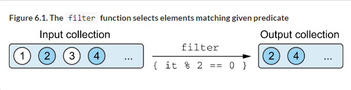
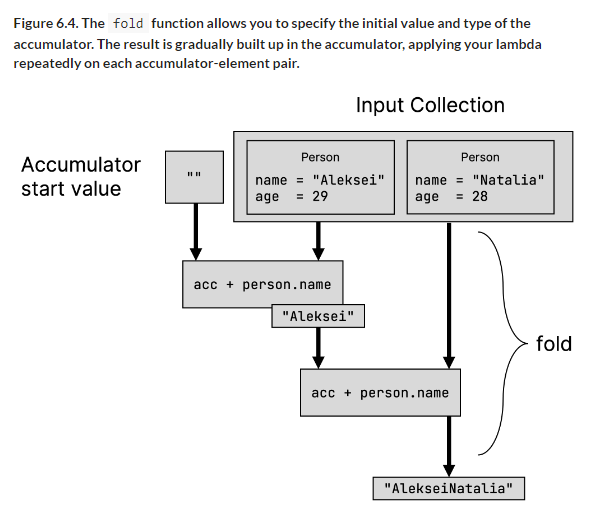
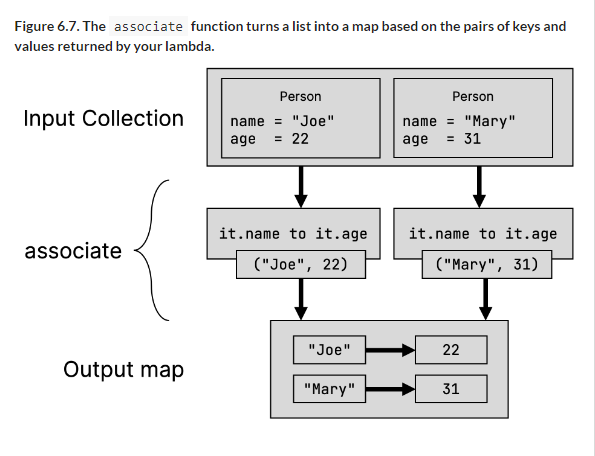
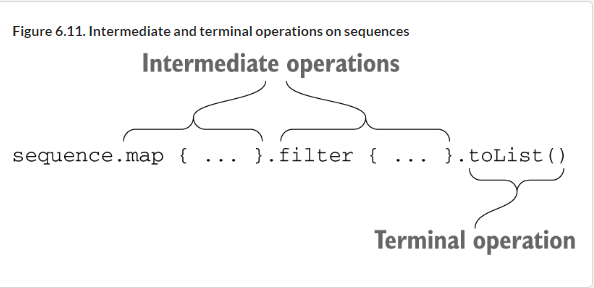

# 6 Working with collections and sequences

::: tip This chapter covers

- Working with collections in a functional style 
- Sequences: performing collection operations lazily

:::

In 5, you learned about lambdas as a way of passing small blocks of code to other functions. One of the most common uses for lambdas is working with collections. In this chapter, you will see how replacing common collection access patterns with a combination of standard library functions and your own lambdas can make your code more expressive, elegant, and concise— whether you’re filtering your data based on predicates, need to group data, or transform collection items from one form to another.

You will also explore Sequences as an alternative way to apply multiple collection operations efficiently and without creating much overhead. You will learn the difference between eager and lazy execution of collection operations in Kotlin, and how to use either one in your programs.

## 6.1 Functional APIs for collections

A functional programming style provides many benefits when it comes to manipulating collections. For the majority of tasks, you can use functions provided by the standard library, and customize their behaviour by passing lambdas as arguments to these functions. Compared to navigating through collections and aggregating data manually, this allows you to express common operations consistenly using a vocabulary of functions that you share with other Kotlin developers.

In this section, we’ll explore some of the functions in the Kotlin standard library that you might find yourself reaching for when working with

collections. We’ll start with staple functions like filter and map that help you transform and the concepts behind them. We’ll also cover other useful functions and give you tips about how not to overuse them and how to write clear and comprehensible code.

Note that these functions weren’t invented by the designers of Kotlin. These or similar functions are available for all languages that support lambdas, including C#, Groovy, and Scala. If you’re already familiar with these concepts, you can quickly look through the following examples and skip the explanations.

### 6.1.1 Removing and transforming elements: filter and map

The filter and map functions form the basis for manipulating collections. Many collection operations can be expressed with their help. Whenever you’re faced with a task of filtering a collection based on a specific predicate, or you need to transform each element of a collection into a different form, these functions should come to mind.

For each function, we’ll provide one example with numbers and one using the familiar Person class:

```kotlin
data class Person(val name: String, val age: Int)
```

The filter function goes through a collection and selects the elements for which the given lambda returns true. For example, given a list of some numbers, filter can help you extract only the even numbers (where the remainder of a division by 2 is zero):

```kotlin
fun main() {
    val list = listOf(1, 2, 3, 4)
    println(list.filter { it % 2 == 0 })
    // [2, 4]
}
```

The result is a new collection that contains only the elements from the input collection that satisfy the predicate, as illustrated in 6.1.

Figure 6.1. The filter function selects elements matching given predicate



If you want to keep only people older than 30, you can use filter:

```kotlin
fun main() {
    val people = listOf(Person("Alice", 29), Person("Bob", 31))
    println(people.filter { it.age > 30 })
    // [Person(name=Bob, age=31)]
}
```

The filter function can create a new collection of elements that match a given predicate, but does not transform the elements in the process—your output is still a collection of Person objects. You can think of it as "extracting" entries from your collection, without changing their type.

Compare this to the map function, which allows you to transform the elements of your input collection. It applies the given function to each element in the collection and collects the return values into a new collection. You could use it to transform a list of numbers into a list of their squares, for example:

```kotlin
fun main() {
    val list = listOf(1, 2, 3, 4)
    println(list.map { it * it })
    // [1, 4, 9, 16]
}
```

The result is a new collection that contains the same number of elements, but each element is has been transformed according to the given predicate function (see 6.2).

Figure 6.2. The map function applies a lambda to all elements in a collection.


If you want to print just a list of names, not a list of people, you can transform the list using map:

```kotlin
fun main() {
    val people = listOf(Person("Alice", 29), Person("Bob", 31))
    println(people.map { it.name })
    // [Alice, Bob]
}
```

Note that this example can be nicely rewritten using member references:

```kotlin
people.map(Person::name)
```

You can easily chain several calls like that. For example, let’s find the names of people older than 30:

```kotlin
println(people.filter { it.age > 30 }.map(Person::name))
// [Bob]
```

Now, let’s say you need to find the oldest people in the group. You can find the maximum age of the people in the group and return everyone who is that age. It’s easy to write such code using lambdas:

```kotlin
people.filter {
    val oldestPerson = people.maxByOrNull(Person::age)
    it.age == oldestPerson?.age
}
```

But note that this code repeats the process of finding the maximum age for every person, so if there are 100 people in the collection, the search for the maximum age will be performed 100 times!

The following solution improves on that and calculates the maximum age just once:

```kotlin
val maxAge = people.maxByOrNull(Person::age)?.age
people.filter { it.age == maxAge }
```

Don’t repeat a calculation if you don’t need to! Simple-looking code using lambda expressions can sometimes obscure the complexity of the underlying operations. Always keep in mind what is happening in the code you write.

If your filtering and transformation operations depend on the index of the elements in addition to their actual values, you can use the sibling functions filterIndexed and mapIndexed, which provide your lambda with both the index of an element, as well as the element itself. In this example, you’re filtering a list of numbers to only contain those values at an even index and greater than 3. You are also mapping a second list to sum the index number and the numerical value of each element:

```kotlin
fun main() {
    val numbers = listOf(1, 2, 3, 4, 5, 6, 7)
    val filtered = numbers.filterIndexed { index, element ->
        index % 2 == 0 && element > 3
    }
    println(filtered)
    // [5, 7]

    val mapped = numbers.mapIndexed { index, element ->
        index + element
    }
    println(mapped)
}
// [5, 7]
// [1, 3, 5, 7, 9, 11, 13]
```

Filter and transformation functions can also be applied to maps:

```kotlin
fun main() {
    val numbers = mapOf(0 to "zero", 1 to "one")
    println(numbers.mapValues { it.value.uppercase() })
    // {0=ZERO, 1=ONE}
}
```

There are separate functions to handle keys and values. `filterKeys` and `mapKeys` filter and transform the keys of a map, respectively, where as `filterValues` and `mapValues` filter and transform the corresponding values.

### 6.1.2 Accumulating values for collections: reduce and fold

Next to the filter and map functions, reduce and fold are two more essential building blocks when working with collections in a functional style. These functions are used to aggregate information from a collection: given a collection of items, they return a single value. This value is gradually built up in a so-called "accumulator". Your lambda is invoked for each element, needs to return a new accumulator value.

When using reduce, you start with the first element of your collection in the accumulator (so don’t call it on an empty collection!) Your lambda is then called with the accumulator and the second element. In this example, you use reduce to sum and multiply the values of the input collection, respectively:

```kotlin
fun main() {
    val list = listOf(1, 2, 3, 4)
    val summed = list.reduce { acc, element ->
        acc + element
    }
    println(summed)
    // 10
    val multiplied = list.reduce { acc, element ->
        acc * element
    }
    println(multiplied)
    // 24
}
```

Figure 6.3. The reduce function gradually builds up a result in its accumulator, invoking your lambda repeatedly with each element and the previous accumulator value.


The fold function is conceptually very similar to reduce, but instead of putting the first element of your collection into the accumulator at the beginning, you can choose an arbitrary start value. In this example, you’re concatenating the name property of two Person objects using fold (a job usually tailored for the joinToString function we explored earlier, but an illustrative example nonetheless). You initialize the accumulator with an empty string, and then gradually build up the final text in your lambda:

```kotlin
fun main() {
    val people = listOf(
        Person("Aleksei", 29),
        Person("Natalia", 28)
    )
    val folded = people.fold("") { acc, person ->
        acc + person.name
    }
    println(folded)
}
// AlekseiNatalia
```

Figure 6.4. The fold function allows you to specify the initial value and type of the accumulator. The result is gradually built up in the accumulator, applying your lambda repeatedly on each accumulator-element pair.



There are many algorithms you can express concisely using a fold or reduce operation. For cases where you want to retrieve all intermittent values the reduce or fold operations, the runningReduce and runningFold functions come to the rescue. Their only difference to the reduce and fold functions as we just discussed them is that these functions return a list. It contains all intermittent accumulator values alongside the final result. In this example, you’re using the running counterpart of the snippets discussed in the previous paragraphs:

```kotlin
fun main() {
    val list = listOf(1, 2, 3, 4)
    val summed = list.runningReduce { acc, element ->
        acc + element
    }
    println(summed)
    // [1, 3, 6, 10]
    val multiplied = list.runningReduce { acc, element ->
        acc * element
    }
    println(multiplied)
    // [1, 2, 6, 24]
    val people = listOf(
        Person("Aleksei", 29),
        Person("Natalia", 28)
    )
    println(people.runningFold("") { acc, person ->
        acc + person.name
    })
    // [, Aleksei, AlekseiNatalia]
}
```

### 6.1.3 Applying a predicate to a collection: all, any, none, count, and find

Another common task is checking whether all, some, or no elements in a collection match a certain condition. In Kotlin, this is expressed through the all, any, and none functions. The count function checks how many elements satisfy the predicate, and the find function returns the first matching element.

To demonstrate those functions, let’s define the predicate `canBeInClub27` to check whether a person is 27 or younger:

```kotlin
val canBeInClub27 = { p: Person -> p.age <= 27 }
```

If you’re interested in whether all the elements satisfy this predicate, you use the all function:

```kotlin
fun main() {
    val people = listOf(Person("Alice", 27), Person("Bob", 31))
    println(people.all(canBeInClub27))
}
false
```

If you need to check whether there’s at least one matching element, use any: 

```kotlin
fun main() {
    println(people.any(canBeInClub27))
    // true
}
```

Note that !all ("not all") with a condition can be replaced with any with a negation of that condition, and vice versa. To make your code easier to understand, you should choose a function that doesn’t require you to put a negation sign before it:

```kotlin
fun main() {
    val list = listOf(1, 2, 3)
    println(!list.all { it == 3 })
    // true
    println(list.any { it != 3 })
    // true
}
```

The first check ensures that not all elements are equal to 3. That’s the same as having at least one non-3, which is what you check using any on the second line.

Likewise, you can replace `!any` with `none`:

```kotlin
fun main() {
    val list = listOf(1, 2, 3)
    println(!list.any { it == 4 })
    // true
    println(list.none { it == 4 })
    // true
}
```

The first invocation checks whether there are any elements in the collection are equal to 4, and negates that result. A more natural way of expressing this, both in code and words, is to check whether none of the elements are equal to 4.

::: info Predicates and empty collections

While reading the description of the different types of predicates—any, none, and all—you may have started to wonder what these functions return when called on empty collections. Let’s address this mystery.

In the case of any, the collection contains no elements that can satisfy the provided predicate. That means it returns false:

```kotlin
fun main() {
    println(listOf<Int>().any { it > 42 })
    // false
}
```

As you’ve seen, the none function is the inverse of the any function. That’s also reflected in the case of an empty collection: There is no element that can violate the predicate, so the function returns true:

```kotlin
fun main() {
    println(listOf<Int>().none { it > 42 })
    // true
}
```

The function with the perhaps largest mind-bending potential is all. Regardless of the predicate, it returns true when called on an empty collection:

```kotlin
fun main() {
    println(listOf<Int>().all { it > 42 })
    // true
}
```

This might surprise you at first, but upon further investigation, you’ll find that this is a very reasonable return value. You can’t name an element that violates the predicate, so the predicate clearly has to be true for all elements in the collection—even if there are none! This concept is known as the vacuous truth, and actually ends up a usually good fit for conditionals that should also work with empty collections.

:::

If you want to know how many elements satisfy a predicate, use count: 

```kotlin
fun main() {
    val people = listOf(Person("Alice", 27), Person("Bob", 31))
    println(people.count(canBeInClub27))
    // 1
}
```

::: info Using the right function for the job: "count" vs. "size"

It’s easy to forget about count and implement it by filtering the collection and getting its size:

```kotlin
println(people.filter(canBeInClub27).size)
// 1
```

But in this case, an intermediate collection is created to store all the elements that satisfy the predicate. On the other hand, the count method tracks only the number of matching elements, not the elements themselves, and is therefore more efficient.

As a general rule, try to find the most appropriate operation that suits your needs.

:::

To find an element that satisfies the predicate, use the find function:

```kotlin
fun main() {
    val people = listOf(Person("Alice", 27), Person("Bob", 31))
    println(people.find(canBeInClub27))
    // Person(name=Alice, age=27)
}
```

This returns the first matching element if there are many or null if nothing satisfies the predicate. A synonym of find is firstOrNull , which you can use if it expresses the idea more clearly for you.

### 6.1.4 Splitting a list to a pair of lists: partition

In some situations, you need to divide a collection into two groups based on a given predicate: Elements that fulfill a Boolean predicate, and those that don’t. If you need both groups, you could use the functions filter and its sibling filterNot (which inverts the predicate) to create these two lists. In this example, you’re finding out who is allowed in the club—and who isn’t:

```kotlin
fun main() {
    val people = listOf(
        Person("Alice", 26),
        Person("Bob", 29),
        Person("Carol", 31)
    )
    val comeIn = people.filter(canBeInClub27)
    val stayOut = people.filterNot(canBeInClub27)
    println(comeIn)
    // [Person(name=Alice, age=26)]
    println(stayOut)
    // [Person(name=Bob, age=29), Person(name=Carol, age=31)]
}
```

But there is also a more concise way to do this: using the partition function. It returns this pair of lists, without having to repeat the predicate, and without having to iterate the input collection twice. This means you can express the same logic from the previous code snippet as follows:

```kotlin
val (comeIn, stayOut) = people.partition(canBeInClub27)
println(comeIn)
// [Person(name=Alice, age=26)]
println(stayOut)
// [Person(name=Bob, age=29), Person(name=Carol, age=31)]
```

Figure 6.5. The partition function returns a pair consisting of two lists: Those that satisfy the given Boolean predicate, and those that don’t.


### 6.1.5 Converting a list to a map of groups: groupBy

Often enough, the elements in a collection can’t be clustered into just the "true" and "false" groups that partition returns. Instead, you may want to divide all elements into different groups according to some quality. For example, you want to group people of the same age. It’s convenient to pass this quality directly as a parameter. The groupBy function can do this for you:

```kotlin
fun main() {
    val people = listOf(
        Person("Alice", 31),
        Person("Bob", 29),
        Person("Carol", 31)
    )
    println(people.groupBy { it.age })
}
```

The result of this operation is a map from the key by which the elements are grouped (age, in this case) to the groups of elements (persons); see 6.6.

Figure 6.6. The result of applying the groupBy function


For this example, the output is as follows:

```kotlin
{29=[Person(name=Bob, age=29)], 31=[Person(name=Alice, age=31),
Person(name=Carol, age=31)]}
```

Each group is stored in a list, so the result type is `Map<Int, List<Person>>`. You can do further modifications with this map, using functions such as mapKeys and mapValues.

As another example, let’s see how to group strings by their first character using member references:

```kotlin
fun main() {
    val list = listOf("apple", "apricot", "banana", "cantaloupe")
    println(list.groupBy(String::first))
    // {a=[apple, apricot], b=[banana], c=[cantaloupe]}
}
```

Note that first here isn’t a member of the String class, it’s an extension. Nevertheless, you can access it as a member reference.

### 6.1.6 Transforming collections into maps: associate, associateWith and associateBy:

With groupBy, you now already know a way of creating an associative data structure from a list—by grouping elements based on a common property. If you want to create a map from the elements of a collection without grouping elements, the associate function comes into play. You provide it with a lambda that expresses a transformation from an item in your input collection to a key-value pair that will be put into a map. In this example, you use the associate function to turn a list of Person objects into a map of names to ages, and query an example value, like you would with any other `Map<String, Int>`. You use the infix function to which we introduced in 3.4.3 to specify the individual key-value pairs:

```kotlin
fun main() {
    val people = listOf(Person("Joe", 22), Person("Mary", 31))
    val nameToAge = people.associate { it.name to it.age }
    println(nameToAge)
    // {Joe=22, Mary=31}
    println(nameToAge["Joe"])
    // 22
}
```

Figure 6.7. The associate function turns a list into a map based on the pairs of keys and values returned by your lambda.



Instead of creating pairs of custom keys and custom values, you may want to create an association between the elements of your collection with another certain value. You can do this with the associateWith and associateBy functions.

associateWith uses the original elements of your collection as keys. The lambda that you provide generates the corresponding value for each key. On the other hand, associateBy uses the original elements of your collection as values, and uses your lambda to generate the keys of the map.

In this example, you’re first creating a map of people to their ages by using the associateWith function. You create the inverse map, from ages to people, using the associateBy function:

```kotlin
fun main() {
    val people = listOf(
        Person("Joe", 22),
        Person("Mary", 31),
        Person("Jamie", 22)
    )
    val personToAge = people.associateWith { it.age }
    println(personToAge)
    // {Person(name=Joe, age=22)=22, Person(name=Mary, age=31)=31,
    //  Person(name=Jamie, age=22)=22}
    val ageToPerson = people.associateBy { it.age }
    println(ageToPerson)
    // {22=Person(name=Jamie, age=22), 31=Person(name=Mary, age=31)}
}
```

Keep in mind that keys for maps have to be unique, and the ones generated by associate, associateBy and associateWith are no exception. If your transformation function would result in the same key being added multiple times, the last result overwrites any previous assignments.

### 6.1.7 Replacing elements in mutable collections: replaceAll and fill

Generally, a functional programming style encourages you to work with immutable collections, but there may still be some situations where it is more ergonomic to work with mutable collections. For those situations, the Kotlin standard library comes with a few convenience functions to help you change the contents of your collections.

When applied to a MutableList, the replaceAll function replaces each element in the list with a result from the lambda you specify. For the special case of replacing all elements in the mutable list with the same value, you can use the fill function as a shorthand. In this example, you first replace all elements in your input collection with their uppercase variant, and replace all names with a placeholder text afterwards:

```kotlin
fun main() {
    val names = mutableListOf("Martin", "Samuel")
    println(names)
    // [Martin, Samuel]
    names.replaceAll { it.uppercase() }
    println(names)
    // [MARTIN, SAMUEL]
    names.fill("(redacted)")
    println(names)
    // [(redacted), (redacted)]
}
```

### 6.1.8 Handling special cases for collections: ifEmpty

Often, it only makes sense for a program to proceed if an input collection is not empty—so that there are some actual elements to process. With the ifEmpty function, you can provide a lambda that generates a default value in case your collection does not contain any elements:

```kotlin
fun main() {
    val empty = emptyList<String>()
    val full = listOf("apple", "orange", "banana")
    println(empty.ifEmpty { listOf("no", "values", "here") })
    // [no, values, here]
    println(full.ifEmpty { listOf("no", "values", "here") })
    // [apple, orange, banana]
}
```

::: info ifBlank: ifEmpty’s sibling function for strings

When working with text (which we often also simply treat as a collection of characters), we sometimes relax the requirement of "empty" to "blank": strings containing only whitespace characters are seldom more expressive than pure empty strings. To generate a default value for them, we can use the `ifBlank` function.

```kotlin
fun main() {
    val blankName = " "
    val name = "J. Doe"
    println(blankName.ifEmpty { "(unnamed)" })
    //
    println(blankName.ifBlank { "(unnamed)" })
    // (unnamed)
    println(name.ifBlank { "(unnamed)" })
    // J. Doe
}
```

:::

### 6.1.9 Splitting collections: "chunked" and "windowed"

When the data in your collection represents a series of information, you may want to work with multiple consecutive values at a time. Consider, for example, a list of daily measurements of a temperature sensor:

```kotlin
val temperatures = listOf(27.7, 29.8, 22.0, 35.5, 19.1)
```

To get a three-day average for each set of days in this list of values, you would use a sliding window of size 3: you would first average the first three values: 27.7, 29.8, and 22.0. Then, you would "slide" the window over by one index, averaging 29.8, 22.0, and 35.5. You would keep sliding until you reach the final three values—22.0, 35.5, and 19.1.

To generate these kinds of sliding windows, you can use the windowed function. windowed optionally lets you pass a lambda that transforms the output. In the case of temperature measurements, that could be calculating the average of each window:

```kotlin
fun main() {
    println(temperatures.windowed(3))
    // [[27.7, 29.8, 22.0], [29.8, 22.0, 35.5], [22.0, 35.5, 19.1]]
    println(temperatures.windowed(3) { it.sum() / it.size })
    // [26.5, 29.099999999999998, 25.53333333333333]
}
```

Figure 6.8. The windowed function processes your input collection using a sliding window.


Instead of running a sliding window over your input collection, you may want to break the collection into distinct parts of a given size. The chunked function helps you achieve this. Once again, you can also pass a lambda which transforms the output:

```kotlin
fun main() {
    println(temperatures.chunked(2))
    // [[27.7, 29.8], [22.0, 35.5], [19.1]]
    println(temperatures.chunked(2) { it.sum() })
    // [57.5, 57.5, 19.1]
}
```

Figure 6.9. The chunked function processes your input collection in non-overlapping segments of the specified size.


Note that in the example above, even though you specify a chunk size of 2, the last generated chunk may have a smaller size: since the input collection has an odd number of items, the chunked function creates two chunks of size 2, and puts the remaining item in a third chunk.

### 6.1.10 Merging collections: zip

You may encounter situations where your data isn’t yet formatted nicely in proper lists of Kotlin objects. Instead, you may have to work with separate lists that contain related information. For example, instead of a list of Person objects, you have two lists for people’s names and ages respectively:

```kotlin
val names = listOf("Joe", "Mary", "Jamie")
val ages = listOf(22, 31, 22, 44, 0)
```

If you know that the values in each list correspond by their index (that is, the name at index 0, "Joe", corresponds to the age at index 0, 22) you can use the zip function to create a list of pairs from values at same index from two collections. Passing a lambda to the function also allows you to specify how the output should be transformed. In this example, you create a list of Person objects from each pair of name and age:

```kotlin
fun main() {
    val names = listOf("Joe", "Mary", "Jamie")
    val ages = listOf(22, 31, 22, 44, 0)
    println(names.zip(ages))
    // [(Joe, 22), (Mary, 31), (Jamie, 22)]
    println(names.zip(ages) { name, age -> Person(name, age) })
    // [Person(name=Joe, age=22), Person(name=Mary, age=31),
    // Person(name=Jamie, age=22)]
}
```

Figure 6.10. The zip function correlates each element of its two inputs at the same index using the lambda you pass to it, or creates pairs of the elements otherwise. Elements that don’t have a counterpart in the other collection are ignored.


Note that the size of the resulting collection is the same as the shorter of the two lists: `zip` only processes items at those indexes that exist in both input collections.

Like the `to` function to create `Pair` objects, the `zip` function can also be called as an infix function (as introduced in 3.4.3)—though you won’t be able to pass a transforming lambda in this case:

```kotlin
println(names zip ages)
// [(Joe, 22), (Mary, 31), (Jamie, 22)]
```

Like any other function, you can chain multiple zip calls to combine more than two lists. Since zip always operates on two lists, though, you’ll need to be aware that your resulting structure will consist of nested pairs, rather than simply a list of lists:

```kotlin
val countries = listOf("DE", "NL", "US")
println(names zip ages zip countries)
// [((Joe, 22), DE), ((Mary, 31), NL), ((Jamie, 22), US)]
```

### 6.1.11 Processing elements in nested collections: flatMap and flatten

Now let’s put aside our discussion of people and switch to books. Suppose you have a storage of books, represented by the class Book:

```kotlin
class Book(val title: String, val authors: List<String>)
```

Each book was written by one or more authors, and you have a number of books in your library:

```kotlin
val library = listOf(
 Book("Kotlin in Action", listOf("Isakova", "Elizarov", "Aigner", "Jemerov")),
 Book("Atomic Kotlin", listOf("Eckel", "Isakova")),
 Book("The Three-Body Problem", listOf("Liu"))
)
```

If you want to compute all authors in your library, you might start by using the map function you’ve gotten to know in 6.1.1:

```kotlin
fun main() {
    val authors = library.map { it.authors }
    println(authors)
    // [[Isakova, Elizarov, Aigner, Jemerov], [Eckel, Isakova], [Liu]]
}
```

Likely, this isn’t the result you had in mind though: Because authors is a `List<String>` in itself, your resulting collection is a `List<List<String>>`— a nested collection.

With the flatMap function, you can compute the set of all the authors in your library, without any extra nesting. It does two things: At first it transforms (or maps) each element to a collection according to the function given as an argument, and then it combines (or flattens) these several lists into one.

Listing 6.1. The flatMap function turns a collection of collections into a flat list.

```kotlin
fun main() {
    val authors = library.flatMap { it.authors }
    println(authors)
    // [Isakova, Elizarov, Aigner, Jemerov, Eckel, Isakova, Liu]
    println(authors.toSet())
    // [Isakova, Elizarov, Aigner, Jemerov, Eckel, Liu]
}
```

Each book can be written by multiple authors, and the book.authors property stores a list of authors. In 6.1, you use the flatMap function to combine the authors of all the books in a single, flat list. The toSet call removes duplicates from the resulting collection—so, in this example, Svetlana Isakova is listed only once in the output.
You may think of flatMap when you’re stuck with a collection of collections of elements that have to be combined into one. Note that if you don’t need to transform anything and just need to flatten such a collection of collections, you can use the flatten function: listOfLists.flatten().
We’ve highlighted a few of the collection operation functions in the Kotlin standard library, but there are many more. We won’t cover them all, for reasons of space, and also because showing a long list of functions is boring. Our general advice when you write code that works with collections is to

think of how the operation could be expressed as a general transformation, and to look for a standard library function that performs such a transformation—either by looking through your IDE’s autocomplete suggestions, or by consulting the Kotlin standard library reference (https://kotlinlang.org/api/latest/jvm/stdlib/). It’s likely that you’ll be able to find one and use it to solve your problem more quickly than with a manual implementation.

Now let’s take a closer look at the performance of code that chains collection operations. In the next section, you’ll see the different ways in which such operations can be executed.

## 6.2 Lazy collection operations: sequences

In the previous section, you saw several examples of chained collection functions, such as map and filter. These functions create intermediate collections eagerly, meaning the intermediate result of each step is stored in a temporary list. Sequences give you an alternative way to perform such computations that avoids the creation of intermediate temporary objects, similar to how Java 8’s streams do.

Here’s an example:

```kotlin
people.map(Person::name).filter { it.startsWith("A") }
```

The Kotlin standard library reference says that both filter and map return a list. That means this chain of calls will create two lists: one to hold the results of the filter function and another for the results of map. This isn’t a problem when the source list contains two elements, but it becomes much less efficient if you have a million.

To make this more efficient, you can convert the operation so it uses
sequences instead of using collections directly:

```kotlin
people
    .asSequence()
    .map(Person::name)
    .filter { it.startsWith("A") }
    .toList()
```

The result of applying this operation is the same as in the previous example: a list of people’s names that start with the letter A. But in the second example, no intermediate collections to store the elements are created, so performance for a large number of elements will be noticeably better.

The entry point for lazy collection operations in Kotlin is the Sequence interface. The interface represents just that: a sequence of elements that can be enumerated one by one. Sequence provides only one method, iterator, that you can use to obtain the values from the sequence.

The strength of the Sequence interface is in the way operations on it are implemented. The elements in a sequence are evaluated lazily. Therefore, you can use sequences to efficiently perform chains of operations on elements of a collection without creating collections to hold intermediate results of the processing. You’ll also notice that we can use functions that we already know from regular list processing, such as map and filter, with sequences as well.
Any collection can be converted to a sequence by calling the extension function asSequence. To do the opposite conversion, from a sequence to a plain list, you call toList.
Why do you need to convert the sequence back to a collection? Wouldn’t it be more convenient to use sequences instead of collections, if they’re so much better? The answer is: sometimes. If you only need to iterate over the elements in a sequence, you can use the sequence directly. If you need to use other API methods, such as accessing the elements by index, then you need to convert the sequence to a list.

::: warning Note

As a rule, use a sequence whenever you have a chain of operations on a large collection. In Chapter 10, we’ll discuss why eager operations on regular collections are efficient in Kotlin, in spite of creating intermediate collections. But if the collection contains a large number of elements, the intermediate rearranging of elements costs a lot, so lazy evaluation is preferable.

:::

Because operations on a sequence are lazy, in order to perform them, you need to iterate over the sequence’s elements directly or by converting it to a collection. The next section explains that.

### 6.2.1 Executing sequence operations: intermediate and terminal operations

Operations on a sequence are divided into two categories: intermediate and terminal. An intermediate operation returns another sequence, which knows how to transform the elements of the original sequence. A terminal operation returns a result, which may be a collection, an element, a number, or any other object that’s somehow obtained by the sequence of transformations of the initial collection (see 6.11).

Figure 6.11. Intermediate and terminal operations on sequences



Intermediate operations are always lazy. Look at this example, where the terminal operation is missing:

```kotlin
fun main() {
    println(
        listOf(1, 2, 3, 4)
            .asSequence()
            .map {
                print("map($it) ")
                it * it
            }.filter {
                print("filter($it) ")
                it % 2 == 0
            }
    )
    // kotlin.sequences.FilteringSequence@506e1b77
}
```

Executing this code snippet doesn’t print the expected result to the console— rather than seeing the result of these operations, you only see the Sequence object itself. The execution of the map and filter transformations are postponed and will be applied only when the result is obtained (that is, when the terminal operation is called):

```kotlin
fun main() {
    listOf(1, 2, 3, 4)
        .asSequence()
        .map {
            print("map($it) ")
            it * it
        }.filter {
            print("filter($it) ")
            it % 2 == 0
        }.toList()
}
```

The terminal operation causes all the postponed computations to be performed.

One more important thing to notice in this example is the order in which the computations are performed. The naive approach would be to call the map function on each element first and then call the filter function on each element of the resulting sequence. That’s how map and filter work on collections, but not on sequences. For sequences, all operations are applied to each element sequentially: the first element is processed (mapped, then filtered), then the second element is processed, and so on.

This approach means some elements aren’t transformed at all if the result is obtained before they are reached. Let’s look at an example with map and find operations. First you map a number to its square, and then you find the first item that’s greater than 3:

```kotlin
fun main() {
    println(
        listOf(1, 2, 3, 4)
            .asSequence()
            .map { it * it }
            .find { it > 3 }
    )
    // 4
}
```

If the same operations are applied to a collection instead of a sequence, then the result of map is evaluated first, transforming all elements in the initial collection. In the second step, an element satisfying the predicate is found in the intermediate collection. With sequences, the lazy approach means you can skip processing some of the elements. 6.12 illustrates the difference between evaluating this code in an eager (using collections) and lazy (using sequences) manner.

Figure 6.12. Eager evaluation runs each operation on the entire collection; lazy evaluation processes elements one by one.


In the first case, when you work with collections, the list is transformed into another list, so the map transformation is applied to each element, including 3 and 4. Afterward, the first element satisfying the predicate is found: the square of 2.

In the second case, the find call begins processing the elements one by one. You take a number from the original sequence, transform it with map, and then check whether it matches the predicate passed to find. When you reach 2, you see that its square is greater than 3 and return it as the result of the find operation. You don’t need to look at 3 and 4, because the result was found before you reached them.

The order of the operations you perform on a collection can affect performance as well. Imagine that you have a collection of people, and you

want to print their names if they’re shorter than a certain limit. You need to do two things: map each person to their name, and then filter out those names that aren’t short enough. You can apply map and filter operations in any order in this case. Both approaches give the same result, but they differ in the total number of transformations that should be performed (see 6.13).

```kotlin
fun main() {
    val people = listOf(
        Person("Alice", 29),
        Person("Bob", 31),
        Person("Charles", 31),
        Person("Dan", 21)
    )
    println(
        people
            .asSequence()
            .map(Person::name)
            .filter { it.length < 4 }.toList()
    )
    // [Bob, Dan]
    println(
        people
            .asSequence()
            .filter { it.name.length < 4 }
            .map(Person::name).toList()
    )
    // [Bob, Dan]
}
```

Figure 6.13. Applying filter first helps to reduce the total number of transformations.


If map goes first, each element is transformed, even if it is discarded in the next step, and never used again. If you apply filter first, inappropriate elements are filtered out as soon as possible and aren’t transformed. As a rule of thumb, the earlier you can remove elements from your chain of operations (without compromising the logic of your code, of course), the more performant your code will be.

### 6.2.2 Creating sequences

The previous examples used the same method to create a sequence: you called asSequence() on a collection. Another possibility is to use the generateSequence function. This function calculates the next element in a sequence given the previous one. For example, here’s how you can use generateSequence to calculate the sum of all natural numbers up to 100. You first generate a sequence of all natural numbers. You then use the takeWhile function to take elements from that sequence while they’re less than or equal to 100. Lastly, you use sum to calculate the sum of these numbers.

Listing 6.2. Generating and using a sequence of natural numbers

```kotlin
fun main() {
    val naturalNumbers = generateSequence(0) { it + 1 }
    val numbersTo100 = naturalNumbers.takeWhile { it <= 100 }
    println(numbersTo100.sum())
    // 5050
}
```

Note that naturalNumbers (an infinite sequence) and numbersTo100 (a finite sequence) in this example are both sequences with postponed computation. The actual numbers in those sequences won’t be evaluated until you call the terminal operation (sum in this case).

Another common use case is a sequence of parents. If an element has parents of its own type, you may be interested in qualities of the sequence of all of its ancestors. Typical examples for this might be the lineage for a human being, or the parent folder structure for a given file (on the JVM, both files and folders are typically represented by the same type—File).

In the following example, you inquire whether the file is located in a hidden directory by generating a sequence of its parent directories and checking this attribute on each of the directories.

Listing 6.3. Generating and using a sequence of parent directories

```kotlin
import java.io.File

fun File.isInsideHiddenDirectory() =
        generateSequence(this) { it.parentFile }.any { it.isHidden }

fun main() {
    val file = File("/Users/svtk/.HiddenDir/a.txt")
    println(file.isInsideHiddenDirectory())
    // true
}
```

Once again, you generate a sequence by providing the first element and a way to get each subsequent element. By replacing any with find, you’ll get the actual directory that is hidden, instead of just a Boolean value indicating that there is a hidden file somewhere in the path. Note that using sequences allows you to stop traversing the parents as soon as you find the required directory.

## 6.3 Summary

1. Instead of manually iterating over elements in a collection, most common operations can be performed by combining existing functions from the standard library with your own lambdas. Kotlin comes with a wide variety of such functions.
2. The filter and map functions form the basis for manipulating collections, and make it easy to extract elements that match a certain predicate or transform elements into a new form.
3. The reduce and fold operations aggregate information from a collection, helping you compute a single value given a collection of items.
4. Functions from the associate and groupBy families help you turn flat lists into maps, so you can structure your data by your own critera.
5. For data in collections that is related by its indices, the chunked, windowed, and zip functions make it possible to create subgroups of collection elements or merge together multiple collections.
6. Using predicates, lambda functions that return Boolean, the all, any, none, and other sibling functions allow you to check whether certain invariants apply to your collections.
7. To deal with nested collections, the flatten function can help you extract the nested items, while the flatMap function makes it possible to even perform a transformation in the same step.
8. Sequences allow you to combine multiple operations on a collection lazily and without creating collections to hold intermediate results, making your code more efficient. You can use the same functions you use for collections to manipulate sequences.
