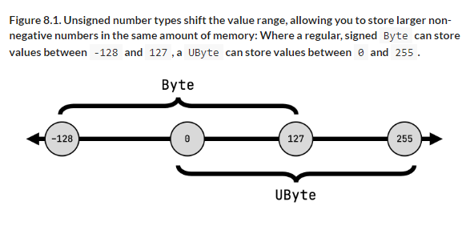

# 8 Basic types, collections, and arrays

::: tip This chapter covers

- Primitive and other basic types and their correspondence to the Java types
- Kotlin collections, arrays, and their nullability and interoperability stories

:::

Beyond its support for nullability, Kotlin’s type system has several essential features to improve the reliability of your code, and implements many lessons learned from other typesystems, including Java’s. These decisions shape the way you work with everything in Kotlin code, from primitive values and basic types to the hierarchy of collections found in the Kotlin standard library. Kotlin introduces features that aren’t present in other type sytems, such as read-only collections, and refines or doesn’t expose parts of the type system that have turned out to be problematic or unnecessary, such as first-class support for arrays. Let’s take a closer look, starting with the basic building blocks.

## 8.1 Primitive and other basic types

This section describes the basic types used in programs, such as `Int`, `Boolean`, and `Any`. Unlike Java, Kotlin doesn’t differentiate primitive types and wrappers. You’ll shortly learn why, and how it works under the hood. You’ll see the correspondence between Kotlin types and such Java types as `Object` and `Void`, as well.

### 8.1.1 Representing integers, floating-point numbers, characters and Booleans with primitive types

As you may know, Java makes a distinction between primitive types and reference types. A variable of a primitive type (such as `int`) holds its value directly. A variable of a reference type (such as `String`) holds a reference to the memory location containing the object.

Values of primitive types can be stored and passed around more efficiently, but you can’t call methods on such values or store them in collections. Java provides special wrapper types (such as `java.lang.Integer`) that encapsulate primitive types in situations when an object is needed. Thus, to define a collection of integers, you can’t say `Collection<int>`; you have to use `Collection<Integer>` instead.

Kotlin doesn’t distinguish between primitive types and wrapper types. You always use the same type (for example, `Int`):

```kotlin
val i: Int = 1
val list: List<Int> = listOf(1, 2, 3)
```

That’s convenient. What’s more, you can call methods on values of a number type. For example, consider this snippet, which uses the coerceIn standard library function to restrict the value to the specified range:

```kotlin
fun showProgress(progress: Int) {
    val percent = progress.coerceIn(0, 100)
    println("We're ${percent}% done!")
}

fun main() {
    showProgress(146)
    // We're 100% done!
}
```

If primitive and reference types are the same, does that mean Kotlin represents all numbers as objects? Wouldn’t that be terribly inefficient? Indeed it would, so Kotlin doesn’t do that.

At runtime, the number types are represented in the most efficient way possible. In most cases—for variables, properties, parameters, and return types—Kotlin’s Int type is compiled to the Java primitive type int. The only case in which this isn’t possible is generic classes, such as collections. A primitive type used as a type argument of a generic class is compiled to the corresponding Java wrapper type. For example, if the Int type is used as a type argument of the collection, then the collection will store instances of `java.lang.Integer`, the corresponding wrapper type.

The full list of types that correspond to Java primitive types is:

- Integer types—Byte, Short, Int, Long 
- Floating-point number types—Float, Double 
- Character type—Char
- Boolean type—Boolean

### 8.1.2 Using the full bit range to represent positive numbers: Unsigned number types

There are situations where you need to utilize the full bit range of an integer number representing positive values, for example when you’re working on the bit-and-byte level, manipulating the pixels in a bitmap, the bytes in a file, or other binary data.

For situations like these, Kotlin extends extends the regular primitive types on the JVM with types for unsigned integer numbers. Specifically, there are four unsigned number types:

| Type   | Size   | Value range  |
|--------|--------|--------------|
| UByte  | 8 bit  | 0 - 255      |
| UShort | 16 bit | 0 - 65535    |
| UInt   | 32 bit | 0 - 2^32 - 1 |
| ULong  | 64 bit | 0 - 2^64 - 1 |

Unsigned number types "shift" the value range compared to their signed counterparts, allowing you to store larger non-negative numbers in the same

amount of memory. A regular Int for example allows you to store numbers from roughly minus 2 billion to plus two billion. A UInt on the other hand can represent numbers between 0 and roughly 4 billion.

Figure 8.1. Unsigned number types shift the value range, allowing you to store larger non- negative numbers in the same amount of memory: Where a regular, signed Byte can store values between -128 and 127, a UByte can store values between 0 and 255.



Like other primitive types, unsigned numbers in Kotlin are only wrapped when required, and have the performance characteristics of primitive types otherwise.

::: WARNING Note

It may be tempting to use unsigned integers in situations where you want to express that non-negative integers are required. However, that’s not the goal of Kotlin’s unsigned number types. In cases where you don’t explicitly need the full bit range, you are generally better served with regular integers, and checking that a non-negative value was passed to your function.

:::

::: info Unsigned number types: implementation details

If you take a look at the specification of the JVM (http://mng.bz/nJa4), you’ll notice that the Java Virtual Machine itself does not specify or provide primitives for unsigned numbers. Kotlin can’t change that, so it provides its own abstractions on top of the existing signed primitives.

It does so using a concept you learned about in 4.5: Inline classes. Each class representing an unsigned number is actually an inline class which uses its signed counterpart as a storage. That’s right: under the hood, your UInt is just a regular Int. Because the Kotlin compiler takes care of replacing inline classes by the underlying property they wrap wherever possible, you can expect unsigned number types to perform equal to signed number types.

:::

The Kotlin compiler can easily convert a type like Int to the corresponding primitive type on the JVM, because both types are capable of representing the same set of values (and neither can store a null reference). Likewise, when you use a Java declaration from Kotlin, Java primitive types become non- null types (not platform types), because they can’t hold null values. Now let’s discuss the nullable versions of the same types.

### 8.1.3 Nullable primitive types: Int?, Boolean?, and more

Nullable types in Kotlin can’t be represented by Java primitive types, because null can only be stored in a variable of a Java reference type. That means whenever you use a nullable version of a primitive type in Kotlin, it’s compiled to the corresponding wrapper type.

To see the nullable types in use, let’s go back to the opening example of the book and recall the Person class declared there. The class represents a person whose name is always known and whose age can be either known or

unspecified. Let’s add a function that checks whether one person is older than another.

Listing 8.1. Using nullable primitive types

```kotlin
data class Person(val name: String,
                  val age: Int? = null) {

    fun isOlderThan(other: Person): Boolean? {
        if (age == null || other.age == null)
            return null
        return age > other.age
    }
}

fun main() {
    println(Person("Sam", 35).isOlderThan(Person("Amy", 42)))
    // false
    println(Person("Sam", 35).isOlderThan(Person("Jane")))
    // null
}
```

Note how the regular nullability rules apply here. You can’t just compare two values of type Int?, because one of them may be null. Instead, you have to check that both values aren’t null. After that, the compiler allows you to work with them normally.

The value of the age property declared in the class Person is stored as a java.lang.Integer. But this detail only matters if you’re working with the class from Java. To choose the right type in Kotlin, you only need to consider whether null is a possible value for the variable or property.
As mentioned earlier, generic classes are another case when wrapper types come into play. If you use a primitive type as a type argument of a class, Kotlin uses the boxed representation of the type. For example, this creates a list of boxed Integer values, even though you’ve never specified a nullable type or used a null value:

```kotlin
val listOfInts = listOf(1, 2, 3)
```

This happens because of the way generics are implemented on the Java virtual machine. The JVM doesn’t support using a primitive type as a type argument, so a generic class (both in Java and in Kotlin) must always use a boxed representation of the type. As a consequence, if you need to efficiently store large collections of primitive types, you need to either use a third-party library like Eclipse Collections (https://github.com/eclipse/eclipse- collections) that provides support for such collections, or store them in arrays. We’ll discuss arrays in detail at the end of this chapter.

Now let’s look at how you can convert values between different primitive types.

### 8.1.4 Kotlin makes number conversions explicit

One important difference between Kotlin and Java is the way they handle numeric conversions. Kotlin doesn’t automatically convert numbers from one type to the other, even when the type you’re assigning your value to is larger, and could comfortably hold the value you’re trying to assign. For example, the following code won’t compile in Kotlin:

```kotlin
val i = 1
val l: Long = i
```

Instead, you need to apply the conversion explicitly:

```kotlin
val i = 1
val l: Long = i.toLong()
```

Conversion functions are defined for every primitive type (except `Boolean`): `toByte()`, `toShort()`, `toChar()` and so on. The functions support converting in both directions: extending a smaller type to a larger one, like `Int.toLong()`, and truncating a larger type to a smaller one, like `Long.toInt()`.

Kotlin makes the conversion explicit in order to avoid surprises, especially when comparing boxed values. The `equals` method for two boxed values checks the box type, not just the value stored in it. Thus, in Java, `Integer.valueOf(42).equals(Long.valueOf(42))` returns `false`. If Kotlin supported implicit conversions, you could write something like this:

```kotlin
val x = 1
val list = listOf(1L, 2L, 3L)
x in list
```

This would evaluate to `false`, contrary to everyone’s expectations. Thus the line `x in list` from this example doesn’t compile. Kotlin requires you to convert the types explicitly so that only values of the same type are compared:

```kotlin
fun main() {
    val x = 1
    println(x.toLong() in listOf(1L, 2L, 3L))
    // true
}
```

If you use different number types in your code at the same time, you have to convert variables explicitly to avoid unexpected behavior.

::: info Primitive type literals

Kotlin supports the following ways to write number literals in source code, in addition to simple decimal numbers:

- Literals of type `Long` use the `L` suffix: `123L`.
- Literals of type `Double` use the standard representation of floating-point numbers: `0.12`, `2.0`, `1.2e10`, `1.2e-10`.
- Literals of type `Float` use the `f` or `F` suffix: `123.4f`, `.456F`, `1e3f`. 
- Hexadecimal literals use the `0x` or `0X` prefix (such as `0xCAFEBABE` or `0xbcdL`).
- Binary literals use the `0b` or `0B` prefix (such as `0b000000101`). 
- Unsigned number literals use the `U` suffix: `123U`, `123UL`, `0x10cU`.

For character literals, you use mostly the same syntax as in Java. You write the character in single quotes, and you can also use escape sequences if you need to. The following are examples of valid Kotlin character literals: `'1'`, `'\t'` (the tab character), `'\u0009'` (the tab character represented using a Unicode escape sequence).

:::

Note that when you’re writing a number literal, you usually don’t need to use conversion functions. One possibility is to use the special syntax to mark the type of the constant explicitly, such as 42L or 42.0f. And even if you don’t use it, the necessary conversion is applied automatically if you use a number literal to initialize a variable of a known type or pass it as an argument to a function. In addition, arithmetic operators are overloaded to accept all appropriate numeric types. For example, the following code works correctly without any explicit conversions:

```kotlin
fun printALong(l: Long) = println(l)

fun main() {
    val b: Byte = 1
    val l = b + 1L
    printALong(42)
    // 42
}
```

Note that the behavior of Kotlin arithmetic operators with regard to number- range overflow and underflow is exactly the same in Java; Kotlin doesn’t introduce any extra overflow checks:

```kotlin
fun main() {
    println(Int.MAX_VALUE + 1)
    -2147483648
    println(Int.MIN_VALUE - 1)
    2147483647
}
```

::: info Conversion from String

The Kotlin standard library provides a set of extension functions to convert a string into a primitive type: toInt, toByte, toBoolean, and so on. Each of these functions tries to parse the contents of the string as the corresponding type and throws a NumberFormatException if the parsing fails:

```kotlin
fun main() {
    println("42".toInt())
    // 42
}
```

However, if you’re expecting the conversion from string to primitive type to fail often, it can be cumbersome to always handle the NumberFormatException explicitly. For this case, each of these extension

functions also comes with a counterpart that returns null if the conversion fails: toIntOrNull, toByteOrNull, and so on:

```kotlin
fun main() {
    println("seven".toIntOrNull())
    // null
}
```

A special case is the conversion of strings to Boolean values. These conversion functions are defined on a nullable receiver, as we introduced them in 7.1.9. The toBoolean function returns true if the string it is called on is not null, and its content is equal to the word "true" (ignoring capitalization). Otherwise, it returns false:

```kotlin
fun main() {
    println("trUE".toBoolean())
    // true
    println("7".toBoolean())
    // false
    println(null.toBoolean())
    // false
}
```

For exact matches on the strings "true" and "false" during conversion, use the toBooleanStrict function, which only accepts these two values, and throws an exception otherwise.

:::

Before we move on to other types, there are three more special types we need to mention: Any, Unit, and Nothing.

### 8.1.5 "Any" and "Any?": the root of the Kotlin type hierarchy

Similar to how `Object` is the root of the class hierarchy in Java, the Any type is the supertype of all non-nullable types in Kotlin. But in Java, `Object` is a supertype of all reference types only, and primitive types aren’t part of the hierarchy. That means you have to use wrapper types such as `java.lang.Integer` to represent a primitive type value when `Object` is required. In Kotlin, `Any` is a supertype of all types, including the primitive types such as `Int`.

Just as in Java, assigning a value of a primitive type to a variable of type `Any` performs automatic boxing:

```kotlin
val answer: Any = 42
```

Note that Any is a non-nullable type, so a variable of the type Any can’t hold the value null. If you need a variable that can hold any possible value in Kotlin, including null, you must use the `Any?` type.

Under the hood, the Any type corresponds to `java.lang.Object`. The Object type used in parameters and return types of Java methods is seen as Any in Kotlin. (More specifically, it’s viewed as a platform type, because its nullability is unknown.) When a Kotlin function uses Any, it’s compiled to Object in the Java bytecode.

As you saw in chapter 4, all Kotlin classes have the following three methods: `toString`, `equals`, and `hashCode`. These methods are inherited from `Any`. Other methods defined on `java.lang.Object` (such as `wait` and `notify`) aren’t available on `Any`, but you can call them if you manually cast the value to `java.lang.Object`.

### 8.1.6 The Unit type: Kotlin’s "void"

The Unit type in Kotlin fulfills the same function as void in Java. It can be used as a return type of a function that has nothing interesting to return:

```kotlin
fun f(): Unit { ... }
```

Syntactically, it’s the same as writing a function with a block body without a type declaration:

```kotlin
fun f() { ... }
```

In most cases, you won’t notice the difference between `void` and `Unit`. If your Kotlin function has the `Unit` return type and doesn’t override a generic function, it’s compiled to a good-old `void` function under the hood. If you override it from Java, the Java function just needs to return `void`.

What distinguishes Kotlin’s `Unit` from Java’s `void`, then? `Unit` is a full-fledged type, and, unlike `void`, it can be used as a type argument. Only one value of this type exists; it’s also called `Unit` and is returned implicitly. This is useful when you override a function that returns a generic parameter and make it return a value of the `Unit` type:

```kotlin
interface Processor<T> {
    fun process(): T
}

class NoResultProcessor : Processor<Unit> {
    override fun process() {
        // do stuff
    }
}
```

The signature of the interface requires the process function to return a value; and, because the Unit type does have a value, it’s no problem to return it from the method. But you don’t need to write an explicit return statement in NoResultProcessor.process, because return Unit is added implicitly by the compiler.

Contrast this with Java, where neither of the possibilities for solving the problem of using "no value" as a type argument is as nice as the Kotlin solution. One option is to use separate interfaces (such as Callable and Runnable) to represent interfaces that don’t and do return a value. The other is to use the special java.lang.Void type as the type parameter. If you use the second option, you still need to put in an explicit return null; to return the only possible value matching that type, because if the return type isn’t void, you must always have an explicit return statement.

You may wonder why we chose a different name for Unit and didn’t call it Void. The name Unit is used traditionally in functional languages to mean "only one instance," and that’s exactly what distinguishes Kotlin’s Unit from Java’s void. We could have used the customary Void name, but Kotlin has a type called Nothing that performs an entirely different function. Having two types called Void and Nothing would be confusing because the meanings are so close. So what’s this Nothing type about? Let’s find out.

### 8.1.7 The Nothing type: "This function never returns"

For some functions in Kotlin, the concept of a "return value" doesn’t make sense because they never complete successfully. For example, many testing libraries have a function called fail that fails the current test by throwing an exception with a specified message. A function that has an infinite loop in it will also never complete successfully.

When analyzing code that calls such a function, it’s useful to know that the function will never terminate normally. To express that, Kotlin uses a special return type called Nothing:

```kotlin
fun fail(message: String): Nothing {
    throw IllegalStateException(message)
}

fun main() {
    fail("Error occurred")
    // java.lang.IllegalStateException: Error occurred
}
```

The Nothing type doesn’t have any values, so it only makes sense to use it as a function return type or as a type argument for a type parameter that’s used as a generic function return type. In all other cases, declaring a variable where you can’t store any value doesn’t make sense.

Note that functions returning Nothing can be used on the right side of the Elvis operator to perform precondition checking:

```kotlin
val address = company.address ?: fail("No address")
println(address.city)
```

This example shows why having Nothing in the type system is extremely useful. The compiler knows that a function with this return type never terminates normally and uses that information when analyzing the code calling the function. In the previous example, the compiler infers that the type of address is non-null, because the branch handling the case when it’s null always throws an exception, and won’t continue the execution of the code that follows.

We’ve finished our discussion of the basic types in Kotlin: primitive types, `Any`, `Unit`, and `Nothing`. Now let’s look at the collection types and how they differ from their Java counterparts.

## 8.2 Collections and arrays

You’ve already seen many examples of code that uses various collection APIs, and since 3.1, you know that Kotlin builds on the Java collections library and augments it with features added through extension functions. There’s more to the story of the collection support in Kotlin and the correspondence between Java and Kotlin collections, and now is a good time to look at the details.

### 8.2.1 Collections of nullable values and nullable collections

Earlier in this chapter, we discussed the concept of nullable types, but we only briefly touched on nullability of type arguments. But this is essential for a consistent type system: it’s no less important to know whether a collection can hold null values than to know whether the value of a variable can be null. The good news is that Kotlin fully supports nullability for type arguments. Just as the type of a variable can have a ? character appended to indicate that the variable can hold null, a type used as a type argument can be marked in the same way. To see how this works, let’s look at an example of a function that takes an input text and tries to parse each line in the input string as a number.

Listing 8.2. Building a collection of nullable values

```kotlin
fun readNumbers(text: String): List<Int?> {
    val result = mutableListOf<Int?>()
    for (line in text.lineSequence()) {
        val numberOrNull = line.toIntOrNull()
        result.add(numberOrNull)
    }
    return result
}
```

`List<Int?>` is a list that can hold values of type `Int?`: in other words, `Int` or `null`. You add an integer to the `result` list if the line can be parsed, or `null` otherwise.

Note how the nullability of the type of the variable itself is distinct from the nullability of the type used as a type argument. The difference between a list of nullable `Int`s and a nullable list of `Int`s is illustrated in 8.2.

Figure 8.2. Carefully consider how you intend to use your collection when thinking about nullability. Should the whole collection itself be nullable, or should individual elements inside the collection be nullable?


In the first case, the list itself is always not null, but each value in the list can be null. A variable of the second type may contain a null reference instead of a list instance, but the elements in the list are guaranteed to be non-null.

By the way: Given our knowledge of functional programming and lambdas, we can actually shrink this example by using the map function which we first saw in 6.1.1. It applies a given function—in this case, toIntOrNull—to each element in the input sequence, which we can then collect in a result list:

Listing 8.3. Shortening the readNumbers method with "map"

```kotlin
fun readNumbers2(text: String): List<Int?> =
    text.lineSequence().map { it.toIntOrNull() }.toList()
```

You may also find yourself in a situation where you would like to declare a variable that holds a nullable list of nullable numbers. This allows you to express that individual elements in the list can be absent, but also that the list as a whole may be absent, as well. The Kotlin way to write this is `List<Int?>?`, with two question marks. The inner question mark specifies that the elements of the list are nullable. The outer question mark specifies that the list itself is nullable. You need to apply `null` checks both when using the value of the variable and when using the value of every element in the list.

Figure 8.3. A nullable collection of nullable integers can be null itself, or store elements which are potentially null.


To see how you can work with a list of nullable values, let’s write a function to add all the valid numbers together and count the invalid numbers separately.

Listing 8.4. Working with a collection of nullable values

```kotlin
fun addValidNumbers(numbers: List<Int?>) {
    var sumOfValidNumbers = 0
    var invalidNumbers = 0
    for (number in numbers) {
        if (number != null) {
            sumOfValidNumbers += number
        } else {
            invalidNumbers++
        }
    }
    println("Sum of valid numbers: $sumOfValidNumbers")
    println("Invalid numbers: $invalidNumbers")
}

fun main() {
    val input = """
        1
        abc
        42
    """.trimIndent()
    val numbers = readNumbers(input)
    addValidNumbers(numbers)
    // Sum of valid numbers: 43
    // Invalid numbers: 1
}
```

There isn’t much special going on here. When you access an element of the list, you get back a value of type Int?, and you need to check it for null before you can use it in arithmetical operations.

Taking a collection of nullable values and filtering out null is such a common operation that Kotlin provides a standard library function filterNotNull to perform it. Here’s how you can use it to greatly simplify the previous example.

Listing 8.5. Using filterNotNull with a collection of nullable values

```kotlin
fun addValidNumbers(numbers: List<Int?>) {
    val validNumbers = numbers.filterNotNull()
    println("Sum of valid numbers: ${validNumbers.sum()}")
    println("Invalid numbers: ${numbers.size - validNumbers.size}")
}
```

Of course, the filtering also affects the type of the collection. The type of `validNumbers` is `List<Int>`, because the filtering ensures that the collection doesn’t contain any `null` elements.

Figure 8.4. The filterNotNull function returns a new collection with all the null elements from the input collection removed. This new collection is also of non-nullable type, meaning you won’t have to do any further null-handling down the line.


Now that you understand how Kotlin distinguishes between collections that hold nullable and non-null elements, let’s look at another major distinction introduced by Kotlin: read-only versus mutable collections.

### 8.2.2 Read-only and mutable collections

An important trait that sets apart Kotlin’s collection design from Java’s is that it separates interfaces for accessing the data in a collection and for modifying the data. This distinction exists starting with the most basic interface for working with collections, `kotlin.collections.Collection`. Using this interface, you can iterate over the elements in a collection, obtain its size, check whether it contains a certain element, and perform other operations that read data from the collection. But this interface doesn’t have any methods for adding or removing elements.

To modify the data in the collection, use the `kotlin.collections.MutableCollection` interface. It extends the regular `kotlin.collections.Collection` and provides methods for adding and removing the elements, clearing the collection, and so on. 8.5 shows the key methods defined in the two interfaces.

Figure 8.5. The Collections interface is ready-only. MutableCollection extends it and adds methods to modify a collection’s contents.


As a general rule, you should use read-only interfaces everywhere in your code. Use the mutable variants only if the code will modify the collection.

Just like the separation between val and var, the separation between read-only and mutable interfaces for collections makes it much easier to understand what’s happening with data in your program. If a function takes a parameter that is a Collection but not a MutableCollection, you know it’s not going to modify the collection, but only read data from it. And if a function requires you to pass a MutableCollection, you can assume that it’s going to modify the data. If you have a collection that’s part of the internal state of your component, you may need to make a copy of that collection before passing it to such a function. (This pattern is usually called a defensive copy.)

For example, you can clearly see that the following `copyElements` function will modify the target collection but not the source collection.

Listing 8.6. Using read-only and mutable collection interfaces

```kotlin
fun <T> copyElements(source: Collection<T>,
                     target: MutableCollection<T>) {
    for (item in source) {
        target.add(item)
    }
}

fun main() {
    val source: Collection<Int> = arrayListOf(3, 5, 7)
    val target: MutableCollection<Int> = arrayListOf(1)
    copyElements(source, target)
    println(target)
    // [1, 3, 5, 7]
}
```

You can’t pass a variable of a read-only collection type as the `target` argument, even if its value is a mutable collection:

```kotlin
fun main() {
    val source: Collection<Int> = arrayListOf(3, 5, 7)
    val target: Collection<Int> = arrayListOf(1)
    copyElements(source, target)
    // Error: Type mismatch: inferred type is Collection<Int>
    // but MutableCollection<Int> was expected
}
```

A key thing to keep in mind when working with collection interfaces is that read-only collections aren’t necessarily immutable. If you’re working with a variable that has a read-only interface type, this can be just one of the many references to the same collection. Other references can have a mutable interface type, as illustrated in 8.6.

Figure 8.6. Two different references, one read-only and one mutable, pointing to the same collection object. Code accessing list can’t change the underlying collection, but may still have to deal with changes done by code working with the mutableList.


If one part of your code holds a reference to the collection which is mutable, then another part of your code holding a read-only "view" on that same collection can’t rely on the fact that the collection isn’t modified by the first part simultaneously. When the collection is modified while your code is working on it, it may lead to `ConcurrentModificationException` errors and other problems.

Therefore, it’s essential to understand that read-only collections aren’t always thread-safe: what your function may receive as a "view" on a collection may actually be a mutable collection under the hood. So, if you’re working with data in a multithreaded environment, you need to ensure that your code properly synchronizes access to the data or uses data structures that support concurrent access.

::: warning Note

While immutable collections aren’t available in the standard library, the `kotlinx.collections.immutable` library (https://github.com/Kotlin/kotlinx.collections.immutable) provides immutable collection interfaces and implementation prototypes for Kotlin.

:::

How does the separation between read-only and mutable collections work? Didn’t we say earlier that Kotlin collections are the same as Java collections? Isn’t there a contradiction? Let’s see what really happens here.

### 8.2.3 Kotlin collections and Java collections are deeply related

It’s true that every Kotlin collection is an instance of the corresponding Java collection interface. No conversion is involved when moving between Kotlin and Java; there’s no need for wrappers or copying data. But every Java collection interface has two representations in Kotlin: a read-only one and a mutable one, as you can see in 8.7.

Figure 8.7. The hierarchy of the Kotlin collection interfaces. The Java classes ArrayList and
HashSet, among others, extend Kotlin mutable interfaces.


All collection interfaces shown in 8.7 are declared in Kotlin. The basic structure of the Kotlin read-only and mutable interfaces is parallel to the structure of the Java collection interfaces in the `java.util` package. In addition, each mutable interface extends the corresponding read-only interface. Mutable interfaces correspond directly to the interfaces in the `java.util` package, whereas the read-only versions lack all the mutating methods.

8.7 also contains the Java classes java.util.ArrayList and java.util.HashSet to show how Java standard classes are treated in Kotlin. Kotlin sees them as if they inherited from the Kotlin’s MutableList and MutableSet interfaces, respectively. Other implementations from the Java collection library (LinkedList, SortedSet, and so on) aren’t presented here, but from the Kotlin perspective they have similar supertypes. This way, you get both compatibility and clear separation of mutable and read-only interfaces.

In addition to the collections, the Map class (which doesn’t extend Collection or Iterable) is also represented in Kotlin as two distinct versions: Map and MutableMap.

8.1 shows the functions you can use to create collections of different types.

Table 8.1. Collection-creation functions

| Collection type | Read-only        | Mutable                                                               |
|-----------------|------------------|-----------------------------------------------------------------------|
| `List`          | `listOf`, `List` | `mutableListOf`, `MutableList`, `arrayListOf`, `buildList`            |
| `Set`           | `setOf`          | `mutableSetOf`, `hashSetOf`, `linkedSetOf`, `sortedSetOf`, `buildSet` |
| `Map`           | `mapOf`          | `mutableMapOf`, `hashMapOf`, `linkedMapOf`, `sortedMapOf`, `buildMap` |

Note that setOf() and mapOf() return instances of the Set and Map read-only interfaces, but that are mutable under the hood. (On the JVM, collections can be wrapped in a call to `Collections.unmodifiable` to make changes impossible. However, since this introduces indirection overhead, Kotlin doesn’t do this for your collections automatically.) But you shouldn’t rely on that: it’s possible that a future version of Kotlin will use truly immutable implementation classes as return values of setOf and `mapOf`.

When you need to call a Java method and pass a collection as an argument, you can do so directly without any extra steps. For example, if you have a Java method that takes a java.util.Collection as a parameter, you can pass any Collection or MutableCollection value as an argument to that parameter.

This has important consequences with regard to mutability of collections. Because Java doesn’t distinguish between read-only and mutable collections, Java code can modify the collection even if it’s declared as a read-only Collection on the Kotlin side. The Kotlin compiler can’t fully analyze what’s being done to the collection in the Java code, and therefore there’s no way for Kotlin to reject a call passing a read-only Collection to Java code that modifies it. For example, the following two snippets of code form a compilable cross-language Kotlin/Java program:

```kotlin
/* Java */
// CollectionUtils.java
public class CollectionUtils {
    public static List<String> uppercaseAll(List<String> items) {
        for (int i = 0; i < items.size(); i++) {
            items.set(i, items.get(i).uppercase());
        }
        return items;
    }
}
```

```kotlin
// Kotlin
// collections.kt
fun printInUppercase(list: List<String>) {
    println(CollectionUtils.uppercaseAll(list))
    println(list.first())
}

fun main() {
    val list = listOf("a", "b", "c")
    printInUppercase(list)
    // [A, B, C]
    // A
}
```

Therefore, if you’re writing a Kotlin function that takes a collection and passes it to Java, it’s your responsibility to use the correct type for the parameter, depending on whether the Java code you’re calling will modify the collection.

Note that this caveat also applies to collections with non-null element types. If you pass such a collection to a Java method, the method can put a null value into it; there’s no way for Kotlin to forbid that or even to detect that it has happened without compromising performance. Because of that, you need to take special precautions when you pass collections to Java code that can modify them, to make sure the Kotlin types correctly reflect all the possible modifications to the collection.

Now, let’s take a closer look at how Kotlin deals with collections declared in Java code.

### 8.2.4 Collections declared in Java are seen as platform types in Kotlin

If you recall the discussion of nullability earlier in this chapter, you’ll remember that types defined in Java code are seen as platform types in Kotlin. For platform types, Kotlin doesn’t have the nullability information, so the compiler allows Kotlin code to treat them as either nullable or non-null. In the same way, variables of collection types declared in Java are also seen as platform types. A collection with a platform type is essentially a collection of unknown mutability—the Kotlin code can treat it as either read-only or mutable. Usually this doesn’t matter, because, in effect, all the operations you may want to perform just work.

The difference becomes important when you’re overriding or implementing a Java method that has a collection type in its signature. Here, as with platform

types for nullability, you need to decide which Kotlin type you’re going to use to represent a Java type coming from the method you’re overriding or implementing.

You need to make multiple choices in this situation, all of which will be reflected in the resulting parameter type in Kotlin:

- Is the collection nullable?
- Are the elements in the collection nullable? 
- Will your method modify the collection?

To see the difference, consider the following cases. In the first example, a Java interface represents an object that processes text in a file.

Listing 8.7. A Java interface with a collection parameter

```kotlin
/* Java */
interface FileContentProcessor {
    void processContents(File path,
        byte[] binaryContents,
        List<String> textContents);
}
```

A Kotlin implementation of this interface needs to make the following choices:

- The list will be nullable, because some files are binary and their contents can’t be represented as text.
- The elements in the list will be non-null, because lines in a file are never null.
- The list will be read-only, because it represents the contents of a file, and those contents aren’t going to be modified.

Here’s how this implementation looks.

Listing 8.8. Kotlin implementation of FileContentProcessor

```kotlin
class FileIndexer : FileContentProcessor {
    override fun processContents(path: File,
        binaryContents: ByteArray?,
        textContents: List<String>?) {

        // ...
    }
}
```

Contrast this with another interface. Here the implementations of the interface parse some data from a text form into a list of objects, append those objects to the output list, and report errors detected when parsing by adding the messages to a separate list.

Listing 8.9. Another Java interface with a collection parameter

```kotlin
/* Java */
interface DataParser<T> {
    void parseData(String input,
        List<T> output,
        List<String> errors);
}
```

The choices in this case are different:

- `List<String>` will be non-null, because the callers always need to receive error messages.
- The elements in the list will be nullable, because not every item in the output list will have an associated error message.
- `List<String>` will be mutable, because the implementing code needs to add elements to it.

Here’s how you can implement that interface in Kotlin.

```kotlin
//Listing 8.10. Kotlin implementation of DataParser

class PersonParser : DataParser<Person> {
    override fun parseData(input: String,
        output: MutableList<Person>,
        errors: MutableList<String?>) {

        // ...
    }
}
```

Note how the same Java type—`List<String>`—is represented by two different Kotlin types: a `List<String>?` (nullable list of strings) in one case and a `MutableList<String?>` (mutable list of nullable strings) in the other. To make these choices correctly, you must know the exact contract the Java interface or class needs to follow. This is usually easy to understand based on what your implementation needs to do.

Now that we’ve discussed collections, it’s time to look at arrays. As we’ve mentioned before, you should prefer using collections to arrays by default. But because many Java APIs still use arrays, we’ll cover how to work with them in Kotlin.

### 8.2.5 Creating arrays of objects and primitive types for interoperability and performance reasons

You have already encountered arrays quite early in your Kotlin journey, because an array can be part of the signature of the Kotlin main function. Here’s a reminder of how it looks:

Listing 8.11. Using arrays

```kotlin
fun main(args: Array<String>) {
    for (i in args.indices) {
         println("Argument $i is: ${args[i]}")
    }
}
```

An array in Kotlin is a class with a type parameter, and the element type is specified as the corresponding type argument.

To create an array in Kotlin, you have the following possibilities:

- The `arrayOf` function creates an array containing the elements specified as arguments to this function.
- The `arrayOfNulls` function creates an array of a given size containing null elements. Of course, it can only be used to create arrays where the element type is nullable.
- The `Array` constructor takes the size of the array and a lambda, and initializes each array element by calling the lambda. This is how you can initialize an array with a non-null element type without passing each element explicitly.

As a simple example, here’s how you can use the Array function to create an array of strings from "a" to "z".

Listing 8.12. Creating an array of characters

```kotlin
fun main() {
    val letters = Array<String>(26) { i -> ('a' + i).toString() }
    println(letters.joinToString(""))
    // abcdefghijklmnopqrstuvwxyz
}
```

The lambda takes the index of the array element and returns the value to be placed in the array at that index. Here you calculate the value by adding the index to the 'a' character and converting the result to a string. The array element type is shown for clarity; you can omit it in real code because the compiler can infer it:

```kotlin
fun main() {
    val letters = Array(26) { i -> ('a' + i).toString() }
    println(letters.joinToString())
    // a, b, c, d, e, f, g, h, i, j
}
```

::: warning Note

This type of construction isn’t actually exclusive to arrays. Kotlin also provides `List` and `MutableList` functions that also instantiate their elements based on a size parameter and an initialization lambda.

:::

Having said that, one of the most common cases for creating an array in Kotlin code is when you need to call a Java method that takes an array, or a Kotlin function with a vararg parameter. In those situations, you often have the data already stored in a collection, and you just need to convert it into an array. You can do this using the toTypedArray method.

Listing 8.13. Passing a collection to a vararg method

```kotlin
fun main() {
    val strings = listOf("a", "b", "c")
    println("%s/%s/%s".format(*strings.toTypedArray()))
    // a/b/c
}
```

As with other types, type arguments of array types always become object types. Therefore, if you declare something like an `Array<Int>`, it will become an array of boxed integers (its Java type will be `java.lang.Integer[]`). If you need to create an array of values of a primitive type without boxing, you must use one of the specialized classes for arrays of primitive types.

To represent arrays of primitive types, Kotlin provides a number of separate classes, one for each primitive type. For example, an array of values of type Int is called `IntArray`. For other types, Kotlin provides `ByteArray`, `CharArray`, `BooleanArray`, and so on. All of these types are compiled to regular Java primitive type arrays, such as `int[]`, `byte[]`, `char[]`, and so on. Therefore, values in such an array are stored without boxing, in the most efficient manner possible.

::: info Note

Just like other number type arrays that prevent boxing, Kotlin also allows you to create arrays of unsigned types, such as `UByteArray`, `UShortArray`, `UIntArray`, and `ULongArray`. At the time of writing, unsigned arrays and operations on them are not yet stable.

:::

To create an array of a primitive type, you have the following options:

- The constructor of the type takes a size parameter and returns an array initialized with default values for the corresponding primitive type (usually zeros).
- The factory function (intArrayOf for IntArray, and so on for other array types) takes a variable number of values as arguments and creates an array holding those values.
- Another constructor takes a size and a lambda used to initialize each element.

Here’s how the first two options work for creating an integer array holding five zeros:

```kotlin
val fiveZeros = IntArray(5)
val fiveZerosToo = intArrayOf(0, 0, 0, 0, 0)
```

Here’s how you can use the constructor accepting a lambda:

```kotlin
fun main() {
    val squares = IntArray(5) { i -> (i+1) * (i+1) }
    println(squares.joinToString())
    // 1, 4, 9, 16, 25
}
```

Alternatively, if you have an array or a collection holding boxed values of a primitive type, you can convert them to an array of that primitive type using the corresponding conversion function, such as toIntArray.
Next, let’s look at some of the things you can do with arrays. In addition to the basic operations (getting the array’s length and getting and setting elements), the Kotlin standard library supports the same set of extension functions for arrays as for collections. All the functions you saw in chapter 6 (filter, map, and so on) work for arrays as well, including the arrays of primitive types. (Note that the return values of these functions are lists, not arrays.)

Let’s see how to rewrite 8.11 using the forEachIndexed function and a lambda. The lambda passed to that function is called for each element of the array and receives two arguments, the index of the element and the element itself.

Listing 8.14. Using forEachIndexed with an array

```kotlin
fun main(args: Array<String>) {
    args.forEachIndexed { index, element ->
        println("Argument $index is: $element")
    }
}
```

Now you know how to use arrays in your code. Working with them is as simple as working with collections in Kotlin.

## 8.3 Summary

1. Types representing basic numbers (such as `Int`) look and function like regular classes but are usually compiled to Java primitive types. Kotlin’s unsigned number classes, that don’t have an exact equivalent on the JVM, are transformed via inline classes to behave and perform like primitive types.
2. Nullable primitive types (such as `Int?`) correspond to boxed primitive types in Java (such as `java.lang.Integer`).
3. The Any type is a supertype of all other types and is analogous to Java’s `Object`. `Unit` is an analogue of `void`.
4. The `Nothing` type is used as a return type of functions that don’t terminate normally.
5. Types coming from Java are interpreted as platform types in Kotlin, allowing the developer to treat them as either nullable or non-null. Kotlin uses the standard Java classes for collections and enhances them with a distinction between read-only and mutable collections.
6. You need to carefully consider nullability and mutability of parameters when you extend Java classes or implement Java interfaces in Kotlin.
7. Kotlin’s `Array` class looks like a regular generic class, but is compiled to a Java array.
8. Arrays of primitive types are represented by special classes such as `IntArray`.
