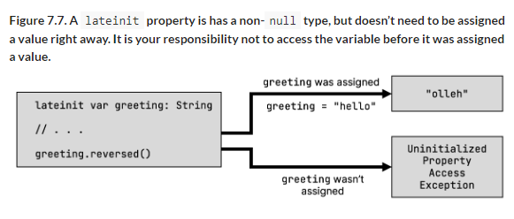
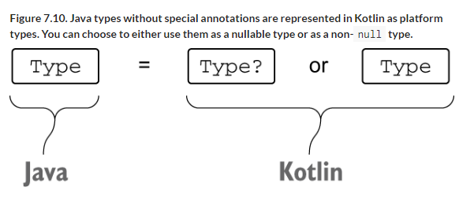

# 7 Working with nullable values

::: tip This chapter covers

- Nullable types
- Syntax for dealing with values that are potentially `null`
- Converting between nullable and non-nullable types
- Interoperability between Kotlin’s concept of nullability and Java code

:::

By now, you’ve seen a large part of Kotlin’s syntax in action. You’ve moved beyond creating basic code in Kotlin and are ready to enjoy some of Kotlin’s productivity features that can make your code more compact and readable. One of the essential features in Kotlin that helps improve the reliability of your code is its support for nullable types. Let’s look at the details.

## 7.1 Avoiding NullPointerExceptions and handling the absence of values: Nullability

Nullability is a feature of the Kotlin type system that helps you avoid `NullPointerException` errors. As a user of a program, you’ve probably seen an error message similar to "An error has occurred: java.lang.NullPointerException," with no additional details. On Android, you may have seen another version of this message along the lines of "Unfortunately, the application X has stopped," which often also conceals a `NullPointerException` as a cause. Such errors occurring at runtime are troublesome for both users and developers.

The approach of modern languages, including Kotlin, is to convert these problems from runtime errors into compile-time errors. By supporting nullability as part of the type system, the compiler can detect many possible errors during compilation and reduce the possibility of having exceptions thrown at runtime.

In this section, we’ll discuss nullable types in Kotlin: how Kotlin marks values that are allowed to be `null`, and the tools Kotlin provides to deal with such values. Moving beyond that, we’ll cover the details of mixing Kotlin and Java code with respect to nullable types.

### 7.1.1 Making possibly null variables explicit with nullable types

The first and probably most important difference between Kotlin’s and Java’s type systems is Kotlin’s explicit support for nullable types. What does this mean? It’s a way to indicate which variables or properties in your program are allowed to be `null`. If a variable can be `null`, calling a method on it isn’t safe, because it can cause a `NullPointerException`. Kotlin disallows such calls and thereby prevents many possible exceptions. To see how this works in practice, let’s look at the following Java function, which accepts a `String` and calls the `length` function on it:

```kotlin
/* Java */
int strLen(String s) {
    return s.length();
}
```

Is this function safe? Well, a seasoned developer would probably quickly spot that if the function is called with a `null` argument, it will throw a `NullPointerException`. Do you need to add a check for `null` to the function? It depends on the function’s intended use.

Let’s rewrite this function in Kotlin. The first question you must answer is, do you expect the function to be called with a `null` argument? We mean not only the `null` literal directly, as in `strLen(null)`, but also any variable or other expression that may have the value `null` at runtime.

If you don’t expect it to happen, you declare this function in Kotlin as follows:

```kotlin
fun strLen(s: String) = s.length
```

Calling `strLen` with an argument that may be `null` isn’t allowed and will be flagged as error at compile time:

```kotlin
fun main() {
    strLen(null)
    // ERROR: Null can not be a value of a non-null type String
}
```

The parameter is declared as type `String`, and in Kotlin this means it must always contain a `String` instance. The compiler enforces that, so you can’t pass an argument containing `null`. This gives you the guarantee that the `strLen` function will never throw a `NullPointerException` at runtime.

If you want to allow the use of this function with all arguments, including those that can be `null`, you need to mark it explicitly by putting a question mark after the type name:

```kotlin
fun strLenSafe(s: String?) = ...
```

You can put a question mark after any type, to indicate that the variables of this type can store `null` references: `String?`, `Int?`, `MyCustomType?`, and so on (see 7.1).

::: info Figure 7.1. The question mark after a type name indicates that it is nullable. A variable of nullable type can store a `null` reference.


:::

To reiterate, a type without a question mark denotes that variables of this type can’t store `null` references. This means all regular types are non-`null` by default, unless explicitly marked as nullable.

Once you have a value of a nullable type, the set of operations you can perform on it is restricted. For example, you can no longer call methods on it. The compiler will now complain about the call to `length` in the function body:

```kotlin
fun strLenSafe(s: String?) = s.length()
// ERROR: only safe (?.) or non-null asserted (!!.) calls are allowed
//  on a nullable receiver of type kotlin.String?
```

You also can’t assign a value of nullable type to a variable of a non-`null` type:

```kotlin
fun main() {
  val x: String? = null
  var y: String = x
  //ERROR: Type mismatch: inferred type is String? but String was expected
}
```

You can’t pass a value of a nullable type as an argument to a function having a non-null parameter:

```kotlin
fun main() {
  val x: String? = null
  strLen(x)
  //ERROR: Type mismatch: inferred type is String? but String was expected
}
```

So what can you do with a value of nullable type? The most important thing is to compare it with `null`. And once you perform the comparison, the compiler remembers that and treats the value as being non-null in the scope where the check has been performed. For example, this code is perfectly valid.

::: info Listing 7.1. Handling null values using if checks

```kotlin
fun strLenSafe(s: String?): Int =
    if (s != null) s.length else 0

fun main() {
    val x: String? = null
    println(strLenSafe(x))
    // 0
    println(strLenSafe("abc"))
    // 3
}
```
:::

If using `if` checks was the only tool for tackling nullability, your code would become verbose fairly quickly. Fortunately, Kotlin provides a number of other tools to help deal with nullable values in a more concise manner. But before we look at those tools, let’s spend some time discussing the meaning of nullability and what variable types are.

### 7.1.2 Taking a closer look at the meaning of types

Let’s think about the most general questions: what are types, and why do variables have them? The Wikipedia article on types (http://en.wikipedia.org/wiki/Data_type) gives a pretty good answer to what a type is: "A type is a classification … that determines the possible values for that type, and the operations that can be done on values of that type."

Let’s try to apply this definition to some of the Java types, starting with the `double` type. As you know, a `double` is a 64-bit floating-point number. You can perform standard mathematical operations on these values. All of those functions are equally applicable to all values of type `double`. Therefore, if you have a variable of type `double`, then you can be certain that any operation on its value that’s allowed by the compiler will execute successfully.

Now let’s contrast this with a variable of type `String`. In Java, such a variable can hold one of two kinds of values: an instance of the class `String` or `null`. Those kinds of values are completely unlike each other: even Java’s own `instanceof` operator will tell you that `null` isn’t a `String`. The operations that can be done on the value of the variable are also completely different: an actual `String` instance allows you to call any methods on the string, whereas a `null` value allows only a limited set of operations.

This means Java’s type system isn’t doing a good job in this case. Even though the variable has a declared type—`String`—you don’t know what you can do with values of this variable unless you perform additional checks.
Often, you skip those checks because you know from the general flow of data in your program that a value can’t be `null` at a certain point. Sometimes you’re wrong, and your program then crashes with a `NullPointerException`.

::: info **Other ways to cope with NullPointerException errors**

Java has some tools to help solve the problem of `NullPointerException`. For example, some people use annotations (such as `@Nullable` and `@NotNull`) to express the nullability of values. There are tools (for example, IntelliJ IDEA’s built-in code inspections) that can use these annotations to detect places where a `NullPointerException` can be thrown. But such tools aren’t part of the standard Java compilation process, so it’s hard to ensure that they’re applied consistently. It’s also difficult to annotate the entire codebase, including the libraries used by the project, so that all possible error locations can be detected. Our own experience at JetBrains shows that even widespread use of nullability annotations in Java doesn't completely solve the problem of NPEs.

Another path to solving this problem is to never use `null` values in code and to use a special wrapper type, such as the `Optional` type introduced in Java 8, to represent values that may or may not be defined. This approach has several downsides: the code gets more verbose, the extra wrapper instances affect performance at runtime, and it’s not used consistently across the entire ecosystem. Even if you do use `Optional` everywhere in your own code, you’ll still need to deal with `null` values returned from methods of the JDK, the Android framework, and other third-party libraries.

:::

Nullable types in Kotlin provide a comprehensive solution to this problem. Distinguishing nullable and non-null types provides a clear understanding of what operations are allowed on the value and what operations can lead to exceptions at runtime and are therefore forbidden.

::: warning Note

Objects of nullable or non-null types at runtime are the same; a nullable type isn’t a wrapper for a non-null type. Besides some automatically generated intrinsic checks (https://en.wikipedia.org/wiki/Intrinsic_function) which have very little performance impact, working with nullable types in Kotlin has essentially no runtime overhead.

:::

Now let’s see how to work with nullable types in Kotlin and why dealing with them is by no means annoying. We’ll start with the special operator for safely accessing a nullable value.

### 7.1.3 Combining null-checks and method calls with the safe call operator: "?."

One of the most useful tools in Kotlin’s arsenal is the safe-call operator: `?.`, which allows you to combine a `null` check and a method call into a single operation. For example, the expression `str?.uppercase()` is equivalent to the following, more cumbersome one: `if (str != null) str.uppercase() else null`.

In other words, if the value on which you’re trying to call the method isn’t `null`, the method call is executed normally. If it’s `null`, the call is skipped, and `null` is used as the value instead. 7.2 illustrates this.

::: info Figure 7.2. The safe-call operator calls methods only on non-null values. If the value happens to be `null`, no call is made, and `null` is returned directly. This allows you to safely call methods without having to write a `null` check by hand.


:::

Note that the result type of such an invocation is nullable. Although `String.uppercase` returns a value of type `String`, the result type of an expression `s?.uppercase()` when `s` is nullable will be `String?`:

```kotlin
fun printAllCaps(str: String?) {
    val allCaps: String? = str?.uppercase()
    println(allCaps)
}

fun main() {
    printAllCaps("abc")
    // ABC
    printAllCaps(null)
    // null
}
```

Safe calls can be used for accessing properties as well, not just for method calls. The following example shows a simple Kotlin class `Employee` with a nullable property `manager` and demonstrates the use of a safe-call operator for accessing that property in the `managerName` function.

::: info Listing 7.2. Using safe calls to deal with nullable properties

```kotlin
class Employee(val name: String, val manager: Employee?)

fun managerName(employee: Employee): String? = employee.manager?.name

fun main() {
    val ceo = Employee("Da Boss", null)
    val developer = Employee("Bob Smith", ceo)
    println(managerName(developer))
    // Da Boss
    println(managerName(ceo))
    // null
}
```
:::

If you have an object graph in which multiple properties have nullable types, it’s often convenient to use multiple safe calls in the same expression. Say you store information about a person, their company, and the address of the company using different classes. Both the company and its address may be omitted. With the `?.` operator, you can access the `country` property for a `Person` in one line, without any additional checks.

::: info Listing 7.3. Chaining multiple safe-call operators

```kotlin
class Address(val streetAddress: String, val zipCode: Int,
              val city: String, val country: String)

class Company(val name: String, val address: Address?)

class Person(val name: String, val company: Company?)

fun Person.countryName(): String {
   val country = this.company?.address?.country
   return if (country != null) country else "Unknown"
}

fun main() {
    val person = Person("Dmitry", null)
    println(person.countryName())
    // Unknown
}
```
:::

Sequences of calls with null checks are a common sight in Java code, and you’ve now seen how Kotlin makes them more concise. But 7.3 contains unnecessary repetition: you’re comparing a value to null and returning either that value or something else if it’s null. Let’s see how Kotlin can help get rid of that repetition.

### 7.1.4 Providing default values in null-cases with the Elvis operator: "?:"

Kotlin has a handy operator to provide default values instead of `null`. It’s called the Elvis operator (or the null-coalescing operator, if you prefer more serious-sounding names for things). It looks like this: `?:` (you can visualize it being Elvis if you turn your head sideways). Here’s how it’s used:

```kotlin
fun greet(name: String?) {
    val recipient: String = name ?: "unnamed"
    println("Hello, $recipient!")
}
```

The operator takes two values, and its result is the first value if it isn’t `null` or the second value if the first one is `null`. 7.3 shows how it works.

::: info Figure 7.3. The Elvis operator substitutes a specified value for `null`. This allows you to provide a default value should the left-hand expression happen to be `null`.


:::

The Elvis operator is often used together with the safe-call operator to substitute a value other than `null` when the object on which the method is called is `null`. Here’s how you can use this pattern to simplify 7.1.

::: info Listing 7.4. Using the Elvis operator to deal with `null` values

```kotlin
fun strLenSafe(s: String?): Int = s?.length ?: 0

fun main() {
    println(strLenSafe("abc"))
    // 3
    println(strLenSafe(null))
    // 0
}
```
:::

The implementation of the `countryName` function from 7.3 now also fits in a single, elegant expression.

```kotlin
fun Person.countryName() = company?.address?.country ?: "Unknown"
```

What makes the Elvis operator particularly handy in Kotlin is that operations such as `return` and `throw` work as expressions and therefore can be used on the operator’s right side. In that case, if the value on the left side is `null`, the function will immediately return a value or throw the exception you specified. This is helpful for checking preconditions in a function.

Let’s see how you can use this operator to implement a function to print a shipping label with the person’s company address. 7.5 repeats the declarations of all the classes—in Kotlin, they’re so concise that it’s not a problem.

::: info Listing 7.5. Using `throw` together with the Elvis operator

```kotlin
class Address(val streetAddress: String, val zipCode: Int,
              val city: String, val country: String)

class Company(val name: String, val address: Address?)

class Person(val name: String, val company: Company?)

fun printShippingLabel(person: Person) {
    val address = person.company?.address
      ?: throw IllegalArgumentException("No address")
    with (address) {
        println(streetAddress)
        println("$zipCode $city, $country")
    }
}

fun main() {
    val address = Address("Elsestr. 47", 80687, "Munich", "Germany")
    val jetbrains = Company("JetBrains", address)
    val person = Person("Dmitry", jetbrains)
    printShippingLabel(person)
    // Elsestr. 47
    // 80687 Munich, Germany
    printShippingLabel(Person("Alexey", null))
    // java.lang.IllegalArgumentException: No address
}
```
:::

The function `printShippingLabel` prints a label if everything is correct. If there’s no address, it doesn’t just throw a `NullPointerException` with a line number, but instead reports a meaningful error. If an address is present, the label consists of the street address, the ZIP code, the city, and the country. Note how the `with` function, which you saw in 5.4.1, is used to avoid repeating `address` four times in a row.

Now that you’ve seen the Kotlin way to perform "if not-`null` " checks, let’s talk about the Kotlin safe version of `instanceof` checks: the safe-cast operator that often appears together with safe calls and Elvis operators.

### 7.1.5 Safely casting values without throwing exceptions: "as?"

In chapter 2, you saw the regular Kotlin operator for type casts: the as operator. Just like a regular Java type cast, `as` throws a `ClassCastException` if the value doesn't have the type you’re trying to cast it to. Of course, you can combine it with an `is` check to ensure that it does have the proper type. But as a safe and concise language, doesn't Kotlin provide a better solution? Indeed it does.

The `as?` operator tries to cast a value to the specified type and returns `null` if the value doesn't have the proper type. 7.4 illustrates this.

::: info Figure 7.4. The safe-cast operator `as?` gives you the tools to safety work with the possibility that a cast may not succeed. It tries to cast a value to the given type and returns null if the type differs.


:::

One common pattern of using a safe cast is combining it with the Elvis operator. For example, this comes in handy for implementing the `equals` method.

::: info Listing 7.6. Using a safe cast to implement `equals`

```kotlin
class Person(val firstName: String, val lastName: String) {
    override fun equals(other: Any?): Boolean {
        val otherPerson = other as? Person ?: return false

        return otherPerson.firstName == firstName &&
                otherPerson.lastName == lastName
    }

    override fun hashCode(): Int =
        firstName.hashCode() * 37 + lastName.hashCode()
}

fun main() {
    val p1 = Person("Dmitry", "Jemerov")
    val p2 = Person("Dmitry", "Jemerov")
    println(p1 == p2)
    // true
    println(p1.equals(42))
    // false
}
```
:::

With this pattern, you can easily check whether the parameter has a proper type, cast it, and return `false` if the type isn’t right—all in the same expression. Of course, smart casts also apply in this context: after you’ve checked the type and rejected `null` values, the compiler knows that the type of the `otherPerson` variable’s value is `Person` and lets you use it accordingly.

The safe-call, safe-cast, and Elvis operators are useful and appear often in Kotlin code. But sometimes you don’t need Kotlin’s support in handling `null` values; you just need to tell the compiler that the value is in fact not `null`.
Let’s see how you can achieve that.

### 7.1.6 Making promises to the compiler with the not-null assertion operator: "!!"

The not-null assertion is the simplest and bluntest tool Kotlin gives you for dealing with a value of a nullable type. It’s represented by a double exclamation mark and converts any value to a non-null type. For null values, an exception is thrown. The logic is illustrated in 7.5.

::: info Figure 7.5. By using a not-null assertion, you don’t have to explicitly handle your value being
`null`. Instead, it throws an exception when encountering a null value.


:::

Here’s a trivial example of a function that uses the assertion to convert a nullable argument to a non-null one.

::: info Listing 7.7. Using a not-null assertion

```kotlin
fun ignoreNulls(str: String?) {
    val strNotNull: String = str!!
    println(strNotNull.length)
}

fun main() {
    ignoreNulls(null)
    // Exception in thread "main" java.lang.NullPointerException
    //  at <...>.ignoreNulls(07_NotnullAssertions.kt:2)
}
```
:::

What happens if `str` is `null` in this function? Kotlin doesn't have much choice: it will throw an exception at runtime. But note that the place where the exception is thrown is the assertion itself, not a subsequent line where you’re trying to use the value. Essentially, you’re telling the compiler, "I know the value isn’t `null`, and I’m ready for an exception if it turns out I’m wrong."

::: warning Note

You may notice that the double exclamation mark looks a bit rude: it’s almost like you’re yelling at the compiler. This is intentional. The designers of Kotlin are trying to nudge you toward a better solution that doesn’t involve making assertions that can’t be verified by the compiler.

:::

But there are situations when not-null assertions are the appropriate solution for a problem. When you check for null in one function and use the value in another function, the compiler can’t recognize that the use is safe. If you’re certain the check is always performed in another function, you may not want to duplicate it before using the value; then you can use a not-null assertion instead.

This happens in practice with action classes, which you might encounter in UI frameworks. In an action class, there are separate methods for updating the state of an action (to enable or disable it) and for executing it. The checks performed in the `update` method ensure that the `execute` method won’t be called if the conditions aren’t met, but there’s no way for the compiler to recognize that.

Let’s look at a hypothetical example of an action class that uses a not-`null` assertion in this situation. The `CopyRowAction` action, which operates on a `SelectableTextList`, is supposed to copy the value of the selected row in a list to the clipboard. We’ve omitted all the unnecessary details, keeping only the code responsible for checking whether any row was selected (meaning therefore the action can be performed) and obtaining the value for the selected row. We imply here that that `executeCopyRow` is called only when `isActionEnabled` is `true`. That also means that `list.selectedIndex` will never be `null` when `executeCopyRow` is invoked (even though the compiler doesn’t know this):

::: info Listing 7.8. Using a not-null assertion in an action class

```kotlin
class SelectableTextList(
    val contents: List<String>,
    var selectedIndex: Int? = null,
)

class CopyRowAction(val list: SelectableTextList) {
    fun isActionEnabled(): Boolean =
        list.selectedIndex != null

    fun executeCopyRow() {
        val index = list.selectedIndex!!
        val value = list.contents[index]
        // copy value to clipboard
    }
}
```
:::

Note that if you don’t want to use `!!` in this case, you can write `val index = list.selectedIndex! ?: return` to obtain the index as a non-null type. If you use that pattern, a nullable value of `list.selectedIndex` will cause an early return from the function, so `value` will always be non-`null`. Although the not-null check using the Elvis operator is redundant here, it may be a good protection against `isActionEnabled` becoming more complicated later.

There’s one more caveat to keep in mind: when you use `!!` and it results in an exception, the stack trace identifies the line number in which the exception was thrown but not a specific expression. To make it clear exactly which value was `null`, it’s best to avoid using multiple `!!` assertions on the same line:

```kotlin
person.company!!.address!!.country
```

If you get an exception in this line, you won’t be able to tell whether it was `company` or `address` that held a `null` value.

So far, we’ve discussed mostly how to access the values of nullable types. But what should you do if you need to pass a nullable value as an argument to a function that expects a non-null value? The compiler doesn’t allow you to do that without a check, because doing so is unsafe. The Kotlin language doesn’t have any special support for this case, but there’s a standard library function that can help you: it’s called `let`.

### 7.1.7 Dealing with nullable expressions: The "let" function

The `let` function makes it easier to deal with nullable expressions. Together with the safe-call operator, it allows you to evaluate an expression, check the result for `null`, and store the result in a variable, all in a single, concise expression.

One of its most common uses is handling a nullable argument that should be passed to a function that expects a non-null parameter. Let’s say the function `sendEmailTo` takes one parameter of type `String` and sends an email to that address. This function is written in Kotlin and requires a non-null parameter:

```kotlin
fun sendEmailTo(email: String) { /*...*/ }
```

You can’t pass a value of a nullable type to this function:

```kotlin
fun main() {
    val email: String? = "foo@bar.com"
    sendEmailTo(email)
    // ERROR: Type mismatch: inferred type is String? but String was expected
}
```

You have to check explicitly whether this value isn’t `null`: 

```kotlin
if (email != null) sendEmailTo(email)
```

But you can go another way: use the `let` function, and call it via a safe call. All the `let` function does is turn the object on which it’s called into a parameter of the lambda. In that way, it is similar to some of the other scope functions you got to know in 5.4. However, if you combine it with the safe call syntax, it effectively converts an object of a nullable type on which you call `let` into one of non-null type (see 7.6).

::: info Figure 7.6. Together with the safe-call operator, `let` allows you to specify a lambda that is only executed if your expression isn’t `null`. This is particularly useful when you are working with the result of a chain of expressions that happens to be nullable.


:::

The `let` function will be called only if the email value is non-null, so you use the email as a non-null argument of the lambda:

```kotlin
email?.let { email -> sendEmailTo(email) }
```

Switching to the short syntax using the autogenerated name `it`, the result is much more concise: `email?.let { sendEmailTo(it) }`. Here’s a more complete example that shows this pattern.

::: info Listing 7.9. Using `let` to call a function with a non-null parameter

```kotlin
fun sendEmailTo(email: String) {
    println("Sending email to $email")
}

fun main() {
    var email: String? = "yole@example.com"
    email?.let { sendEmailTo(it) }
    // Sending email to yole@example.com
    email = null
    // email?.let { sendEmailTo(it) }
}
```
:::

Note that the `let` notation is especially convenient when you have to use the value of a longer expression if it’s not `null`. You don’t have to create a separate variable in this case. Compare this explicit `if` check

```kotlin
val person: Person? = getTheBestPersonInTheWorld()
if (person != null) sendEmailTo(person.email)
```

to the same code without an extra variable:

```kotlin
getTheBestPersonInTheWorld()?.let { sendEmailTo(it.email) }
```

This function returns `null`, so the code in the lambda will never be executed:

```kotlin
fun getTheBestPersonInTheWorld(): Person? = null
```

When you need to check multiple values for `null`, you can use nested `let` calls to handle them. But in most cases, such code ends up fairly verbose and hard to follow. It’s generally easier to use a regular `if` expression to check all the values together.

::: info Comparing Kotlin’s scope functions: When to use "with", "apply", "let", "run", and "also"

During the last chapters, you’ve taken a detailed look at multiple functions with very similar signatures: `with`, `apply`, `let`, `run` and `also`.

All of these scope functions execute a block of code in the context of an object. They differ in how you refer to the object in question from inside the lambda, as well as their return value:

| Function        | Access to `x` via | Return value     |
|-----------------|-------------------|------------------|
| `x.let { … }`   | `it`              | Result of lambda |
| `x.also { … }`  | `it`              | `x`              |
| `x.apply { … }` | `this`            | `x`              |
| `x.run { … }`   | `this`            | Result of lambda |
| `with(x) { … }` | `this`            | Result of lambda |

Their differences are quite subtle. Thus, it’s worth once again pointing out the tasks each of them is particularly suited for, so you can compare them side by side:

- Use `let` together with the safe call operator `?.` to execute a block of code only when the object you are working with is not `null`.Use a standalone `let` to turn an expression into a variable, limited to the scope of its lambda.
- Use `apply` to configure properties of your object using a builder-style API, e.g. when creating an instance.
- Use `also` to execute additional actions that use your object, while passing the original object to further chained operations.
- Use `with` to group function calls on the same object, without having to repeat its name.
- Use `run` to configure an object and compute a custom result.

The usage of the different scope functions differs mainly in the details, so you might find yourself in a situation where more than one scope function seems like a good fit. For those cases, it makes sense to agree on conventions used in your team or for your project.

:::

One other common situation is properties that are effectively non-null but can’t be initialized with a non-null value in the constructor. Let’s see how Kotlin allows you to deal with that situation.

### 7.1.8 Non-null types without immediate initialization: Late- initialized properties

Many frameworks initialize objects in dedicated methods called after the object instance has been created. For example, in Android, the activity initialization happens in the `onCreate` method. In JUnit, it is customary to put initialization logic in methods annotated with `@BeforeAll` or `@BeforeEach`.

But you can’t leave a non-null property without an initializer in the constructor and only initialize it in a special method. Kotlin normally requires you to initialize all properties in the constructor, and if a property has a non-`null` type, you have to provide a non-null initializer value. If you can’t provide that value, you have to use a nullable type instead. If you do that, every access to the property requires either a `null` check or the `!!` operator.

::: info Listing 7.10. Using non-null assertions to access a nullable property

```kotlin
class MyService {
    fun performAction(): String = "Action Done!"
}

class MyTest {
    private var myService: MyService? = null

    @BeforeAll fun setUp() {
        myService = MyService()
    }

    @Test fun testAction() {
        assertEquals("Action Done!", myService!!.performAction())
    }
}
```
:::

This looks ugly, especially if you access the property many times. To solve this, you can declare the `myService` property as late-initialized. This is done by applying the `lateinit` modifier.

::: info Listing 7.11. Using a late-initialized property

```kotlin
class MyService {
    fun performAction(): String = "Action Done!"
}

class MyTest {
    private lateinit var myService: MyService

    @BeforeAll fun setUp() {
        myService = MyService()
    }

    @Test fun testAction() {
        assertEquals("Action Done!", myService.performAction())
    }
}
```
:::

Note that a late-initialized property is always a `var`, because you need to be able to change its value outside of the constructor, and `val` properties are compiled into final fields that must be initialized in the constructor. But you no longer need to initialize it in a constructor, even though the property has a non-null type. If you access the property before it’s been initialized, you get the following:

```kotlin
kotlin.UninitializedPropertyAccessException:
    lateinit property myService has not been initialized
```

It clearly identifies what has happened and is much easier to understand than a generic `NullPointerException`.

::: info Figure 7.7. A `lateinit` property is has a non-`null` type, but doesn’t need to be assigned a value right away. It is your responsibility not to access the variable before it was assigned a value.


:::

`lateinit` properties are commonly used in conjunction with Java dependency injection frameworks like Google Guice. In that scenario, the values of `lateinit` properties are set externally by the framework. To ensure compatibility with a broad range of Java frameworks, Kotlin generates a field with the same visibility as the `lateinit` property. If the property is declared as `public`, the field will be `public` as well.

::: warning Note

The `lateinit` modifier isn’t restricted to properties of classes. You can also specify local variables inside a function body or lambda, as well as top-level properties, to be late-initialized.

:::

Now let’s look at how you can extend Kotlin’s set of tools for dealing with `null` values by defining extension functions for nullable types.

### 7.1.9 Extending types without the safe-call operator: Extensions for nullable types

Defining extension functions for nullable types is one more powerful way to deal with `null` values. Rather than ensuring that a variable can’t be `null` before a method call, you can allow the calls with `null` as a receiver, and deal with `null` in the function. This is only possible for extension functions; regular member calls are dispatched through the object instance and therefore can never be performed when the instance is `null`.

As an example, consider the functions isEmpty and `isBlank`, `defined` as extensions of `String` in the Kotlin standard library. The first one checks whether the string is an empty string `""`, and the second one checks whether it’s empty or if it consists solely of whitespace characters. You’ll generally use these functions to check that the string is non-trivial in order to do something meaningful with it. You may think it would be useful to handle `null` in the same way as trivial empty or blank strings. And, indeed, you can do so: the functions `isEmptyOrNull` and `isBlankOrNull` can be called with a receiver of type `String?`.

::: info Listing 7.12. Calling an extension function with a nullable receiver

```kotlin
fun verifyUserInput(input: String?) {
    if (input.isNullOrBlank()) {
        println("Please fill in the required fields")
    }
}

fun main() {
    verifyUserInput(" ")
    // Please fill in the required fields
    verifyUserInput(null)
    // Please fill in the required fields
}
```
:::

You can call an extension function that was declared for a nullable receiver without safe access (see 7.8). The function handles possible `null` values.

::: info Figure 7.8. Extensions for nullable types know how to handle the null-case for their receiver themselves. Therefore, they can be accessed without a safe call.


:::

The function `isNullOrBlank` checks explicitly for `null`, returning `true` in this case, and then calls `isBlank`, which can be called on a non-null `String` only:

```kotlin
fun String?.isNullOrBlank(): Boolean =
        this == null || this.isBlank()
```

When you declare an extension function for a nullable type (ending with `?`), that means you can call this function on nullable values; and `this` in a function body can be `null`, so you have to check for that explicitly. In Java, `this` is always not-null, because it references the instance of a class you’re in. In Kotlin, that’s no longer the case: in an extension function for a nullable type, `this` can be `null`.

Note that the `let` function we discussed earlier can be called on a nullable receiver as well, but it doesn’t check whether the value is `null`. If you invoke it on a nullable type without using the safe-call operator, the lambda argument will also be nullable. It also means the passed block of code will always be executed, whether the value turns out to be `null` or not:

```kotlin
fun sendEmailTo(email: String) {
  println("Sending email to $email")
}

fun main() {
  val recipient: String? = null
  recipient.let { sendEmailTo(it) }
  //ERROR: Type mismatch: inferred type is String? but String was expected
}
```

Therefore, if you want to check the arguments for being non-`null` with `let`, you have to use the safe-call operator `?.`, as you saw earlier: `recipient.let { sendEmailTo(it) }`.

::: warning Note

When you define your own extension function, you need to consider whether you should define it as an extension for a nullable type. By default, define it as an extension for a non-null type. You can safely change it later (no code will be broken) if it turns out it’s used mostly on nullable values, and the null value can be reasonably handled.

:::

This section showed you something unexpected. If you dereference a variable without an extra check, as in `s.isNullOrBlank()`, it doesn't immediately mean the variable is non-null: the function can be an extension for a nullable type. Next, let’s discuss another case that may surprise you: a type parameter can be nullable even without a question mark at the end.

### 7.1.10 Nullability of type parameters

By default, all type parameters of functions and classes in Kotlin are nullable. Any type, including a nullable type, can be substituted for a type parameter; in this case, declarations using the type parameter as a type are allowed to be `null`, even though the type parameter `T` doesn't end with a question mark. Consider the following example.

::: info Listing 7.13. Dealing with a nullable type parameter

```kotlin
fun <T> printHashCode(t: T) {
    println(t?.hashCode())
}

fun main() {
    printHashCode(null)
    // null
}
```
:::

In the `printHashCode` call, the inferred type for the type parameter `T` is a nullable type, `Any?`. Therefore, the parameter `t` is allowed to hold `null`, even without a question mark after `T`.

To make the type parameter non-null, you need to specify a non-null upper bound for it. That will reject a nullable value as an argument.

::: info Listing 7.14. Declaring a non-null upper bound for a type parameter

```kotlin
fun <T: Any> printHashCode(t: T) {
    println(t.hashCode())
}

fun main() {
    printHashCode(null)
    // Error: Type parameter bound for `T` is not satisfied
    printHashCode(42)
    // 42
}
```
:::

Chapter 11 will cover generics in Kotlin, and Chapter 11 will cover this topic in more detail.

Note that type parameters are the only exception to the rule that a question mark at the end is required to mark a type as nullable, and types without a question mark are non-null. The next section shows another special case of nullability: types that come from the Java code.

### 7.1.11 Nullability and Java

The previous discussion covered the tools for working with `null` values in the Kotlin world. But Kotlin prides itself on its Java interoperability, and you know that Java doesn’t support nullability in its type system. So what happens when you combine Kotlin and Java? Do you lose all safety, or do you have to check every value for `null`? Or is there a better solution? Let’s find out.

First, as we mentioned, sometimes Java code contains information about nullability, expressed using annotations. When this information is present in the code, Kotlin uses it. Thus `@Nullable String` in Java is seen as `String`? by Kotlin, and `@NotNull String `is just `String` (see 7.9)

::: info Figure 7.9. Annotated Java types are represented as nullable and non-null types in Kotlin, according to the annotations. Those types can either explicitly store null values, or are explicitly non-null.


:::

Kotlin recognizes many different flavors of nullability annotations, including those from the JSR-305 standard (in the `javax.annotation` package), the Android ones (`android.support.annotation`), and those supported by JetBrains tools (`org.jetbrains.annotations`). The interesting question is what happens when the annotations aren’t present. In that case, the Java type becomes a platform type in Kotlin.

**Platform types**

::: info Figure 7.10. Java types without special annotations are represented in Kotlin as platform types. You can choose to either use them as a nullable type or as a non-null type.


:::

A platform type is essentially a type for which Kotlin doesn’t have nullability information; you can work with it as either a nullable or a non-null type (see 7.10). This means, just as in Java, you have full responsibility for the operations you perform with that type. The compiler will allow all operations. It also won’t highlight any null-safe operations on such values as redundant, which it normally does when you perform a null-safe operation on a value of a non-null type. If you know the value can be null, you can compare it with null before use. If you know it’s not null, you can use it directly. Just as in Java, you’ll get a `NullPointerException` at the usage site if you get this wrong.

Let’s say the class `Person` is declared in Java.

::: info Listing 7.15. A Java class without nullability annotations

```kotlin
/* Java */
public class Person {
    private final String name;

    public Person(String name) {
        this.name = name;
    }

    public String getName() {
        return name;
    }
}
```
:::

Can `getName` return `null` or not? The Kotlin compiler knows nothing about nullability of the `String` type in this case, so you have to deal with it yourself. If you’re sure the name isn’t `null`, you can dereference it in a usual way, as in Java, without additional checks. But be ready to get an exception in this case.

::: info Listing 7.16. Accessing a Java class without null checks

```kotlin
fun yellAt(person: Person) {
    println(person.name.uppercase() + "!!!")
}

fun main() {
    yellAt(Person(null))
    // java.lang.NullPointerException: person.name must not be null
}
```
:::

Your other option is to interpret the return type of `getName()` as nullable and access it safely.

::: info Listing 7.17. Accessing a Java class with null checks

```kotlin
fun yellAtSafe(person: Person) {
    println((person.name ?: "Anyone").uppercase() + "!!!")
}

fun main() {
    yellAtSafe(Person(null))
    // ANYONE!!!
}
```
:::

In this example, `null` values are handled properly, and no runtime exception is thrown.

Be careful while working with Java APIs. Most of the libraries aren’t annotated, so you may interpret all the types as non-null, but that can lead to errors. To avoid errors, you should check the documentation (and, if needed, the implementation) of the Java methods you’re using to find out when they can return `null`, and add checks for those methods.

::: info Why platform types?

Wouldn't it be safer for Kotlin to treat all values coming from Java as nullable? Such a design would be possible, but it would require a large number of redundant `null` checks for values that can never be `null`, because the Kotlin compiler wouldn't be able to see that information.

The situation would be especially bad with generics—for example, every `ArrayList<String>` coming from Java would be an `ArrayList<String?>?` in Kotlin, and you’d need to check values for `null` on every access or use a cast, which would defeat the safety benefits. Writing such checks is extremely annoying, so the designers of Kotlin went with the pragmatic option and allowed the developers to take responsibility for correctly handling values coming from Java.

:::

You can’t declare a variable of a platform type in Kotlin; these types can only come from Java code. But you may see them in error messages and in the IDE:

```kotlin
val i: Int = person.name
// ERROR: Type mismatch: inferred type is String! but Int was expected
```

The `String!` notation is how the Kotlin compiler and Kotlin IDEs like IntelliJ IDEA and Android Studio denote platform types coming from Java code. You can’t use this syntax in your own code, and usually this exclamation mark isn’t connected with the source of a problem, so you can usually ignore it. It just emphasizes that the nullability of the type is unknown.

::: info Figure 7.11. When using type inference for a Java property, IntelliJ IDEA and Android Studio indicate that you are working with a platform type if Inlay Hints for Kotlin Types are enabled. The exclamation point allows you to spot these platform types at a glance.


:::

As we said already, you may interpret platform types any way you like—as nullable or as non-null—so both of the following declarations are valid:

```kotlin
val s: String? = person.name
val s1: String = person.name
```

In this case, just as with the method calls, you need to make sure you get the nullability right. If you try to assign a null value coming from Java to a non-null Kotlin variable, you’ll get an exception at the point of assignment.

We’ve discussed how Java types are seen from Kotlin. Let’s now talk about some pitfalls of creating mixed Kotlin and Java hierarchies.

**Inheritance**

When overriding a Java method in Kotlin, you have a choice whether to declare the parameters and the return type as nullable or non-null. For example, let’s look at a `StringProcessor` interface in Java.

::: info Listing 7.18. A Java interface with a `String` parameter

```kotlin
/* Java */
interface StringProcessor {
    void process(String value);
}
```
:::

In Kotlin, both of the following implementations will be accepted by the compiler.

::: info Listing 7.19. Implementing the Java interface with different parameter nullability

```kotlin
class StringPrinter : StringProcessor {
    override fun process(value: String) {
        println(value)
    }
}

class NullableStringPrinter : StringProcessor {
    override fun process(value: String?) {
        if (value != null) {
            println(value)
        }
    }
}
```
:::

Note that it’s important to get nullability right when implementing methods from Java classes or interfaces. Because the implementation methods can be called from non-Kotlin code, the Kotlin compiler will generate non-null assertions for every parameter that you declare with a non-null type. If the Java code does pass a null value to the method, the assertion will trigger, and you’ll get an exception, even if you never access the parameter value in your implementation.

Let’s summarize our discussion of nullability. We’ve discussed nullable and non-null types and the means of working with them: operators for safe operations (safe call `?.`, Elvis operator `?:`, and safe cast `as?`), as well as the operator for unsafe dereference (the not-`null` assertion `!!`). You’ve seen how the library function `let` can help you accomplish concise non-`null` checks and how extensions for nullable types can help move a not-`null` check into a function. We’ve also discussed platform types that represent Java types in Kotlin.

## 7.2 Summary

1. Kotlin’s support of nullable types detects possible `NullPointerException` errors at compile time.
2. Regular types are non-null by default, unless they are explicitly marked as nullable. A question mark after a type name indicates that it is nullable.
3. Kotlin provides a variety of tools for dealing with nullable types concisely.
4. Safe calls (`?.`) allow you to call methods and access properties on nullable objects.
5. The Elvis operator (`?:`) makes it possible to provide a default value for an expression that may be `null`, return from execution, or throw an exception.
6. You can use not-null assertions (`!!`) to promise the compiler that a given value is not `null` (but will have to expect an exception if you break that promise).
7. The `let` scope function turns the object on which it is called into the parameter for a lambda. Together with the safe-call operator, it effectively converts an object of nullable type into one of non-null type. 
8. The `as?` operator provides an easy way to cast a value to a type and to handle the case when it has a different type.
