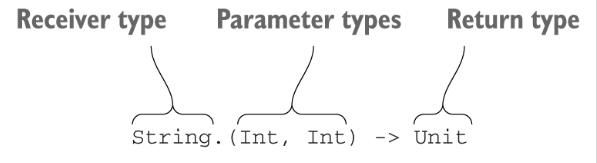
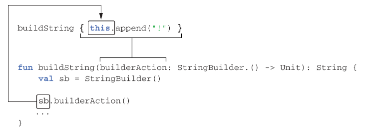
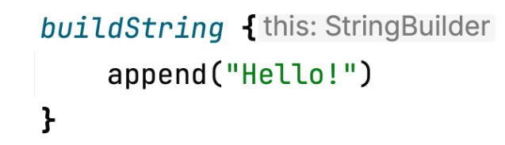
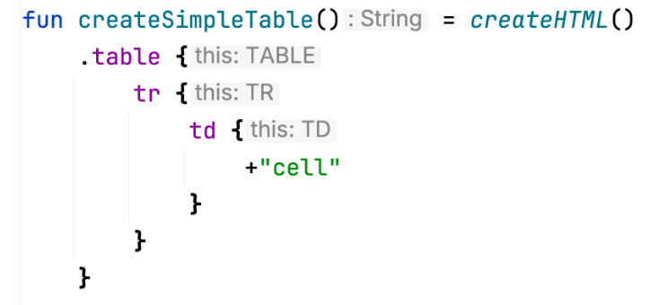

# 13 DSL construction

::: tip **This chapter covers**

- Building domain-specific languages
- Using lambdas with receivers
- Applying the `invoke` convention
- Examples of existing Kotlin DSLs

:::


In this chapter, we’ll discuss how you can design expressive and idiomatic APIs for your Kotlin classes through the use of domain-specific languages (DSLs). We’ll explore the differences between traditional and DSL-style APIs, and you’ll see how DSL-style APIs can be applied to a wide variety of practical problems in areas as diverse as database access, HTML generation, testing, writing build scripts, and many others.

Kotlin DSL design relies on many language features, two of which we haven’t yet fully explored. One of them you saw briefly in section 5.4: lambdas with receivers. They let you create a DSL structure by defining code-block-specific functions, properties, and behavior. The other is new: the `invoke` convention, which enables more flexibility in combining lambdas and property assignments in DSL code. We’ll study those features in detail in this chapter.

## 13.1 From APIs to DSLs: Creating expressive custom code structures

Before we dive into the discussion of DSLs, let’s better understand the problem we’re trying to solve. Ultimately, the goal is to achieve the best possible code readability and maintainability. To reach that goal, focusing on individual classes is not enough. Most of the code in a class interacts with other classes, so we need to look at the interfaces through which these interactions happen—in other words, the APIs of the classes.

It’s important to remember that the challenge of building good APIs isn’t reserved for library authors; every developer has to do it. Just as a library provides a programming interface for using it, every class in an application provides possibilities for other classes to interact with it. Ensuring that those interactions are easy to understand and can be expressed clearly is essential for keeping a project maintainable.

Throughout this book, you’ve seen many examples of Kotlin features that allow you to build clean APIs for classes. What do we mean when we say an API is clean? Two things:

- It needs to be clear to readers what’s happening in the code. This can be achieved with a good choice of names and concepts, which is important in any language.
- The code needs to include minimal ceremony and no unnecessary syntax. Achieving this is the main focus of this chapter. A clean API can even be indistinguishable from a built-in language feature.

Examples of Kotlin features that enable you to build clean APIs include extension functions, infix calls, lambda syntax shortcuts, and operator overloading. 13.1 shows how these features help reduce the amount of syntactic noise in the code.

::: info Table 13.1. Kotlin support for clean syntax

| Regular syntax                     | Clean syntax                               | Feature in use                |
|------------------------------------|--------------------------------------------|-------------------------------|
| `StringUtil.capitalize(s)`         | `s.capitalize()`                           | Extension function            |
| `1.to("one")`                      | `1 to "one"`                               | Infix call                    |
| `set.add(2)`                       | `set += 2`                                 | Operator overloading          |
| `map.get("key")`                   | `map["key"]`                               | Convention for the get method |
| `file.use({ f -> f.read() } )`     | `file.use { it.read() }`                   | Lambda outside of parentheses |
| `sb.append("yes") sb.append("no")` | `with (sb) { append("yes") append("no") }` | Lambda with a receiver        |

:::

In this chapter, we’ll take a step beyond clean APIs and look at Kotlin’s support for constructing DSLs. Kotlin’s DSLs build on its syntax features and extend them with the ability to create structure out of multiple method calls. As a result, DSLs can be even more expressive and pleasant to work with than APIs constructed out of individual method calls.

Just like other features of the language, Kotlin DSLs are fully statically typed. This means you still get all the advantages of static typing, such as compile-time error detection and better IDE support, when you use DSL patterns for your APIs.

As a quick taste, here are a couple of examples that show what Kotlin DSLs can do. This expression goes back in time and returns the previous day (alright, it doesn’t actually time travel—it just provides the previous date):

```kotlin
val yesterday = Clock.System.now() - 1.days
```

and this function generates an HTML table:

```kotlin
fun createSimpleTable() = createHTML().
    table {
        tr {
            td { +"cell" }
        }
    }
```

Throughout the chapter, you’ll learn how these examples are constructed. But before we begin a detailed discussion, let’s look at what DSLs are.


### 13.1.1 The concept of domain-specific languages

The general idea of a DSL has existed for almost as long as the idea of a programming language. We make a distinction between a general-purpose programming language, with a set of capabilities complete enough to solve essentially any problem that can be solved with a computer, and a domain-specific language, which focuses on a specific task, or domain, and forgoes the functionality that’s irrelevant for that domain.

The most common DSLs that you’re undoubtedly familiar with are SQL and regular expressions. They’re great for solving the specific tasks of manipulating databases and text strings, respectively, but you can’t use them to develop an entire application. (At least, we hope you don’t. The idea of an entire application built in the regular-expression language makes us shudder.)

These languages can effectively accomplish their goal by reducing the set of functionality they offer. When you need to execute an SQL statement, you don’t start by declaring a class or a function. Instead, the first keyword in every SQL statement indicates the type of operation you need to perform (`SELECT`, `INSERT`, `…`), and each type of operation has its own distinct syntax and set of keywords specific to the task at hand. With the regular-expression language, there’s even less syntax: the program directly describes the text to be matched, using compact punctuation syntax to specify how the text can vary. Through such a compact syntax, a DSL can express a domain-specific operation much more concisely than an equivalent piece of code in a general-purpose language.

Another important point is that DSLs tend to be declarative, as opposed to general-purpose languages, many of which are imperative. Whereas an imperative language describes the exact sequence of steps required to perform an operation, a declarative language describes the desired result and leaves the execution details to the engine that interprets it. This often makes the execution more efficient, because the necessary optimizations are implemented only once in the execution engine; on the other hand, an imperative approach requires every implementation of the operation to be optimized independently.

As a counterweight to all those benefits, DSLs of this type have one disadvantage: combining them with a host application in a general-purpose language can be difficult. They have their own syntax that can’t be directly embedded into programs in a different language. Therefore, to invoke a program written in a DSL, you need to either store it in a separate file or embed it in a string literal. That makes it non-trivial to validate the correct interaction of the DSL with the host language at compile time, debug the DSL program, and provide IDE code assistance when writing it. Also, the separate syntax requires separate learning and often makes code harder to read.

To solve that issue while preserving most of the other benefits of DSLs, Kotlin makes it possible to write internal DSLs. Let’s see what this is about.

### 13.1.2 Internal DSLs are seamlessly integrated into the rest of your program

As opposed to external DSLs, which have their own independent syntax, internal DSLs are part of programs written in a general-purpose language, using exactly the same syntax. In effect, an internal DSL isn’t a fully separate language, but rather a particular way of using the main language while retaining the key advantages of DSLs with an independent syntax.

To compare the two approaches, let’s see how the same task can be accomplished with an external and an internal DSL. Imagine that you have two database tables, `Customer` and `Country`, and each `Customer` entry has a reference to the country the customer lives in. The task is to query the database and find the country where the majority of customers live. The external DSL you’re going to use is SQL; the internal one is provided by the Exposed framework (https://github.com/JetBrains/Exposed), which is a Kotlin framework for database access. Here’s how you do this with SQL:

```sql
    SELECT Country.name, COUNT(Customer.id)
      FROM Country
INNER JOIN Customer
        ON Country.id = Customer.country_id
  GROUP BY Country.name
  ORDER BY COUNT(Customer.id) DESC
   LIMIT 1
```

Writing the query in SQL directly may not be convenient: you have to provide a means for interaction between your main application language—in this case, Kotlin—and the query language. Usually, the best you can do is put the SQL into a string literal and hope that your IDE will help you write and verify it.

As a comparison, here’s the same query built with Kotlin and Exposed:

```kotlin
(Country innerJoin Customer)
    .slice(Country.name, Count(Customer.id))
    .selectAll()
    .groupBy(Country.name)
    .orderBy(Count(Customer.id), order = SortOrder.DESC)
    .limit(1)
```

You can see the similarity between the two versions. In fact, executing the second version generates and runs exactly the same SQL query as the one written manually. But the second version is regular Kotlin code, and `selectAll`, `groupBy`, `orderBy`, and others are regular Kotlin methods. Moreover, you don’t need to spend any effort on converting data from SQL query result sets to Kotlin objects—the query-execution results are delivered directly as native Kotlin objects. Thus, we call this an internal DSL: the code intended to accomplish a specific task (building SQL queries) is implemented as a library in a general-purpose language (Kotlin).

### 13.1.3 Structure of DSLs

Generally speaking, there’s no well-defined boundary between a DSL and a regular API. Often, the distinction is as subjective as "I know it’s a DSL when I see it." DSLs often rely on language features that are broadly used in other contexts as well, such as infix calls and operator overloading. But one trait comes up often in DSLs and usually doesn’t exist in other APIs: structure, or grammar.

A typical API consists of many methods, and the client uses the offered functionality by calling the methods one by one. There’s no inherent structure in the sequence of calls, and no context is maintained between one call and the next. Such an API is sometimes called a command-query API. In contrast, the method calls in a DSL exist in a larger structure, defined by the grammar of the DSL. In a Kotlin DSL, structure is most commonly created through the nesting of lambdas or through chained method calls. You can clearly see this in the previous SQL example: executing a query requires a combination of method calls describing the different aspects of the required result set, and the combined query is much easier to read than a single method call taking all the arguments you’re passing to the query.

This grammar is what allows us to call an internal DSL a language. In a natural language such as English, sentences are constructed out of words, and the rules of grammar govern how those words can be combined with one another. Similarly, in a DSL, a single operation can be composed out of multiple function calls, and the type checker ensures that the calls are combined in a meaningful way. In effect, the function names usually act as verbs (`groupBy`, `orderBy`), and their arguments fulfill the role of nouns (`Country.name`).

One benefit of the DSL structure is that it allows you to reuse the same context between multiple function calls, rather than repeat it in every call. This is illustrated by the following example, showing the Kotlin DSL that is used for describing dependencies in Gradle build scripts:

```kotlin
dependencies {
    testImplementation(kotlin("test"))
    implementation("org.jetbrains.exposed:exposed-core:0.40.1")
    implementation("org.jetbrains.exposed:exposed-dao:0.40.1")
}
```

In contrast, here’s the same operation performed through a regular command-query API. Note that there’s much more repetition in the code:

```kotlin
project.dependencies.add("testImplementation", kotlin("test"))
project.dependencies.add("implementation", "org.jetbrains.exposed:exposed-core:0.40.1")
project.dependencies.add("implementation", "org.jetbrains.exposed:exposed-dao:0.40.1")
```

Chained method calls are another way to create structure in DSLs. For example, they’re commonly used in test frameworks to split an assertion into multiple method calls. Such assertions can be much easier to read, especially if you can apply the infix call syntax.

The following example comes from Kotest (https://github.com/kotest/kotest), a third-party test framework for Kotlin that we’ll discuss in more detail in 13.4.1:

```kotlin
str should startWith("kot")
```

Note how the same example expressed through regular JUnit-style APIs is noisier and not as readable:

```kotlin
assertTrue(str.startsWith("kot"))
```

Now let’s look at an example of an internal DSL in more detail.

### 13.1.4 Building HTML with an internal DSL

One of the teasers at the beginning of this chapter was a DSL for building HTML pages. In this section, we’ll discuss it in more detail. The API used here comes from the kotlinx.html library (https://github.com/Kotlin/kotlinx.html). Here’s a small snippet that creates a table with a single cell:

```kotlin
fun createSimpleTable() = createHTML().
    table {
        tr {
            td { +"cell" }
        }
    }
```
It’s clear what HTML corresponds to the previous structure:

```kotlin
<table>
  <tr>
    <td>cell</td>
  </tr>
</table>
```

The `createSimpleTable` function returns a string containing this HTML fragment.

Why would you want to build this HTML with Kotlin code, rather than write it as text? First, the Kotlin version is type-safe: you can use the `td` tag only in `tr`; otherwise, this code won’t compile. What’s more important is that it’s regular code, and you can use any language construct in it. That means you can generate table cells dynamically, (for instance, corresponding to elements in a map) in the same place when you define a table:

::: code-group

```kotlin [KT]
fun createAnotherTable() = createHTML().table {
    val numbers = mapOf(1 to "one", 2 to "two")
    for ((num, string) in numbers) {
        tr {
            td { +"$num" }
            td { +string }
        }
    }
}
```

```kotlin [The generated HTML contains the desired data:]
<table>
  <tr>
    <td>1</td>
    <td>one</td>
  </tr>
  <tr>
    <td>2</td>
    <td>two</td>
  </tr>
</table>
```

:::

HTML is a canonical example of a markup language, which makes it perfect for illustrating the concept, but you can use the same approach for any languages with a similar structure, such as XML. Shortly we’ll discuss how such code works in Kotlin.

Now that you know what a DSL is and why you might want to build one, let’s see how Kotlin helps you do that. First, we’ll take a more in-depth look at lambdas with receivers: the key feature that helps establish the grammar of DSLs.


## 13.2 Building structured APIs: lambdas with receivers in DSLs

Lambdas with receivers are a powerful Kotlin feature that allows you to build APIs with a structure. As we already discussed, having structure is one of the key traits distinguishing DSLs from regular APIs. Let’s examine this feature in detail and look at some DSLs that use it.

### 13.2.1 Lambdas with receivers and extension function types

You had a brief encounter with the idea of lambdas with receivers when we talked about the `buildList` `buildString`, `with`, and `apply` standard library functions in section 5.4. Now let’s look at how they’re implemented, using the `buildString` function as an example. This function allows you to construct a string from several pieces of content added to an intermediate `StringBuilder`.

To begin the discussion, let’s define the `buildString` function so that it takes a regular lambda as an argument. You saw how to do this in chapter 10, so this should be familiar material.

::: info Listing 13.1. Defining `buildString()` that takes a lambda as an argument

```kotlin
fun buildString(
    builderAction: (StringBuilder) -> Unit
): String {
    val sb = StringBuilder()
    builderAction(sb)
    return sb.toString()
}

fun main() {
    val s = buildString {
        it.append("Hello, ")
        it.append("World!")
    }
    println(s)
    // Hello, World!
}
```

:::

This code is easy to understand, but it looks less easy to use than we’d prefer. Note that you have to use `it` in the body of the lambda to refer to the `StringBuilder` instance (you could define your own parameter name instead of `it`, but it still has to be explicit). The main purpose of the lambda is to fill the `StringBuilder` with text, so you want to get rid of the repeated it. prefixes and invoke the `StringBuilder` methods directly, replacing `it.append` with `append`.

To do so, you need to convert the lambda into a lambda with a receiver. In effect, you can give one of the parameters of the lambda the special status of a receiver, letting you refer to its members directly without any qualifier. The following listing shows how you do that.

::: info Listing 13.2. Redefining `buildString()` to take a lambda with a receiver

```kotlin
fun buildString(
    builderAction: StringBuilder.() -> Unit
): String {
    val sb = StringBuilder()
    sb.builderAction()
    return sb.toString()
}

fun main() {
    val s = buildString {
        this.append("Hello, ")
        append("World!")
    }
    println(s)
    // Hello, World!
}
```

:::

Pay attention to the differences between 13.1 and 13.2. First, consider how the way you use `buildString` has improved. Now you pass a lambda with a receiver as an argument, so you can get rid of it in the body of the lambda. You replace the calls to `it.append()` with `append()`. The full form of the call would be `this.append()`, but, just like with regular members of a class, an explicit `this` is normally only used for disambiguation.

Next, let’s discuss how the declaration of the `buildString` function has changed. You use an extension function type instead of a regular function type to declare the parameter type. When you declare an extension function type, you effectively pull one of the function type parameters out of the parentheses and put it in front, separated from the rest of the types with a dot. In 13.2, you replace `(StringBuilder) -> Unit` with `StringBuilder.() -> Unit`. This special type is called the receiver type, and the value of that type passed to the lambda becomes the receiver object. 13.1 shows a more complex extension function type declaration.

::: info Figure 13.1. An extension function type with receiver type `String` and two parameters of type `Int`, returning `Unit`



:::

Why an extension function type? The idea of accessing members of an external type without an explicit qualifier may remind you of extension functions, which allow you to define your own methods for classes defined elsewhere in the code. Both extension functions and lambdas with receivers have a receiver object, which has to be provided when the function is called and is available in its body. In effect, an extension function type describes a block of code that can be called as an extension function.

The way you invoke the variable also changes when you convert it from a regular function type to an extension function type. Instead of passing the object as an argument, you invoke the lambda variable as if it were an extension function. When you have a regular lambda, you pass a `StringBuilder` instance as an argument to it using the following syntax: `builderAction(sb)`. When you change it to a lambda with a receiver, the code becomes `sb.builderAction()`. To reiterate, `builderAction` here isn’t a method declared on the `StringBuilder` class; it’s a parameter of a function type that you call using the same syntax you use to call extension functions.

13.2 shows the correspondence between an argument and a parameter of the `buildString` function. It also illustrates the receiver on which the lambda body will be called.

::: info Figure 13.2. The argument of the `buildString` function (lambda with a receiver) corresponds to the parameter of the extension function type (`builderAction`). The receiver (`sb`) becomes an implicit receiver (`this`) when the lambda body is invoked. 



:::

You can also declare a variable of an extension function type, as shown in 13.3. Once you do that, you can either invoke it as an extension function or pass it as an argument to a function that expects a lambda with a receiver.

```kotlin
//Listing 13.3. Storing a lambda with a receiver in a variable
val appendExcl: StringBuilder.() -> Unit =
    { this.append("!") }

fun main() {
    val stringBuilder = StringBuilder("Hi")
    stringBuilder.appendExcl()
    println(stringBuilder)
    // Hi!
    println(buildString(appendExcl))
    // !
}
```

Note that a lambda with a receiver looks exactly the same as a regular lambda in the source code. To see whether a lambda has a receiver, you need to look at the function to which the lambda is passed: its signature will tell you whether the lambda has a receiver and, if it does, what its type is. For example, you can look at the declaration of `buildString` or look up its documentation in your IDE, see that it takes a lambda of type `StringBuilder.() -> Unit`, and conclude from this that in the body of the lambda, you can invoke `StringBuilder` methods without a qualifier.

::: info Figure 13.3. Optional inlay hints in IntelliJ IDEA and Android Studio can help you visualize the receiver type of a lambda


:::

The implementation of `buildString` in the standard library is shorter than in listing 13.2. Instead of calling `builderAction` explicitly, it is passed as an argument to the apply function (which you saw in section 5.4). This allows you to collapse the function into a single line:

```kotlin
fun buildString(builderAction: StringBuilder.() -> Unit): String =
        StringBuilder().apply(builderAction).toString()
```

The `apply` function effectively takes the object on which it was called (in this case, a new `StringBuilder` instance) and uses it as an implicit receiver to call the function or lambda specified as the argument (`builderAction` in the example). You’ve also seen another useful library function previously: `with`. Let’s study their implementations:

```kotlin
inline fun <T> T.apply(block: T.() -> Unit): T {
    block()
    return this
}

inline fun <T, R> with(receiver: T, block: T.() -> R): R =
    receiver.block()
```

Basically, all `apply` and `with` do is invoke the argument of an extension function type on the provided receiver. The `apply` function is declared as an extension to that receiver, whereas `with` takes it as a first argument. The main difference is that apply returns the receiver itself, but `with` returns the result of calling the lambda.

So, if you don’t care about the result, these functions are actually interchangeable:

```kotlin
fun main() {
    val map = mutableMapOf(1 to "one")
    map.apply { this[2] = "two"}
    with (map) { this[3] = "three" }
    println(map)
    // {1=one, 2=two, 3=three}
}
```

The `with` and `apply` functions are used frequently in Kotlin, and we hope you’ve already appreciated their conciseness in your own code.

We’ve reviewed lambdas with receivers and talked about extension function types. Now it’s time to see how these concepts are used in the DSL context.

### 13.2.2 Using lambdas with receivers in HTML builders

A Kotlin DSL for HTML is usually called an HTML builder, and it represents a more general concept of type-safe builders. Initially, the concept of builders gained popularity in the Groovy community (https://www.groovy-lang.org/dsls.html#_builders): Builders provide a way to create an object hierarchy in a declarative way, which is convenient for generating markup or describing layouts.

While it uses the same idea, Kotlin’s builders are type-safe, making them more robust and convenient to use. Let’s look in detail at how the implementation of an HTML builder could work in Kotlin.

```kotlin
//Listing 13.4. Producing a simple HTML table with a Kotlin HTML builder
fun createSimpleTable() = createHTML().
    table {
        tr {
            td { +"cell" }
        }
    }
```

To reiterate, this is just regular Kotlin code, not a special templating language: `table`, `tr`, and `td` are just functions. Each of them is a higher-order function, taking a lambda with a receiver as an argument.

::: info Figure 13.4. Optional inlay hints in IntelliJ IDEA and Android Studio help visualize the receiver types for the lambdas.


:::

The remarkable thing here is that those lambdas change the name-resolution rules. In the lambda passed to the `table` function, you can use the `tr` function to create the `<tr>` HTML tag. Outside of that lambda, the `tr` function would be unresolved. In the same way, the `td` function is only accessible in `tr`. Notice how the design of the API forces you to follow the grammar of the HTML language.

The name-resolution context in each block is defined by the receiver type of each lambda. The lambda passed to `table` has a receiver of a special type `TABLE`, which defines the `tr` method. Similarly, the `tr` function expects an extension lambda to `TR`. The following listing is a greatly simplified view of the declarations of these classes and methods.

::: info Listing 13.5. Declaring tag classes for the HTML builder

```kotlin
open class Tag

class TABLE : Tag {
    fun tr(init: TR.() -> Unit)
}

class TR : Tag {
    fun td(init: TD.() -> Unit)
}

class TD : Tag
```

:::

`TABLE`, `TR`, and `TD` are utility classes that shouldn’t appear explicitly in the code, and that’s why they’re named in capital letters. They all extend the `Tag` superclass. Each class defines methods for creating tags allowed in it: the `TABLE` class defines the `tr` method, among others, whereas the `TR` class defines the `td` method.

Note the types of the `init` parameters of the `tr` and `td` functions: they’re extension function types `TR.() -> Unit` and `TD.() -> Unit`. They determine the types of receivers in the argument lambdas: `TR` and `TD`, respectively.

To make it clearer what happens here, you can rewrite 13.4, making all receivers explicit. As a reminder, you can access the receiver of the lambda that’s the argument of the `foo` function as `this@foo`.

::: info Listing 13.6. Making receivers of HTML builder calls explicit

```kotlin
fun createSimpleTable() = createHTML().table {
    this@table.tr {
        this@tr.td {
            +"cell"
        }
    }
}
```

:::

If you tried to use regular lambdas instead of lambdas with receivers for builders, the syntax would become as unreadable as in this example: you’d have to use the `it` reference to invoke the tag-creation methods or assign a new parameter name for every lambda. Being able to make the receiver implicit and hide the `this` reference makes the syntax of builders nice and similar to the original HTML.

Note that if one lambda with a receiver is placed in the other one, as in 13.6, the receiver defined in the outer lambda remains available in the nested lambda. For instance, in the lambda that’s the argument of the `td` function, all three receivers (`this@table`, `this@tr`, `this@td`) are available. If you’re working with deeply nested structures, this can lead to confusion, because it won’t be immediately obvious which receiver an expression is invoked on. For example, you could accidentally refer to the `href` property of a surrounding `a` tag from inside an `img` lambda:

```kotlin
//Listing 13.7. Without extra constraints, having multiple receivers in scope can lead to confusing code
createHTML().body {
    a {
        img {
            href = "https://..."
        }
    }
}
```

To avoid this, Kotlin provides the `@DslMarker` annotation, which constrains the availability of outer receivers in lambdas. The `@DslMarker` annotation is a meta-annotation, as you have gotten to know them in section 12.1.5: It can be applied to an annotation class. In `kotlinx.html`, that annotation is called `HtmlTagMarker`:

::: info Listing 13.8. A DSL defines its own "Marker" annotation class that is itself annotated with the meta-annotation @DslMarker.
```kotlin
@DslMarker
annotation class HtmlTagMarker
```

:::

Any declaration that is annotated with the `@HtmlTagMarker` annotation will have additional restrictions on their implicit receivers. Specifically, you can never have two implicit receivers within the same scope if their types are marked with the same `@DslMarker` annotation. Because our tags are all subclasses of the `Tag` class, we can add the `@HtmlTagMarker` annotation there:

```kotlin
@HtmlTagMarker
open class Tag
```

Now the receiver of the `a` lambda (`this: A`) is not available inside the `img` lambda (`this: IMG`), because both these receiver types are marked with `@HtmlTagMarker`: The same code you saw in 13.7 now doesn’t compile. Instead, attempting to assign `href` inside the `img` block leads to the following error: "`var href: String` can’t be called in this context by implicit receiver. Use the explicit one if necessary".

We’ve explained how the syntax of HTML builders is based on the concept of lambdas with receivers. Next, let’s discuss how the desired HTML is generated.

13.9 uses functions defined in the kotlinx.html library. Now you’ll implement a much simpler version of an HTML builder library: you’ll extend the declarations of the `TABLE`, `TR`, and `TD` tags and add support for generating the resulting HTML. As the entry point for this simplified version, a top-level `table` function creates a fragment of HTML with `<table>` as a top tag.

```kotlin
//Listing 13.9. Generating HTML to a string
fun createTable() =
    table {
        tr {
            td {
            }
        }
    }

fun main() {
    println(createTable())
    / <table><tr><td></td></tr></table>
}
```

The `table` function creates a new instance of the `TABLE` tag, initializes it (calls the function passed as the `init` parameter on it), and returns it:

```kotlin
fun table(init: TABLE.() -> Unit) = TABLE().apply(init)
```

In `createTable`, the lambda passed as an argument to the `table` function contains the invocation of the `tr` function. The call can be rewritten to make everything as explicit as possible: `table(init = { this.tr { … } })`. The `tr` function will be called on the created `TABLE` instance, as if you’d written `TABLE().tr { … }`.

In this toy example, `<table>` is a top-level tag, and other tags are nested into it. Each tag stores a list of references to its children. Therefore, the `tr` function should not only initialize the new instance of the `TR` tag but also add it to the list of children associated with the outer tag.

```kotlin
//Listing 13.10. Defining a tag builder function
fun tr(init: TR.() -> Unit) {
    val tr = TR()
    tr.init()
    children.add(tr)
}
```

This logic of initializing a given tag and adding it to the children of the outer tag is common for all tags, so you can extract it as a `doInit` member of the `Tag` superclass. The `doInit` function is responsible for two things: storing the reference to the child tag and calling the lambda passed as an argument. The different tags then just call it: for instance, the `tr` function creates a new instance of the `TR` class and then passes it to the `doInit` function along with the `init` lambda argument: `doInit(TR(), init)`. 13.11 shows the full code used to generate the desired HTML structures.

```kotlin
//Listing 13.11. A full implementation of a simple HTML builder

@DslMarker
annotation class HtmlTagMarker

@HtmlTagMarker
open class Tag(val name: String) {
    private val children = mutableListOf<Tag>()

    protected fun <T : Tag> doInit(child: T, init: T.() -> Unit) {
        child.init()
        children.add(child)
    }

    override fun toString() =
        "<$name>${children.joinToString("")}</$name>"
}

fun table(init: TABLE.() -> Unit) = TABLE().apply(init)

class TABLE : Tag("table") {
    fun tr(init: TR.() -> Unit) = doInit(TR(), init)
}
class TR : Tag("tr") {
    fun td(init: TD.() -> Unit) = doInit(TD(), init)
}
class TD : Tag("td")

fun createTable() =
    table {
        tr {
            td {
            }
        }
    }

fun main() {
    println(createTable())
    // <table><tr><td></td></tr></table>
}
```

Every tag stores a list of nested tags and renders itself accordingly: it renders its name and all the nested tags recursively. To keep the code concise, this implementation doesn’t support text inside tags or tag-specific attributes. If you are interested in the full implementation of an HTML builder for Kotlin, you can browse the source code of the aforementioned kotlinx.html library.

Because the tag-creation functions add the corresponding tag to the parent’s list of children on their own, you can generate tags dynamically.

```kotlin
//Listing 13.12. Generating tags dynamically with an HTML builder

fun createAnotherTable() = table {
    for (i in 1..2) {
        tr {
            td {
            }
        }
    }
}

fun main() {
    println(createAnotherTable())
    // <table><tr><td></td></tr><tr><td></td></tr></table>
}
```

By now, you have seen how lambdas with receivers are a great tool for building DSLs. Because you can change the name-resolution context in a code block, they let you create structure in your API, which is one of the key traits that distinguishes DSLs from flat sequences of method calls. Next, let’s discuss the benefits of integrating this DSL into a statically typed programming language.

### 23.2.3 Kotlin builders: enabling abstraction and reuse

When you write regular code in a program, you have a lot of tools to avoid duplication and to make the code look nicer. Among other things, you can extract repetitive code into new functions and give them self-explanatory names. That may not be as easy or even possible with SQL or HTML. But using internal DSLs in Kotlin to accomplish the same tasks gives you a way to abstract repeated chunks of code into new functions and reuse them.

Let’s consider an application that is responsible for generating a list of book summaries as HTML, complete with a table of contents in the beginning. Writing such HTML by hand isn’t particularly difficult—a basic implementation of the application could look like this:

::: info Listing 13.13. Building a page with a table of contents

```kotlin
<body>
  <ul>
    <li><a href="#0">The Three-Body Problem</a></li>
    <li><a href="#1">The Dark Forest</a></li>
    <li><a href="#2">Death's End</a></li>
  </ul>
  <h2 id="0">The Three-Body Problem</h2>
  <p>The first book tackles...</p>
  <h2 id="1">The Dark Forest</h2>
  <p>The second book starts with...</p>
  <h2 id="2">Death's End</h2>
  <p>The third book contains...</p>
</body>
```
:::

In Kotlin with kotlinx.html, you can use the functions `ul`, `li`, `h2`, `p`, and so on to replicate the same structure.

```kotlin
//Listing 13.14. Building a drop-down menu using a Kotlin HTML builder
fun buildBookList() = createHTML().body {
    ul {
        li { a("#1") { +"The Three-Body Problem" } }
        li { a("#2") { +"The Dark Forest" } }
        li { a("#3") { +"Death's End" } }
    }

    h2 { id = "1"; +"The Three-Body Problem" }
    p { +"The first book tackles..." }

    h2 { id = "2"; +"The Dark Forest" }
    p { +"The second book starts with..." }

    h2 { id = "3"; +"Death's End" }
    p { +"The third book contains..." }
}
```

But you can do better. Because `ul`, `h2`, and so on are regular functions, you can extract the logic responsible for building the table of contents as well as the summary into separate functions. The result may look like this:

```kotlin
//Listing 13.15. Building a drop-down menu with helper functions

fun buildBookList() = createHTML().body {
    listWithToc {
        item("The Three-Body Problem", "The first book tackles...")
        item("The Dark Forest", "The second book starts with...")
        item("Death's End", "The third book contains...")
    }
}
```

Now the unnecessary details are hidden, you don’t need to manually keep track of adding items to the table of contents, and the code looks much nicer. But how can you actually implement the `listWithToc` and `item` functions?

Just like we saw in 13.11, we can create our own `LISTWITHTOC` class that provides an `entries` function, and keeps track of all the headline-body pairs that are added using the `item` function. The class is annotated with `@HtmlTagMarker` to make sure it follows the DSL scoping rules we previously discussed in 13.2.2:

```kotlin
@HtmlTagMarker
class LISTWITHTOC {
    val entries = mutableListOf<Pair<String, String>>()
    fun item(headline: String, body: String) {
        entries += headline to body
    }
}
```

After you define the `LISTWITHTOC` class, you need to provide a way of calling it as we’ve seen in 13.15. For simplicity, we can assume that we want to be able to add our list with TOC directly to the `body` of our HTML. As such, we can make the `listWithToc` function an extension function of `BODY`. Its parameter `block` is the lambda in which you can specify the entries to the list. Because you want to be able to invoke the `item` function inside that lambda, you need to specify its receiver type, `LISTWITHTOC`. The `listWithToc` function creates a new instance of the `LISTWITHTOC` class, and calls the `block`, which was passed as the parameter, on the instance. In turn, that means all `item()` invocations that were specified inside `block` are executed, and added to the list’s `entries`. You can then use the computed `entries` list to create both the table of contents and the actual paragraphs with their respective headlines. Because your function is an extension on `BODY`, you can call the same functions as before, such as `ul`, `li`, `h2` and `p`, to append the list to the surrounding tag:

```kotlin
fun BODY.listWithToc(block: LISTWITHTOC.() -> Unit) {
    val listWithToc = LISTWITHTOC()
    listWithToc.block()
    ul {
        for ((index, entry) in listWithToc.entries.withIndex()) {
            li { a("#$index") { +entry.first } }
        }
    }
    for ((index, entry) in listWithToc.entries.withIndex()) {
        h2 { id = "$index"; +entry.first }
        p { +entry.second }
    }
}
```

::: info NOTE
 
For simplification reasons, we’ve used `BODY` as the receiver type in this example. However, kotlinx.html actually also has a more generic type that could’ve been used instead: `HtmlBlockTag`, which represents any HTML block element. Moving from `BODY` to `HtmlBlockTag` would allow the `listWithToc` function to be invoked wherever an HTML block is expected.

:::

This example illustrates how the means of abstraction and reuse can help improve your code and make it easier to understand. Now let’s look at one more tool that can help you support more flexible structures in your DSLs: the `invoke` convention.

## 13.3 More flexible block nesting with the invoke convention

The `invoke` convention allows you to call objects of custom types as functions. You’ve already seen that objects of function types can be called as functions; with the `invoke` convention, you can define your own objects that support the same syntax.

Note that this isn’t a feature for everyday use, because when abused, it can be used to write hard-to-understand code, such as `1()`. But it’s sometimes very useful in DSLs. We’ll show you why, but first let’s discuss the convention itself.

### 13.3.1 The "invoke" convention: objects callable as functions

In chapter 9, we discussed in detail Kotlin’s concept of conventions: specially named functions that are called not through the regular method-call syntax but using different, more concise notations. As a reminder, one of the conventions we discussed was `get`, which allows you to access an object using the indexed access operator. For a variable `foo` of type `Foo`, a call to `foo[bar]` is translated into `foo.get(bar)`, provided the corresponding `get` function is defined as a member in the `Foo` class or as an extension function to `Foo`.

In effect, the `invoke` convention does the same thing, except that the brackets are replaced with parentheses. A class for which the `invoke` method with an `operator` modifier is defined can be called as a function. Here’s an example of how this works.

```kotlin
//Listing 13.16. Defining an invoke method in a class

class Greeter(val greeting: String) {
    operator fun invoke(name: String) {
        println("$greeting, $name!")
    }
}

fun main() {
    val bavarianGreeter = Greeter("Servus")
    bavarianGreeter("Dmitry")
    // Servus, Dmitry!
}
```

This code defines the `invoke` method in `Greeter`, which allows you to call instances of `Greeter` as if they were functions. Under the hood, the expression `bavarianGreeter("Dmitry")` is compiled to the method call `bavarianGreeter.invoke("Dmitry")`. There’s no mystery here. It works like a regular convention: it provides a way to replace a verbose expression with a more concise, clearer one.

The `invoke` method isn’t restricted to any specific signature. You can define it with any number of parameters and with any return type, or even define multiple overloads of `invoke` with different parameter types.

When you call the instance of the class as a function, you can use all of those signatures for the call.

You may actually remember seeing `invoke` earlier in the book: In section 10.1.2, we discussed that you can call a variable of a nullable function type as `lambda?.invoke()`, using the safe-call syntax with the `invoke` method name.

Now that you know about the `invoke` convention, it should be clear that the way you normally invoke a lambda (by putting parentheses after it: `lambda()`) is nothing but an application of this convention. Lambdas, unless inlined, are compiled into classes that implement the `FunctionN` interfaces (`Function1` and so on), and those interfaces define the `invoke` method with the corresponding number of parameters:

```kotlin
interface Function2<in P1, in P2, out R> {
    operator fun invoke(p1: P1, p2: P2): R
}
```

When you invoke a lambda as a function, the operation is translated into a call of the `invoke` method, thanks to the convention.

Let’s look at a practical situation where the `invoke` convention can be used in the context of building internal DSLs with Kotlin.

### 13.3.2 The "invoke" convention in DSLs: declaring dependencies in Gradle

Let’s revisit the example of the Gradle DSL for configuring the dependencies of a module. Here’s the code you saw earlier:

```kotlin
dependencies {
    testImplementation(kotlin("test"))
    implementation("org.jetbrains.exposed:exposed-core:0.40.1")
    implementation("org.jetbrains.exposed:exposed-dao:0.40.1")
}
```

You often want to be able to support both a nested block structure, as shown here, and a flat call structure in the same API. In other words, you want to allow both of the following:

```kotlin
dependencies.implementation("org.jetbrains.exposed:exposed-core:0.40.1")

dependencies {
    implementation("org.jetbrains.exposed:exposed-core:0.40.1")
}
```

With such a design, users of the DSL can use the nested block structure when there are multiple items to configure and the flat call structure to keep the code more concise when there’s only one thing to configure.

The first case calls the `implementation` method on the `dependencies` variable. You can express the second notation by defining the `invoke` method on `dependencies` so that it takes a lambda as an argument. The full syntax of this call is `dependencies.invoke({…})`.

The `dependencies` object is an instance of the `DependencyHandler` class, which defines both `implementation` and `invoke` methods. The `invoke` method takes a lambda with a receiver as an argument, and the type of the receiver of this method is again `DependencyHandler`. What happens in the body of the lambda is already familiar: you have a `DependencyHandler` as a receiver and can call methods such as `implementation` directly on it. The following minimal example shows how that part of `DependencyHandler` is implemented.

```kotlin
//Listing 13.17. Using invoke to support flexible DSL syntax

class DependencyHandler {
    fun implementation(coordinate: String) {
        println("Added dependency on $coordinate")
    }

    operator fun invoke(
        body: DependencyHandler.() -> Unit) {
        body()
    }
}

fun main() {
    val dependencies = DependencyHandler()
    dependencies.implementation("org.jetbrains.kotlin:kotlin-stdlib:1.9.20")
    // Added dependency on org.jetbrains.kotlin:kotlin-stdlib:1.9.20
    dependencies {
        implementation("org.jetbrains.kotlin:kotlin-reflect:1.9.20")
    }
    // Added dependency on org.jetbrains.kotlin:kotlin-reflect:1.9.20
}
```

When you add the first dependency, you call the compile method directly. The second call is effectively translated to the following:

```kotlin
dependencies.invoke({
    this.compile("org.jetbrains.kotlin:kotlin-reflect:1.0.0")
})
```

In other words, you’re invoking `dependencies` as a function and passing a lambda as an argument. The type of the lambda’s parameter is a function type with a receiver, and the receiver type is the same `DependencyHandler` type. The `invoke` method calls the lambda. Because it’s a method of the `DependencyHandler` class, an instance of that class is available as an implicit receiver, so you don’t need to specify it explicitly when you call `body()`.

One fairly small piece of code, the redefined `invoke` method, has significantly increased the flexibility of the DSL API. This pattern is generic, and you can reuse it in your own DSLs with minimal modifications.

You’re now familiar with two new features of Kotlin that can help you build DSLs: lambdas with receivers and the `invoke` convention. Let’s look at how previously discussed Kotlin features come into play in the DSL context.

## 13.4 Kotlin DSLs in practice

By now, you’re familiar with all the Kotlin features used when building DSLs. Some of them, such as extensions and infix calls, should be your old friends by now. Others, such as lambdas with receivers, were first discussed in detail in this chapter. Let’s put all of this knowledge to use and investigate a series of practical DSL construction examples. We’ll cover fairly diverse topics: testing, rich date literals, and database queries.

### 13.4.1 Chaining infix calls: "should" in test frameworks

As we mentioned previously, clean syntax is one of the key traits of an internal DSL, and it can be achieved by reducing the amount of punctuation in the code. Most internal DSLs boil down to sequences of method calls, so any features that let you reduce syntactic noise in method calls find a lot of use there. In Kotlin, these features include the shorthand syntax for invoking lambdas, which we’ve discussed in detail, as well as infix function calls. We discussed infix calls in section 3.4. Here, we’ll focus on their use in DSLs.

Let’s look at an example that uses the DSL of Kotest (https://github.com/kotest/kotest), which you saw earlier in this chapter. The `testKPrefix` test will fail with an assertion if the value of the `s` variable doesn’t start with "K". Note how the code reads almost like English: "The `s` string should start with this letter."


```kotlin
//Listing 13.18. Expressing an assertion with the Kotest DSL

import io.kotest.matchers.should
import io.kotest.matchers.string.startWith
import org.junit.jupiter.api.Test

class PrefixTest {
    @Test
    fun testKPrefix() {
        val s = "kotlin".uppercase()
        s should startWith("K")
    }
}
```

To accomplish this syntax in your own DSL, you would declare the `should` function with the `infix` modifier.

```kotlin
//Listing 13.19. Implementing the should function

infix fun <T> T.should(matcher: Matcher<T>) = matcher.test(this)
```

The `should` function expects an instance of `Matcher`, a generic interface for performing assertions on values. `startWith` implements `Matcher` and checks whether a string starts with the given substring.

```kotlin
//Listing 13.20. Defining a matcher for the Kotest DSL

interface Matcher<T> {
    fun test(value: T)
}

class startWith(val prefix: String) : Matcher<String> {
    override fun test(value: String) {
      if (!value.startsWith(prefix))
          throw AssertionError("String $value does not start with $prefix")
    }
}
```

13.18 shows that applying infix calls in the DSL context is simple and can reduce the amount of noise in your code.

This was a relatively tricky example of DSL construction, but the result is so nice that it’s worth figuring out how this pattern works. The combination of infix calls and `object` instances lets you construct fairly complex grammars for your DSLs and use those DSLs with a clean syntax. And of course, the DSL remains fully statically typed: An incorrect combination of functions and objects won’t compile.

### 13.4.2 Defining extensions on primitive types: handling dates

Now let’s take a look at the remaining teaser from the beginning of this chapter:

```kotlin
val now = Clock.System.now()
val yesterday = now - 1.days
val later = now + 5.hours
```

The `kotlinx.datetime` library (https://github.com/Kotlin/kotlinx-datetime) provides such a DSL for handling date and time manipulation.

The DSL itself can be described in a few lines of code. Here’s the relevant part of the implementation:

```kotlin
//Listing 13.21. Defining a date manipulation DSL
import kotlin.time.DurationUnit

val Int.days: Duration
    get() = this.toDuration(DurationUnit.DAYS)

val Int.hours: Duration
    get() = this.toDuration(DurationUnit.HOURS)
```

Here, both `days` and `hours` are extension properties on the `Int` type. Kotlin has no restrictions on the types that can be used as receivers for extension functions: you can easily define extensions on primitive types and invoke them on constants. You can, of course, use the same approach for declaring your own, custom measurements. A fortnight, for example, refers to the period of 14 days:

```kotlin
val Int.fortnights: Duration get() =
    (this * 14).toDuration(DurationUnit.DAYS)
```

All of these extension properties return a value of type `Duration`, which is Kotlin’s type for representing an amount of time between instants.

Now that you have an idea of how this simple DSL works, let’s move on to something more challenging: the implementation of the database query DSL.

### 13.4.3 Member extension functions: internal DSL for SQL

So far, you’ve already seen that extension functions play a significant role in DSL design. In this section, we’ll study a further trick that we’ve mentioned previously: declaring extension functions and extension properties in a class. Such a function or property is both a member of its containing class and an extension to some other type at the same time. We call such functions and properties member extensions.

Let’s look at a couple of examples that use member extensions. They come from the internal DSL for SQL, the Exposed framework, mentioned earlier. Before we get to that, though, we need to discuss how Exposed allows you to define the database structure.

In order to work with SQL tables, the Exposed framework requires you to declare them as objects extending the Table class. Here’s a declaration of a simple Country table with two columns.

```kotlin
//Listing 13.22. Declaring a table in Exposed
object Country : Table() {
    val id = integer("id").autoIncrement()
    val name = varchar("name", 50)
    override val primaryKey = PrimaryKey(id)
}
```

This declaration corresponds to a table in the database. To create this table, you would connect to your database, and call the `SchemaUtils.create(Country)` method within a transaction. In a project that uses an H2 in-memory database (https://h2database.com/), that would look like this:

```kotlin
fun main() {
    val db = Database.connect("jdbc:h2:mem:test", driver = "org.h2.Driver")
    transaction(db) {
        SchemaUtils.create(Country)
    }
}
```

This generates the necessary SQL statement based on the declared table structure:

```sql
CREATE TABLE IF NOT EXISTS Country (
    id INT AUTO_INCREMENT NOT NULL,
    name VARCHAR(50) NOT NULL,
    CONSTRAINT pk_Country PRIMARY KEY (id)
)
```

Just like with generating HTML, you can see how declarations in the original Kotlin code become parts of the generated SQL statement.

If you examine the types of the properties in the `Country` object, you’ll see that they have the `Column` type with the necessary type argument: `id` has the type `Column<Int>`, and `name` has the type `Column<String>`.

The `Table` class in the Exposed framework defines all types of columns that you can declare for your table, including the ones just used:

```kotlin
class Table {
    fun integer(name: String): Column<Int>
    fun varchar(name: String, length: Int): Column<String>
    // ...
}
```

The `integer` and `varchar` methods create new columns for storing integers and strings, respectively.

Now let’s see how to specify properties for the columns. This is when member extensions come into play:

```kotlin
val id = integer("id").autoIncrement()
```

Methods like `autoIncrement` are used to specify the properties of each column. Each method can be called on `Column` and returns the instance it was called on, allowing you to chain the methods. Here are the simplified declarations of this function:

```kotlin
class Table {
    fun Column<Int>.autoIncrement(): Column<Int>
    // ...
}
```

Even though `autoIncrement` is a member function of the `Table` class (meaning it can’t be used outside of the scope of this class), it’s still an extension function of `Column<Int>`. This illustrates why it can make sense to declare methods as member extensions: you constrain their applicability scope. You can’t specify the properties of a column outside the context of a table: the necessary methods won’t resolve.

Another great feature of extension functions that you use here is the ability to restrict the receiver type. Although any column in a table can be its primary key, only numeric columns can be auto-incremented. You can express this in the API by declaring the `autoIncrement` method as an extension on `Column<Int>`. An attempt to mark a column of a different type as auto-incremented will fail to compile.

::: info MEMBER EXTENSIONS ARE STILL MEMBERS

Member extensions have a downside, as well: the lack of extensibility. They belong to the class, so you can’t define new member extensions on the side.

For example, imagine that you wanted to add support for a new database to Exposed and that the database supported some new column attributes. To achieve this goal, you’d have to modify the definition of the `Table` class and add the member extension functions for new attributes there. You wouldn’t be able to add the necessary declarations without touching the original class, as you can do with regular (nonmember) extensions, because the extensions wouldn’t have access to the `Table` instance where they could store the definitions.

:::

Let’s look at another member extension function that can be found in a simple `SELECT` query. Imagine that you’ve declared two tables, `Customer` and `Country`, and each `Customer` entry stores a reference to the country the customer is from. The following code prints the names of all customers living in the USA.

::: code

```kotlin [Listing 13.23. Joining two tables in Exposed]
val result = (Country innerJoin Customer)
    .select { Country.name eq "USA" }
result.forEach { println(it[Customer.name]) }
```

:::

The `select` function can be called on `Table` or on a join of two tables. Its argument is a lambda that specifies the condition for selecting the necessary data.

Where does the `eq` method come from? We can say now that it’s an infix function taking "USA" as an argument, and you may correctly guess that it’s another member extension.

Here you again come across an extension function on `Column` that’s also a member and thus can be used only in the appropriate context: for instance, when specifying the condition of the `select` method. The simplified declarations of the `select` and `eq` methods are as follows:

```kotlin
fun Table.select(where: SqlExpressionBuilder.() -> Op<Boolean>) : Query

object SqlExpressionBuilder {
    infix fun<T> Column<T>.eq(t: T) : Op<Boolean>
    // ...
}
```

The `SqlExpressionBuilder` object defines many ways to express conditions: compare values, check for being not `null`, perform arithmetic operations, and so on. You’ll never refer to it explicitly in the code, but you’ll regularly call its methods when it’s an implicit receiver. The `select` function takes a lambda with a receiver as an argument, and the `SqlExpressionBuilder` object is an implicit receiver in this lambda. That allows you to use in the body of the lambda all the possible extension functions defined in this object, such as `eq`.

You’ve seen two types of extensions on columns: those that should be used to declare a `Table`, and those used to compare the values in a condition. Without member extensions, you’d have to declare all of these functions as extensions or members of `Column`, which would let you use them in any context. The approach with member extensions gives you a way to control that.

::: info NOTE

In section 9.5.6, we looked at some code that worked with Exposed while talking about using delegated properties in frameworks. Delegated properties often come up in DSLs, and the Exposed framework illustrates that well. We won’t repeat the discussion of delegated properties here, because we’ve covered them in detail. But if you’re eager to create a DSL for your own needs or improve your API and make it cleaner, keep this feature in mind.

:::

## 13.5 Summary

1. Internal DSLs are an API design pattern you can use to build more expressive APIs with structures composed of multiple method calls.
2. Lambdas with receivers employ a nesting structure to redefine how methods are resolved in the lambda body.
3. The type of a parameter taking a lambda with a receiver is an extension function type, and the calling function provides a receiver instance when invoking the lambda.
4. The benefit of using Kotlin internal DSLs rather than external template or markup languages is the ability to reuse code and create abstractions.
5. Defining extensions on primitive types lets you create a readable syntax for various kinds of literals, such as durations.
6. Using the `invoke` convention, you can call arbitrary objects as if they were functions.
7. The kotlinx.html library provides an internal DSL for building HTML pages, and can be extended to suit your applications.
8. The Kotest library provides an internal DSL that supports readable assertions in unit tests.
9. The Exposed library provides an internal DSL for working with databases.
