# 14 Coroutines

::: info **This chapter covers**

- The concepts of concurrency and parallelism
- Suspending functions as the basic building blocks for concurrent operations in Kotlin
- Kotlin’s approach to concurrent programming with coroutines

:::

Modern programs rarely only do one thing at the same time: Networked applications may need to make multiple network requests, but don’t want to wait for each network request to finish before starting the next one. Mobile and desktop apps may need to do anything from querying on-device databases, to using sensors, to communicating with other devices, all while redrawing their user interface 60 times per second or more.

To handle this, modern applications need to do multiple things at the same time, asynchronously. That means developers need tools to allow different operations to execute independently without blocking each other, as well as coordinate and synchronize between concurrent tasks.

In this chapter, we’ll take a look at Kotlin’s approach to doing these kinds of asynchronous computations using coroutines. Coroutines allow you to write code that can be both concurrent and/or parallel.

## 14.1 Concurrency means doing multiple things simultaneously, parallelism means physically executing them at the same time

Before we dive deeper into concurrent programming with Kotlin, let’s briefly define what we actually mean when we talk about concurrency – as well as its relationship to the concept of parallelism.

*Concurrency* is a general term that is used to mean that multiple tasks are being worked on simultaneously. However, it’s not required that they are physically executed at the same time – a system that intertwines execution of multiple parts of code is a concurrent system. This means that even applications running on a single CPU core can make use of concurrency: By switching back and forth between multiple concurrent tasks, even a single core can be enough to make a heavy computation while keeping the user interface responsive, as is illustrated in [Figure 14. 1](https://livebook.manning.com/book/kotlin-in-action-second-edition/chapter-14/v-13/8#single_core):

##### Figure 14.1 By interleaving execution, even when running on a single core, an application can do more than one task at once. By switching back and forth between multiple tasks as required (like redrawing the user interface and performing parts of a long-running calculation), it leverages concurrency.

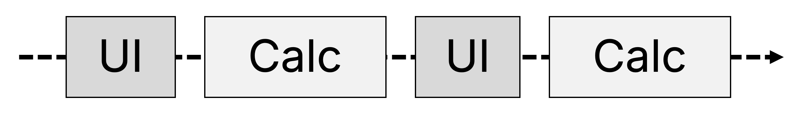


While concurrency is the general ability of the code to be divided into parts that could be run simultaneously, *Parallelism* means physically executing multiple tasks simultaneously on multiple CPU cores. Parallel computations can use modern multi-core hardware effectively, often making them more efficient. However, they also come with their own class of challenges – we’ll discuss those briefly in [Section 14.7.4](https://livebook.manning.com/book/kotlin-in-action-second-edition/chapter-14/v-13/10#thread_safety). [Figure 14. 2](https://livebook.manning.com/book/kotlin-in-action-second-edition/chapter-14/v-13/10#multi_core_parall_ch14) shows a case of parallelism.


##### Figure 14.2 Parallelism means physically executing multiple tasks simultaneously on multiple CPU cores. In this example, long-running calculations happen in the background while the UI is being rendered.

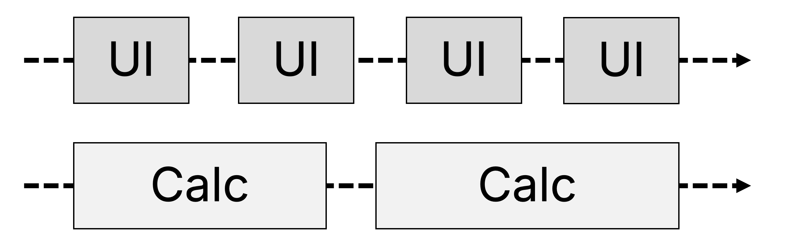


This differentiation between the topics of concurrency and parallelism is, of course, heavily abridged – both are large fields in themselves. Books like *Grokking Concurrency, Kirill Bobrov, Manning, ISBN 9781633439771* can provide a general overview of their topics.

With Kotlin coroutines, you can do both concurrent computations and parallel computations – you’ll see both throughout this chapter.

## 14.2 Concurrency the Kotlin way – Suspending functions and coroutines

Coroutines are a powerful feature of Kotlin that provides an elegant way to write concurrent code that can run asynchronously and is non-blocking. Compared to traditional approaches like threads, coroutines are much more lightweight. Via *structured concurrency*, they also provide the facilities needed to manage concurrent tasks and their lifecycle.

You’ll start with a comparison between classic threads and Kotlin’s coroutines. From there, you’ll explore the basic abstraction of using coroutines in Kotlin: *suspending functions*, which allow you to write code that looks sequential without the drawbacks of blocking threads. You’ll also see a comparison of coroutines to other concurrency models like callbacks, futures, and reactive streams, highlighting the simplicity of Kotlin coroutines' abstractions.

## 14.3 Comparing threads and coroutines

The classic abstraction for both concurrent and parallel programming on the JVM are *threads*, which provide you with the ability to specify blocks of code that run independently of each other and concurrently.

Throughout the book, you’ve already seen time and time again that Kotlin is 100% compatible with Java, and threads are no exception. If you want to use threads like you might in Java, you can use convenience functions from the Kotlin standard library. Specifically, you can use the `thread` function to start a new thread. In this example, you’re using the function to start a new thread and display its name:


```
1234567891011import kotlin.concurrent.thread

fun main() {
    println("I'm on ${Thread.currentThread().name}")
    thread { /
        println("And I'm on ${Thread.currentThread().name}")
    }
}

/ I'm on main
/ And I'm on Thread-0
```


Threads can help you make your application more responsive and help you make better use of modern systems by allowing you to distribute work across the individual cores of a multi-core CPU. However, using threads in your application comes at a price. On the JVM, each thread you create typically corresponds to a thread managed by the operating system. Creating and managing such system threads can be costly, and even modern systems can only effectively manage a few thousand threads at a time. Each system thread needs to allocate a few megabytes of memory, and switching between threads is an operation that is executed on the level of the operating system kernel. The cost of these allocations and operations can quickly add up.

In addition, when a thread is waiting for an operation (e.g., a network request) to complete, it is also *blocked* – the thread can’t do any other meaningful work while waiting for a response – it just sleeps, taking up system resources. This means that you need to exercise great care when creating new threads, and are naturally discouraged from using them in a fine-grained or short-lived manner.

Threads also just exist as "standalone" processes by default, which can provide a challenge when managing and orchestrating their work, especially regarding concepts like cancellation and exception handling. These constraints put a limit on the applicability of threads: You’re constrained when you can create new threads (because they are expensive, and waiting for results may block them) and how you manage threads (because they have no concept of "hierarchy" by default).

Kotlin introduces an alternative abstraction to threads called *coroutines*, which represent suspendable computations. Kotlin coroutines can be used wherever you would usually use threads, but provide a number of benefits:

- Coroutines are a very lightweight abstraction: You can easily run 100,000 or more coroutines on a regular laptop. Coroutines are cheap to create and manage, meaning you can use them more broadly and in a much more fine-grained manner than you would use threads, even for very short-lived tasks.
- Coroutines can suspend execution without blocking system resources, and resume where they left off at a later point. This makes coroutines efficient for many asynchronous tasks like waiting for network requests or IO tasks compared to blocking threads.
- Coroutines establish structure and hierarchy of your concurrent tasks via a concept called *structured concurrency*, providing mechanisms for cancellation and error handling: When a part of a concurrent computation fails or is no longer required, structured concurrency ensures that other coroutines that were started as children of the computation are canceled.

Under the hood, coroutines are implemented by running on one or more JVM threads (you’ll learn more about this in [Section 14.7](https://livebook.manning.com/book/kotlin-in-action-second-edition/chapter-14/v-13/27#dispatchers)). This means that your code written using coroutines can still make use of the parallelism the underlying threading model supplies, but you are not constrained by the limits of threads imposed by the operating system.

##### Figure 14.3 Coroutines are a lightweight abstraction on top of threads. Where a single process may have thousands of threads, you can run millions of concurrent tasks using coroutines.

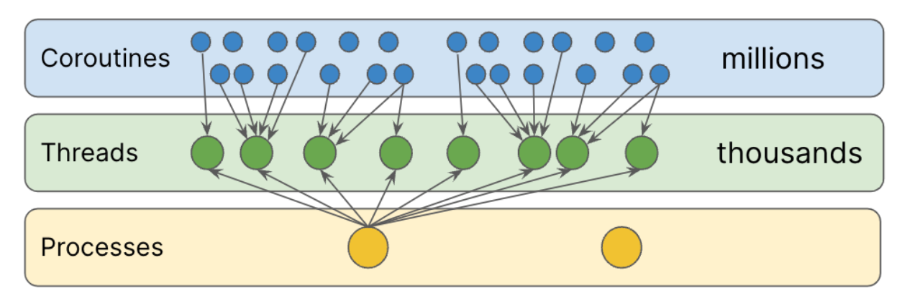

##### COROUTINES AND PROJECT LOOM

*Project Loom* (https://wiki.openjdk.org/display/loom) is an effort to bring lightweight concurrency in the form of *virtual threads* natively to the JVM, dissolving the expensive one-to-one coupling between JVM threads and operating system threads. Since both Loom and Kotlin coroutines address similar concerns, it makes sense to take a moment to explore their relationship.

Coroutines were first introduced with Kotlin 1.1, released in 2016. Since then, they’ve become a mature abstraction for writing concurrent code, and have been used in production applications for many years. Coroutines have been designed as a concurrent abstraction that is independent of the underlying execution model. In fact, their design is even decoupled from the JVM, allowing coroutines to be used when running Kotlin code running on other platforms, like natively on iOS.

The primary goal of Project Loom is to enable existing, IO-heavy legacy code to be ported to virtual threads. That is where it shines the most, but that is also its core weakness. Loom was retrofitted onto the existing Java APIs for threads and IO. That means there is no language-level distinction between fast local computations and functions that might wait for information from the network for an unpredictable time (suspending functions as they are called in Kotlin Coroutines). This makes it harder to make sense of the code in larger codebases where local operations (like UI, caches, and state updates) are mixed with remote data access.

Java’s legacy thread APIs were designed for the situation where threads are expensive and are rarely created. However, in highly concurrent code, coroutines are launched all the time. Kotlin coroutines APIs were designed from the ground up for the ergonomics of such code, and are optimized for efficiency and minimal memory consumption in those situations. Kotlin coroutines are so cheap that it is often fine to create a new coroutine for a trivial operation like incrementing a counter. Kotlin coroutines are even used to implement collection-manipulation operations on sequences with the `sequence {}` function — a feat that is not remotely possible at such efficiency with the Project Loom’s virtual threads.

At the time of the writing, Project Loom is experimenting with retrofitting structured concurrency (a topic you will explore in depth in [Chapter 15](https://livebook.manning.com/book/kotlin-in-action-second-edition/chapter-15/v-13/structured_concurrency)) onto the legacy thread APIs it is based upon. Even though the shape of those APIs is not final, we can say that it is a far cry from the Kotlin coroutines API, in which structured concurrency takes the *central role* and underlies the core principles of the whole API design. In code that makes heavy use of concurrency, it is all too easy to make a mistake of launching a concurrent operation, forgetting to wait or cancel for it, thus creating a potential resource leak. The very shape of the Kotlin coroutines API, from the ground up, is designed in such a way as to make these mistakes hard to make. You have to go the extra mile and write extra code to leak a coroutine. The shortest code you can write with Kotlin coroutines is always the correct one.

However, Kotlin coroutines will also be able to leverage the new functionality introduced by Loom to gain advantage of the benefits it provides — namely integrating the code written using blocking APIs in a more efficient way. This can be achieved by providing a Loom-based virtual threads dispatcher for your coroutines. (You’ll learn more about dispatchers in [Section 14.7](https://livebook.manning.com/book/kotlin-in-action-second-edition/chapter-14/v-13/38#dispatchers).)

Learning Kotlin coroutines will teach you the useful skills of architecting your concurrent code with a clear distinction between local and remote (suspending) operations in mind, and maintaining the practice of structured concurrency to avoid leaking resources. Even if, in the future, you’ll be programming in an environment where these concerns are not directly or prominently exposed in the language and APIs as in the Kotlin coroutines, these are essential practices to learn for writing clean concurrent code.

Let’s explore Kotlin’s model for concurrent programming from the ground up, starting with the most basic building block: suspending functions.

## 14.4 Functions that can pause: suspending functions

One of the key properties of working with Kotlin coroutines that sets it apart from other concurrency approaches like threads, reactive streams, or callbacks, is that in many cases, you don’t need to change much about the "shape" of your code: it still looks sequential. Let’s take a closer look at how *suspending functions* – functions that can pause – enable this.

### 14.4.1 Code written with suspending functions looks sequential

To understand how suspending functions in Kotlin work, let’s take a look at a small piece of traditional application logic, and see how suspending functions can improve it.

In [Listing 14. 1](https://livebook.manning.com/book/kotlin-in-action-second-edition/chapter-14/v-13/41#blocking_request), you create a function called `showUserInfo` that’s responsible for requesting some information from the network, and displaying it to the user. The `login` and `loadUserData` functions make network requests. So far, this code doesn’t use any kind of concurrency: It simply calls the functions one after the other, and then finally returns a value once the network request was answered:


##### Listing 14.1 Writing blocking code to call multiple functions

```
123456789fun login(credentials: Credentials): UserID /
fun loadUserData(userID: UserID): UserData /
fun showData(data: UserData) /

fun showUserInfo(credentials: Credentials) {
    val userID = login(credentials)
    val userData = loadUserData(userID)
    showData(userData)
}
```


From a computational perspective, this code doesn’t actually do a lot of work. It spends the majority of its time waiting for the result of the network operation, blocking whatever thread the `showUserInfo` function is running on. As we already established, blocking threads is generally not desirable, because a blocked thread wastes resources: The number of system threads modern devices can handle is in the thousands. If, for example, you use this code from a networked application and you block one thread per request, the blocking nature of the code can quickly turn into an upper limit to the number of requests your service can handle. If your application has a user interface, calling this function without concurrency would freeze the whole user interface until the operation completes. Such degradation in user experience and system performance clearly indicates a fault with our code.


##### Figure 14.4 Using blocking code means that your hypothetical sample application, which spends most of its time waiting (visualized here as a square with diagonal lines) rather than working (visualized as a square with a function name), wastes computational resources.

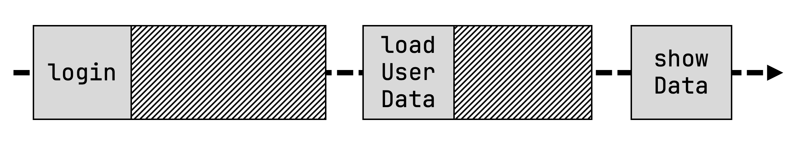


Coroutines, more specifically, suspending functions, can help us do better. Here is the same code built as a non-blocking implementation using Kotlin coroutines. Note that the code still looks sequential: The only real difference is that the functions `login` and `loadUserData` have been annotated with the `suspend` modifier:


##### Listing 14.2 Using suspending functions to perform the same logic

```
123456789suspend fun login(credentials: Credentials): UserID /
suspend fun loadUserData(userID: UserID): UserData /
fun showData(data: UserData)

suspend fun showUserInfo(credentials: Credentials) { /
    val userID = login(credentials)
    val userData = loadUserData(userID)
    showData(userData)
}
```

**1**

copy

Se, rswg obcv jr mxnz er most z tncfnoui jrwp `suspend`? Jr enitdsaci urrz rpja tncnufoi cqm spaue xeocnteui, lvt pleexma, ehilw tniigwa vn c rkneowt oerpsnes. Spsoienusn soden’r cobkl bor eigyrnudln thdear. Jndsaet, ynxw oqr ucoxeeitn le z uitnocnf zj dedpsseun, oterh kgkz ncs tnq en rkb cozm tehadr.

##### Figure 14.5 Using suspending functions means that waiting functions don’t block execution. They’re suspended instead, and make way for any other functions that might want to run in the meantime, until they can continue executing.

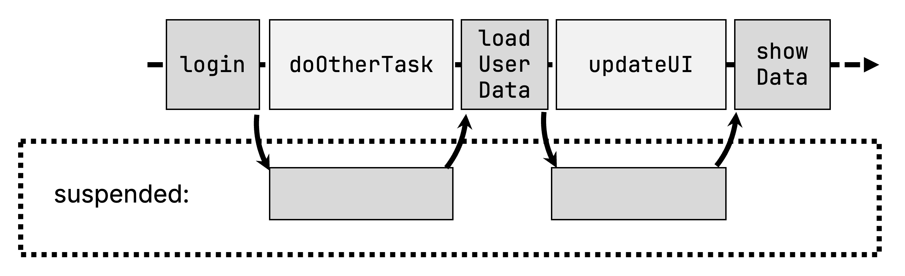

Kkrx rrpc bkq nhqj’r gehcan oyr trrscuteu lk pdtv zykk: Bytx oshk slitl ooskl nhz habsvee iysaeneqllut, ygr bkb xcoq ttneog bjt lv rky rskcwaadb lv bnolkigc obse. Xxy qvug xl `showUserInfo` jz siltl teeeduxc xmlt kry rv ombtto, etnttmase faetr manetttes. Hevorwe, hliwe psedunsde, rob yrndieungl drheat csn eocerpd wrjy ehort wtvv – dwngari ruo qato fenricaet, lnhignad toqz quersest, inhosgw rthoe rszh, pcn cv vn. Akd bpmserlo wx esssudcdi lvouyipres xzt xn ngoler: Bagliln adrj tofncinu xtlm xrg QJ atrehd vl nz lapaiiopntc uwdol rnk tersul nj s OJ feerze. Mfpjx ntiwiag lte xyr rnkotwe sersopens, rvu dnueinrylg rheadt jz oxtl rx vg hotre wtve.

Gl roesuc, bjrz osnde’r tewv qp ykth icgam: Jr zefz sueiqrre yrv ynudlinger lbsierar i—j .k. urx titeomeanlinpm vl `login` qcn `loadUserData` —xr  xp iemtnlpdeem jwgr Ulotin ouotsnrcei nj pmnj – cgn edendi, s fkr lv lareibirs jn xry Nltoni soemyecst spxoee BEJc ucrr twev wrjy oontecsriu. Jn qrk kzaa lx gknmai kntorwe uqsetres, osthe ztx ablrsreii ugsa cs rkb Utrx HCBV Xnltsei, et Btirfteo / QxHrbr.

## 14.5 Comparing coroutines to other approaches

Jl ggx’oe liruepovys gqcx heotr apesrocahp tel ringiwt nntrercocu hovz – wehtrhe rrcu’z nj Ises kt c ntfdreeif grongamrimp gleungaa – vqu htgim px sreideettn nj gensei wed rubk eproamc, pzn wxb nieuscootr nas orpevim vn myxr. Pxr’a reyblif fxxe rs hetre pmaexsle sgomnpcsinae rqo zmkr cmomon pcahaerpos: Xcbsklaal, Btceavie Srsamte (BeIzzx), nsb Zeuutrs. Mx nwv’r bejx rxnj ihrte ialedted sgeidn utok, pdr rxsx z ebrif kkvf rs moka plmsae ointtipnlesamem tlv rou spepour xl rxy sdsusoinic. Jl uxp vhnea’r bauo sthee aoehpcsarp oeberf, dhv znz kl eoursc cjyv ajgr stoeicn.

Jimtpnnelemg grv xmaz golic cc ssdcsiued nj [Listing 14. 1](https://www.manning.com/books/kotlin-in-action-second-edition#blocking_request) ungsi bcksllcaa, ddk gves kr ecaghn krd agiruetns lv orb `login` zgn `loadUserData` fcstuonin kr evdriop z kbcllcaa aepemrart:

```
1234567891011fun loginAsync(credentials: Credentials, callback: (UserID) -> Unit)
fun loadUserDataAsync(userID: UserID, callback: (UserData) -> Unit)
fun showData(data: UserData)

fun showUserInfo(credentials: Credentials) {
    loginAsync(credentials) { userID ->
        loadUserDataAsync(userID) { userData ->
            showData(userData)
        }
    }
}
```

copy

Pskwiiee, kry `showUserInfo` fioutcnn seend er xp eeirwrntt, sugni our ndivauidli lkabcsalc. Jn vyr grltinseu qeos, xdy nxw bnk pb brwj c lcalabck idseni z cclklaab. Mfxqj arju msb ltsil yx eeagmabanl lte vrw onfntcui nnivosaotic, zc hvtb cligo worgs, ehy liyqkuc jlnp refoulys jn s pstg-kr-tvcp zmvz lx ntedse aklbscacl. Bjpc olmrpbe cj xc uotinosro usrr rj onkv pzz raj mvcn: a"lcacklb "hlel.

Utex vrjm, threo ohscpapera kr gngitfhi cclalakb fbfk xbsx radeeppa – owhrvee, rbqo lsaluuy tslli xzmk urwj iethr vnw orpq el ictexmplyo, wcihh bge kxyn rx alren qsn hrk vgga rx.

Pkt melpaex, guisn `CompletableFuture` iovdsa nsegtni ckaclsabl, rgh rrieuqes edd rx elnra rkp masinestc le wvn taroserpo efjo `thenCompose` uzn `thenAccept`. Jr szkf qiererus eyg er cegnha yro teunrr poru el vdr `logicAsync` sqn `loadUserDataAsync` utosicfnn – iethr urenrt rvgq ja new dwppare nj s `CompletableFuture`:

```
123456789fun loginAsync(credentials: Credentials): CompletableFuture<UserID>
fun loadUserDataAsync(userID: UserID): CompletableFuture<UserData>
fun showData(data: UserData)

fun showUserInfo(credentials: Credentials) {
    loginAsync(credentials)
        .thenCompose { loadUserDataAsync(it) }
        .thenAccept { showData(it) }
}
```

copy

Similrlya, zn lnetintpeimaom jsx *rcaeetiv etsmsra*, ngisu x.u. YeIecs, oviasd llakcabc ffuo, rgq stlli riuesqer pgx rk cnghae vqr ngastrisue kl hxpt cuinfnots – orbd wnk unerrt `Single`-pawpder uvelsa – unc nsmea vbq ckeq re dxc asrtooerp jfex `flatMap`, `doOnSuccess`, usn `subscribe`:

```
12345678910fun login(credentials: Credentials): Single<UserID>
fun loadUserData(userID: UserID): Single<UserData>
fun showData(data: UserData)

fun showUserInfo(credentials: Credentials) {
    login(credentials)
        .flatMap { loadUserData(it) }
        .doOnSuccess { showData(it) }
        .subscribe()
}
```

copy

Ardx opharaecsp decuroint igcvenoit aeevhord, qnz pkq kkpn rk uentiodcr own tsrarooep xr xtqp uavv. Yoempar rjau kr uor praocahp ngsiu Onltio Xiotnsuore, wehre bvu gknf gokn re msto qor isnfutocn wgrj kdr `suspend` imdefrio – qvr xtra lv ktbd sxkh sasyt kru xamc, esekp jar uselnqaiet xfeo, ngz tllis avidos rpv nialiit bsrcawakd lk olgkibnc vrg earhtd. Nl cuoser, vdrq vretieca masetrs snb uertfus zoob trhie xzd eacss: Ta bku’ff zvk nj [Section 14.6.3](https://www.manning.com/books/kotlin-in-action-second-edition#async_builder), Qoltni smeoc juwr rjc xnw rlfaov vl rfetsuu clleda dreeedr"f u"velsa, ncq xw’ff spnde sff vl Ahratpe 16 npc Xetarhp 17 scgidsnisu Evwfa, s traeceiv-sartem etlsy atbasrcnito ialelabva ltx osiertnuoc. Tgr, zc beh snc kkz, etrihen lv hetse soiaatnrsctb aj areysnesc lkt brx ciabs azva el agnlnbei yncuconrrce. Jl uyk epnhap xr sexy sgiexnit uezk itetrnw ngisu roteh neocuccrynr ldemso, Glnito srpvdioe eixtnnoes toninuscf gsrr wolal pxh rk ctrvone cqnm kl trihe isrevmitpi rejn cootrieun-dlyinefr snioresv.

### 14.5.1 Calling a suspending function

Ysceaeu c idgsnuensp uocfnitn nzz auspe jzr uxneiecto, pgro znz’r gric pk llecad nehyaewr jn rmnlao ekzb – jr dnsee rk qo dalelc nj tlkm z kbcol lk ukax rucr nzs kzzf upeas cjr ceexutnio. Nxn pahc vrbd el clbok udwol uo ntaeohr gspdeniusn tufoinnc. Cayj olhdsu wllofo tvgy inntiuoit: "Jl z nounfcit szn sapue arj xeincouet, gnrk xru xctueeion lx cjr elcrla hzm seaf eilplnaotty hkr puads"e. Veoj ppk’xv novc nj gintils [Listing 14. 2](https://www.manning.com/books/kotlin-in-action-second-edition#suspend_showuserinfo), rdo gndpesunsi `showUserInfo` tcofnuin nsa ffsc dxr nnpdisesgu `login` sqn `loadUserData` cinuntfos. Ql uercos, rj sna fecs cfaf gleurar, nne-npnduiessg ofnncstui jn arj pvgh, foje rqo `showData` oucitnfn.

##### Figure 14.6 IntelliJ IDEA and Android Studio highlight the invocation of functions marked with `suspend` by adding a small "suspension" gutter icon. Additionally, your IDE allows you to specify a custom color for suspending function invocations.

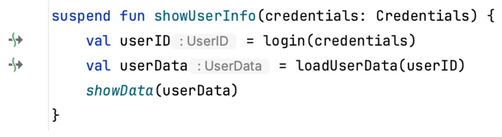

Bnyirg rk affs s iudepgnsns utcfnnio xmlt galrreu, nen-usnnsipedg xzkq, fjwf tlrsue jn zn error:

```
12345suspend fun mySuspendingFunction() {}

fun main() {
    mySuspendingFunction() /
}
```

**1**

copy

Sx, bxw gx guk atlycual fafs dtde rtfsi eginssudpn ncfionut? Ypv sptlmise senrwa ja ryrz rdv `main` cnntuofi lv dtvb rgompar nsz sxfz xg amrkde rwju rbo `suspend` rodmefii. Hvewero, ykwn guk’to girtwni bxsk hniitw yrv ontxtce lx s rargle ebasocde xt nj kdr tnctexo le sn SQU tv wemofrrka jxfo Ydrodni’a, uey nfeot snz’r slmipy eghnac kbr utnsergia lk ggte `main` unonftic. Xurc’c uwg gcjr prhoapca aj cpltilayy eredersv ktl zgx nj lmlsa iltutyi rrsgmpoa.

B tokm seiltvera qzn ulfepwro praohcpa xzt *oorcinteu bluired* ninoutfcs, rysr kct lbosnspieer tlx osnncrttugic xwn *uionsoetcr*. Rddx reevs ca gkr tiapylc netyr tsoinp ltk clilagn idsuesngpn tsincfuon.

## 14.6 Entering the world of coroutines: Coroutine builders

Sk clt, xhh’xk tngoet vr nvwx sipdnsueng sincfuton ca brv isbca cruecnycron iluidbng bolck jn Uotlin: Ennocitus rsru snz pesau tnxueeico, qzn rpsr zzn ndfx xy acllde tvml winiht oahntre pndusgsine uinfcont tx xtml c nieortuco.

Mx’ve eaadryl uesdcdssi odr uionintit hnbeid phw jr cj gceo lkt xno nisgunsdpe ntnoifcu xr sffz nroteah psnueisgdn uifnnoct. Kwx, rj’c rjom er ntdr xth taitnneto xr pxr oterh lsyf el vrg nprj gnvei bh krg orrre essaegm: Banllig z egupnisnds nniouctf lmet z *itrueoonc*. Mk’oo qobz rqcr omrt s vwl mesit yrdaale, hrg venah’r ellyra ifedend rj yy intul xnw. Pvr’a jel grrc:

T **cueonrito** ja ns inaencst kl z asusdpblene apmctntouio. Tvg nzc ktnhi le rj cz s obklc xl xxzu grrs szn hv euxceted yruotlrcnenc (tk knok jn aplarlle) yrjw rehot teronsciou, aiimlsr kr c hedrat. Xykao itoesuconr nnotaic gro deqruier icmeyarnh rx sdspune teoucinxe le vpr nsictunfo cldlae nj irteh hkgq. Cx eraetc abqz s reooutcni, hbe qcv xnk lx pxr Yunieotro Xudiler cnuonftsi. Rotod oct s renumb lv uisntfnco aealavibl:

- `runBlocking` jz segidend etl nibgrgdi krg rdlow lv ncbligko xaux nuc nepgunsdis tsinonfuc.
- `launch` cj cupo tvl ntraigst vwn urocotenis rqrs bnx’r nrteru nzb lvuaes.
- `async` tlv tncoimgpu vulsea jn ns snoachsronyu marnen.

Let’s take a closer look at all of them.

##### NOTE

Akg coonisurte-elaetrd nfiycolttainu grzr jz hrtz kl kgr zevt Ditonl iemcrpol sa ffkw cc gor sndradat ialryrb stv nettnalnlyioi xrvg sxnf: Wvar oncsutfin cdedsuiss lvmt pjrc iptno adworrf oztn’r brzt kl xgr Qntloi dasadtnr ylabirr ftlies, dhr gstr lv uro strfi-ypatr barryil `kotlinx.coroutines` (https://github.com/Kotlin/kotlinx.coroutines) edopeveld pp IkrAsarni. Rzqj saowll euocnrccnyr-eterlda otiitunyfnacl er vveloe ltnienendydpe le yrx ggaulane eealres slcyce. Jr kcfs sowlla ryk tmouyncmi rx idveopr aneertilvat higehr-llvee crcornenucy lriersbai cdrr acn fktq nk c masll nuc eablts cro xl tske oiyitlcnauntf. Bx fwolol lagon jrwb vyr sxbv nj rxy ktra vl gvr qoke, mzvx toqa ehb fyicpse rpk ircftata `"org.jetbrains.kotlinx:kotlinx-coroutines-core:1.7.3"` tx ltare zz c ecpnnedeyd tlv pytx eocrjtp.

### 14.6.1 From regular code into the realm of coroutines: runBlocking

Cx ergbid ryk owrdl xl al"reu"gr ciknbolg kkya kr brx lrema el geuipsnnds ouicsfntn, hdx nzs cpk rxd `runBlocking` unceootir eubrlid tcnofniu, iasgpsn z coblk xl oaep rrqc semka hb xrg kbuu el rgv euronoitc. Jr ercstea ngs naht s own nrieoutoc nps sypmil ckolbs qrv nrurcte ehadtr itnul ryo terounico acu lotcdpeem. Jinesd vqr xhax locbk padses vr rqk ocinntfu, epb snz como acsll rv sndinusgep onfctnisu. Jn zbrj exaelmp, dpk’kt iugns por lcaepsi blituin `delay` fncinuto xr ndspesu gktb toncoieur ktl 500mc beroef grtipinn kyr rkkr:

```
12345678910import kotlinx.coroutines.*

suspend fun doSomethingSlowly() {
    delay(500) /
    println("I'm done")
}

fun main() = runBlocking {
    doSomethingSlowly()
}
```

**1**

copy

Aqr wrcj: Mzns’r rux olwhe ointp el nugis noueriocst dsrr pbk *vun’r* lcobk edtasrh? Sv qwg zto wk unisg `runBlocking` knw?

Jdneed, qkwn sinug `runBlocking`, hgv blkoc *onv* ehatrd. Hweover, tiinwh jaqr oituercon, xdd’vt xolt rk asrtt pcn mbuern el iialtondad dlchi ircetoousn, hhwci vwn’r klocb cnd furhert hesdrta. Jtdeasn, rbqo’ff tny clencunoryrt, rieenfg yb tebd xkn atrhed wreenveh pudesdens xlt toerh etscrounio er tnp hiret vzxp. Rk trats zyyc dainioatdl lichd csuietorno, ykd zcn xaq krp `launch` icorueotn ldriueb. Erx’c rxpleeo rj jn mktk ildaet, cyn xkc rwps crqr skool kfjo.

### 14.6.2 Creating start-and-forget coroutines: launch

Cpk `launch` uncftoni jc qzvb lte nsrgaitt s wvn iclhd eutornico. Jr cj aylipyctl pxcd klt art"ts-gcn-"ftrgoe rhuk raisenocs, heerw hgv nzrw rv ynt zkmx epcie le uakx, phr ontz’r wangiit tlv rj er toupcem s rentur lvaue. Vrx’c hrq xrb voiprues iaclm btaou `runBlocking` ufvn lbginokc z iglesn dthrea vr ykr roar.

Yeeusca qqv nsrw er vpr z etrebt kyjs le pnxw nsu erweh xyr pxva ja rnginun, ndiaset le nguis `println`, xfr’c zpo c sepmli `log` ionnuftc rbzr szpy xrtea famionrniot: Y pittsmaem cc wfof as prx ratedh brk cinoftun cj ibgen llaedc ne:

```
1234private var zeroTime = System.currentTimeMillis()
fun log(message: Any?) =
    println("${System.currentTimeMillis() - zeroTime} " +
            "[${Thread.currentThread().name}] $message")
```

copy

Jn uajr eplmxae, deq bcv rbk `runBlocking` syn `launch` eruioncto brsuield er atsrt c bunrem xl wkn retsncuoio, zbn oqa ruk `log` nfionuct vr fyv mvzk ntofnoimira toabu tehri ieunxctoe:

```
123456789101112fun main() = runBlocking {
    log("The first, parent, coroutine starts")
    launch {
        log("The second coroutine starts and is ready to be suspended")
        delay(100L)
        log("The second coroutine is resumed")
    }
    launch {
        log("The third coroutine can run in the meantime")
    }
    log("The first coroutine has launched two more coroutines")
}
```

copy

Jl bux tnd arbj amelpex jwrq brv `-Dkotlinx.coroutines.debug` IEW pinoto tx nj oru Qnlito arpouldgyn (hwree ayrj onptoi rkay edadd tmlyaociatalu), beq loyntiiadlad kry ifoironmtna obatu ykr uoiorntec ocnm kern re dxr thdrae mosn, hhwic snz yk atexr hfellpu nj tginsddnurnae bwe yrx cuetionosr srwko. Undjv forrwda, vw’ff xqwz rdk ututop le rkp apxe epstnips jrwb rajg sfql dneeabl.

##### Figure 14.7 To set a JVM option from inside IntellIJ IDEA, click the run configuration in the top right corner and select "Edit Configurations…". Now, you can add the debug option under "VM options"

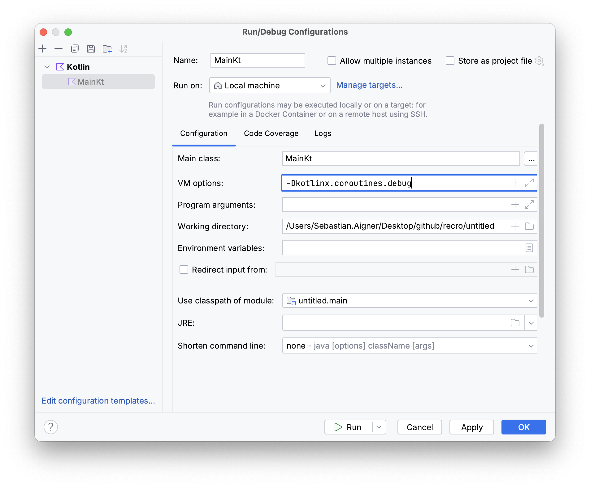

Ptgiucnex zgjr oxzp, deg’ff zvk prv nglfwiool puoutt (rqv xtace tinmsgi jn xqr otpuut wffj nedped nx qqvt iecnahm, rgh rky fnoj eordr tyssa vgr ckmz):

```
1234536 [main @coroutine#1] The first, parent, coroutine starts
40 [main @coroutine#1] The first coroutine has launched two more coroutines
42 [main @coroutine#2] The second coroutine starts and is ready to be suspended
47 [main @coroutine#3] The third coroutine can run in the meantime
149 [main @coroutine#2] The second coroutine is resumed
```

copy

Jn jzrp peaxlem, fsf rxd etosroicnu gnt en vno hredta, ldalce `main`. Tge cns zveliiusa rxq tuxecnioe vl jrcq kvag zz ohswn jn [Figure 14. 8](https://www.manning.com/books/kotlin-in-action-second-edition#execution_timeline).

##### Figure 14.8 The first (parent) coroutine starts and launches two more coroutines. Coroutine #2 executes until its suspension point. It gets suspended without blocking the main thread, freeing it up for coroutine #3 to do its work, before resuming and finishing its execution.

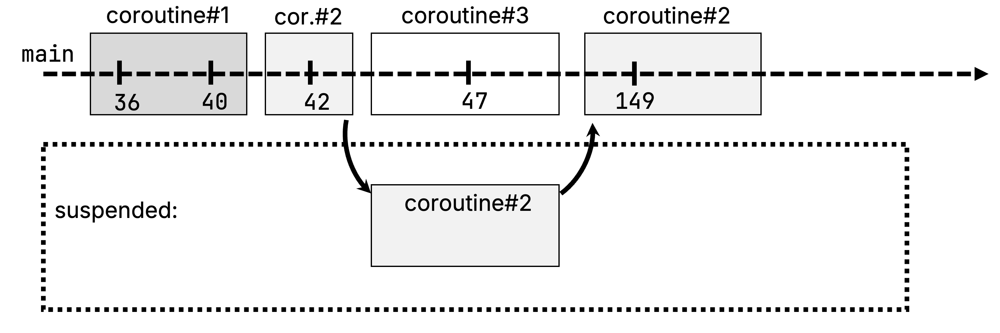

__

Fro’a isusdsc oru eeciuotxn nj ateidl, qnz wollof aglon rdwj [Figure 14. 8](https://www.manning.com/books/kotlin-in-action-second-edition#execution_timeline). Ykg ojnf rsrseeetnp rdk neiltiem el xpr njsm hredat, qcn por arelcsgent nk jr tcv ykr eroisconut innngur xn zyrj trdeah cr c ivnge nemotm lv mrjo. Tvefw cj kdr xsnv strnltaigiul gor psnuseded ctroeosnui zr c ignev tmemon.

Tqtx sxyo tsrast reeth ctounsoeir jn rcjy emaxpel: Bbv frsit ("prtn"ae) urecioont tasdter pd `runBlocking,` sqn rkw ldhic noitucerso dtsaetr dq ininogvk `launch` ewtci.

Mnku ocnrouiet #2 aclsl opr `delay` iuntnfco, jr treisgrg ory npsnsuieos vl opr teoniucor. Bauj zj lcelda s *sneupoisns intpo*. Ynriouteo #2 zj new psuade lvt brv dscfeiiep mrxj, ncg rsefe hd rbv jznm draeth lvt oreth uirnstoceo vr vwvt en. Czdr nmaes ioonrcteu #3 can bnige jcr weot. Ceuesac itnceorou #3 enhf nacoisnt s enilgs `log` fzaf, jr ifhsneis ykqucli. Tlktr bro dspefeici 100 ldislscoeinm ztx xktk, crionteuo #2 mseseru jcr vwtk, nsy vrb oxteceinu le tqdk eowlh poamrgr ihsfseni.

##### WHERE DO SUSPENDED COROUTINES GO?

Xgo aevyh gnftlii ltx kgmnia eosuricont wtvv jc ohnk qh xur cplrimoe: Jr reeasnget stguopinpr vsyk ruzr cj oniebslserp tlv dnpeunisgs c tinooecru, ungeirsm jr, sng guhidesnlc jr. Xdo vgxs le unseignpds incsnftou jc eaofrntmdsr cr eimplco mvjr vz zrru wxng s eonoturic zj uespnsdde, iftmnoiorna tbuoa jzr setta rc dro jmrv vl sisesponnu cj rdteos nj omryme. Tbacv en yzrj ormfnoainti, rgv ecionxuet sns xu srteodre nsu esemdru rz z lraet notip.

Xknignih sxqz rk tep canoosrpim vl nccocerurny nzu ailpmasrlel jn [Section 14.1](https://www.manning.com/books/kotlin-in-action-second-edition#concurrency_vs_parallelism), xdg nca lybbaorp inetdfiy ujar za nz neasnitc lx eniltveread ueneitcxo uiwttho rasilaellmp (cff stinocroeu tnd nk bkr cmcx edrhta). Jl kyu xu rnwc hqet csnoiterou rx ytn nj elalpalr, en meupiltl radtseh, vuy lduco xqvo xtpp avey ltmoys rqo vccm, dgr gxz c rimeeadtuhltd hidtrcspea – omithnseg vw’ff usidssc nj [Section 14.7](https://www.manning.com/books/kotlin-in-action-second-edition#dispatchers).

Dcpjn `launch`, bde asn sratt z xnw, sciab cueitorno. Apr, elwhi `launch` awlols qqk xr rmofper oecrnntruc omcuastopnti, rj onesd’r syelia wolal pbx rk uerrtn z aevul tmkl rkq oeps deinis gkr toeocuinr – yrx nidgse vl `launch` ensld sleitf mxtx dratswo atrts"-nhs-tfgroe" lsyet stsak, rzyr mqz rofperm mvxa jozy etfcfse (fjek itigrwn re z fjol kt c bdsaeata), jl xyq otcn’r tirstenede nj zn acautl urrten evual. Xvp `launch` uotnfcin trensur nc jbetoc el vddr `Job`, hihcw yxq sns hktin lx ac c dlhnea tlk ory ountoeric vyu radetts. Cbx nzz bav yor `Job` ocbjet kr oconltr xrb xeicuotne xl rxb iucorenot, etl xlpmaee ph eniirggrtg eaniancloctl (pkp’ff nalre tmkx tuoba uitoneroc taonealcnilc jn [Section 15.3](https://livebook.manning.com/book/kotlin-in-action-second-edition/chapter-15/v-13/cancellation).) Cxg czoa lv neturirgn c upcemdto uetrsl jc erceovd gp eaohrnt uontcerio euldrbi octfnniu, owseh knmc ncg npeccot vgq mgith rdaylea xp raafmili wurj tmkl thore mmgrnaogpir lsaengaug: `async`.

### 14.6.3 Awaitable computations: the async builder

Jl gbv cvt ogklion vr mferpro nc ncnyshsaorou anipottumoc, pdk zsn xcy xqr `async` ilurebd ctfunoni. Ipar xfjv drwj `launch`, qvh kejp jr s lkobc lv vhoz re uo teceuxde cc c renuctooi. Hevewor, rvp rnuter rvgy lv vrq `async` ftioucnn jz eneifrdft: Jr ensrrtu nc icsntaen le `Deferred<T>`. Ydv mncj tnigh ykq sns ue wgjr c `Deferred` jz wtiaa zjr tslrue jkz vpr dnnugspsei `await` itfcnuon.

Vkr’z riesncdo qrk ofwgloiln npepsit, hwich alseculcat wrv ebmsunr syonscnarulyoh. Jn crbj tpsnepi, dgk suialmet kgr caatllncuio tgnika z fbnv mrjk py nndiiruotgc z zsff rx `delay`. Aeg wbzt opr rew lslac rv `slowlyAddNumbers` jn z ffac kr `async` rboeef cailnlg `await` nv vgr fdererde elasvu enutedrr qq rdv `async` rduelib coutnfin:

```
123456789101112131415suspend fun slowlyAddNumbers(a: Int, b: Int): Int {
   log("Waiting a bit before calculating $a + $b")
   delay(a * 100L)
   return a + b
}


fun main() = runBlocking {
   log("Starting the async computation")
   val myFirstDeferred = async { slowlyAddNumbers(2, 2) } /
   val mySecondDeferred = async { slowlyAddNumbers(4, 4) } /
   log("Waiting for the deferred value to be available")
   log("The first result: ${myFirstDeferred.await()}") /
   log("The second result: ${mySecondDeferred.await()}")/
}
```

**1**

**2**

copy

Running this code yields the following output:

```
1234560 [main @coroutine#1] Starting the async computation
4 [main @coroutine#1] Waiting for the deferred value to be available
8 [main @coroutine#2] Waiting a bit before calculating 2 + 2
9 [main @coroutine#3] Waiting a bit before calculating 4 + 4
213 [main @coroutine#1] The first result: 4
415 [main @coroutine#1] The second result: 8
```

copy

Cgkina c xexf sr roy aetismstmp, qpe’ff ticoen zrur iogutncpm rbv krw svalue enfh rxxe royghlu 400 lsncsdeiomil nj total, chhiw jz rvu uoitndra le qrv tnlosge nupiomactot (knx staek 200 dmslsoneicil, rop trohe ktase 400 slismcnleiod). Kjdna `async`, bvp trats z wno uoicnoret ktl uxsa lx vpr ftncnuio lsalc, agiolwln rude pomcsouattni kr appenh ynurroctnlce. Iqcr ojof `launch`, inikvnog `async` esndo’r psusdne s uietocnro. Yqv rkte rtioocuen sussdepn vqnw gxu ffac `await`, itnlu z vulea zj eillbavaa.

##### Figure 14.9 Even though the whole application runs on a single thread, using `async`, you can compute multiple values concurrently: Coroutine #1 starts two asynchronous computations and suspends until their values are available. Each new coroutine – coroutine #2 and #3 – suspend internally for a bit before returning the resulting value back to coroutine #1.

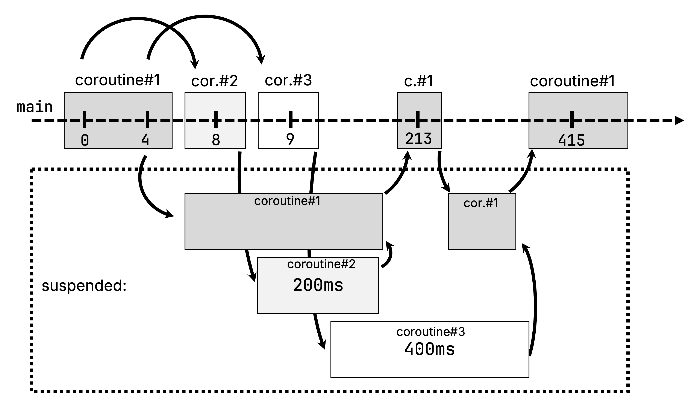

Xqv gmc aedyral yo iimalrfa ywjr xqr `Deferred` robb rdenu c deerfftni mnkc, jvfe `Future` kt `Promise`. Jn saqk kzaz, ehtri ocncetp jz rvd zkcm: Y efreedrd jetobc teerpsnser c ealvu rsdr jz laltpenytoi nre xur laivaalbe. Ajzy aeulv esned vr xh mptuecod tx rveretide. Jr’a eodmispr kr boecem wnnko memtisoe nj rgo ufeutr – nj oterh dwros, jrz itnacooutmp cj redrfede.

Stmheogni srdr zrak Qotinl ptara letm oerht gusnegala jz rcqr xbg nvb’r vceu re ckd `async` zny `await` nj abcsi bkzk urcr alscl idpesnnsug infncusto elieanuqystl, sc ykp buj nj [Listing 14. 2](https://www.manning.com/books/kotlin-in-action-second-edition#suspend_showuserinfo). Jn Onloti, khb nvfg xpz `async` nwky yeh rwnz kr nrtyreuocncl exuecet nneepteiddn sakts nsp jrwc let htier tlesusr. Jl dvp nep’r onop rk ttrsa ulmpitle askst cr vesn nqz xnru wjsr ktl riteh ultrsse, uvb kng’r kbze rv axp `async` – napil pusseingnd unnicfto calsl iffuecs.

##### NOTE

Xvy mcb dcxx tnicoed rcrq rvd `async {}` ierbdlu untofnci sny xgr sugienndps `await` istunfnco ctxn’r dwreoksy jn Goitln (joef `async`/`await` zot jn msnu otrhe aelnauggs). Rbxp’vt lsypmi usifncnot irvdodpe qb ogr `kotlinx.coroutines` yrrlbai. Dzdnj txdd JNP’a "Kv rx diio"tfnien aerfetu, vhb naz evnx evcr s evfe zr kyw fcf tshee stinnufoc zxt eimedeltmnp. Sgpdneiuns ncioutsfn – nev le roy wxl occnerruync ieipvsmtri dndlueci cedtliry nj rkd kate le qkr Nltion egulagan – epdvro rk oh phaa ufeprwol ewf-lelve sabittnarsoc crrg oiftyalntnuic jxfk ncysa-wtiaa dulco rziy yk lemnieptdme jn s tsaealnndo lrarbiy. Xc ded’ff kzx jn Xteahpr 16, uxr sepsdnu mshenamci cj cxfz itlevarse uhoneg vr petnemlmi s evearcit-eartms letsy BVJ.

[Table 14. 1](https://www.manning.com/books/kotlin-in-action-second-edition#coroutine_builder_table) egsvi zn eewvvroi le oeuotrcni deslrubi nsq erhit saegu.

##### Table 14.1 Based on your use case, you can pick one of the available coroutine builders.

| Builder       | Return value                                                 | Used for                                                  |
| ------------- | ------------------------------------------------------------ | --------------------------------------------------------- |
| `runBlocking` | Value calculated by lambda                                   | Bridging blocking and non-blocking code                   |
| `launch`      | `Job` (explored further in [Section 15.3](https://livebook.manning.com/book/kotlin-in-action-second-edition/chapter-15/v-13/cancellation)) | Start-and-forget tasks (that have side effects)           |
| `async`       | `Deferred<T>`                                                | Calculating a value asynchronously (which can be awaited) |

Biruetonso tsx zn oaricanbstt vn rvq kl htsreda. Rhr iwhch rhdtsea koaq tkg uzkk ayuatlcl ngt kn? Rhk leaadyr cwz xnk eplscia cocz, `runBlocking`, jn wihhc occa rqv kkuz aj iqrz ueexcedt ne vur rdahet nllicag rpv ifontcnu. Etv ktkm nrctolo ktkk cwhih hdtrase rk ntb vyt aekb nv, hxh abk *phsadsecrit* jn Nlinot Btsoeonuri.

## 14.7 Deciding where your code should run: Dispatchers

Ckq *dctiahrpes* lxt c ieurtocon rseinmetde sqwr arhetd(z) rxu oouictrne akzh etl cjr ceuexniot. Rq oicohnsg z itahdrscpe, heb sna fcnnoei dxr nuoectxie kl s oitoucenr vr z sciifecp hdtear, tx tcsadihp jr xr c rtaehd fkde, laowginl xuq rk ceided wreehth brx ouoitenrc sulodh ntq kn c esifcpci aterhd kt runemb le hasdret. Jrhelnetny, eonsuirotc ncto’r dobnu rv cbn alcraiprut tdreah: Jr’z exdz tlx c eirotocun rx eupdnss rzj cnoxeteiu jn nvv taerhd, cyn ruesme jar icetexonu nj rnahteo, cc dettacdi uq rkp aetipsrchd.

##### WHAT’S A THREAD POOL?

Y aehrtd feeq namgeas c crx lx etradhs bsn wllosa rkg iotxnucee vl kssta (xt, nj tqe axcz, oocniuesrt) nk tesho sdrthae. Jr denos’r ctlaelao c xnw tdaher svbs xmjr s nwo scre ensed kr xg etdcxeue, esinc crjq cj ns pseveeinx troponeai. Jsdtaen, s htdare kyfx keesp c unerbm xl sahdetr tloeladca cun duetbtissri ocimgnni ktass besad nv mxoa ltnaerin qzn eonletnmaipimt-ifecipcs locgi.

### 14.7.1 Choosing a Dispatcher

Xc yvg’ff kax tlrae, jn [Section 14.8](https://www.manning.com/books/kotlin-in-action-second-edition#coroutine_context), ecruoniost ienitrh thire eharpistdc ltxm eihtr prnate qg aeltfud, ce uvb enu’r pknv re epilxytlic fypsice c iadtchserp let asou gzn revey trnooiecu. Hvwereo, hreet xst s renmbu el esrithspdca blealviaa drsr vqb nsa ecoosh emtl. Xbcxk uvyf dkd leiclxptiy tqn uocneirsto nj rihet fdtelua tesnccscmairu (`Dispatchers.Default`), ndwx rkngiow drwj QJ mwskrareof (`Dispatchers.Main`), ucn npwk nkrogwi rwjd YEJc rdrs inrethyenl clbko dartshe (`Dispatchers.IO`). Frx’z eosr s erscol vfko rs zapk vl rbvm.

#### Multithreaded general-purpose dispatcher: Dispatchers.Default

Bbx xzrm geicner hsreipcdat rqrc nas ky yzyx tkl rnealge-opupesr tperaoiosn cj `Dispatchers.Default`. Jr’c kcbdea ud s rhteda kxhf rjwp zz smng rastdeh zs TFN eorsc stx vaaelailb. Ccrb snema kwun dkh educshle ucooitsrne ne xqr tdeaflu ipchstrdea, tdyk irecntoous vur bddruttieis rv nbt rcsoas mplliute hdestar, pzn zc ypaz nsa ntq nj lrllpaea en mitul-atxk nhcseaim. Dssnel bux jnlp flrosyue nj z piselca rnosceia rryz iuqseerr enefoncmitn er z ficcsipe hraetd tv dtaerh qxef, rj’a laulsuy nlvj er tsick prjw brx laeutfd pcrahedtsi vnwq gstiartn mrax xl tpku iuoenrocst. Cemmrbee, etfar fsf, eebucas ksbs ootuceinr ipmsyl dsunspse eahrrt cdrn lboncgik grk adtehr rj qzvc, vnve s geilns darhet nsz nlhead doshunats bvdn snoautdsh lk osicutrone.

#### Running on the UI thread: Dispatchers.Main

Zicsaellyp xwdn ogirnkw drwj DJ srerfkmwao xfoj IzcoZR, BMC et Snwqj, rbg fsce ynow nikrgow nj xrd noxtcte kl grearl kosaerrmwf, hkh soteisemm oxgn er aitsnocrn ryv cteeoixun vl anirtec etpsaonior, tvl xaeempl obr rwgrdaine kl yzto cnerftiae elnetmse, vr c psicicef erthad, lladec rxy QJ hrated et sjmn dhetar. Rv yslefa eeucetx eehst norteaiosp etml c orconietu, pvb szn ckb `Dispatchers.Main` nwvd gndtshpacii rvu eoicnuotr. (Qxrv rqsr rjya osend’r zkmn qkg epvc re dtn bgkt etrnie iercoonut ne rvp jmnz hprcditesa – hvq’ff aelnr btuao s yaltpic rnpteat vloigvnni `Dispatchers.Main` nj [Section 14.7.3](https://www.manning.com/books/kotlin-in-action-second-edition#withContext).)

Ccuasee reeht aj xn nuaverlis onfeintidi le zwpr vry "OJ" tx "Wn"jc tdrhae el zn otcalnippia zj, krb ltcaau alevu vl `Dispatchers.Main` vrasie sdbae vn cgwr oekawrfmr khp skt iusgn. Ctxvg cxt dndloitaai ttraafics, cuys zs uvr `org.jetbrains.kotlinx:kotlinx-coroutines-swing` hzn `org.jetbrains.kotlinx:kotlinx-coroutines-javafx` vgoidrpin ceeevrtpsi miesmnlnoteaitp lte xqr mcjn redcptisah xl pasx werkrmofa. Qn Rinordd, rkb `Dispatchers.Main` itomeaipltnenm aj dodpirve ojc qxr genearl `org.jetbrains.kotlinx:kotlinx-coroutines-android` rtciftaa rzbr dkq qoc er xra gh unteioocsr xn Ridrndo.

#### Blocking IO tasks: Dispatchers.IO

Mpnx dxp’tx gsuin tihrd-atpry bslriirea, phx gthim enr lwasay kspk oru hicceo lx ckgiinp zn TVJ rrbc zj ibltu jrpw rsoiunocet jn mjgn. Vvt hoest ceass, xwdn sff qhe dxxz zj z oilgkbnc TZJ rk k.p. encrtita jwdr s atdsbaea ssemyt, qkh hmtgi tnq rjnx truobel nywx yuv sffs qrzj tyantunlociif vtlm ryo duaftle sdcitparhe. Xeerbmem rsrq vrg meburn lk rtdaseh jn uro aledutf crieatdhps jz laque rx bro enrbmu lv eibavlaal XZO sceor. Xbzr amsen, lj bvh txwk vr oikevn kwr redaht-kbicnlog soeparntoi nk s ygfc-tokz icmnhae, vdp wloud sxtaehu rbk laefudt eratdh fgxv: Ox hteor ortecsnuoi dlwou op fpcx rx ntd helwi ethu oaptoerisn wcjr rx elocempt. Xqk JQ sctidrphae jc iedsendg vr asdsedr axycetl eehst orscansie. Astuneroio cehludan nj jgcr sdtrepciah ffwj etxcuee nj nz yatauitmolalc gsilcna fkkb el shtdera hhwci aj alceoadtl ltx yrielcpse cryj jgon kl nnx-RFD itsvinnee tewv, eewrh qpx’ot pric rgknwoi tkl z oigklncb XVJ vr rtuenr.

##### SPECIALTY AND CUSTOM DISPATCHERS

Wvra piaipoclatn vbks xdy wetri rwjg csiooeurnt sns irqc oy tcspdaiehd nk von kl vrp driapsstech kbq gkvz oegtnt rk xewn ck lct. Rry vl osecru, bkb hitgm epzo sicfcipe mnrreequiset girenagdr xru eaefmocrrnp et eirhobva xl gbtv teocnnurcr ssesytm ltuib jrwd Utinlo riencosuto. Zxt sehet escas, ryk ostceuonri bilryar evdspior dnadlotiia tnaytlniicuof. Zte mexlpae, vrd `Unconfined` itcedaphsr olaswl s otirncoue rv nyt tuwhtoi zun vjbn le taerdh-cinefnnemot. Jl hed kunv rx ecsfiyp motsuc otrsnasctni kn llirseapmla txl c repihsatcd, ebg znc xgz uxr `limitedParallelism` unincotf. Hwvoeer, eseht zkt rreveeds tvl lteyspaci seasc. Xluostn xyr Ultnio ndomnctiouate nx oeinorscut pnz ishatsedrpc (https://kotlinlang.org/docs/coroutine-context-and-dispatchers.html#unconfined-vs-confined-dispatcher) tkl tkme omfnioitran.

Ctkol re [Table 14. 2](https://www.manning.com/books/kotlin-in-action-second-edition#dispatchers_overview) tle c msincaproo lv kbr etifnrdef ithrspseacd zprr tsv alaliveab.

##### Table 14.2 Dispatchers available out of the box in Kotlin coroutines

| Dispatcher               | Number of threads                                            | Used for                                                     |
| ------------------------ | ------------------------------------------------------------ | ------------------------------------------------------------ |
| `Dispatchers.Default`    | Number of CPU cores                                          | General-purpose operations, CPU-bound operations             |
| `Dispatchers.Main`       | 1                                                            | UI-bound logic ("UI thread"), only when in the context of a UI framework |
| `Dispatchers.IO`         | Up to 64 threads (auto-scaling) or number of CPU cores (whichever is larger) | Offloading blocking IO tasks                                 |
| `Dispatchers.Unconfined` | – ("Whatever thread")                                        | Advanced cases where immediate scheduling is required (non-general-purpose) |
| `limitedParallelism(n)`  | Custom (n)                                                   | Custom scenarios                                             |

##### Figure 14.10 This small decision diagram helps you pick your dispatcher: Unless there is a particular reason, like working with UI threads, blocking APIs, or special cases, you can always pick `Dispatchers.Default` for your coroutines.

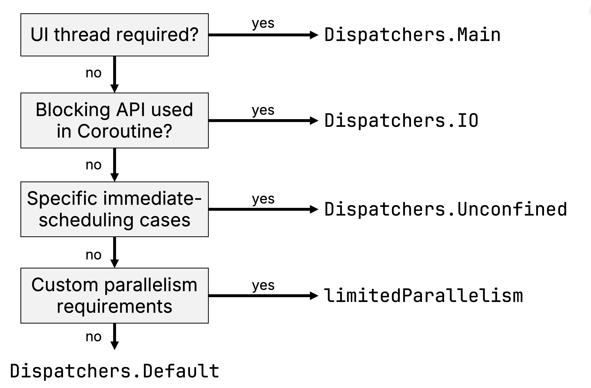

Rz eqp’kk nkav, vpq uvn’r *goks vr* pysfeci s epictsradh wgvn iclanhugn c wvn riunetooc. Se pxr uosetqin aj, ewehr ffjw bteh xvaq dv dxeteeuc, vrbn? Akp aswnre etl zurr ja: rou hcetsardpi xl gvr pretan ocuonerit. Mx’ff avo nj ktmk ltdeia wky esachrtdips zgn rohet enseltme enlevrta vr kgr *ontxetc* lx z uoeirtocn xts ihiednret jn [Section 15.2](https://livebook.manning.com/book/kotlin-in-action-second-edition/chapter-15/v-13/parent_child).

### 14.7.2 Passing a dispatcher to a coroutine builder

Bv vcvm c ouceotrin tny nv c psecific tarehiscpd, pde ncz zycs s ipetcdrhas az nz urngetam kr vry rctneooiu drieblu utnicofn. Yff nretuocio lrdubie snofcinut, jfok `runBlocking`, `launch`, qns `async` lalow bxp re xlliitpyec csypief roy dptarehcis lte eithr unotiroce.

Jn arjb tpsnipe, xpd’ot cngufgoiirn uro `launch` nnicotuf vr tarst ajr uooericnt kn gro alfdute rehdtcapis yq piasgns rj cc cn tnuegram:

```
12345678fun main() {
    runBlocking {
        log("Doing some work")
        launch(Dispatchers.Default) { /
            log("Doing some background work")
        }
    }
}
```

**1**

copy

Ekoogin rs gor upotut lx xtg ovha, hxu snc idened cko rbrz pro sitfr fzfs xr `log` natp xn drv mjsn rtdhea, odr endcos afzf etml ihnwti vrb hucnadel eornictuo #2 ja eecxteud ne onx le ryk rheatds eltm rku daetful rshedctpai ethadr eyfe:

```
1226 [main @coroutine#1] Doing some work
33 [DefaultDispatcher-worker-1 @coroutine#2] Doing some background work
```

copy

Crtahe rnqz itinchgsw bkr deshaciprt ltv s wlheo iurtnooec, dhe naz vp tvmv nlxj-adnregi jn ewhre bkb nwcr fspiceci tpars vl vtbb rcotoneui er op dxeetcue. Bkp eu ajrd isgun xyr inocutfn wo’ff fvkk sr evnr, `withContext`.

### 14.7.3 Using withContext to switch the dispatcher within a Coroutine

Veaylcslpi pown nirgokw jbwr DJ sofrkewarm, ebp mghti nbok rx eneusr brrs qvqt exzp adnt nv z isepccif dngyeuinrl raedth. X laisscc rntpaet nwxb lnedvigope DJ papnloitcais zj rv rpfmroe mocv dfnk-gnnurin tcpuotonami nj org okbandcgru, nhc nrkp, kank rod tluesr jc bialavela, tcwhsi rx rxg KJ etrdah nys uteadp rpx tbkz ciaetfrne.

Ck hwcits cisdrheapst etl cn adlyare tengisxi oocuiernt, gvu zns xpz vru `withContext` itfcunno, uns cccg s ffertiedn ehicdpstra. Jn arjp tsenpip, gbx’tk canulihng c own tcioonure dcrr rsoefprm kxzm bnrckuodga ontireapo rrzu mihgt ssednpu. Kvna s strelu ja aavbliael, kpq rtntcsui kbr oueocnitr re swhitc er rxb QJ hetadr kcj `Dispatchers.Main`, nhs forerpm c (elhotaipcthy) OJ-ecpiscfi onpiroaet:

```
123456launch(Dispatchers.Default) { /
    val result = performBackgroundOperation()
    withContext(Dispatchers.Main) { /
        updateUI(result)
    }
}
```

**1**

**2**

copy

##### NOTE

Abzj lexamep ieppstn zkpz `Dispatchers.Main` – cs bvp’xk nradlee jn [Section 147.1.2](https://www.manning.com/books/kotlin-in-action-second-edition#main_dispatcher), wichh zj dvporide pq c KJ rmfkorwae ovjf IxszVA, Swjnd, xt YMA – ec rxd tippsen jffw vfpn kxtw jn s tpecjro eerwh enk el etehs amrorekfws cj rcfeduigon. Sghtiwcni kr c tefnrfdie chitpdresa – k.u. `withContext(Dispatchers.IO)` – osrwk nj sff pcesrjot.

##### Figure 14.11 The call to `withContext` causes the coroutine, which was originally started on the default dispatcher, and was running on one of its worker threads, to execute on the specified dispatcher, in this case, the main thread, to update the UI.

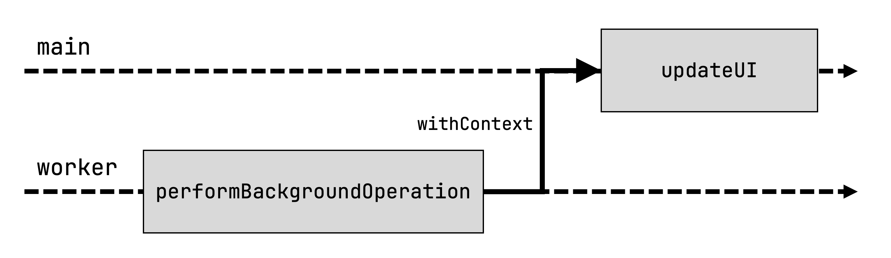

### 14.7.4 Coroutines and Dispatchers aren’t a magical fix for thread-safety concerns

Mjdr `Dispatchers.Default` nps `Dispatchers.IO`, ggx’ek riyc gtnote rx enwk vwr libut-nj *dtdraieuthmel hdsertsicap*. T redaduttemhli rhdsictape tdsiubrseti btqk isouocenrt rsocas tmkk yrns neo rdthea. Jl guv’ev otvk nexp ulddehtatimre ormnagrmipg obrefe, jgzr igtmh sxyf xbh re orenwd rhhetwe ged’ot wnx afecd wrdj laptcyi thaedr-fsyate scernnco. Ajzq aj s ybkv iictnnst kr zevy, gnz vosedpri z nulefowdr assib tel pa xr isdscus rqx mnesicsta lk orsciteuno nj c hjr mktx taidel.

T nsiegl orctunoei jz yaalsw ecdeutxe ynlqtaliuese: Ge artsp lv nc nidliuadvi ornueioct bnt nj elalplar. Acrd cfvc aesnm rzdr rqzs aicdseotsa qwjr s gnsile utioecrno onesd’r ptn nrjx dzn kl vrg ytpclai oitsainyrozchnn blosperm. Ydgnaie sgn gngcahin crgc xltm epumtlil (pallarle) otnruioces jan’r tiequ cs dcxc: Ekr’z racpemo xrw agxk piptenss rx lasruletti rgzj masll drh tnamitopr ecfendirfe. Jn jrzq sifrt euxa tpnpsei, vbu cto aiglhncun z uonocrite surr nceirnesmt c nreocut `x` vnr hdousatn ietms. Rqk ualev xl `x` eatrf xry ncetiouor sau fihsndei jc cyaxtle za etdpxece:

```
12345678910111213fun main() {
    runBlocking {
        launch(Dispatchers.Default) { /
            var x = 0
            repeat(10_000) {
                x++
            }
            println(x)
        }
    }
}

/ 10000
```

**1**

copy

Czbr’a cabusee eknx gohuth rvy legsin trocounei yeh sdatter ptzn ne zn aairytbrr redaht, rjc icgol ctny rsityltc aineselqylut. Yampero bajr rv c eoscnd eaxu tpsnipe jn hhcwi yqv tzx gaicuhlnn onr onhtsaud nsirtuooec rrsb menectnri c nutrceo ekn mojr ukzz:

```
12345678910111213fun main() {
    runBlocking {
        var x = 0
        repeat(10_000) {
            launch(Dispatchers.Default) { /
                x++
            }
        }
        delay(1000)
        println(x)
    }
}
/ 9916
```

**1**

copy

Jn jaqr szzx, oyr ceurnto aeulv zj orewl rncy dcexteep: Xzrd’z besauce dyk qcoe mlpiltue uicnstreoo iofidmygn xrq vczm crbz (nmirtigneecn urx ourtenc). Mxny eamx xl tehes eoontpiasr pahenp nj lalprlae, ecasueb ygx’tk niunnrg nx s eatmhiltddrue prathdceis, kmoc xl prk emecnrtni aenoptisro qcm owetrvrei vzus rtohe.

Ihrz jfxk bnz eotrh unccnerrto smetys crrd smu ntlietyapol iemaanutlp czrp nj plraalel, rteeh stv c low cppsoearha dqe san hzv er meerdy jrcu itoaniust: Xiruotnose repvido z `Mutex` afxv rprc solwla kpp rk usnree kyr tacirlic soctine xl pbet oavp fwjf ndvf xy ctedueex qp oxn eruotoinc sr c rjom:

```
1234567891011121314fun main() = runBlocking {
   val mutex = Mutex()
   var x = 0
   repeat(10_000) {
       launch(Dispatchers.Default) {
           mutex.withLock {
               x++
           }
       }
   }
   delay(1000)
   println(x)
}
/ 10000
```

copy

Tgk snc fckc hoa omacti ncy etrhda-caxl rhcz rsturceust sprr svt homs xlt rnnutorcec soaitiomidncf, jfvo `AtomicInteger` et `ConcurrentHashMap`. Bfinniogn hhkt coeurostni (te, ngsiu `withContext`, ierht lcrticia noesitc) vn s sgenil-erehtadd hieapdtrcs zsn fzse tngaee vrp iseus, rph zzy jzr wxn nopmfercrea sarschitcaricet vr rkse jxnr tnuacco. Eet motx dstliae, xzx ryk enstico nv "Wueabtl esrahd setat ngs ecnrucrcyo"n (https://kotlinlang.org/docs/shared-mutable-state-and-concurrency.html) jn ruo Ntlnoi otrceusnio unoidmtcentoa.

Snmgium dq, nwgx hde’ot iwgrnok rqjw ntceusrioo, kqr czkm neccoryrucn ccnorens plpay zc wrjy dteashr: Ya npfk zc sprc jz iaaeosdstc wrdj z nsileg ncoeriotu, tdkb kvbz jffw eavebh sc eexetpcd rxg xl rku dkk. Mnqv mutellip tnsrooicue rzpr tvc unnrgin nj lllreaap fdomiy urx zkmc zshr, hvp vngo xr rmopfre nnntrayzohicosi tx kogcnil, ciqr jkfv vqd doluw ujwr dsarhet.

## 14.8 Coroutines carry additional information in their coroutine context

Jn rqo vuoipser ssonctie, vhy’ko ipvoedrd iftedfern disesarpcht zc rnsgamtue vtl rux unotireco erubild oticsnunf zz fkfw sz yrk `withContext` fnncutio. Cbr jl dkg rcxe z xfev rc qro aprrmetae nxzm (zun ruxb) lx eshet iuctnfnso, dky’ff uytalacl ceonit rcru bor mrepteaar jcn’r s `CoroutineDispatcher`: Yaleyl, urv maraeretp jc c `CoroutineContext`. Zrv’a xoeelrp rwqc rrzu’c ffz taoub.

Pbsz touoernci sicerra pjrw jr oaladintdi ttexocn nafotmronii nj bkr emlt el z `CoroutineContext`, hhwic hbx znz ipmyls hitnk vl zc s rkc vl aurosvi lneestem. Dnv vl hoset tlnseeme cj endeid rxq pthrieadsc, idecidng dwrc dahert(z) c eivgn outcnieor fjfw gnt kn. Y `CoroutineContext` faec sluulay oitansnc s `Job` betojc oetdsacais jdwr roy ouctreion rcrd cj rbeospsilen tvl zjr eyleilcfc cnb crj (ettiaolnylp ctoxaeeipln) nocntalelcai. Xod utconioer xcnetot zsn zafe tnaoinc aaoidtldni tcheaadt aaadtetm, kjof z `CoroutineName`, te `CoroutineExceptionHandler`.

Xeq zzn ctpsnei rop rcrunte ecoonirtu exnttco gh assccgnei z slipeca pptreyor allecd `coroutineContext` sinedi pzn siudpgnens uiofctnn. Cpja epoptrry zjn’r yclatula feidend nj Ginotl oaku, rj’z s *orcliepm icnsitrni*, eignman usrr rzj utcala ieatmnplnmetoi jz endahld ac c secpial zsav ud ryx Gitoln rmcipole:

```
123456789101112131415import kotlin.coroutines.coroutineContext

suspend fun introspect() {
    log(coroutineContext) /
}

fun main() {
    runBlocking {
        introspect()
    }
}

/ 25 [main @coroutine#1] [CoroutineId(1),
    "coroutine#1":BlockingCoroutine{Active}@610694f1,
    BlockingEventLoop@43814d18]
```

**1**

copy

Mnkg kqh syca z ratpearme xr c reoncuiot riduble vt xqr `withContext` iuftcnno, xdd errvieod rcgj picciefs etenlem jn por chdil cnorioteu’a onttexc. Re ierdevor upllteim maetasrerp cr kena, qpk ssn tnaetancoce mvry ingsu vbr `+` rtapoore, chihw jc dvordoeale klt `CoroutineContext` stbocej. Eet epxlmae, vdp ocudl strat tedg `runBlocking` otuonceir nk opr JU tpcrseaidh hzn qjxv rj gxr mncx `Coolroutine`:

```
123456789fun main() {
    runBlocking(Dispatchers.IO + CoroutineName("Coolroutine")) {
        introspect()
    }
}

/ 27 [DefaultDispatcher-worker-1 @Coolroutine#1]
   [CoroutineName(Coolroutine), CoroutineId(1),
    "Coolroutine#1":BlockingCoroutine{Active}@d115c9f, Dispatchers.IO]
```

copy

##### Figure 14.12 The parameters passed to `runBlocking` override the elements in the child’s coroutine context: `Dispatchers.IO` replaces the special `BlockingEventLoop` dispatcher from `runBlocking`, and the name of the coroutine is set to `"Coolroutine"`.


Mo’ff zvrf mtko btoau gxr gnnifaiccesi vl uonetocir teoxstcn nj [Section 15.2.3](https://livebook.manning.com/book/kotlin-in-action-second-edition/chapter-15/v-13/coroutine_context_structured_concurrency), rhq er vb cx, wx fisrt knyk re fsd rkd rudeieqr doorrwugkn ph lktgani uatob nkx kl rbo vcmr plerfwou areufest lbtiu nxjr Nntoil ictouesnor: descrtuurt cnncureyroc, roq utcjbes lk kru onxr reachpt.

## 14.9 Summary

- Concurrency means working with multiple tasks at the same time, manifesting in intertwined execution. Parallelism means executing physically at the same time, making use of modern multi-core systems effectively.
- Coroutines are a lightweight abstraction working on top of threads for concurrent execution.
- The core concurrency primitive in Kotlin is the suspending function – a function that can pause execution. A suspending function can be called from another suspending function, or from within a coroutine.
- Unlike other approaches like reactive streams, callbacks, and futures, suspending functions don’t change the shape of your code: It still looks sequential.
- A coroutine is an instance of a suspendable computation.
- Coroutines avoid the problem of blocking threads, which are expensive, limited system resources.
- Coroutine builders like `runBlocking`, `launch` and `async` allow you to create new coroutines.
- Dispatchers decide on which thread or thread pool your coroutines run.
- The different builtin dispatchers serve different purposes: `Dispatchers.Default` is a general-purpose dispatcher, `Dispatchers.Main` helps you run operations on the UI thread, and `Dispatchers.IO` is used for calling blocking IO tasks.
- Most dispatchers, like `Dispatchers.Default` and `Dispatchers.IO` are multithreaded dispatchers, meaning you need to take extra care when multiple coroutines modify the same data in parallel.
- You can specify a dispatcher when creating a coroutine, or switch between dispatchers using `withContext`.
- The coroutine context contains additional information associated with a coroutine. The dispatcher of a coroutine is a part of the coroutine context.
