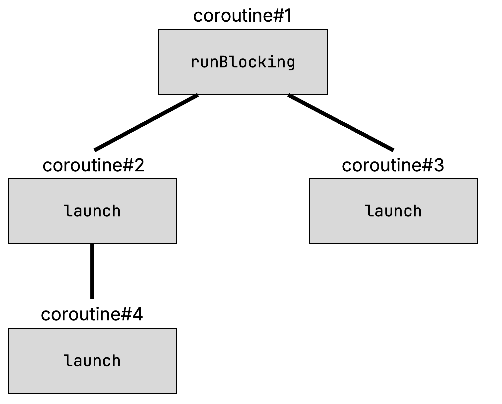
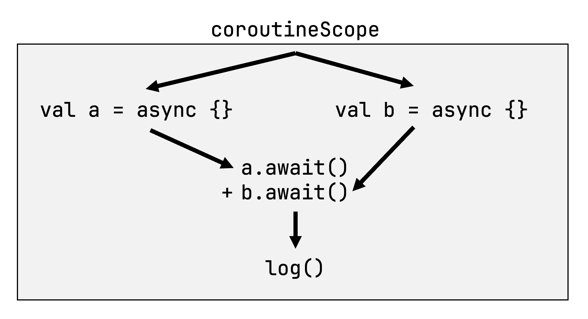
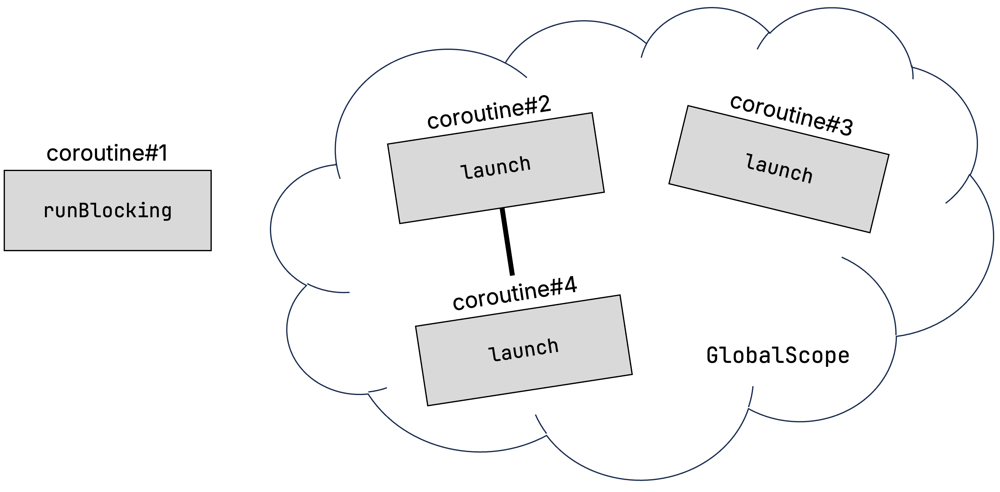
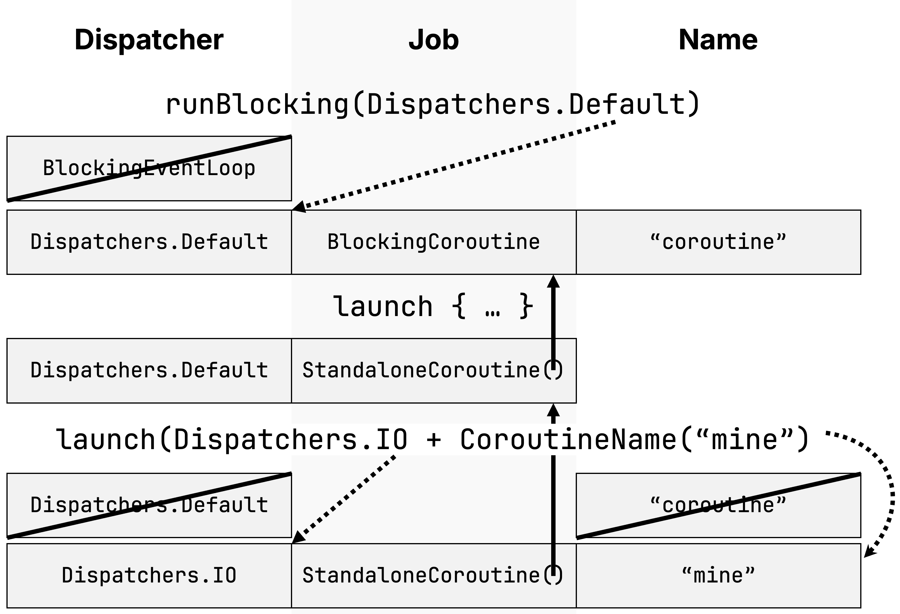
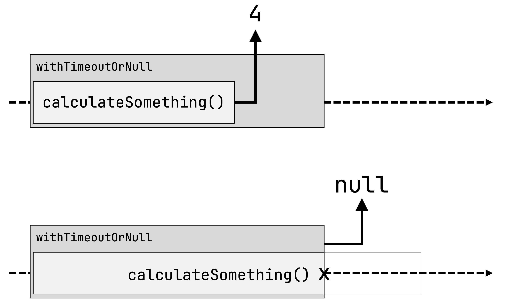
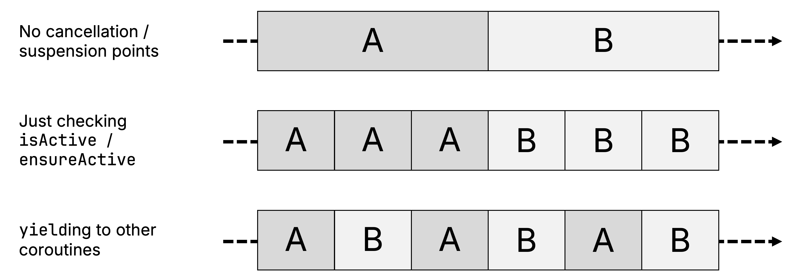

# 15 Structured concurrency

### This chapter covers

- Establishing hierarchies between coroutines via the concept of structured concurrency
- How structured concurrency gives you fine-grained over execution and cancellation of your code, automatically propagating cancellation across the coroutine hierarchy
- The relationship between the coroutine context and structured concurrency
- Writing code that behaves correctly when cancelled

## 15.1 Controlling concurrent execution


When you use Kotlin coroutines in the context of real applications, chances are you will be managing a lot of coroutines. Major challenges when working with many concurrent operations are keeping track of the individual tasks that are running, canceling them when they’re no longer needed, and making sure that errors are handled properly.

Without keeping track of your coroutines, you run the risk of resource leaks and doing unnecessary work. Consider the following example: A user requests a network resource, and immediately navigates away to a different screen. If you have no way of keeping track of the (potentially dozens of) coroutines responsible for the network request and postprocessing of the information received, you have no choice but to let them run to completion – even if their result will just be discarded in the end.

Yfklnhuyal, *stdrcetruu creocyrncun*, qkr liayitb rk aaegmn zun yxke kacrt xl dxr iyrecahrh le oiuroectns ynz iethr temisilfe nwihit txbu iialcntoapp, zj tliub ghrti nrje uor atxk vl Unoitl orcoietusn. Sruucdtret conreynccru okrsw rxh lx qvr uve, tuhwtio enengdi ehb vr alumynal ogox rtkca lv sbxa ourtcnioe bqv rsatt: Tq ngius ceurtdruts rccuneocnry rothugtuho vbht aocnipptlia, rj mneas erhte tco nk r""goeu niecuootsr rsbr pdv ncz retgfo btaou, tx urrc tdn lte nrgole cnrd bqx fsbn lkt oumr rx.

Jn ajur capehtr, xuq’ff rzov cn nj-ehtpd fxve rc Qlnoit’c dturrtscue noeccunycrr hnmamseic, nys ooc gwx rj beslnae gxg xr tnnlfecoiyd aganme vnov galre nsrmbeu lk trinecusoo.

## 15.2 Coroutine scopes establish structure between coroutines


With structured concurrency, each coroutine belongs to a *coroutine scope*. Coroutine scopes help establish parent-child relationships between coroutines: The `launch` and `async` coroutine builder functions are actually extension functions on the `CoroutineScope` interface. That means when you create a new coroutine using `launch` or `async` in the body of another coroutine builder, your new coroutine will automatically become a child of that coroutine. In this code snippet, you’re starting a number of coroutines that take differing amounts of time to complete:


##### Listing 15.1 Starting a number of different coroutines

```kotlin
fun main() {
    runBlocking { / this: CoroutineScope
        launch { / this: CoroutineScope
            delay(1000)
            launch {
                delay(250)
                log("Grandchild done")
            }
            log("Child 1 done!")
        }
        launch {
            delay(500)
            log("Child 2 done!")
        }
        log("Parent done!")
    }
}
```


When you look at the output, you’ll notice that even though the body of the `runBlocking` function finishes its execution almost instantly, indicated by "Parent done!", the program doesn’t actually terminate until all child coroutines have completed:


```
123429 [main @coroutine#1] Parent done!
539 [main @coroutine#3] Child 2 done!
1039 [main @coroutine#2] Child 1 done!
1293 [main @coroutine#4] Grandchild done
```


This is possible thanks to structured concurrency: There is a parent-child relationship between the coroutines (strictly speaking, the `Job` objects associated with your coroutines, as you’ll see in [Section 15.2.3](https://livebook.manning.com/book/kotlin-in-action-second-edition/chapter-15/v-13/13#coroutine_context_structured_concurrency)), meaning that your `runBlocking` invocation knows how many of its children are still working, and continues to wait until they are all done. You did not have to manually keep track of the launched coroutines or their further descendants, or have to manually await them – structured concurrency can keep track of that for you.


##### Figure 15.1 Thanks to structured concurrency, coroutines exist in a hierarchy: Each coroutine knows its children or its parents. Even though you never explicitly specified it, this allows, for example, `runBlocking` to wait for the completion of all its children before returning.




As we’ll explore further in [Section 15.3](https://livebook.manning.com/book/kotlin-in-action-second-edition/chapter-15/v-13/17#cancellation), the fact that coroutines are aware of their child coroutines and can keep track of them also enables functionality like automatically cancelling child coroutines when the parent coroutine gets canceled. They can also help you express your desired behavior when it comes to exception handling – we will discuss this in Chapter 18. (You’ll learn more about how this parent-child relationship is being established on a technical level in [Section 15.2.3](https://livebook.manning.com/book/kotlin-in-action-second-edition/chapter-15/v-13/17#coroutine_context_structured_concurrency).)

### 15.2.1 Creating a coroutine scope: the coroutineScope function

As you’ve seen, whenever you create a new coroutine using the coroutine builders, they create their own `CoroutineScope`. But you can also group coroutines using our own coroutine scopes without having to create an entirely new coroutine. To do so, you can use the `coroutineScope` function. It’s a suspending function that creates a new coroutine scope, and waits for the completion of all of its child coroutines before it itself completes.

A typical use case for the `coroutineScope` function is *concurrent decomposition of work* – leveraging multiple coroutines together to perform a computation. In this example snippet, you’re using it to calculate a sum of multiple concurrently generated numbers. You leverage the fact that `coroutineScope` can return a value to return the sum of the two values from the block before logging it. Because `coroutineScope` is suspending, you also mark the `computeSum` function as suspending:


```kotlin
import kotlin.random.Random

suspend fun generateValue(): Int {
    delay(500)
    return Random.nextInt(0, 10)
}

suspend fun computeSum() { /
    log("Computing a sum...")
    val sum = coroutineScope { /
        val a = async { generateValue() }
        val b = async { generateValue() }
        a.await() + b.await() /
    }
    log("Sum is $sum")
}

fun main() = runBlocking {
    computeSum()
}

/ 0 [main @coroutine#1] Computing a sum...
/ 532 [main @coroutine#1] Sum is 10
```


##### Figure 15.2 `coroutineScope` is used for the concurrent decomposition of work: leveraging multiple coroutines together to perform a computation. The two coroutines `a` and `b` run concurrently. You use their results to compute a value and log it.



### 15.2.2 The danger of GlobalScope

In some samples or code snippets, you may see a special instance of coroutine scope, `GlobalScope`. As the name suggests, it’s a coroutine scope that exists on the global level. Especially for newcomers to Kotlin coroutines, this might make it a tempting choice when deciding what coroutine scope to use when creating a coroutine: After all, it is available globally.

However, using `GlobalScope` comes with a number of drawbacks. Briefly summarized, using `GlobalScope` means opting out of all the benefits that structured concurrency has to offer. Coroutines launched on the global scope can’t be automatically canceled and aren’t aware of any lifecycle. This means it’s very easy to introduce resource leaks into your application when using the global scope, or simply continue to do unnecessary work, and wasting computational resources.

You can see one type of issue caused by using `GlobalScope` by slightly adjusting the code from [Listing 15. 1](https://livebook.manning.com/book/kotlin-in-action-second-edition/chapter-15/v-13/23#coroutine_scope_snippet). This code will will terminate immediately, without waiting for any of the launched coroutines:


```
12345678910111213141516171819fun main() {
    runBlocking {
        GlobalScope.launch { /
            delay(1000)
            launch {
                delay(250)
                log("Grandchild done")
            }
            log("Child 1 done!")
        }
        GlobalScope.launch {
            delay(500)
            log("Child 2 done!")
        }
        log("Parent done!")
    }
}

/ 28 [main @coroutine#1] Parent done!
```

**1**

This is because using `GlobalScope` breaks the hierarchy that is typically established out of the box when using structured concurrency: Coroutines #2 through #4 have been launched in a way where the coroutine associated with `runBlocking`, coroutine #1, is no longer the parent. Therefore, it has no children to wait for, and the program terminates prematurely.

##### Figure 15.3 Using `GlobalScope` breaks the hierarchy between coroutines: `runBlocking` is no longer a parent of the launched coroutines, meaning it has no way to automatically wait for their completion.



For these reasons, `GlobalScope` is declared with a special annotation – `@DelicateCoroutinesApi`. You’ll get a warning that encourages you to exercise caution: "This is a delicate API and its use requires care. Make sure you fully read and understand the documentation of the declaration that is marked as a delicate API." In general application code, cases where you should choose `GlobalScope` are extremely rare (one such example are top-level background processes that must stay active for the *whole* lifetime of an application). In general, you are usually better served finding a more appropriate scope to start your coroutines: Either via the coroutine builders, or via the `coroutineScope` function.

### 15.2.3 Coroutine contexts and structured concurrency

Now that you have a high-level overview of structured concurrency, we can return to the discussion of coroutine contexts. Coroutine contexts are closely related to the concept of structured concurrency: They are inherited along the same parent-child hierarchy established between coroutines.

So what happens with the coroutine context when you start a new coroutine? First, the child coroutine inherits the parent context. Then, the new coroutine creates a new `Job` object (the same kind as you have seen in [Section 14.6.2](https://livebook.manning.com/book/kotlin-in-action-second-edition/chapter-14/v-13/launch_builder)), which is responsible for establishing the parent-child relationship: The `Job` becomes a child of the `Job` in the parent coroutine. Lastly, any arguments that are provided for the coroutine context are applied. They may override whatever was previously inherited.

The following code snippet and [Figure 15. 4](https://livebook.manning.com/book/kotlin-in-action-second-edition/chapter-15/v-13/30#viz_context) visualize this.


```
12345678910111213141516171819fun main() {
    runBlocking(Dispatchers.Default) {
        log(coroutineContext)
        launch {
            log(coroutineContext)
            launch(Dispatchers.IO + CoroutineName("mine")) {
                log(coroutineContext)
            }
        }
    }
}

/ 0 [DefaultDispatcher-worker-1 @coroutine#1] [CoroutineId(1),
    "coroutine#1":BlockingCoroutine{Active}@68308697, Dispatchers.Default]
/ 1 [DefaultDispatcher-worker-2 @coroutine#2] [CoroutineId(2),
    "coroutine#2":StandaloneCoroutine{Active}@2b3ce773, Dispatchers.Default]
/ 2 [DefaultDispatcher-worker-3 @mine#3] [CoroutineName(mine),
    CoroutineId(3), "mine#3":StandaloneCoroutine{Active}@7c42841a,
    Dispatchers.IO]
```

copy

##### Figure 15.4 `runBlocking` starts with a special dispatcher, `BlockingEventLoop`, that is overridden by the provided parameter, and becomes `Dispatchers.Default`. It creates a `Job` object for the coroutine called `BlockingCoroutine`, and initializes the coroutine name with the default value `"coroutine"`. Launch inherits the default dispatcher. It creates its own `Job` object called `StandaloneCoroutine` and establishes the relationship with the parent job, the coroutine name remains unchanged. The second invocation of launch also inherits the dispatcher, creates a new child `Job`, as well as the coroutine name. The parameters passed to `launch` override the dispatcher to be `Dispatchers.IO` and the coroutine name to `"mine"`.



Now that you know how coroutine contexts are passed down the hierarchy of coroutines, it’s easier to come up with an answer to this question: "If I `launch` a new coroutine without specifying a Dispatcher, which dispatcher will it run on?" The answer is **not** `Dispatchers.Default`! Rather, it is "whatever the parent dispatcher was".

You can actually see the parent-child relationship between the coroutines in your code – or, more precisely, the relationships between the *jobs associated with your coroutines*. You can do so by checking the `job`, `job.parent`, and `job.children` properties on the coroutine context of each coroutine:

```
1234567891011121314151617import kotlinx.coroutines.job


fun main() = runBlocking(CoroutineName("A")) {
   log("A's job: ${coroutineContext.job}")
   launch(CoroutineName("B")) {
       log("B's job: ${coroutineContext.job}")
       log("B's parent: ${coroutineContext.job.parent}")
   }
   log("A's children: ${coroutineContext.job.children.toList()}")
}


/ 0 [main @A#1] A's job: "A#1":BlockingCoroutine{Active}@41
/ 10 [main @A#1] A's children: ["B#2":StandaloneCoroutine{Active}@24
/ 11 [main @B#2] B's job: "B#2":StandaloneCoroutine{Active}@24
/ 11 [main @B#2] B's parent: "A#1":BlockingCoroutine{Completing}@41
```

copy

Just like coroutines started with the coroutine builder functions like `launch` and `async`, the `coroutineScope` function also has its own `Job` object that participates in the parent-child hierarchy. You can convince yourself that this indeed the case by checking its `coroutineContext.job` property:

```
123456789101112131415161718fun main() = runBlocking<Unit> { / coroutine
   log("A's job: ${coroutineContext.job}")
   coroutineScope {
       log("B's parent: ${coroutineContext.job.parent}") / A
       log("B's job: ${coroutineContext.job}") / C
       launch { /coroutine
           log("C's parent: ${coroutineContext.job.parent}") / B
       }
   }
}


/ 0 [main @coroutine#1] A's job: "coroutine#1":BlockingCoroutine{Active}@41
/ 2 [main @coroutine#1] B's parent:
    "coroutine#1":BlockingCoroutine{Active}@41
/ 2 [main @coroutine#1] B's job: "coroutine#1":ScopeCoroutine{Active}@56
/ 4 [main @coroutine#2] C's parent:
    "coroutine#1":ScopeCoroutine{Completing}@56
```

copy

Aucj tpnear-lhcid hainlpoerits hetasesibdl ud suucrrtdet yecunrnccro zfzv yfdx jrwd *alnalciencto*, zc bpe’ff oxrelep jn pxr vvrn ntoeisc.

## 15.3 Cancellation

*Cancellation* refers to stopping the execution of your code before it has completed regularly. While cancellation may, on the surface, not seem like a particularly common occurrence, the reality is that almost all modern applications need to be able to handle the cancellation of computations if they want to be robust and efficient. There are a number of reasons for that.

Cancellation prevents unnecessary work. In applications with a user interface, you may start a computation or network request, and the user may simply close the window or navigate away. Without a way of canceling the work you started, you would have to complete the computation, or download the whole response over the network, and then throw away the result. It can negatively impact the throughput of server-side applications, and this is especially wasteful on mobile devices, where computational resources and battery life are constrained.

Cancellation also helps avoid memory or resource leaks: Without a way to cancel work when it is no longer needed, it would be easy for rogue coroutines to hold onto resources, or keep references to data structures in memory, preventing the garbage collector from freeing up the space.

Cancellation also plays an important role when it comes to handling errors, which we’ll discuss in more detail in Chapter 18. In short: Often, you have multiple coroutines working together to compute a result – for example, you may be starting a number of asynchronous network requests, and then await all of their results. If one of the network requests fails, you might find yourself in a situation where you can’t reasonably compute a result anymore – so there is no reason to wait for the completion of further (or start additional) network requests. This is a special case of avoiding unnecessary work.

Because cancellation is such a core part of building concurrent applications that behave well, Kotlin coroutines come with built-in machinery to perform as well as handle cancellations. Let’s take a closer look.

### 15.3.1 Triggering cancellation

The return value of the different coroutine builders can be used as a handle for you to trigger cancellation: The `launch` coroutine builder returns a `Job`, and the `async` coroutine builder returns a `Deferred`. Both of them allow you to call `cancel` to trigger cancellation of the respective coroutine.


```
1234567891011121314151617181920fun main() {
    runBlocking {
        val launchedJob = launch { /
            log("I'm launched!")
            delay(1000)
            log("I'm done!")
        }
        val asyncDeferred = async { /
            log("I'm async")
            delay(1000)
            log("I'm done!")
        }
        delay(200)
        launchedJob.cancel() /
        asyncDeferred.cancel() /
    }
}

/ 0 [main @coroutine#2] I'm launched!
/ 7 [main @coroutine#3] I'm async
```

**1**

In [Section 15.2.3](https://livebook.manning.com/book/kotlin-in-action-second-edition/chapter-15/v-13/52#coroutine_context_structured_concurrency), you also learned about the fact that the coroutine context for each coroutine scope also contains a `Job`, which you can use to cancel a scope in the very same way. Despite manually triggering cancellation for a coroutine, you can also let the library automatically cancel coroutines under certain conditions.

### 15.3.2 Invoking cancellation automatically after a time limit has exceeded

The Kotlin coroutines library also comes with some convenience functions that can help you trigger cancellation for your coroutines automatically. The `withTimeout` and `withTimeoutOrNull` functions allow you to compute a value while constraining the maximum amount of time spent for the computation.

Like other functions in the Kotlin standard library that you have gotten to know already, the `withTimeout` function throws an exception in case the timeout was exceeded. The `withTimeoutOrNull` sibling function returns `null` in this case.

In this code example, you’re invoking the `calculateSomething` function, which takes about 3 seconds to complete. You invoke it first with a short timeout of 500 milliseconds, which causes the timeout to expire. The `calculateSomething` function gets canceled, and you receive `null` as the return value. In the second invocation, you give the function enough time to complete, so you receive the actual computed value:


```
123456789101112131415161718192021import kotlinx.coroutines.*

suspend fun calculateSomething(): Int {
    delay(3000)
    return 2 + 2
}

fun main() {
    runBlocking {
        val quickResult = withTimeoutOrNull(500) {
            calculateSomething()
        }
        println(quickResult)
        / null
        val slowResult = withTimeoutOrNull(5000) {
            calculateSomething()
        }
        println(slowResult)
        / 4
    }
}
```

copy

##### Figure 15.5 Using `withTimoutOrNull` constrains the execution time of a suspending function. When the function returns a value within the given timeout, that value is returned immediately. When the timeout expires, the function is cancelled, and `null` is returned.



### 15.3.3 Cancellation cascades through all children

When you cancel a coroutine, all of its child coroutines are also canceled. This is a very powerful feature of structured concurrency: Because each coroutine is aware of the coroutines it started, it can always clean up after itself, without leaving any rogue coroutines running that might end up doing unnecessary work or holding extraneous data in memory for longer than required.

Even when you have many layers of indirection, like in the following snippet, where you have multiple coroutines launching coroutines of themselves, triggering the cancellation of the outermost launched coroutine properly cancels even the grand-grandchild coroutine:


```
12345678910111213141516171819fun main() {
    runBlocking {
        val job = launch {
            launch {
                launch {
                    launch { /
                        log("I'm started")
                        delay(500)
                        log("I'm done!")
                    }
                }
            }
        }
        delay(200)
        job.cancel()
    }
}

/ 0 [main @coroutine#5] I'm started
```

**1**

But how and where can a coroutine be canceled?

### 15.3.4 Canceled coroutines throw CancellationExceptions in special places

The general mechanism of cancellation works by throwing a special exception type, `CancellationException` at special places. Those places are first and foremost suspension points.

A canceled coroutine throws CancellationException at suspension points, as you’ve briefly seen them in [Section 14.6.2](https://livebook.manning.com/book/kotlin-in-action-second-edition/chapter-14/v-13/launch_builder): Places where the execution of a coroutine can pause. In general, you can assume that all suspending functions inside the coroutines library introduce such points where a `CancellationException` can be thrown. Depending on whether the scope was canceled or not, the following code snippet would either print "A" or "ABC" – but never "AB", since there is no cancellation point between "B" and "C":


```
123456coroutineScope {
    log("A")
    delay(500) /
    log("B")
    log("C")
}
```

**1**

Because coroutines use an exception to propagate cancellation across the hierarchy of coroutines, it’s important that you take care not to accidentally swallow this exception or handle it yourself. Consider the following code, which repeatedly executes some code that may throw an `UnsupportedOperationException`:


```
123456789101112131415161718192021222324suspend fun doWork() {
    delay(500) /
    throw UnsupportedOperationException()
}

fun main() {
    runBlocking {
        withTimeout(2000) {
            while (true) {
                try {
                    doWork()
                } catch (e: Exception) { /
                    println("Oops: ${e.message}")
                }
            }
        }
    }
}

/ Oops: Didn't work!
/ Oops: Didn't work!
/ Oops: Didn't work!
/ Oops: Timed out waiting for 2000 ms
/ ... (does not terminate)
```

**1**

After 2 seconds, the `withTimeout` function requests the cancellation of its child coroutine scope. In doing so, the next invocation of `delay` throws a `CancellationException`. However, because the `catch` statement catches exceptions of all types, the code just continues looping indefinitely. You can fix this by either rethrowing the exception (`if(e is CancellationException) throw e)`) or not catching it in the first place (`catch (e: UnsupportedOperationException)`). With either of these changes, the code cancels as expected.

##### NOTE

It’s not just catching `Exception` that may cause this unwanted behavior: You need to exercise the same type of caution when working with any supertype of `CancellationException`: `IllegalStateException`, `RuntimeException`, `Exception` and `Throwable`.

### 15.3.5 Cancellation is cooperative

All functions included with Kotlin coroutines out of the box are already cancellable. Likewise, in practice, when you are using a library that offers a suspending API, such as Ktor, you can assume that any suspending functions provided by the framework functions are internally cancellable. For your own code, however, you need to take care of making it cancellable yourself. It may be easy to assume that your code is cancellable. But take a look at this code:


```
123456789101112131415161718192021suspend fun doCpuHeavyWork(): Int {
      log("I'm doing work!")
    var counter = 0
    val startTime = System.currentTimeMillis()
    while (System.currentTimeMillis() < startTime + 500) {
        counter++ /
    }
    return counter
}

fun main() {
    runBlocking {
        val myJob = launch {
            repeat(5) {
                doCpuHeavyWork()
            }
        }
        delay(600)
        myJob.cancel()
    }
}
```

**1**

You may suspect that this code would print the "I’m doing work" text two times before getting canceled. However, the actual output of this code snippet reveals that in fact, all five iterations of `doCpuHeavyWork` complete before the program ends:


```
1234530 [main @coroutine#2] I'm doing work!
535 [main @coroutine#2] I'm doing work!
1036 [main @coroutine#2] I'm doing work!
1537 [main @coroutine#2] I'm doing work!
2042 [main @coroutine#2] I'm doing work!
```

copy

Mpu aj rayj? Cealcl rqrz ccilaantlnoe wroks hq irhntgwo z `CancellationException` cr z nunsospise ioptn iwinht rkq otifucnn. Hvwreoe, setdiep iebng dmrkea jgrw ord `suspend` eodifrmi, rqv gvpu kl rog `doCpuHeavyWork` fiuocnnt goak ern tuyclala oticnan uzn upssioenns isntpo – jr esporrmf z fzaf rx `log` chn rngv rfrpsome kmxz nbvf-unrngin YED-hveay monoipttuca (hwcih vw mluisdeta vktq dq lcnaigl `Thread.sleep`).

This is why we say that cancellation in Kotlin coroutines is *cooperative*: Suspending functions need to provide the logic that makes them cancellable themselves. When your code calls other functions that cancellable, this automatically also introduces a point where your code can be canceled as well: For example, including a call to `delay` in the function body of `doWork` introduces a point at which your function can be canceled:


```
12345678910suspend fun doCpuHeavyWork(): Int {
    log("I'm doing work!")
    var counter = 0
    val startTime = System.currentTimeMillis()
    while (System.currentTimeMillis() < startTime + 500) {
        counter++
        delay(100) /
    }
    return counter
}
```

**1**

copy

Xhr el rescuo, bvu nowuld’r rwzn vr alyde hept ontmcpaouit rfiaciyiltal nfvh rx proutps cnlelaaciont. Jtsande, rux Gntoli rcoouienst mesv bjrw tulityi ioicfalntynut yrrc hslpe bkq ocvm tuqe svpx baleclenlac. Sallipcefyic, sheot svt rdv `ensureActive` yns `yield` nncufoist, zc wffo za kgr `isActive` oetryppr. Vrk’a krvz s srleco kevf zr kwb hdrx sns od dvpc.

### 15.3.6 Checking whether a coroutine has been canceled

Xv eeitmernd rwhteeh z ectooiunr zqz xgno aedcecln, edh nac zdir eckch gor Toloaen `isActive` peptryor vl c `CoroutineScope`: Y `false` velau aiietdcsn brzr rxd uctreinoo jc vn leorng eivtca. Cbv cna lltsi isnfih ebbt entrruc rqjn vl wtee, olces gzn soserurce xpp mcg euxz riaucqde, nsq rnkq rtnuer. Etx xleapme, bvh ldcuo trrewie tqkg vebf kr kchec rhhetew rvb etrcnur nuorteoci poces scb vqxn aceecldn:

```
123456val myJob = launch {
    repeat(5) {
        doCpuHeavyWork()
        if(!isActive) return@launch
    }
}
```

copy

Chtare cnur hceingck `isActive` cnq lpixcteily enturngri jn zzkz c `false` lauev cj terdouencen, Nloint noiuctreso pevdroi oetrnha ecncveonnie uocntnfi: `ensureActive`. Jl yvr rectunioo zj nx leorgn vaicte, argj noncutif howrts c `CancellationException`:

```
123456val myJob = launch {
    repeat(5) {
        doCpuHeavyWork()
        ensureActive()
    }
}
```

copy

### 15.3.7 Letting other coroutines play: yield

Cbx rnotoceuis laribry zsef soirpved rntaheo, traeled tfiuocnn, ldecal `yield`. Yeessdi gcoudintnri s oiptn erhwe ktdb uftnnioc nas dx dcnlaece, rj kzfc epoivsdr c zbw xr vfr hrteo unctreoiso etew nk z yrucelntr ocucedip eiahctpdsr. Ce atiovtme qzjr, rfk’z xvrc z vfex sr rjua kxsg rsry nuaelsch vwr runcseooit chiwh asyk bx mxxa wtxk:

```
12345678910111213141516171819202122232425import kotlinx.coroutines.*

fun doCpuHeavyWork(): Int {
    var counter = 0
    val startTime = System.currentTimeMillis()
    while (System.currentTimeMillis() < startTime + 500) {
        counter++
    }
    return counter
}

fun main() {
    runBlocking {
        launch {
            repeat(3) {
                doCpuHeavyWork()
            }
        }
        launch {
            repeat(3) {
                doCpuHeavyWork()
            }
        }
    }
}
```

copy

Jl urx neailpontimtme kl `doCpuHeavyWork` vyax enr cxbo cnq psounesnis tnospi jn jar nenpetaomimlti, kqg’ff oienct srru txgy ftsir lcnhadue ionrcueto dnct re ocoimnetlp feoerb rky ncdose eoiurtcno veno enbsig rv tnb:

```
12345629 [main @coroutine#2] I'm doing work!
533 [main @coroutine#2] I'm doing work!
1036 [main @coroutine#2] I'm doing work!
1537 [main @coroutine#3] I'm doing work!
2042 [main @coroutine#3] I'm doing work!
2543 [main @coroutine#3] I'm doing work!
```

copy

Mqd ja rcrq? Mtuioth ncp inspeounss ioptsn nj drk yuvu lx pvpt icertouno, rheet cj nvree zn pyottnpruoi ltv xrd gleyundnir nsoriutcoe yeaicnmrh re ausep opr txeenuoci vl qutv rtisf uorotcnie nsy tarst prk oecinxteu el tgvd scoend orcetnoiu. Yekchnig `isActive` te lgncali `ensureActive` keqa nrk cgenah hgyitnan: Rcvqx iutonnfsc knfq ehcck txl nnlcoaicatel, ruy vny’r atlauycl seupsdn oru eunocrito.

Hokt, vgr `yield` uifotncn lsehp: Jr’c c enspsgudni tinfuocn rzrd uirtnoecds s tipon jn gktb soep herwe s `CancellationException` anc xh rothnw, cnu sfxc laslwo rkg retdhspiac er shiwct rk ignkorw vn c fetfnidre touorenci lj rheet jz kvn wtinagi (orb outericon idely_s ry_x tdhpeisarc). Rdx ncs eterwir qkr ainetnptmoimle lx xbr `doCpuHeavyWork` tfnniouc rk vvfx as wslolfo:

```
123456789suspend fun doCpuHeavyWork(): Int {
    var counter = 0
    val startTime = System.currentTimeMillis()
    while (System.currentTimeMillis() < startTime + 500) {
        counter++
        yield()
    }
    return counter
}
```

copy

Mqjr s szff er `yield` jn cepal, qtdx reefditfn siuoorentc czn nkw wetk dertevelnia, jurw etcnusioro #2 znu #3 goscrseipn iterh wdkoarol jn neaoaintrtl:

```
1234560 [main @coroutine#2] I'm doing work!
559 [main @coroutine#3] I'm doing work!
1062 [main @coroutine#2] I'm doing work!
1634 [main @coroutine#3] I'm doing work!
2208 [main @coroutine#2] I'm doing work!
2734 [main @coroutine#3] I'm doing work!
```

copy

Egieur [Figure 15. 6](https://www.manning.com/books/kotlin-in-action-second-edition#yield_illust) llsatrseitu xdr dfeeicfrne tnbeewe ngavih xn nsssnuiope zun caelonatnlic noptis, rzyi gecnhkic `isActive` et `ensureActive`, nqs agnilcl `yield`. [Table 15. 1](https://www.manning.com/books/kotlin-in-action-second-edition#tbl_isActive) dspeoirv eahrton ewrievvo lk qwkn dzzk lx rky teher ousntinfc jz gzxb.

##### Figure 15.6 Without suspension points, multiple coroutines will always run to completion, and (on a single-threaded dispatcher) without interleaving. Checking `isActive` or calling `ensureActive` allows the coroutines to cancel their work prematurely at these cancellation points. Using `yield` to let other coroutines use the underlying thread means the coroutines can run interleaved.



##### Table 15.1 Mechanisms for enabling cooperative cancellation

| Function/property | Use case                                                     |
| ----------------- | ------------------------------------------------------------ |
| `isActive`        | Check to see if cancellation was requested (to do some finishing work before stopping work) |
| `ensureActive`    | Introduces "cancellation point" – throws `CancellationException` upon cancellation, instantly stopping work |
| `yield()`         | Relinquish computation resources, preventing CPU-heavy computations from exhausting the underlying thread(pool) |

### 15.3.8 Keep cancellation in mind when acquiring resources

Ysfo gskx tofen dzz re twek rwyj ecsosrure vfxj tbdasaae isnecontcon, JK, pns mktk, rrqs uxkn rk gv exyiltlcip csloed tfrae avp xr ueesrn bpro ots yprorlpe ereedasl. Xeaseuc anotcaliceln, raip fejv gzn ehtor orqh kl pexctnoei, sna suace nz eryal tnurre lk eqtb eqax, xgh kpnx xr vsrv erporp tzoz vr ernsue rcrd qdx hnk’r ycleilacnatd koxq hdinlgo nk re rucessoer areft eqbt toerncuoi wca elcednca. Jn djar exlpame, dxd’xt gnsui s `DatabaseConnection` tcjeob rrcu ja ntdeedin xr vp soceld tfaer xzh rv o"srt"e s tnrigs lk vrrk. Hweover, nj rjbc sentipp, kbp’to tianteolilynn acnnliecg rdo cintouexe kl bor ooitceurn ectsdsoiaa rwjy mkiagn jrpc eteqsur eoerfb rj nzs loesc zrj staadbea noincetocn. Auk steurl ja crrp rvy `close` iuontnfc renve dzro dlaelc, unz vpp peck dlakee c ucrseeor:

```
1234567891011121314151617181920class DatabaseConnection : AutoCloseable {
    fun write(s: String) = println("writing $s!")
    override fun close() {
        println("Closing!")
    }
}

fun main() {
    runBlocking {
        val dbTask = launch {
            val db = DatabaseConnection()
            delay(500)
            db.write("I love coroutines!")
            db.close()
        }
        delay(200)
        dbTask.cancel()
    }
    println("I leaked a resource!")
}
```

copy

Aeq duhlso wsalya ngsdie qetp ntrosecoui-beasd spkk er xu bsurto nj gvr klsz lx anaeclcloitn. Rkp ucoo dyareal ozvn brsr vpnw acntinleclao eahsppn, s `CancellationException` jz rotwhn. Xeefroher, hgx nss zvq oqr ccmo cmhinemsa heu wludo goa let gurerla xtpcenoie dhgnainl jn rdo necttox lv eoncotrsiu, as ffkw – z `finally` block, zqrr zj ecuxeedt rseaedrgls le hewthre zn toexicepn zsw otnrwh te xnr:

```
123456789val dbTask = launch {
    val db = DatabaseConnection()
    try {
        delay(500)
        db.write("I love coroutines!")
    } finally {
        db.close()
    }
}
```

copy

Jl drk creesoru dvh vzt iunsg diseni bted noeuciotr ilntpemsme rdk `AutoClosable` tnfaeeric, gvg zan tiuezli rod `.use` funicnto rurs ubk’kk tetngo rv xwnx nj [Listing 10.17](https://livebook.manning.com/book/kotlin-in-action-second-edition/chapter-10/v-13/kotlin_use_resource) sz c mkte imcaotiid shhtrnado tel rop ocmc bhoireav:

```
123456val dbTask = launch {
    DatabaseConnection().use {
        delay(500)
        it.write("I love coroutines!")
    }
}
```

copy

### 15.3.9 Frameworks can perform cancellation for you

Se tcl, yvp’kk lalaumyn eiregtgrd ryv cnacitleolan el qetq ioscernuto, tv, nj ruo kzzz xl `withTimeout`, vfr ryk tcrisneouo rryilab eedcid dwnx rk itrrgge nciecnloaalt. Jn ndzm tfxz-odlrw toinplapaics, wkmafoerrs – vtl emxleap, rbo Xdrdoni mtlfopar, tk ykr ketrngwnio rrfokmewa Qter – acn srox zaot vl idnvoprgi orectnoiu cseosp zz fofw sa eirgtgginr eihrt anenlalctico. Jn tsohe cseas, qtxh uhpr zj rk obzj rkp githr noriutceo pceos, qcn msvv tvag rzrq xpr ykxs geh teriw szn yltluaac xu elncdaec.

Jn qxr ntcoxet lx ns Bdriond nalatpocpii, drv `ViewModel` acsls deisprov z `viewModelScope`. Mnku xry emweivodl zj decreal – ltk xelmpea, qonw vur ctbv gaetansvi qzzw etml yrk ceenrs sngpyidali yrx omewdlvei – uor `viewModelScope` zj ledccaen, qzn ea tck zdn octrouiens hndauecl nj rjcb pseco:

```
12345678910class MyViewModel: ViewModel() {
    init {
        viewModelScope.launch { /
            while(true) {
                println("Tick!")
                delay(1000)
            }
        }
    }
}
```

**1**

copy

Xthroen pxmeale jz ervrse-ayjv lppsnciaatoi tiwertn wjrg Urkt: Hotx, xcag etqurse nrhadle zps nc teojbc kl qkdr `PipelineContext` zs sn ipciimlt eecirver, ihhwc rshtneii mktl `CoroutineScope`. Cspr nmeas kqb zzn anuclh ulitelmp coisrteoun letm ithwin krb narldhe. Cgcj oeotrincu oceps jc naleccde wdnx qrv icteln ssncdtiecno. Jl qvr icenlt ecsosl rqv cnontnoice rx rjpz idtneonp thinwi fzcx rsnq lxkj doesncs, dkr "J’m en"od fonj jwff evrne yv ntpirde, eecsbua rxb ueoricton, chihw zwz unhdalec nj rbv itcoroenu ospce xl rod seerutq, fjwf vgce xnoh lceadnec:

```
123456789routing {
    get("/") { / this: PipelineContext
        launch { /
            println("I'm doing some background work!")
            delay(5000)
            println("I'm done")
        }
    }
}
```

**1**

copy

Yjbz hvoairbe nspeetvr utseqer-eelvl cintooseur mlet oignd uneasrsncey txwe: Mbnk heetr cj nk cenlti nigaiwt xlt z nepoessr, ether jz en tpnio nj ginihinfs fsf mctnotposuai cekikd xll bd qrx teeusqr dnlaehr. Etv vewt rrzg slodhu tcuonnie ohyunysaclrsno deelarsgsr kl trhehwe rux ilectn cj ilstl nreetps, qpv bknv rv yaej z fnieftdre ospce. Jn Oter, vyr `Application` sscal faez uedolsb cc s nertoucoi eoscp cyrr szg vrg zomc iiemtlef sa grv Nvrt ailtoacinpp (aminneg rj’ff kd caedclne qxnf uwvn rvd tinpoaiplac jc dtepspo). Bdcj cospe ulwdo xh vwff-teiuds tvl uncoioesrt rrzp osuldh ntg eneitdndpeynl lk xur quetsre cpsoe. Axp szn sccsae jr jsk xry `call` vaelriab:

```
123456789routing {
    get("/") {
        call.application.launch { /
            println("I'm doing some background work!")
            delay(5000)
            println("I'm done")
        }
    }
}
```

**1**

copy

Fknx dnkw orb eclitn clsneca xrd HRBZ euqetrs, gro hnuclead tnouoecri jcn’r dalnecce. Bgzr jc eaceubs jr jz z dihlc lk rxy ptpicaiolna iootnucre oespc, nxr vrq tuqsere-evlle ootucnrei poces.

Ch sicidgsnsu outeisnorc, riconoteu enoctxst, tueionocr oescsp, zqn gor ncpotce el ceruusrdtt rnreucnoccy, vqq’to new pudepiqe jprw kpr sacib oolts rk weitr urctcreonn vsuv jwyr Qilton. Jn qrk xern pcterha, vw’vt gnoig vr mkoe tbv taonitetn ratwdo lswfo, hchwi dfhx bvg oeldm saeiulntqe sstemra lk uaslve xn erq lv dor arbsatoncits hhx’vt wen fliamira jrdw.

## 15.4 Summary

- Structured concurrency gives you control over the work coroutines are doing, and prevents rogue coroutines from escaping cancellation.
- `GlobalScope` is a special coroutine scope that, while often shown in example snippets, should not be used in application code, because it breaks structured concurrency.
- The coroutine context manages how individual coroutines are executed. It is inherited along the coroutines hierarchy.
- The parent-child hierarchy between coroutines and coroutine scopes is established via the associated `Job` object in the coroutine context.
- Suspension points are places where coroutines can be paused, and other coroutines can begin their work.
- Cancellation is realized by throwing a `CancellationException` at *suspension points*.
- Cancellation exceptions should never be swallowed (caught and not processed). Instead, they should either be rethrown or not be caught in the first place.
- Cancellation is a normal occurrence, and your code should be designed to handle it.
- You can invoke cancellation yourself using functions like `cancel` or `withTimeoutOrNull`. Many existing frameworks can also cancel coroutines for you.
- Marking a function with the `suspend` modifier is not enough to support cancellation. However, Kotlin coroutines provides mechanisms that support you in building cancellable suspending functions: They are functions like `ensureActive` or `yield`, and the `isActive` property.
- Frameworks use coroutine scopes to help tie your coroutines to the lifecycle of the application, e.g., the time a viewmodel is shown on screen, or a request handler is executed.

