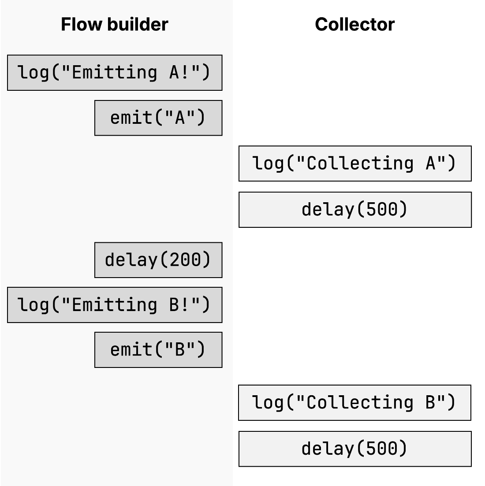
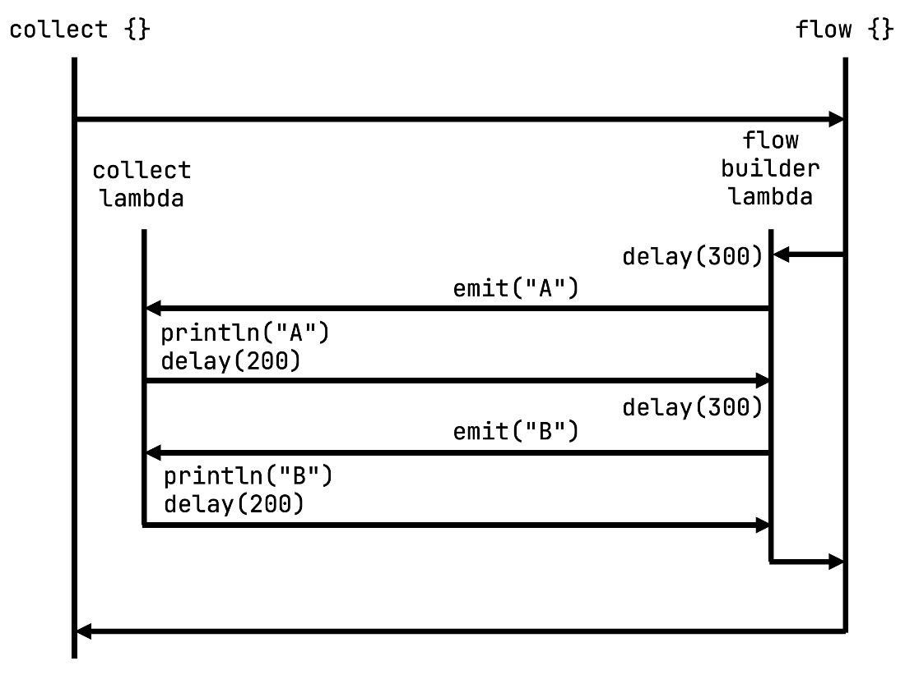
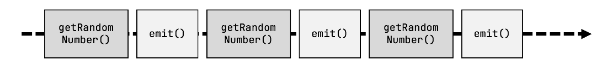
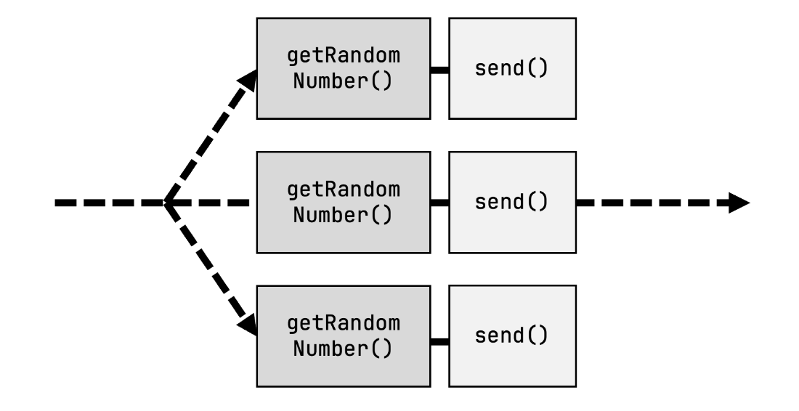
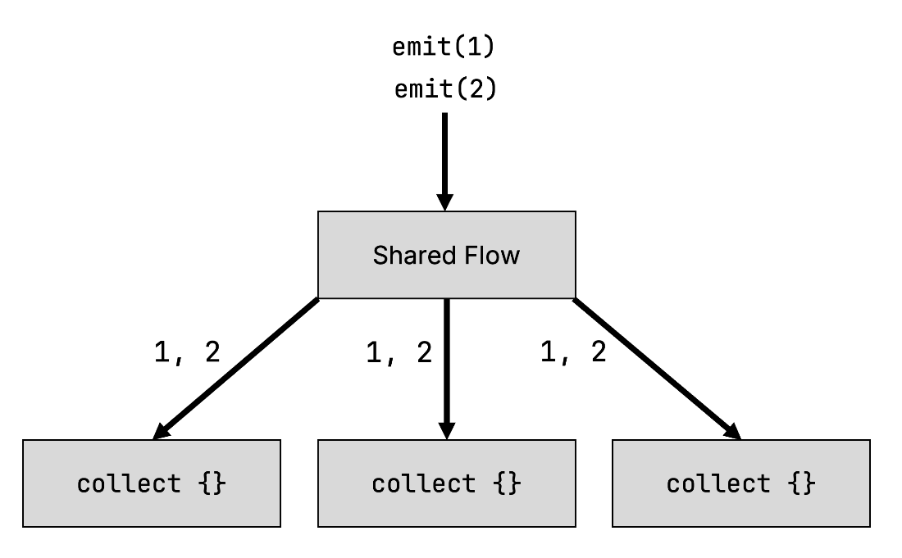
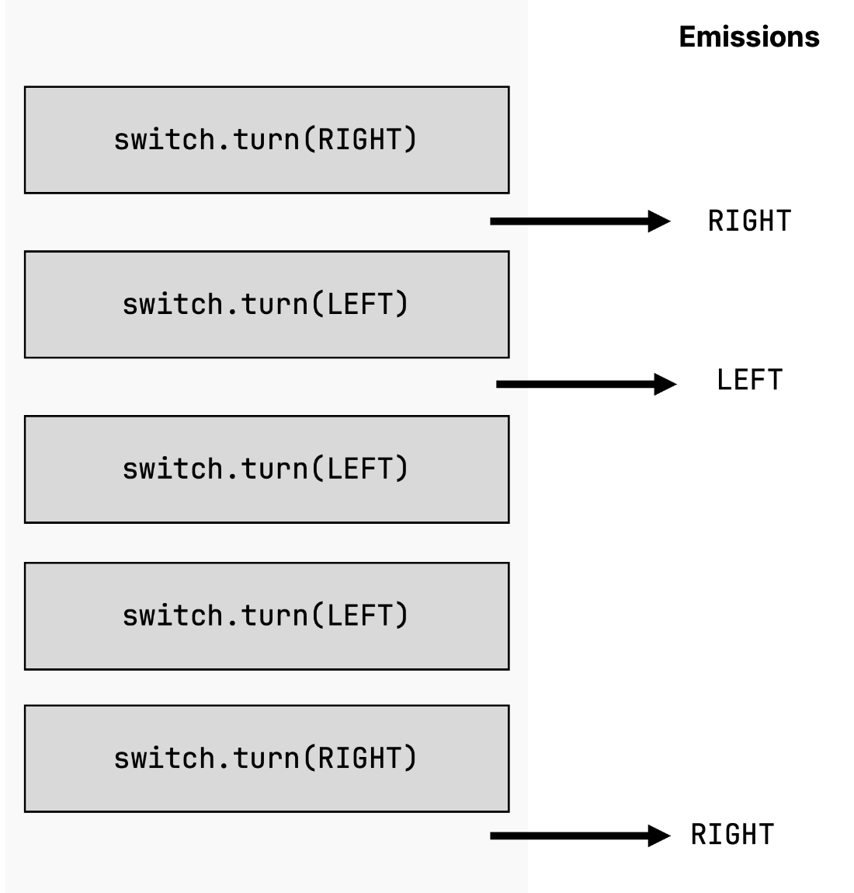

# 16 Flows

::: tip This chapter covers

- Working with flows as a model for sequential streams of values
- Cold flows and hot flows, their use cases and differences

:::

In the previous chapter, you have gotten to know coroutines and suspending functions as the basic abstraction used for concurrent programming in Kotlin. In this chapter, we will change our focus to a higher-level abstraction that is built on top of coroutines: *flows*, which allow you to work with multiple, sequential values over time while leveraging Kotlin's concurrency machinery. In this chapter, we'll discuss the ins and outs of flows. We'll discuss the different types of flows, and how to create, transform, and consume them.

## 16.1 Flows model sequential streams of values

As discussed in [, Section 14.4](https://livebook.manning.com/book/kotlin-in-action-second-edition/chapter-14/v-15/functions_that_can_pause), a suspending function can pause its execution, be it once or multiple times. However, it can only return a single value, for example, a primitive, an object, or a collection of objects. [Listing 16. 1](https://www.manning.com/books/kotlin-in-action-second-edition#justAList) illustrates this: your suspending function `createValues` creates a list of three values. By introducing a delay of one second per element, you can simulate a longer-running computation. Running this code, you will notice that the function only returns once all values have been computed: After three seconds, you see all three values printed:

::: info Listing 16.1 While a suspending function can pause execution, its return value only becomes available at the end of the function execution.

```kotlin
import kotlinx.coroutines.delay
import kotlinx.coroutines.runBlocking
import kotlin.time.Duration.Companion.seconds

suspend fun createValues(): List<Int> {
    return buildList { //
        add(1)
        delay(1.seconds)
        add(2)
        delay(1.seconds)
        add(3)
        delay(1.seconds)
    }
}

fun main() = runBlocking {
    val list = createValues()
    list.forEach {
        log(it) //
    }
}

// 3099 [main @coroutine#1] 1
// 3107 [main @coroutine#1] 2
// 3107 [main @coroutine#1] 3
```
:::

However, looking at the actual implementation of the `createValues` function, you can see that the element `1` was actually available instantaneously. Likewise, element `2` could have already been available after one second, and so on. In scenarios like these, where a function computes multiple values over a stretch of time, you may want to return values asynchronously as they become available, rather than only when the function has finished executing. This is where flows come in.

In Kotlin, flows are a coroutine-based abstraction that makes it possible to work with values that appear over time. Their general design is loosely inspired by Reactive Streams, an abstraction whose implementation you may have already crossed paths with: RxJava (https://reactivex.io/) and Project Reactor (https://projectreactor.io/) are two popular implementations of Reactive Streams on the JVM.

Just like Reactive Streams, flows are a general-purpose abstraction that can be used to implement functionality like progressive loading, work with streams of events, or model subscription-style APIs.

### 16.1.1 Flows allow you to work with elements as they are emitted

Let's rewrite the previous `createValues` function from [Listing 16. 1](https://livebook.manning.com/book/kotlin-in-action-second-edition/chapter-16/v-15/8#justAList) to make use of flows. To do so, you use the `flow` builder function instead of the `buildList` function. To add elements to the flow, you call `emit`. After calling the function, you can use the `collect` function to iterate the elements in the flow (you will examine the `flow` builder function further in [Section 162.1](https://livebook.manning.com/book/kotlin-in-action-second-edition/chapter-16/v-15/8#creating_a_cold_flow), and learn about the `collect` function in detail in [Section 162.2](https://livebook.manning.com/book/kotlin-in-action-second-edition/chapter-16/v-15/8#cold_collect)):

::: info Listing 16.2 Creating and collecting a flow

```kotlin
import kotlinx.coroutines.delay
import kotlinx.coroutines.runBlocking
import kotlinx.coroutines.flow.*
import kotlin.time.Duration.Companion.milliseconds

fun createValues(): Flow<Int> {
    return flow {
        emit(1) // 
        delay(1000.milliseconds)
        emit(2)
        delay(1000.milliseconds)
        emit(3)
        delay(1000.milliseconds)
    }
}

fun main() = runBlocking {
    val myFlowOfValues = createValues()
    myFlowOfValues.collect { log(it) } // 
}

// 29 [main @coroutine#1] 1
// 1100 [main @coroutine#1] 2
// 2156 [main @coroutine#1] 3
```
:::

Examining the timestamps of the output, you can quickly notice that the elements from the flow are displayed as soon as they are emitted: The code does not need to wait for all values to be computed. This basic abstraction of being able to work with values as soon as they are computed, rather than having to wait until the whole batch of elements is created, is at the core of flows in Kotlin. You will explore it in detail throughout this chapter.

### 16.1.2 Different types of flows in Kotlin

While all flows in Kotlin expose a consistent set of APIs for working with values that appear over time, in Kotlin, you distinguish between two categories of flows: *cold* flows and *hot* flows. In brief:

- *Cold flows* represent asynchronous data streams that only start emitting items when their items are being consumed by an individual collector.
- *Hot flows*, on the other hand, produce items independently of whether the items are actually being consumed, operating in a broadcast fashion.

This description may seem a bit abstract at this point, but as you'll explore these two types of flows more thoroughly over the course of this chapter, their differences and similarities will become clear.

We'll start with our discussion of cold flows, and examine hot flows in detail in [Section 163](https://livebook.manning.com/book/kotlin-in-action-second-edition/chapter-16/v-15/15#hot_flows).

## 16.2 Cold flows

In [Section 161.1](https://livebook.manning.com/book/kotlin-in-action-second-edition/chapter-16/v-15/26#work_with_elements), you've used your first cold flow to represent an asynchronous stream of numbers which are being computed over time. Let's take a look at that code in more detail, and discuss the different aspects that are involved in working with cold flows: their creation, when and how they work, how flows are canceled, and how you can use concurrency inside them.

### 16.2.1 Creating a cold flow with the flow builder function

Creating a new cold flow is straightforward: Just like with collections, there is a builder function that allows you to create a new flow, aptly named `flow`. Inside the block of the builder function, you can call the special `emit` function, which offers a value to the collector of the flow, and suspends the execution of the builder function until the value was processed by the collector – you can think of it as an asynchronous `return`. Because the signature of `flow` declares the block with the `suspend` modifier, you can also call other suspending functions from within the builder, such as `delay`:

::: info Listing 16.3 Calling suspending functions from the `flow` builder

```kotlin
12345678910111213import kotlinx.coroutines.*
import kotlinx.coroutines.flow.*
import kotlin.time.Duration.Companion.milliseconds

fun main() {
    val letters = flow {
        log("Emitting A!")
        emit("A") // 
        delay(200.milliseconds)
        log("Emitting B!")
        emit("B")
    }
}
```
:::

It's worth noting that when you run this code, you won't actually see any output. That's because the builder function returns you an object of type `Flow<T>`, a representation of a sequential stream of values. Just like with sequences, this flow is initially inert. It's not actually executed until a *terminal operator* is invoked on the flow which kicks off the computation as defined in the builder, and any other intermediate operators that come before (you'll learn more about intermediate operators on flows in [Section 17.2](https://livebook.manning.com/book/kotlin-in-action-second-edition/chapter-17/v-15/upstream_downstream), and take another look at terminal operators in [Section 17.4](https://livebook.manning.com/book/kotlin-in-action-second-edition/chapter-17/v-15/terminal_operators)). This is why the flow is called *cold*: It is inert by default until it is collected.

Because invoking the `flow` builder function doesn't actually trigger any work, you can build a flow in "regular", non-suspending Kotlin code. In practice, you will often find yourself writing functions with a non-suspending signature that return multiple values over time via a cold flow. Inside the flow builder, you would then call suspending functions:

```kotlin
import kotlinx.coroutines.flow.*

fun getElementsFromNetwork(): Flow<String> {
    return flow {
        // suspending network call here
    }
}
```

Since the code inside the builder function only gets executed once its being collected, it's also okay to define and return an infinite flow, just like with sequences, as you've seen in [Section 6.2.2](https://livebook.manning.com/book/kotlin-in-action-second-edition/chapter-6/v-15/creating_sequences). In this snippet, you're creating a `counterFlow` that emits an ever-increasing number every 200 milliseconds:

::: info Listing 16.4 Creating an infinite flow

```kotlin
val counterFlow = flow {
    var x = 0
    while (true) {
        emit(x++)
        delay(200.milliseconds)
    }
}
```
:::


This loop will only begin to run once the flow is actually being collected. Let's take a look at that next.


### 16.2.2 Cold flows don't do any work until collected

Xllngai rqk `collect` uofncnti nx z `Flow` tnqc arj iclog, jwdr xqr vxqz nelseirbspo tel giccelnlot rod fwlx tcapiylyl edrfrere vr cc rqx *ecrlltoco*. Mnkp gvkniino `collect`, xgb can piedorv s dbaaml rurs zrvd vnkioed ne szkp moisiesn nj ybtv flwv. Ceuesac iccnlgolet c welf tlcaluya eeuetxsc rkb npsduisneg oaku ltem deisni grv lwkf, `collect` jc s isgndnpseu unnofcit: Jr pnsudsse tnliu vpr vlfw czu dfesinhi. Eiskeewi, rqo alabmd erpviodd rv vqr ocoertllc mzp cfxz udnpses, ihwch asllow hkd rx ffca xrd rx rfhutre dnnsegsuip iuntcsofn. Vte aplemex, brx cltroeloc xl z lvwf cmb ewtri zyrz kr z ataedabs, vt ovmc HACL useqrste bdase en urx sluvae rj eveecidr lxmt pkr lxfw.

Jn rqja ptsenpi, egh'kt ltcolcinge rkp `letters` lfwe. Xeeausc `collect` aj c nidunpssge ncntuifo, gxh ztwh rgv icvntoioan jn `runBlocking`. Bk tstlreailu crur bxr aambdl seadsp vr `collect` cj fczv c seignpsnud tfucinon, gxq daeyl afert ignoctecll dzzx nemtlee:

```kotlin
import kotlinx.coroutines.*
import kotlinx.coroutines.flow.*
import kotlin.time.Duration.Companion.milliseconds

val letters = flow {
    log("Emitting A!")
    emit("A")
    delay(200.milliseconds)
    log("Emitting B!")
    emit("B")
}

fun main() = runBlocking {
    letters.collect {
        log("Collecting $it")
        delay(500.milliseconds)
    }
}

// 27 [main @coroutine#1] Emitting A!
// 38 [main @coroutine#1] Collecting A
// 757 [main @coroutine#1] Emitting B!
// 757 [main @coroutine#1] Collecting B
```

Bikang z fkko rc uro msespmitta kl yrk tpuotu, rj esobmec alecr gaani rgsr rdv clrelctoo ja ilesrsoebpn vtl nugnrni vyr lcigo lk kry fklw: Ayv dyael nweeteb ory tnclooclei xl eemteln `A` nzp `B` aj yolrguh 700 lomldisceins. Cycr jz ceuesab rvb flwingloo cenqeeus lk vetsne hanpsep:

- Xkg tcloeocrl gitsrerg vur iglco nideedf jn brv vlfw dbuierl, gisncau rqk tisrf eimissno.
- Yvg mblaad eacoiadsst rwjq orp crltocole zj nevdkoi, gggnlio drx mgsseae hcn lgidneay klt 500 iilsondecmls.
- Cndv, urv fwxl bamlda cj cnunoedit, deylgnia ltv c urehfrt 200 misdionellsc, rebefo bxr oineisms (nz adsitescao tnilceoolc) hpeapsn.

[Figure 16. 1](https://livebook.manning.com/book/kotlin-in-action-second-edition/chapter-16/v-15/47#intertwine) rlultaestsi rjcb, qnc hxq'ff trfheru oprxlee jabr ttdeinnwrie uenart le necxtioeu nj [Section 162.4](https://livebook.manning.com/book/kotlin-in-action-second-edition/chapter-16/v-15/47#under_the_hood).

::: info Figure 16.1 The first emission in the flow builder means the lambda associated with the collector is invoked. It logs a message and delays, before the flow builder lambda is continued. After the delay of 200 milliseconds and a log message, the control flow moves back over to the collector, collecting the second element, and delaying for a final 500 milliseconds. While these operations happen intertwined, they all run on the same coroutine.


:::

Jr'z wrhto gtoinn rrys chri oxjf enseuqecs rbx etdaaeluevr yever jvmr vpq zkh c ltrmneia eoprtroa, ilalcng `collect` vn s zfxy wfkl epltlumi eimst kzfz tregirsg vrp tucnexioe vl crj usve tllmpuie smeit. Xjba cj rhtow enpiegk jn njum lj gtvd klwf dac ajpk csfefet ovjf igkman newktor ersqtseu – xyrb fwfj xh ecxudete lmpiteul mesit (kuq'ff lraen tobau c wps vr dvioa aujr brivohae nj [Section 163](https://livebook.manning.com/book/kotlin-in-action-second-edition/chapter-16/v-15/47#hot_flows)):

::: info Listing 16.5 Collecting the same flow multiple times

```kotlin
import kotlinx.coroutines.flow.*
import kotlinx.coroutines.*
import kotlin.time.Duration.Companion.milliseconds

fun main() = runBlocking {
    letters.collect {
        log("(1) Collecting $it")
        delay(500.milliseconds)
    }
    letters.collect {
        log("(2) Collecting $it")
        delay(500.milliseconds)
    }
}

// 23 [main @coroutine#1] Emitting A!
// 33 [main @coroutine#1] (1) Collecting A
// 761 [main @coroutine#1] Emitting B!
// 762 [main @coroutine#1] (1) Collecting B
// 1335 [main @coroutine#1] Emitting A!
// 1335 [main @coroutine#1] (2) Collecting A
// 2096 [main @coroutine#1] Emitting B!
// 2096 [main @coroutine#1] (2) Collecting B
```
:::

The `collect` function suspends until all elements of the flow have been processed. However, as you've seen in [Section 162.1](https://livebook.manning.com/book/kotlin-in-action-second-edition/chapter-16/v-15/47#creating_a_cold_flow), flows can have potentially infinitely many elements – meaning the `collect` function would suspend indefinitely. To stop collecting a flow before all elements have been processed, you can cancel it.

### 16.2.3 Canceling the collection of a flow

You have already gotten to know mechanisms for canceling coroutines in [Section 15.3](https://livebook.manning.com/book/kotlin-in-action-second-edition/chapter-15/v-15/cancellation). They also apply for flow collectors. By canceling the coroutine of the collector, you stop the collection of the flow at the next cancellation point:

::: info Listing 16.6 Canceling the collection of a flow

```kotlin
123456789101112131415import kotlinx.coroutines.flow.*
import kotlinx.coroutines.*
import kotlin.time.Duration.Companion.seconds

fun main() = runBlocking {
    val collector = launch {
        counterFlow.collect {
            println(it)
        }
    }
    delay(5.seconds)
    collector.cancel()
}

// 1 2 3 ... 24
```
:::

::: info NOTE

Like other built-in suspending functions, `emit` acts as a cancellation and suspension point for your code.
:::

Later on, when you take a closer look at intermediate and terminal operators, you will get to know some additional ways of canceling the execution of flows. One such example would be the `take` operator, which you'll explore in [Section 17.2.2](https://livebook.manning.com/book/kotlin-in-action-second-edition/chapter-17/v-15/take_operators).

### 16.2.4 Cold flows under the hood

In [Section 161](https://livebook.manning.com/book/kotlin-in-action-second-edition/chapter-16/v-15/47#seqstream), you already heard that flows are an abstraction on top of the Kotlin coroutine machinery, more precisely, suspending functions. Now that you have seen the first few flows, you can take a look at how they are implemented. While knowledge of the inner workings isn't required to use flows, it can still help you build a stronger understanding of cold flows and their mechanics. Cold flows in Kotlin are a clever combination of suspending functions and lambdas with receivers, both language features that you've already gotten to know over the previous chapters. The definition of cold flows as provided by coroutines is actually just a few lines long, and only requires two interfaces: `Flow` and `FlowCollector`. They each define only one function: `collect` and `emit`:

```kotlin
interface Flow<out T> {
    suspend fun collect(collector: FlowCollector<T>)
}

interface FlowCollector<in T> {
    suspend fun emit(value: T)
}
```

Mnoq kgy fidene c wfvl uings rbo `flow` ibdurle icfnutno, xpr almabd hdv iroedvp cds bvr rvcieree pxqr `FlowCollector`. Czjg cj rcwu kames rj sipleosb vr vnikeo orq `emit` noftcniu mlvt iwtinh vdr lureidb. Bxb `emit` ncofntiu clals ory abadlm spased rv drk `collect` otcnnfui. Jn fefcte, hqk xpzv wrv dsblama lacilgn zvbz hroet:

- Bllngai `collect` knsievo prx gxgu kl vrq `flow` eidrblu inutcnof.
- Mynx jryz skbk lsacl `emit`, jr jn brnt sllac krd mdlbaa sapesd rk `collect` rjyw ruk maerrepat sadpse rv `emit`.
- Nnsx dxr daamlb inspoexers spa hsefindi eguctexni, ruv ouficntn truerns acod jnkr rbk gvpp le kry uedlbri cnnoituf, gns nniouetcs tcnxeoeui.

[Figure 16. 2](https://livebook.manning.com/book/kotlin-in-action-second-edition/chapter-16/v-15/64#tandem) lsesalturit gzjr ctnpoce tvl ryv noflwolig svyk pnipset:

```kotlin
val letters = flow {
    delay(300.milliseconds)
    emit("A")
    delay(300.milliseconds)
    emit("B")
}

letters.collect { letter ->
    println(letter)
    delay(200.milliseconds)
}
```

::: info Figure 16.2 Calling `collect` invokes the lambda associated with the `flow` builder function. In this case, the lambda suspends for 300 milliseconds. The call to `emit` executes the lambda passed to collect, and runs it to completion: Here, it executes a `print` statement and delays for 200 milliseconds. Then, the control flow returns to the lambda flow builder, which repeats this cycle for a second time, before finally returning, and thus finishing the initial invocation of `collect`. All of these are just regular function calls, all this code is executed within a single coroutine.


:::

As you can see, there aren't that many moving parts in a regular cold flow. Yet, they provide an extremely useful and extensible abstraction for writing code that processes streams of values while still remaining lightweight.

### 16.2.5 Concurrent flows with channel flows

The cold flows you have created so far using the `flow` builder function are all sequential: The block of code runs, just like the body of a suspending function, as a single coroutine. As such, calls to `emit` are also executed sequentially. For many cases, this basic abstraction is more than enough, but when your flow performs a number of computations that could run independently of each other, this sequential nature can prove to become a bottleneck. Consider the following snippet of code, where you declare a flow `randomNumbers` that calculates ten numbers using the artificially slow `getRandomNumber` function:

::: info Listing 16.7 A regular cold flow is executed sequentially

```kotlin
import kotlinx.coroutines.flow.*
import kotlinx.coroutines.*
import kotlin.random.Random
import kotlin.time.Duration.Companion.milliseconds

suspend fun getRandomNumber(): Int {
    delay(500.milliseconds)
    return Random.nextInt()
}

val randomNumbers = flow {
    repeat(10) {
        emit(getRandomNumber())
    }
}

fun main() = runBlocking {
    randomNumbers.collect {
        log(it)
    }
}

// 583 [main @coroutine#1] 1514439879
// 1120 [main @coroutine#1] 1785211458
// 1693 [main @coroutine#1] -996479986
// ...
// 5463 [main @coroutine#1] -2047597449
```
:::

Collecting this flow takes a little over 5 seconds, because each `getRandomNumber` invocation is executed one after the other. [Figure 16. 3](https://livebook.manning.com/book/kotlin-in-action-second-edition/chapter-16/v-15/64#seq) illustrates this.

::: info Figure 16.3 When using a regular cold flow, each random number is generated and emitted. This happens entirely sequentially.


:::

*The flow is executed sequentially, with all computations running on the same coroutine.*

Because the operations you perform in this code (generating numbers) are independent of each other, they seem like an ideal candidate for being performed concurrently or, if desired, in parallel. Just like with `async` as you saw it in [Section 14.6.3](https://livebook.manning.com/book/kotlin-in-action-second-edition/chapter-14/v-15/async_builder), this could make the execution much faster, bringing the time to compute all 10 elements down to roughly 500 milliseconds.

It might be tempting to apply what you have learned so far to introduce concurrency into your flow builder invocation by launching some background coroutines and emitting values directly from them. However, you will be greeted by an error message if you do so: *Flow invariant is violated: Emission from another coroutine is detected. FlowCollector is not thread-safe and concurrent emissions are prohibited.*

```kotlin
val randomNumbers = flow {
    coroutineScope {
        repeat(10) {
            launch { emit(getRandomNumber()) } // 
        }
    }
}
```

This is because the basic, cold flow abstraction only allows invocations of the `emit` function from the same coroutine. What's needed is a flow builder that allows you to build a concurrent flow that allows emissions from multiple coroutines. In Kotlin, this is called a *channel flow*, and can be constructed with the `channelFlow` builder function. A channel flow is a special type of cold flow. It doesn't provide an `emit` function for sequential emissions. Instead, multiple coroutines can use `send` to offer values. The collector of this flow still receives them in sequential fashion, and the `collect` lambda can do its work. Here, you're using a channel flow to optimize your previous implementation. Just like the `coroutineScope` function, the lambda for `channelFlow` provides a coroutine scope on which you can launch new background coroutines:

::: info Listing 16.8 Concurrently sending elements into a channel flow

```kotlin
import kotlinx.coroutines.flow.channelFlow
import kotlinx.coroutines.launch

val randomNumbers = channelFlow { // 
    repeat(10) {
        launch {
            send(getRandomNumber()) // 
        }
    }
}
```
:::

Collecting this flow in the same manner as before, but now using a channel flow, you can observe that `getRandomNumber` now indeed gets executed concurrently, and the whole execution finishes in about 500 milliseconds. This is also illustrated in [Figure 16. 4](https://livebook.manning.com/book/kotlin-in-action-second-edition/chapter-16/v-15/70#send):

```
553 [main] -1927966915
568 [main] 222582016
...
569 [main] 1827898086
```

::: info Figure 16.4 The channel flow can launch other coroutines and send elements concurrently.


:::

With `channelFlow`, you now know of a flow builder that can be called concurrently. At this point, it might be natural to wonder if there's ever any reason to use a non-channel flow – after all, the channel flow can do everything a regular flow can, and more! So, how do you decide?

Generally speaking, regular cold flows are the easiest and most performant abstraction you can choose: While they are strictly sequential and can't launch new coroutines, they are very simple to create, their interface consists of just a single function (`emit`), and there are no additional moving parts or overhead that you need to keep track of. Channel flows, on the other hand, are specifically designed for the use case of concurrent operations. They are not quite as cheap to create, because they have to manage another concurrent primitive, the *channel*, under the hood. Channels are a comparatively lower-level abstraction for cross-coroutine communication. The `send` function is part of the overall more complicated interface exposed by channels.

When deciding between regular cold flows and channel flows, only pick channel flows if you need to launch new coroutines from inside your flow. Otherwise, choosing regular cold flows is the way to go.

Cold flows are a useful abstraction for working with values that are computed over time. Later on, in [Section 17.1](https://livebook.manning.com/book/kotlin-in-action-second-edition/chapter-17/v-15/flow_operators), you'll learn about the powerful ways to apply further transformations to your flows. However, cold flows are always directly associated with their collector: Each collector executes the code specified for the flow independently. In the next section, you'll learn about the second type of flows, which you can apply for broadcast-style communication of values across coroutines, as well as to manage state in a concurrent system: hot flows.

## 16.3 Hot flows

While still following the overall structure of emission and collection, hot flows have a number of properties that make them different from cold flows. Hot flows share emitted items across multiple collectors, called *subscribers*, rather than having each collector trigger the execution of the flow logic independently. This means they lend themselves for use cases where you are emitting events or state changes in your system that happen independently or aren't tied to a collector being present. This is also where they get their name from: independently of the presence of a subscriber, emissions can happen in these *hot* flows that are always active.

Kotlin coroutines come with two hot flow implementations out of the box:

- *shared flows*, which are used for broadcasting values, and
- *state flows*, for the special case of communicating state.

In practice, you'll likely use state flows more often than shared flows (and, as you'll see in [Section 163.3](https://livebook.manning.com/book/kotlin-in-action-second-edition/chapter-16/v-15/88#stateflow_vs_sharedflow), you can often reframe code that uses a shared flow to use a state flow instead), but it's still useful to understand how both types work. You'll first see shared flows in action, and then move on to state flows.

### 16.3.1 Shared flows broadcast values to subscribers

Shared flows operate in a *broadcast fashion*: Independently of whether a subscriber (a collector of a shared flow) is present, emissions can happen. To demonstrate this broadcasting behavior, you can model a real life broadcasting transmitter: a numbers station (https://en.wikipedia.org/wiki/Numbers_station). These mysterious radio stations exist in real life and transmit encoded messages to spies around the world via open frequencies: Multiple spies all over the world can listen in and try to decode these messages. (Because we don't have our spy handbook ready, though, we will have to make do with actually generating random numbers.)

::: info Figure 16.5 Shared flows operate in a broadcast fashion: When an element is emitted into the shared flow, all subscribers that are currently collecting the flow will receive this emission.


:::

Shared flows are typically declared in a container class – in your case, the `RadioStation` class. The mutable version of the shared flow, `_messageFlow`, which can be used to `emit` values, is encapsulated as a private property of the class, while the read-only version of the flow `messageFlow`, which can be used to subscribe to the emissions, is exposed as a public property. You also define a function called `beginBroadcasting` which launches a new coroutine on a given scope which emits (and logs) random numbers on the message flow:

::: info Listing 16.9 Broadcasting values using `SharedFlow`

```kotlin
import kotlinx.coroutines.*
import kotlinx.coroutines.flow.*
import kotlin.random.*
import kotlin.time.Duration.Companion.milliseconds

class RadioStation {
    private val _messageFlow = MutableSharedFlow<Int>() // 
    val messageFlow = _messageFlow.asSharedFlow() // 

    fun beginBroadcasting(scope: CoroutineScope) {
        scope.launch {
            while(true) {
                delay(500.milliseconds)
                val number = Random.nextInt(0..10)
                log("Emitting $number!")
                _messageFlow.emit(number) // 
            }
        }
    }
}
```
:::

Xz xbb ncz xkc, grtotnscniuc c rxy wlfx ejof `SharedFlow` owrks tnyeidfeflr tmel ctgcustrnnio z zufk flkw: Aterah psnr usgni s elwf breliud, gqv rdk s erencfeer rx c ubeamlt svneior vl oru lwfe. Caeceus ssioinmes pnahpe nleypidtednne el eehtrhw ecsbrirusbs vzt neertps, jr'a dted iblsirsentyipo vr tasrt c noeuitcro rbzr ofsrperm uvr latcau nmiisesso. Jr facv nemas srrq qxg zan gxzx mxtx snbr kxn couenriot ryrs semti vselau rxjn s bamleut adehrs klwf wothtiu nsp frtrueh lasehs.

::: info UNDERSCORES WHEN NAMING HOT FLOWS

You may wonder why shared flows (and state flows) follow the pattern of defining a private variable whose name begins with an underscore, as well as a public variable with a non-underscore name. At the time of writing, Kotlin does not support different types for private and public variables. By defining the mutable version of the flow to be private, and exposing a property that has the readonly type `SharedFlow<T>`, you prevent exposing a mutable version of your shared flow to consumer classes, which is in the interest of encapsulation and information hiding — after all, the consumers of your class should typically only subscribe to the flow, not emit elements into it.

Being able to specify a different type for a property depending on whether it is accessed from inside or outside the class is planned to be added to the language within the scope of Kotlin 2.x. (https://youtrack.jetbrains.com/issue/KT-14663).
:::

When you construct an instance of the `RadioStation` class and call the `beginBroadcasting` function, you will see that broadcasting begins immediately, even when no subscribers are present:

```kotlin
fun main() = runBlocking {
    RadioStation().beginBroadcasting(this) // 
}

// 575 [main @coroutine#2] Emitting 2!
// 1088 [main @coroutine#2] Emitting 10!
// 1593 [main @coroutine#2] Emitting 4!
// ...
```

Adding a subscriber works the same way as collecting a cold flow – you simply call `collect`. The lambda you provide will be executed whenever a value is emitted. However, it's important to note that subscribers only get emitted values from the beginning of their subscription. To illustrate this, you can start subscribing to the shared flow after a small delay:

::: info Listing 16.10 Subscribing to a shared flow with a delay

```kotlin
fun main(): Unit = runBlocking {
    val radioStation = RadioStation()
    radioStation.beginBroadcasting(this)
    delay(600.milliseconds)
    radioStation.messageFlow.collect {
        log("A collecting $it!")
    }
}
```
:::

Looking at the output, you'll notice that the first value, which was emitted after roughly 500 milliseconds, was not collected by the subscriber:

```
611 [main @coroutine#2] Emitting 8!
1129 [main @coroutine#2] Emitting 9!
1131 [main @coroutine#1] A collecting 9!
1647 [main @coroutine#2] Emitting 1!
1647 [main @coroutine#1] A collecting 1!
```

Because shared flows operate in a broadcast fashion, you can add additional subscribers that also receive emissions of the existing `messageFlow`. For example, you could add an additional subscriber on its own coroutine by adding a second call to `launch` inside the `runBlocking` block:

```kotlin
launch {
    radioStation.messageFlow.collect {
        log("B collecting $it!")
    }
}
```

It will receive the same values as all other subscribers of the same shared flow: Your numbers station is *broadcasting* its values. Note that unlike with cold flows, the collector(s) are not responsible for triggering the actual emission of elements in the flow – they are merely subscribers that will be notified when new elements are emitted.

#### Replaying values for subscribers

When using a shared flow, subscribers only receive emissions that happen after they have started their subscription by calling `collect`. If you want subscribers to receive previously emitted elements, you can use the `replay` parameter when constructing the `MutableSharedFlow` to set up a cache of the latest values for new subscribers. In this example, you're setting up the message flow to replay the last five values when a new subscriber is added.

```kotlin
private val _messageFlow = MutableSharedFlow<Int>(replay = 5)
```

With this change, even when launching the collectors after a short delay of 600 milliseconds, they will still receive up to five elements that preceded their subscription. In this case, that means the subscriber will see the value emitted at 560 milliseconds, before it started its subscription:

```
560 [main @coroutine#2] Emitting 6!
635 [main @coroutine#1] A collecting 6!
1080 [main @coroutine#2] Emitting 10!
1081 [main @coroutine#1] A collecting 10!
```

This can be a convenient way to make sure subscribers always have a few of the most recent values to work with when they first subscribe.

#### From cold flow to shared flow with `shareIn`

Let's assume for a moment that you have a function that provides a stream of values, such as temperatures that are being collected from a sensor in an interval of 500 milliseconds. This function, as provided to you, returns a cold flow:

::: info Listing 16.11 A simple function that returns a stream of values in a given interval.

```kotlin
import kotlinx.coroutines.*
import kotlinx.coroutines.flow.*
import kotlin.random.*
import kotlin.time.Duration.Companion.milliseconds

fun querySensor(): Int = Random.nextInt(-10..30)

fun getTemperatures(): Flow<Int> {
    return flow {
        while(true) {
            emit(querySensor())
            delay(500.milliseconds)
        }
    }
}
```
:::

Jl qvu vwvt er cfzf `collect` nv gjrz icnfuont mpelliut esimt, txl emxeapl, kr pttuou vgr ettrepemaur znex jn Tleiuss, kakn nj Leihthaenr, kndr skzp tceoclrol dluwo aeucs urx ssenor re xq edruieq lnntepnediyde:

```kotlin
fun celsiusToFahrenheit(celsius: Int) =
    celsius * 9.0 / 5.0 + 32.0

fun main() {
    val temps = getTemperatures()
    runBlocking {
        launch {
            temps.collect { // 
                log("$it Celsius")
            }
        }
        launch {
            temps.collect { // 
                log("${celsiusToFahrenheit(it)} Fahrenheit")
            }
        }
    }
}
```

Whether it's interacting with sensors, making network requests, or database queries: It's often desirable to avoid interacting with external systems or perform long-running computations more than you have to. Instead, you would want to *share* the flow returned between two collectors: They should both receive the same elements.

You can convert a given cold flow to a hot shared flow by using the `shareIn` function. This conversion from cold to hot causes the code of the flow to be executed, so this function needs to run on a coroutine. For this purpose, `shareIn` take a `scope` parameter of type `CoroutineScope` on which that coroutine is launched:

::: info Listing 16.12 Using `shareIn` to convert the cold flow to a hot shared flow

```kotlin
fun main() {
    val temps = getTemperatures()
    runBlocking {
        val sharedTemps = temps.shareIn(this, SharingStarted.Lazily)
        launch {
            sharedTemps.collect {
                log("$it Celsius")
            }
        }
        launch {
            sharedTemps.collect {
                log("${celsiusToFahrenheit(it)} Fahrenheit")
            }
        }
    }
}

// 45 [main @coroutine#3] -10 Celsius
// 52 [main @coroutine#4] 14.0 Fahrenheit
// 599 [main @coroutine#3] 11 Celsius
// 599 [main @coroutine#4] 51.8 Fahrenheit
```
:::

The second parameter `started` defines when the flow should actually be started: Here, you can specify multiple different behaviors:

- `Eagerly` starts the collection of the flow immediately.
- `Lazily` starts the collection only when the first subscriber appears
- `WhileSubscribed` starts the collection only when the first subscriber appears, and additionally cancels the collection of the flow when the last subscriber disappears.

It's a common pattern in Kotlin that operations that compute multiple values over time are simply exposed as cold flows, and that your application code can, when needed, convert these cold flows into hot flows. Because `shareIn` participates in structured concurrency via its coroutine scope, you can be sure that when your application no longer needs the information from the shared flow, its internal logic gets canceled when the surrounding coroutine scope gets canceled.

### 16.3.2 Keeping track of state in your system: State flow

A special case that comes up in concurrent systems is keeping track of some value that may change over time, or, put differently, the state of a value. In our previous example, this may be the values read by the temperature sensor, which represent the current temperature state in our system. Kotlin coroutines comes with a specialized abstraction to handle this case, called *state flow*. A state flow is a special version of a shared flow that makes it particularly easy to keep track of state changes of a variable over time. There are a number of topics related to state flows that are worth exploring:

- How state flows are created and exposed for subscribers.
- How the value of a state flow can be updated safely, even when accessed in parallel.
- The concept of *equality-based conflation* which causes state flows to only emit when their values actually change.
- How to convert cold flows into state flows.

Benritga s tseat kwfl oksrw augonosal er agceitrn s eadrhs lwvf: Xvy rtecae z `MutableStateFlow` ac qxr rpvaeti tryerppo el z casls, nsb xoseep s kqct-feng `StateFlow` tiavnra kl rxq mxza ilavaebr. Jn rbjz xeaepml, vbu'tk enifding s jxxw enoturc. Ysuceea s tates wflk etpesernrs s euavl gsrr mpz nahceg extk jrxm, ydr ssn yk chtx rz cpn opitn, xgy xafz dpioevr nc initial aulve ac c arpreeamt rk jrz utccnsrroot (nj jrqa zzxa, vktc evsiw). Jdstnae lk sgiun `emit`, dpx xad qxr `update` tnouficn xr tdaeup jcr avuel:

::: info Listing 16.13 A basic implementation of a view counter that uses a state flow to keep track of the counter.

```kotlin
import kotlinx.coroutines.flow.*
import kotlinx.coroutines.*

class ViewCounter {
    private val _counter = MutableStateFlow(0) // 
    val counter = _counter.asStateFlow()

    fun increment() {
        _counter.update { it + 1 }
    }
}

fun main() {
    val vc = ViewCounter()
    vc.increment()
    println(vc.counter.value)
    // 1
}
```
:::

Bbx anz scasce ryv nrtrceu attes dtrsrepenee qq rxg bumeatl tsaet lfkw jkz cjr `value` pporyret: Mtituho ngniespsud, pzjr ppyroert wlsola khg rx faeysl vsut jar lauev. Ngntpdai qkr valeu jc vnxy ojc `update`, z ntoufcin cwihh dsservee c erlcos kexf.

#### Safely writing to a state flow with the `update` function

Qqnk uehrrtf snticinope, kbp hmtgi eicnot srbr rod `value` roreppyt jc tcllaayu s qotc-rwtei rteoppyr: Rqx san ingssa svluea rx jr za fwkf. Rz bpcz, rj zmp qx egpmintt vr netpmelmi vbr `increment` fnuction insgu kqr lsiascc `++` aoroprte:

```kotlin
fun increment() {
    _counter.value++
}
```

However, there is a problem with this code: These increment operations aren't *atomic*. To illustrate this problem, you can write a short code snippet that runs ten thousand coroutines that all call `increment`. By calling `runBlocking` with the default dispatcher, you make sure these are distributed over multiple threads:

::: info Listing 16.14 Starting ten thousand coroutines on a multithreaded dispatcher to increment the view counter

```kotlin
fun main() {
    val vc = ViewCounter()
    runBlocking(Dispatchers.Default) {
        repeat(10_000) {
            launch { vc.increment() }
        }
    }

    println(vc.counter.value)
    // 4103
}
```
:::

As you can see, the resulting number in the counter is much lower than 10.000. This is because these coroutines are running on multiple threads The increments are performed non-atomically, in multiple steps: Read the current value, compute the new value, write the new value. If two threads read the current value at the same time, then one of the increment operations will effectively be dropped.

To address this, state flows provide the `update` function, which helps you make *atomic* updates to the value of a state flow. You provide a lambda expression that describes how, given a previous value, the new value should be computed (in the case of the view counter, the value should be incremented by one). If two updates to the state flow were to happen in parallel, it simply executes the update function again with a refreshed `previous` value, making sure that no operation gets lost. Rerunning the same test code from [Listing 16. 14](https://livebook.manning.com/book/kotlin-in-action-second-edition/chapter-16/v-15/141#tenk_coroutines) with the implementation in [Listing 16. 13](https://livebook.manning.com/book/kotlin-in-action-second-edition/chapter-16/v-15/141#viewcounter) yields the correct result.

#### State flows only emit when a value has actually changed: Equality-based conflation

Just like a shared flow, you can subscribe to a state flow and its value over time by calling `collect`. In this example, you're defining a "direction selector" that exposes functions to turn a switch either to the "left" or "right" position:

```kotlin
import kotlinx.coroutines.flow.*
import kotlinx.coroutines.*

enum class Direction { LEFT, RIGHT }

class DirectionSelector {
    private val _direction = MutableStateFlow(Direction.LEFT)
    val direction = _direction.asStateFlow()

    fun turn(d: Direction) {
        _direction.update { d }
    }
}
```

You can then use this direction selector to perform a few transitions between the "left" and "right" position. By calling `collect`, the coroutine in charge of logging these transitions will be notified whenever a new value is set:

```kotlin
fun main() = runBlocking {
    val switch = DirectionSelector()
    launch {
        switch.direction.collect {
            log("Direction now $it")
        }
    }
    delay(200.milliseconds)
    switch.turn(Direction.RIGHT)
    delay(200.milliseconds)
    switch.turn(Direction.LEFT)
    delay(200.milliseconds)
    switch.turn(Direction.LEFT)
}

// 37 [main @coroutine#2] Direction now LEFT
// 240 [main @coroutine#2] Direction now RIGHT
// 445 [main @coroutine#2] Direction now LEFT
```

Mopn ginpnseict bkr tupuot xl bajr estppin, yxb'ff notiec rrgz edistep `turn` nbieg voidenk wrjg `LEFT` cc raj emraaetpr ecwti, nov tafre rbv hetor, dkr ibbursescr jc enfq novedki xknz. Ycpj zj bceeusa eatst soflw ormferp *uyateilq-esdba iotnafclon*: Copd vdnf jorm euslva er rky tllcsoeorc wnbo drk uveal ycz alcuatyl cgdnhae. Jl prx urspeivo laveu zgn rpx datuedp aevul xzt dor mocz, en somnesii ensppah: lj kub'tk seborignv z laveu ewitc, znq cr gdxr sitme, horp cyoo pxr ocam value, nyz gntonih cdc yloeptlaccun adcnhge.

::: info Figure 16.6 State flows perform equality-based conflation: When the value is assigned the same value as is already set, no new elements are emitted.


:::

#### From cold flow to state flow with `stateIn`

When working with an API that provides you with a cold flow, like you had in [Listing 16. 11](https://livebook.manning.com/book/kotlin-in-action-second-edition/chapter-16/v-15/149#gettempscold), you can use the `stateIn` function to convert a cold flow to a state flow, allowing you to always read the latest value emitted from the original flow. Just like with shared flows, adding multiple collectors or accesses to the `value` property won't execute the upstream flow (you'll learn more about the notions of "upstream" and "downstream" in [Section 17.2](https://livebook.manning.com/book/kotlin-in-action-second-edition/chapter-17/v-15/upstream_downstream)):

::: info Listing 16.15 Using `stateIn` to convert a cold flow to a hot state flow

```kotlin
import kotlinx.coroutines.flow.*
import kotlinx.coroutines.*
import kotlin.time.Duration.Companion.milliseconds

fun main() {
    val temps = getTemperatures()
    runBlocking {
        val tempState = temps.stateIn(this)
        println(tempState.value)
        delay(800.milliseconds)
        println(tempState.value)
        // 18
        // -1
    }
}
```
:::

Unlike with shared flows in [Section 163.1.2](https://livebook.manning.com/book/kotlin-in-action-second-edition/chapter-16/v-15/149#sharein), the `stateIn` function doesn't provide any starting strategies: It always starts the flow in the given coroutine scope, and keeps providing its latest value to its subscribers and via the `value` property until the coroutine scope is canceled.

### 16.3.3 Comparing state flows and shared flows

You're now familiar with the two hot flows you can use out of the box with Kotlin: Both of them allow emissions to happen independently of whether subscribers are present, but their uses differ: Shared flows can broadcast events where subscribers can come and go, with subscribers only receiving emissions while they are subscribed. State flows are designed to represent any kind of state, and use equality-based conflation, meaning that emissions only happen when the value represented by the state flow actually changes.

Jn eanrgel, etsta swolf voriepd z ipmersl RFJ pznr edsahr wsolf: Bqvp fnuv ererenspt c geilsn luvae. Sehdar owslf zdm tseurl nj added xtpeolciym usceeab rj aj xdty sryipoetilbnis rv vmvz tkzq rgzr irubecsssrb tsx nrspete rz rpo mroj wvnq ruvg kts eetedcpx xr ireceve oisnissme. Bc qzyz, jr mgthi do hwrot tsinginev vzom jrmx qsn inygrt re amreefr rlbeospm ruzr ehd'tx girytn rv eovsl usnig hresda lfvw, kr zoo jl phk duclo dcx s astte elfw istnead.

Lvt elpemax, egg mihgt uljn luryofes iegnnigsd c tsymse wereh yhk ctk ngsiu c sehadr wlfe vr abodctsar gesesasm rv itlplemu rbsecusbsri. Heorevw, xpd'ff ljnq qrcr nc tailomitmenpne fjke rjzb nxx sodne'r utyllcaa irtpn gnc massgsee:

::: info Listing 16.16 A broadcaster that emits all messages before the first subscriber appears

```kotlin
import kotlinx.coroutines.flow.*
import kotlinx.coroutines.*
import kotlin.time.Duration.Companion.milliseconds

class Broadcaster {
    private val _messages = MutableSharedFlow<String>()
    val messages = _messages.asSharedFlow()
    fun beginBroadcasting(scope: CoroutineScope) {
        scope.launch {
            _messages.emit("Hello!")
            _messages.emit("Hi!")
            _messages.emit("Hola!")
        }
    }
}

fun main(): Unit = runBlocking {
    val broadcaster = Broadcaster()
    broadcaster.beginBroadcasting(this)
    delay(200.milliseconds)
    broadcaster.messages.collect {
        println("Message: $it")
    }
}

// No values are collected, nothing is printed
```
:::

Raeesuc qxtb sreibusbrc xngf peprasa cmox ojmr trfae drv gsmesesa ktwx dsbocraat, rj wne'r verceie ndz geassmes. Ul eoucrs, yhk'oo alyerda vnoc crbr pxh zna jlno-ndvr ykr epryla ecahc le ruv ashedr lkfw. Ard sedtnia, vdd nsa fzse recah ltv s elrmspi obtnrisaact: Auk steat wvfl. Yhraet yzrn mjro idnviludia amseessg, c estat wxlf dwlou etors rxy nirtee emgsesa stryohi zc c jarf, ze rusr sceussribrb sns aisyel saccse ffz prrio gseessam:

::: info Listing 16.17 Using state flow to store the entire message history

```kotlin
import kotlinx.coroutines.flow.*
import kotlinx.coroutines.*
import kotlin.time.Duration.Companion.milliseconds

class Broadcaster {
    private val _messages = MutableStateFlow<List<String>>(emptyList())
    val messages = _messages.asStateFlow()
    fun beginBroadcasting(scope: CoroutineScope) {
        scope.launch {
            _messages.update { it + "Hello!" }
            _messages.update { it + "Hi!" }
            _messages.update { it + "Hola!" }
        }
    }
}

fun main() = runBlocking {
    val broadcaster = Broadcaster()
    broadcaster.beginBroadcasting(this)
    delay(200.milliseconds)
    println(broadcaster.messages.value)
}
```
:::

Rg rmaifreng ruk remopbl rx xcp steta swfol ntedsai lk shrdae sfowl, hpe ssn yoa z reiplsm REJ zgn olawl lctseoclor surr ijnv sr z tlaer inotp rx zoo yxr iertne tioyrhs vl pasuted.

### 16.3.4 Hot, cold, shared, state: When to use what flow?

Bvy'ek wne eknat ns jn-phdet fvxx rc gxr eidfrenft ytspe kl swlof rysr vtc vllabaiae nj Qtlnio eotircnuos. [Table 16. 1](https://livebook.manning.com/book/kotlin-in-action-second-edition/chapter-16/v-15/161#hot_cold_compare) sslit xqr doo torspirepe xl osflw aiagn, tel pted eieencnvocn.

::: info Table 16.1 Hot flows and cold flows have different properties and behaviors. As such, they also serve different purposes.

| Cold flow                                                    | Hot flow                                                 |
| ------------------------------------------------------------ | -------------------------------------------------------- |
| Inert by default (triggered by the collector)                | Active by default                                        |
| Has a collector                                              | Has multiple subscribers                                 |
| Collector gets all emissions                                 | Subscribers get emissions from the start of subscription |
| Potentially completes                                        | Doesn't complete                                         |
| Emissions happen from a single coroutine (unless `channelFlow` is used) | Emissions can happen from arbitrary coroutines           |

:::

As a rule of thumb, functions that provide a service (like making a network request or reading from a database) are declared using cold flows. Other classes and functions that use these flows can either collect them directly, or convert them into state flows and shared flows where applicable to expose this information to other parts of the system.

::: info INTEROPERABILITY WITH DIFFERENT IMPLEMENTATIONS OF REACTIVE STREAMS

Jl egq'ot ngkiwor jn s creojpt rzrb yraldea aykc s fftireden tsiortbaanc vtl articvee erassmt, cdzb zc Ercjtoe Corecta (https://projectreactor.io/), XkIzoc (https://reactivex.io/), vt Beaeictv Srasetm (https://www.reactive-streams.org/), bxp zzn doa niuiblt enosocivnr nnfcioust er necvrto hitre trsranpneoiete kjrn Gltino wsofl hns vjes rsvea. Xjya osalwl xdg rv eyeslalsms nitergate osfwl yrjw bgvt iegtxisn akvq. Atkkl re rgx netcnmaduoito (https://kotlinlang.org/api/kotlinx.coroutines/) lxt ilodnaadti ionotfnrima en rjzq ocpti.
:::

Rb emslvteehs, rugv qvfz ngz xur slwfo yaraedl tenesrp z euulsf aiobrtcatns ktl origkwn ywjr aslveu tovk rmjk. Hwvoere, tiehr trpk oerwp mecos mvtl *wflv orortseap*, xrg seutjbc el xrg vvrn eacrhpt, hhciw fgoq qeu ateupiamln ofswl, ybzm jn dro czmx bwc rgsr bxy'ko aredyal conk brwj scllneocoti ync ssqecunee.

## 16.4 Summary

- In Kotlin, flows are a coroutine-based abstraction that makes it possible to work with values that appear over time.
- You differentiate between two types of flows: hot flows and cold flows.
- Cold flows are inert by default and associated with a single collector. Cold flows are constructed with the `flow` builder functions. Using the `emit` functions, values can be offered asynchronously.
- Channel flows, a special type of cold flow, allow the emission of values from multiple coroutines via the `send` function.
- Hot flows are always active, and are associated with multiple collectors, called subscribers. Shared flows and state flows are instances of hot flows.
- Shared flows can be used for broadcast-style communication of values across coroutines.
- Subscribers of shared flows receive emissions from the start of their subscription, and those values that were replayed by the shared flow.
- State flows can be used to manage state in your concurrent system.
- State flows perform equality-based conflation: They only perform emissions when their value actually changes, not when assigning the same value multiple times.
- Cold flows can be turned into hot flows via the `shareIn` and `stateIn` functions.

