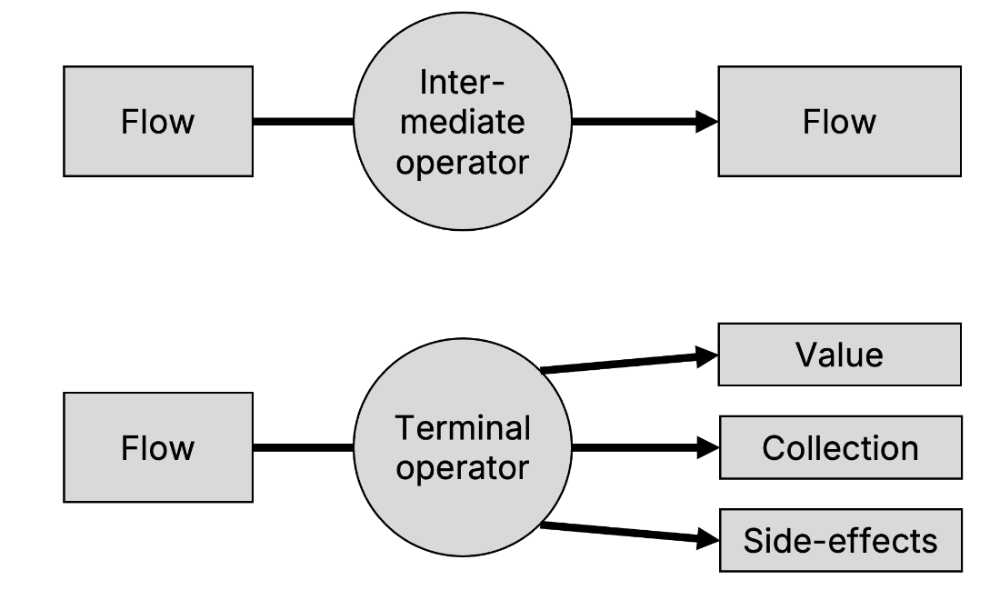
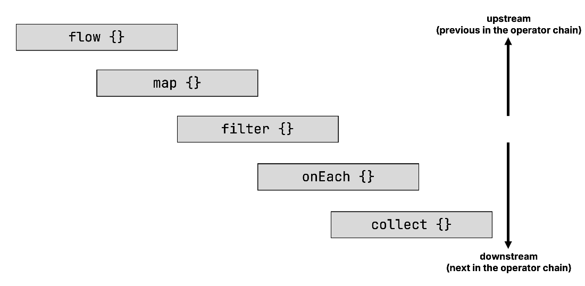
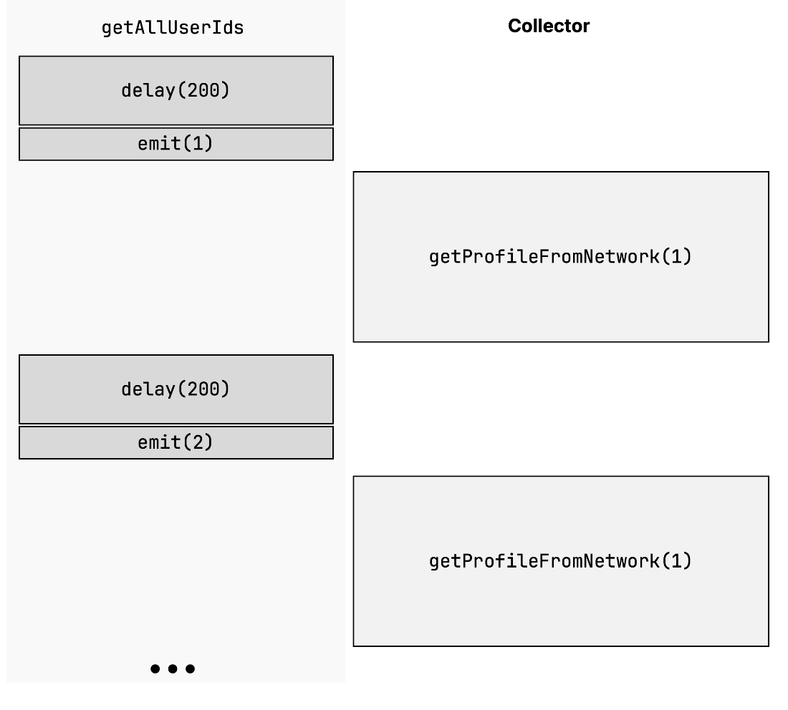
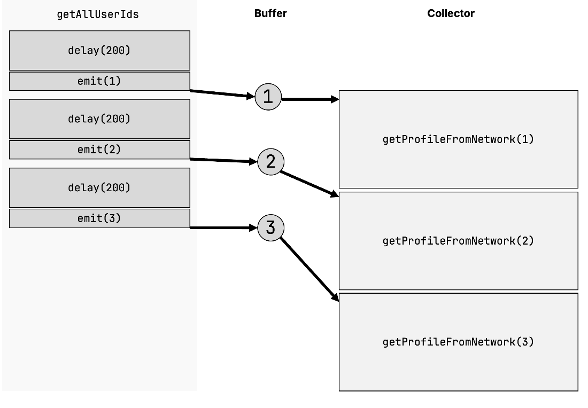

# 17 Flow operators

::: tip This chapter covers

- Operators used to transform and work with flows
- Intermediate and terminal operators
- Building custom flow operators
:::

## 17.1 Manipulating flows with flow operators

In the previous chapter, you have gotten to know flows as the higher-level abstraction that allows you to work with multiple, sequential values over time while leveraging Kotlin's concurrency machinery. In this chapter, we'll discuss how to manipulate and transform them. You've already seen that Kotlin provides a vast selection of operators that you can use to manipulate collections (as we've discussed in [Chapter 5](https://livebook.manning.com/book/kotlin-in-action-second-edition/chapter-5/v-15/programming_with_lambdas) and [Chapter 6](https://livebook.manning.com/book/kotlin-in-action-second-edition/chapter-6/v-15/id_working_with_collections_and_sequences)). Likewise, you can use operators to transform flows.

Just like with sequences, you distinguish between the *intermediate* flow operators and *terminal* flow operators, analogous to our discussion in [Section 6.2.1](https://livebook.manning.com/book/kotlin-in-action-second-edition/chapter-6/v-15/sequence_intermediate_and_terminal): Intermediate operators return another, modified flow, without actually running any of the code yet. Terminal operators return a result – like a collection, an individual element from the flow, a computed value, or no value at all – collecting the flow and executing the actual code.

::: info Figure 17.1 You distinguish between intermediate and terminal flow operators. Where intermediate operators return a modified flow, terminal operators return an actual result. They do so by executing the code in the flow.


:::

## 17.2 Intermediate operators are applied to an upstream flow and return a downstream flow

Intermediate operators are applied to a flow and return a flow themselves. To make it easier to talk about these flows in relation to operators, the names *upstream* and *downstream* flow are commonly used: You call the flow that is being operated on the *upstream* flow. The flow returned by an intermediate operator is called the *downstream flow*. In turn, this downstream flow can act as the upstream flow for the next operator, and so on. [Figure 17. 2](https://livebook.manning.com/book/kotlin-in-action-second-edition/chapter-17/v-15/11#up_down_graph) illustrates this. Just like with sequences, calling an intermediate operator on a flow doesn't run any code: The returned flow is *cold*.

::: info Figure 17.2 The terms "upstream" and "downstream" describe where an intermediate operator sits in the operator chain in relation to another operator. The flow that an operator is being called on is the upstream flow. The flow it returns is the downstream flow. In this example, `flow` is upstream of `map`, `filter` is downstream of `map`, `onEach` is upstream of `collect`, and so on.


:::

::: info NOTE

You may wonder what happens when you apply an intermediate operator to a hot flow. Indeed, even in this case, the behavior defined by your operator won't be executed until a terminal operator like `collect` is called to subscribe to the hot flow.
:::

The great news is that you already know a lot of intermediate operators that work with flows: A large part of the intermediate operators from sequences are available for Kotlin flows as well, including the most popular functions like `map`, `filter`, or `onEach`. They behave exactly as you would expect, just operating on the elements of a flow rather than a sequence or a collection. But there are also Flow operators that provide special behavior and functionality beyond what you already know. Let's focus on them, beginning with the `transform` operator.


### 17.2.1 Emitting arbitrary values for each upstream element: transform

Tyv eardlya nxow sbrr xqp azn kqz rpo `map` nifcnout xr croe sn erutasmp kfwl, ioydfm jrz tneeemsl, nqz return s xnw onwrtemsad lkwf – yfvteeilefc gintmeit c wnv eenltem kr xpr moesnadwtr fwlv txl svzd teeemln nj xgr mrapsuet vfwl:

::: info Listing 17.1 Mapping a flow

```kotlin
import kotlinx.coroutines.*
import kotlinx.coroutines.flow.*

fun main() {
    val names = flow {
        emit("Jo")
        emit("May")
        emit("Sue")
    }
    val uppercasedNames = names.map {
        it.uppercase()
    }
    runBlocking {
        uppercasedNames.collect { print("$it ")}
    }
    // JO MAY SUE
}
```
:::

However, you may find yourself in a situation where you want to emit more than one element: For example, rather than just emitting an uppercased variant of each name, you may also want to include an entirely lowercase variant of each name in the output stream as well. In Kotlin flows, you can do this via the `transform` function. It allows you to emit arbitrarily many elements to the downstream flow for each element in the upstream flow:

::: info Listing 17.2 Transforming a flow

```kotlin
import kotlinx.coroutines.*
import kotlinx.coroutines.flow.*

fun main() {
    val names = flow {
        emit("Jo")
        emit("May")
        emit("Sue")
    }
    val upperAndLowercasedNames = names.transform {
        emit(it.uppercase())
        emit(it.lowercase())
    }
    runBlocking {
        upperAndLowercasedNames.collect { print("$it ")}
    }
    // JO jo MAY may SUE sue
}
```
:::

For cases like these, where your initial flow simply emits a list of values which you then continue to transform via flow operators, you can also use a shorthand builder function for the flow called `flowOf`: `val names = flowOf("Jo", "May", "Sue")`.

### 17.2.2 The take operator family can cancel a flow

You already know functions like `takeWhile` from our discussion of sequences in [Section 6.2.2](https://livebook.manning.com/book/kotlin-in-action-second-edition/chapter-6/v-15/creating_sequences). You can use them the same way that you are used to in sequences. It's worth noting that when the conditions specified by the operator are no longer valid, the upstream flow gets canceled, meaning no further elements are emitted. For example, by calling `take(5)` in [Listing 17. 3](https://livebook.manning.com/book/kotlin-in-action-second-edition/chapter-17/v-15/20#take5) on the flow returned by `getTemperatures` as you declared it in [Listing 16.11](https://livebook.manning.com/book/kotlin-in-action-second-edition/chapter-16/v-15/gettempscold), the upstream flow will get canceled after five emissions.

::: info Listing 17.3 Using the `take` operator means the upstream flow is canceled after the specified number of elements was collected by the downstream flow.

```kotlin
fun main() = runBlocking {
    val temps = getTemperatures()
    temps
        .take(5) // 
        .collect {
            log(it)
        }
}

// 37 [main @coroutine#1] 7
// 568 [main @coroutine#1] 9
// 1123 [main @coroutine#1] 2
// 1640 [main @coroutine#1] -6
// 2148 [main @coroutine#1] 7
```
:::

Besides canceling the coroutine scope associated with the collector as you've seen in [Section 16.2.3](https://livebook.manning.com/book/kotlin-in-action-second-edition/chapter-16/v-15/cancel_flow), the `take` function is another way to cancel the collection of a flow in a controlled manner.

### 17.2.3 Hooking into flow phases with onStart, onEach, onCompletion, and onEmpty

To see that the flow from [Listing 17. 3](https://livebook.manning.com/book/kotlin-in-action-second-edition/chapter-17/v-15/28#take5) indeed completes after collecting five elements, you can use the `onCompletion` operator, with which you can provide a lambda that gets executed after the flow either terminates regularly, is canceled, or terminates with an exception (you'll learn how to handle exceptions in detail in [Chapter 18](https://livebook.manning.com/book/kotlin-in-action-second-edition/chapter-18/v-15/error_handling_and_testing)). You can modify the code from [Listing 17. 3](https://livebook.manning.com/book/kotlin-in-action-second-edition/chapter-17/v-15/28#take5) to notify the user that the collection has finished, either normally or with an exception. You can access the latter as a parameter for the lambda, allowing you to process it further:

```kotlin
fun main() = runBlocking {
    val temps = getTemperatures()
    temps
        .take(5)
        .onCompletion { cause ->
            if (cause != null) {
                println("An error occurred! $cause")
            } else {
                println("Completed!")
            }
        }
        .collect {
            println(it)
        }
}
```

`onCompletion` is part of a family of intermediate operators that allow you to perform at specific phases in the lifecycle of a flow: `onStart` is executed when the collection of the flow begins, even before the first emission happens. `onEach` performs an action on each emitted element of the upstream flow, before emitting it to the downstream flow. For the special case of having a flow that terminates without ever emitting any elements, you can add the `onEmpty` intermediate operator to perform additional logic, or some default elements.

Here, you're putting together the different operators in the `process` function to specify behavior for the beginning of the flow, the processing of each element, and the completion of the flow. You also specify a default case when an empty flow is processed:

::: info Listing 17.4 Running logic in different flow phases

```kotlin
suspend fun process(flow: Flow<Int>) {
    flow
        .onEmpty {
            println("Nothing - emitting default value!")
            emit(0)
        }
        .onStart {
            println("Starting!")
        }
        .onEach {
            println("On $it!")
        }
        .onCompletion {
            println("Done!")
        }
        .collect()
}
```
:::

Calling this function with an empty and non-empty flow respectively, you can see that the individual operators are invoked in the order of the flow lifecycle:

```kotlin
fun main() {
    runBlocking {
        process(flowOf(1, 2, 3))
        // Starting!
        // On 1!
        // On 2!
        // On 3!
        // Done!
        process(flowOf())
        // Starting!
        // Nothing – emitting default value!
        // On 0!
        // Done!
    }
}
```

This is a great example to once again illustrate that these intermediate operators emit elements into their downstream flow: If you move the `onEmpty` operator invocation further down the call-chain, for example, right before the call to `collect`, then you would not see the `On 0!` message. That is because `onEach` would be an upstream operator in relation to `onEmpty` – it won't receive any emissions made by the downstream operator.

### 17.2.4 Buffering elements for downstream operators and collectors: buffer

Real application code often does a lot of heavy lifting inside flows: When collecting the elements of a flow, or processing them with operators like `onEach`, you often find yourself calling suspending functions that take some time to complete. In this example, you simulate accessing a slow database to obtain a flow of user identifiers. Each user identifier is associated with a profile that's accessible via an even slower network resource:

```kotlin
fun getAllUserIds(): Flow<Int> {
    return flow {
        repeat(3) {
            delay(200.milliseconds) // Database latency
            log("Emitting!")
            emit(it)
        }
    }
}

suspend fun getProfileFromNetwork(id: Int): String {
    delay(2.seconds) // Network latency
    return "Profile[$id]"
}
```

Out of the box, when working with a cold flow such as the one above, the producer of values suspends its work until the collector has finished processing the previous element. You can observe this by calling the `getUserIds` function and calling `getProfileFromNetwork` for each element:

```kotlin
fun main() {
    val ids = getAllUserIds()
    runBlocking {
        ids
            .map { getProfileFromNetwork(it) }
            .collect { log("Got $it") }
    }
}

// 310 [main @coroutine#1] Emitting!
// 2402 [main @coroutine#1] Got Profile[0]
// 2661 [main @coroutine#1] Emitting!
// 4732 [main @coroutine#1] Got Profile[1]
// 5007 [main @coroutine#1] Emitting!
// 7048 [main @coroutine#1] Got Profile[2]
```

As you can see, emissions of IDs and the request of profiles are intertwined: When an element is emitted, the producer code doesn't continue until the downstream flow has finished processing the element. In this implementation, that means processing an individual element takes about 1.2 seconds. [Figure 17. 3](https://livebook.manning.com/book/kotlin-in-action-second-edition/chapter-17/v-15/40#nobufs) illustrates this.

::: info Figure 17.3 When the flow from `getAllUserIds` emits an item, the producer code doesn't continue until the downstream flow has finished processing the element.


:::

Even without doing more advanced optimizations like spawning new coroutines for the processing of each element in the flow, there is another observation you can make: If the producer were to be able to produce elements without having to wait for the collector to process them, you could make the execution of your flow faster.

Yabj jz axtlyce grws drx `buffer` petroora olalsw vdh rk pk: Jr otsndruice z fefbru nrkj ihchw etlnesme cna og ediemtt, kneo ehwli krd ramoedwstn flxw cj ltlsi zdpp ocsginreps peoryvisul meetitd eneteslm. Ycpj wasoll bkq er ifvecyetlfe uopeldec stpar le xhtp achni el srprtooea cqrr sscorpe c fwxl. Tg dgndai s frufbe jrwu c ycaciatp el rteeh stlemeen, rou remteit cns tiunocne icpndurgo won xdat ierensitifd bnz cplae mxrb nj vyr eurbff iltnu rgv ecrtloclo zj ydear kr xxzm tuehfrr etnkrow eqsutsre:

```kotlin
fun main() {
    val ids = getAllUserIds()
    runBlocking {
        ids
            .buffer(3)
            .map { getProfileFromNetwork(it) }
            .collect { log("Got $it") }
    }
}

// 304 [main @coroutine#2] Emitting!
// 525 [main @coroutine#2] Emitting!
// 796 [main @coroutine#2] Emitting!
// 2373 [main @coroutine#1] Got Profile[0]
// 4388 [main @coroutine#1] Got Profile[1]
// 6461 [main @coroutine#1] Got Profile[2]
```

Comparing the actual execution time between the two implementations, adding the buffer reduced the execution time: That's because the flow returned by `getAllUserIds` can keep emitting items into the buffer while the collector is working. [Figure 17. 4](https://livebook.manning.com/book/kotlin-in-action-second-edition/chapter-17/v-15/45#bufs_ch17) illustrates this.

::: info Figure 17.4 The `buffer` operator decouples the execution of the upstream flow from the downstream flow: the flow returned by `getAllUserIds` can keep emitting items into the buffer. The collector, which uses the retrieved IDs to call `getProfileFromNetwork`, can do so as elements become available, and at its own speed.


:::

Especially when the time needed to emit and process elements for your flow fluctuates, introducing buffers in your chain of operators can help you increase the throughput of your system: For example, you may be reading and processing input data of different size and complexity. The `buffer` operator is also highly customizable: besides the `size` parameter, it also provides a parameter `onBufferOverflow` that allows you to specify what should happen when the capacity of the buffer is exhausted: Whether the producer should suspend (`SUSPEND`), drop the oldest value that's in the buffer without suspending (`DROP_OLDEST`), or drop the latest value that is being added (`DROP_LATEST`).

### 17.2.5 Throwing away intermediate values: conflate

Another way of ensuring that a producer of values can work unhindered is to simply throw away any items emitted while the collector is busy. In Kotlin flows, you can do this via the `conflate` operator. Here, you're using together with the `getTemperatures` function from [Listing 16.11](https://livebook.manning.com/book/kotlin-in-action-second-edition/chapter-16/v-15/gettempscold), which reads the temperature in 500-millisecond intervals, to collect the flow every second. Looking at the output, you can see that the flow upstream of `conflate` contains all elements emitted by `getTemperatures`, while intermediate elements are discarded downstream in the collector:

::: info Listing 17.5 Using `conflate` to ignore intermediate values

```kotlin
fun main() {
    runBlocking {
        val temps = getTemperatures()
        temps
            .onEach {
                log("Read $it from sensor")
            }
            .conflate()
            .collect {
                log("Collected $it")
                delay(1.second)
            }
    }
}

// 43 [main @coroutine#2] Read 20 from sensor
// 51 [main @coroutine#1] Collected 20
// 558 [main @coroutine#2] Read -10 from sensor
// 1078 [main @coroutine#2] Read 3 from sensor
// 1294 [main @coroutine#1] Collected 3
// 1579 [main @coroutine#2] Read 13 from sensor
// 2153 [main @coroutine#2] Read 26 from sensor
// 2556 [main @coroutine#1] Collected 26
```
:::

Similarly to `buffer`, using `conflate` decouples the execution of the upstream flow from the execution of any downstream operators. When you work with a flow whose values become "out of date" quickly, being replaced by other emitted elements, conflation can help a slow collector keep up by processing only the latest elements in the flow.

### 17.2.6 Filtering out values on a timeout: debounce

In some scenarios, it might be useful to wait for a while before processing values in a flow. In this snippet, you're simulating a user typing a search query into a field by emitting an incrementally longer string whenever the user types something. Because users don't type instantaneously, but take some time to press the buttons, you add calls to `delay` to simulate the typing happening over time:

```kotlin
val searchQuery = flow {
    emit("K")
    delay(100.milliseconds)
    emit("Ko")
    delay(200.milliseconds)
    emit("Kotl")
    delay(500.milliseconds)
    emit("Kotlin")
}
```

Many applications want to provide "instant search functionality", where the user can type and see results without having to press an additional "search" button. If you were to collect this flow without any further processing, this would result in starting a new search request for each keystroke.

An often-used strategy is to wait for a while before actually starting the search process: While the user is still typing their query, no unnecessary search requests are made, but as soon as they stop typing for a period of time, results are displayed without any further action from the user. Using the `debounce` operator, this behavior is easy to implement in Kotlin coroutines: It only emits items into the downstream flow once a certain timeout has elapsed where the upstream hasn't emitted any items. By debouncing with a timeout of 250 milliseconds before collecting the `searchQuery` flow, only elements preceded by a pause of a quarter of a second are emitted into the downstream flow, and thus collected:

```kotlin
fun main() = runBlocking {
    searchQuery
        .debounce(250.milliseconds)
        .collect {
            log("Searching for $it")
        }
}

// 644 [main @coroutine#1] Searching for Kotl
// 876 [main @coroutine#1] Searching for Kotlin
```

### 17.2.7 Switching the coroutine context on which a flow is executed: flowOn

When your flow operators use blocking IO or need to work with the UI thread, the same considerations as with regular coroutines apply: The coroutine context decides where the logic of a flow is executed. By default, the collection process happens in the context in which `collect` has been invoked. But, as you have seen by now, you can build quite complex data processing pipelines using flows. You may want some parts of your processing pipeline to run on a different dispatcher, or with a different coroutine context. The `flowOn` operator allows you to do exactly that: Similar to the `withContext` function that you have gotten to know in [Section 14.7.3](https://livebook.manning.com/book/kotlin-in-action-second-edition/chapter-14/v-15/withContext), it adjusts the coroutine context. Here, you're using it to switch between the dispatcher of `runBlocking`, the default dispatcher, and the IO dispatcher:

::: info Listing 17.6 Switching dispatchers via `flowOn`

```kotlin
fun main() {
    runBlocking {
        flowOf(1)
            .onEach { log("A") }
            .flowOn(Dispatchers.Default)
            .onEach { log("B") }
            .flowOn(Dispatchers.IO)
            .onEach { log("C") }
            .collect()
    }
}

// 36 [DefaultDispatcher-worker-3 @coroutine#3] A
// 44 [DefaultDispatcher-worker-1 @coroutine#2] B
// 44 [main @coroutine#1] C
```
:::

It's important to note that the `flowOn` operator only affects the dispatcher of the upstream flow, that is, the flow (and any intermediate operators) that come before the invocation of `flowOn`. The downstream flow remains untouched, which is why this operator is also referred to as being *context preserving*: Switching the dispatcher to `Dispatchers.Default` only affects "A", the switch to `Dispatchers.IO` only affects "B", and "C" is not affected by the preceding invocations of `flowOn` at all.

## 17.3 Creating custom intermediate operators

As you can tell, the Kotlin coroutines library already comes with a large selection of operators that allow you to manipulate flows. But how do these operators work internally, and how can you create your own, custom intermediate operators?

Generally, an intermediate operator acts as a collector and emitter at the same time: It collects the elements from its upstream flow, performs transformations, side effects, or other custom behavior, and then emits new elements into the downstream flow. You already know all these individual pieces: Collecting elements from an upstream flow is done via `collect`, and you can create a new downstream flow by using the `flow` builder function. Because you only call `collect` on your upstream flow from within the `flow` builder, you ensure that the operator is still cold: Only when another function calls `collect` on the flow returned by your operator, the collection of the upstream flow will be triggered in turn.

For example, you could implement an operator that computes the average of the last `n` elements in a flow of doubles. To do so, your operator internally keeps track of a list of numbers that have occurred, and emits the average of the encountered values:

```kotlin
fun Flow<Double>.averageOfLast(n: Int): Flow<Double> =
    flow {
        val numbers = mutableListOf<Double>()
        collect {
            if (numbers.size >= n) {
                numbers.removeFirst()
            }
            numbers.add(it)
            emit(numbers.average())
        }
    }
```

Just like any other intermediate operator, you can then invoke this operator on an upstream flow, and collect its downstream flow:

```kotlin
fun main() = runBlocking {
    flowOf(1.0, 2.0, 30.0, 121.0)
        .averageOfLast(3)
        .collect {
            print("$it ")
        }
}
// 1.0 1.5 11.0 51.0
```

Most standard operators in the Kotlin coroutines library follow a similar pattern, although they often also contain additional code for the purposes of performance optimization, which helps multiple chained operators perform more efficiently. This is merely an implementation detail – these optimizations happen entirely under the hood, and without changing the behavior of your code.

## 17.4 Terminal operators execute the upstream flow and may compute a value

While intermediate operators transform a given flow into another flow, they don't actually execute any code themselves – this is triggered by the *terminal operators*. Terminal operators either compute a single value, a collection of values, or just trigger the execution of the flow, performing computations and side-effects as specified. You've already seen the most common terminal operator: `collect`. It provides the useful shorthand of specifying a lambda that will be executed on each element in the flow. Now that you have seen the available intermediate operators, you can probably gather that it is equivalent to calling `onEach` before invoking `collect` without any parameters:

```kotlin
fun main() = runBlocking {
    getTemperatures()
        .onEach {
            log(it)
        }
        .collect()
}
```

Because terminal operators are responsible for executing the upstream flows, they are always suspending functions: Calling `collect` always suspends until the entire flow has been collected (or until the coroutine scope in which `collect` is called is canceled). Other terminal operators, like `first` or `firstOrNull`, can cancel the upstream flow after receiving an element, just like you have already seen with intermediate operators in [Section 172.2](https://livebook.manning.com/book/kotlin-in-action-second-edition/chapter-17/v-15/73#take_operators). For example, if you're only interested in an individual reading from your temperature sensor, you can use the `first` terminal operator, or its sibling function `firstOrNull` to obtain a single value:

```kotlin
fun main() = runBlocking {
    getTemperatures()
        .first()
}
```

### 17.4.1 Frameworks provide custom operators

Certain frameworks in the Kotlin ecosystem also provide direct integrations with flows and expose custom operators and conversion functions. For example, the Android UI framework Jetpack Compose from Google, as well as its sibling project Compose Multiplatform from JetBrains, allow you to convert Kotlin flows into `State` objects, which are used by the machinery of the UI framework to trigger the recomposition of the user interface, redrawing elements that have changed. In this snippet, you're using the `collectAsState` function to convert a flow of integers passed as an argument to create a state object. Just like with state flows, the `State` objects from Compose expect an initial value, which you can set to `null` to indicate the absence of a value. You can then use the `temperature` variable in the Compose DSL to describe a component of a user interface. In this case, you simply put a text field inside a box:

```kotlin
@Composable fun TemperatureDisplay(temps: Flow<Int>) {
    val temperature = temps.collectAsState(null)
    Box {
        temperature.value?.let {
            Text("The current temperature is $it!")
        }
    }
}
```

Flows are a powerful addition to your coroutines-based toolkit, and you've seen how they can help you write elegant code that processes values over time. In the next chapter, we're going to take a look at how errors are propagated and handled in coroutines-based applications, and will take a closer look at how you can test your concurrent code.

## 17.5 Summary

- Intermediate operators are used to transform flows into other flows: They operate on an *upstream* flow and return a *downstream* flow. Intermediate operators are cold: They are not executed until a terminal operator is called.
- A large portion of the intermediate operators available for sequences are also available directly for you to use with flows. Flows also provide additional intermediate operators that allow you to perform transformations (`transform`), manage the context in which a flow is executed (`flowOn`), and run code at specific phases during the execution of a flow (`onStart`, `onCompletion`, …)
- Terminal operators like `collect` run the code of a flow or, in the case of hot flows, take care of subscribing to the flow.
- You can build your own operators by collecting a flow from within another flow builder, emitting transformed elements from it.
- External frameworks like Jetpack Compose and Compose Multiplatform provide direct integration with Kotlin flows.

