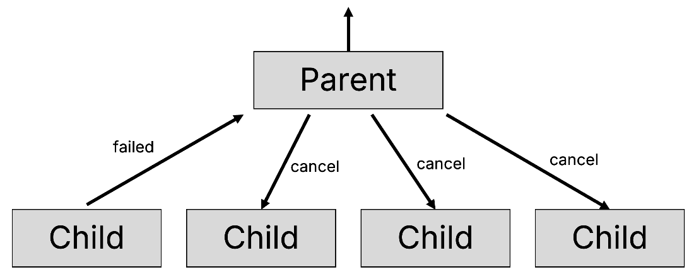
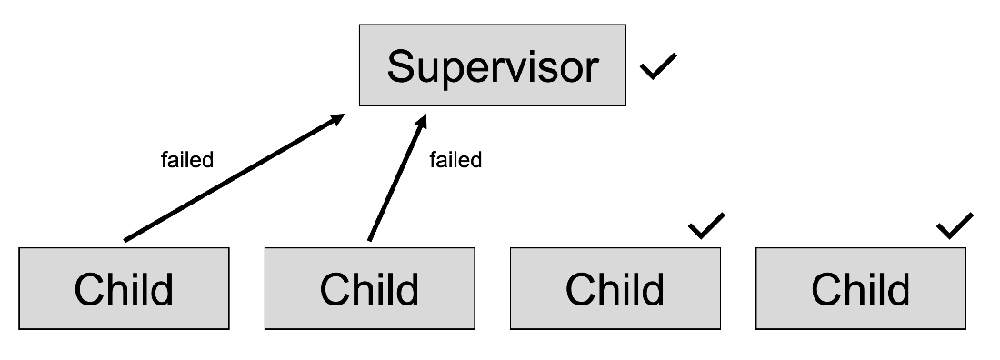
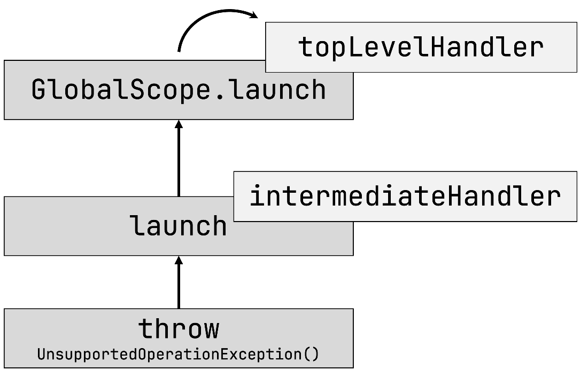
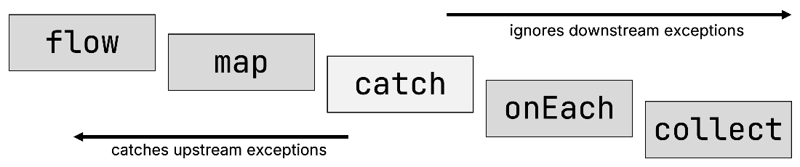

# 18 Error handling and testing

::: tip This chapter covers

- Controlling the behavior of your code in the face of errors and exceptions
- How error handling relates to the concept of structured concurrency
- Writing code that behaves correctly when parts of your system fail
- Writing unit tests for concurrent Kotlin code
- Using the specialty test dispatcher to speed up test execution and testing fine-grained concurrency constraints
- Testing flows with the Turbine library
:::

Over the last few chapters, you've gotten an overview of the different aspects involved when writing concurrent code with Kotlin coroutines. In order to ensure the robustness of your applications, there is one more aspect that needs to be covered: How does your code behave when things go wrong?

Working with concurrent applications is an inherently complex task: Likely, you'll have many moving parts in your system that interact with each other. Beyond that, your application likely also interacts with other systems that are out of your control. These systems may fail, or your connection to these services may be unreliable. However, even in these situations, your application should work well. One of the key aspects that enables this is proper error handling – implementing appropriate mechanisms to handle problems gracefully.

When working with Kotlin coroutines, the subject of error handling is deeply intertwined with the concept of structured concurrency, which you already explored in [Chapter 15](https://livebook.manning.com/book/kotlin-in-action-second-edition/chapter-15/v-15/structured_concurrency). You'll spend the first half of this chapter learning more about how uncaught exceptions are handled and propagated along your hierarchy of coroutines, how errors are handled in flows, and what tools are at your disposal to control this behavior.

Another aspect of building robust software is testing. While many books could be filled with testing strategies and approaches for general application code, you'll spend the second half of this chapter taking a closer look at how to specifically test code written using Kotlin coroutines, learning about the specialty features of running tests with virtual time, and conveniently writing tests for flows using the Turbine library.

By the end of this chapter, you'll have a better understanding of how error propagation works, how you can deal with errors in flows and coroutines, and understand the mechanics of writing tests for your concurrent code.


## 18.1 Handling errors thrown inside coroutines

Just like any other Kotlin code, code written inside suspending functions or a coroutine builder might throw an exception. In order to handle such exceptions, it may be tempting to surround a `launch` or `async` invocation with try-catch. However, this wouldn't work: Remember that these are *coroutine builder functions*: they create a new coroutine to be executed. Exceptions thrown in these new coroutines won't be caught by your `catch` block (just like, for example, exceptions thrown in a newly created thread wouldn't be caught by the code creating the thread.) So, code like this, where an `UnsupportedOperationException` is thrown from within a `launch` builder, will not catch the exception:

```kotlin
import kotlinx.coroutines.*

fun main(): Unit = runBlocking {
    try {
        launch {
            throw UnsupportedOperationException("Ouch!")
        }
    } catch (u: UnsupportedOperationException) {
        println("Handled $u") // 
    }
}
// Exception in thread "main" java.lang.UnsupportedOperationException: Ouch!
//  at MyExampleKt$main$1$1.invokeSuspend(MyExample.kt:6)
//       …
```

One way to properly catch this exception is to move the try-catch block inside the block associated with `launch`. In this case, the exception doesn't cross coroutine boundaries, and you can deal with it in the same way you would if no coroutines were involved at all (Later in this chapter, in [Section 182.3](https://livebook.manning.com/book/kotlin-in-action-second-edition/chapter-18/v-15/12#supervisors_prevent_cancellation) and [Section 183](https://livebook.manning.com/book/kotlin-in-action-second-edition/chapter-18/v-15/12#coroutine_exception_handler), you'll also see how uncaught exceptions that are thrown from coroutines can be handled automatically without crashing the whole application):

```kotlin
import kotlinx.coroutines.*

fun main(): Unit = runBlocking {
    launch {
        try {
            throw UnsupportedOperationException("Ouch!")
        } catch (u: UnsupportedOperationException) {
            println("Handled $u")
        }
    }
}
// Handled java.lang.UnsupportedOperationException: Ouch!
```

If a coroutine created using `async` throws an exception, calling `await` on its result rethrows this exception. That's because `await` can't return a meaningful value of the expected type and therefore needs to throw an exception. [Listing 18. 1](https://livebook.manning.com/book/kotlin-in-action-second-edition/chapter-18/v-15/20#async_await_exception) illustrates this. You originally expected `myDeferredInt.await()` to return an integer value, but since an exception was thrown inside the `async` coroutine computing this value, `await()` rethrows the exception. You catch it by surrounding `await()` with a `try-catch` block:

::: info Listing 18.1 An async coroutine that throws an exception

```kotlin
import kotlinx.coroutines.*

fun main(): Unit = runBlocking {
    val myDeferredInt: Deferred<Int> = async {
        throw UnsupportedOperationException("Ouch!")
    }
    try {
        val i: Int = myDeferredInt.await()
        println(i)
    } catch (u: UnsupportedOperationException) {
        println("Handled: $u")
    }
}
```
:::

When running this example, you observe that the exception was caught by the try-catch surrounding `await()`. But curiously, it was also printed to the error console at the same time:

```
Handled: java.lang.UnsupportedOperationException: Ouch!
Exception in thread "main" java.lang.UnsupportedOperationException: Ouch!
    at MyExampleKt$main$1$myDeferred$1.invokeSuspend(MyExample.kt:6)
     ...
```

That's because `await` *rethrows* the exception, but you observe the original exception, as well. In this example, `async` propagates the exception to its parent coroutine, created using `runBlocking`, which prints it to the error console and crashes the program.

A child coroutine always *propagates* an uncaught exception to its parent. That means it becomes the responsibility of the parent to handle this exception. Just like in real life, the children pass their problems on to their parents if they don't know how to handle them themselves (or if it's simply more convenient to do so). In the next sections, you'll take a more detailed look at error propagation, and learn about different ways of how the parent coroutine can handle uncaught errors from its children.

## 18.2 Error propagation in Kotlin coroutines

When you were first introduced to structured concurrency in [Chapter 15](https://livebook.manning.com/book/kotlin-in-action-second-edition/chapter-15/v-15/structured_concurrency), we briefly mentioned that besides cancellation, one of the major responsibilities of this concept is handling errors. The structured concurrency paradigm influences what happens with the parent coroutine when a child coroutine throws an uncaught exception. There are two conceptual ways for dividing work between children, and therefore two ways of handling errors from children. They differ in whether a failure of one child should lead to failure of the parent:

- If coroutines are used for *concurrent decomposition of work*, the failure of one child means that it's no longer possible to get the final result. The parent coroutine should complete as well with the exception, and other children still working get canceled to avoid producing results that are no longer needed. The failure of one child leads to failure of the parent.
- The second case is when the failure of one child doesn't lead to common failure. We say that a parent is *supervising* execution of their children, when the failure of one child must be handled by the parent and shouldn't lead to the whole system crash. Typically, such supervising coroutines live at the top of the coroutine hierarchy. For example, a server process may start multiple child jobs and needs to supervise their execution. Or a UI component that should stay alive even if fetching the latest data fails. In this scenario, the failure of one child does not lead to the failure of the parent.

In Kotlin coroutines, the way how the child coroutines are handled by the parent depends on whether the parent coroutine has a regular `Job` (child failure leads to the common failure) or `SupervisorJob` (parent is supervising its children) in its coroutine context. In the next sections, you'll see this difference in detail.


### 18.2.1 Coroutines cancel all their children when one child fails

When examining coroutine contexts in [Section 14.8](https://livebook.manning.com/book/kotlin-in-action-second-edition/chapter-14/v-15/coroutine_context), you learned that under the hood, the parent-child hierarchy between coroutines is built via `Job` objects. As such, if a coroutine isn't explicitly created with `SupervisorJob` to become a supervisor, the default way an uncaught exception from one of the child coroutines is handled is to complete the parent with the exception.

A failed child coroutine propagates its failure to its parent. The parent then does the following:

- It cancels all of its other children to avoid unnecessary work.
- It completes its own execution with the same exception.
- It propagates the exception further up the hierarchy.

This process is illustrated by [Figure 18. 1](https://livebook.manning.com/book/kotlin-in-action-second-edition/chapter-18/v-15/35#child_cancels_parent).

::: info Figure 18.1 When child coroutines fail with an uncaught exception, they notify their parent. The parent, in turn, cancels all the sibling coroutines, and propagates the exception further up the coroutine hierarchy.


:::

This behavior is different from comparable primitives in other languages (for example, a goroutine in Go has no such behavior). Usually, this convenient cancellation of other "sibling" tasks on one task failure isn't provided out of the box, and has to be implemented by hand, but is one of the big benefits of Kotlin coroutines.

This behavior is very useful for coroutines grouped under the same scope that work together to perform computations concurrently and then return a common result: When one of the coroutines within the scope fails with an uncaught exception — that is, it encounters a problem it doesn't know how to recover from by itself — the assumption is that the common result can no longer be reasonably computed. To prevent the sibling coroutines from continuing now-useless computations or holding onto resources in such a situation, they are canceled. This avoids unnecessary work, and releases their resources.

Consider [Listing 18. 2](https://livebook.manning.com/book/kotlin-in-action-second-edition/chapter-18/v-15/40#heartbeat_launch), where you create two coroutines. The first coroutine acts as a "heartbeat" coroutine, which simply loops and prints a message on an interval. If an exception occurs, this coroutine terminates by printing the exception and rethrowing it. The second coroutine throws an exception after one second which is not handled:

::: info Listing 18.2 Starting two coroutines: A heartbeat coroutine that keeps looping, and another coroutine that throws an exception.

```kotlin
import kotlinx.coroutines.*
import kotlin.time.Duration.Companion.milliseconds
import kotlin.time.Duration.Companion.seconds

fun main(): Unit = runBlocking {
    launch {
        try {
            while (true) {
                println("Heartbeat!")
                delay(500.milliseconds)
            }
        } catch (e: Exception) {
            println("Heartbeat terminated: $e")
            throw e
        }
    }
    launch {
        delay(1.seconds)
        throw UnsupportedOperationException("Ow!")
    }
}
```
:::

As you can see in the output, the moment a sibling coroutine throws an exception, the heartbeat coroutine is also canceled:

```
Heartbeat!
Heartbeat!
Heartbeat terminated: kotlinx.coroutines.JobCancellationException:
    Parent job is Cancelling; job=BlockingCoroutine{Cancelling}@1517365b
Exception in thread "main" java.lang.UnsupportedOperationException: Ow!
```

By default, all coroutine builders, including `runBlocking` in this example, create a regular, non-supervisor coroutine. That's why when one coroutine terminates with an uncaught exception, the other child coroutines also get canceled.

This behavior of error propagation affects all coroutines, not just those started with `launch`. Starting a new child coroutine with `async` exhibits the same behavior: it propagates its uncaught exception to the parent. Replacing `launch` with `async` in this example also causes the sibling coroutine to be canceled.

### 18.2.2 Structured concurrency only affects exceptions thrown across coroutine boundaries

This behavior of canceling sibling coroutines and propagating the exception up the hierarchy of coroutines only affects uncaught exceptions that cross coroutine boundaries. Because of this, the easiest approach to avoid having to deal with this behavior is to avoid throwing exceptions across these boundaries in the first place. A try-catch block that is confined to a single coroutine (for example, inside the body of a suspending function) will behave exactly as you would expect it. You can rewrite [Listing 18. 2](https://livebook.manning.com/book/kotlin-in-action-second-edition/chapter-18/v-15/48#heartbeat_launch) to catch the `UnsupportedOperationException` itself:

::: info Listing 18.3 Catching the exception inside the coroutine

```kotlin
import kotlinx.coroutines.*
import kotlin.time.Duration.Companion.milliseconds
import kotlin.time.Duration.Companion.seconds

fun main(): Unit = runBlocking {
    launch {
        try {
            while (true) {
                println("Heartbeat!")
                delay(500.milliseconds)
            }
        } catch (e: Exception) {
            println("Heartbeat terminated: $e")
            throw e
        }
    }
    launch {
        try {
            delay(1.seconds)
            throw UnsupportedOperationException("Ow!")
        } catch(u: UnsupportedOperationException) {
            println("Caught $u")
        }
    }
}
```
:::

With this change in place, you can see that the heartbeat coroutine keeps printing its text, even after the exception was thrown:

```
Heartbeat!
Heartbeat!
Caught java.lang.UnsupportedOperationException: Ow!
Heartbeat!
Heartbeat!
...
```

::: info NOTE

It's worth reminding yourself again of what you learned in [Section 15.3.4](https://livebook.manning.com/book/kotlin-in-action-second-edition/chapter-15/v-15/dont-catch-cancel): it's important to be mindful of cancellation exceptions and their supertypes whenever you're catching exceptions in coroutines. Since cancellations are a natural part of the coroutine lifecycle, these exceptions shouldn't be swallowed by your code. Instead, they should either not be caught in the first place, or rethrown.
:::

The propagation of uncaught exceptions up the hierarchy of coroutines, and the cancellation of sibling coroutines that comes with it, helps enforce the paradigm of structured concurrency in your app. But of course, a single uncaught exception shouldn't tear down your entire application. Instead, you want to be able to define boundaries for this error propagation. In Kotlin coroutines, you can do so using supervisors.


### 18.2.3 Supervisors prevent parents and siblings from being canceled

Supervisors survive the failure of their children. Unlike scopes that use regular jobs, supervisors don't fail when some of their children report a failure. They don't cancel their other child coroutines, and don't propagate the exception further up the structured concurrency hierarchy. Because of this, you'll also often find supervisors as the root coroutine, the topmost coroutine in a coroutine hierarchy.

::: info Figure 18.2 When one or more child coroutines of a supervisor fail, the sibling and parent coroutines all keep on working. The exception is no longer propagated further.


:::

For a coroutine to act as a supervisor for its children, the job associated with it should be a `SupervisorJob` instead of a regular `Job`. It takes the same role, but prevents the propagation of exceptions to parents and doesn't trigger the cancellation of other child jobs as a response. Of course, supervisors still participate in structured concurrency: They can still be canceled, and still propagate cancellation exceptions correctly.

To see the supervisor behavior for yourself, you can create a scope via the `supervisorScope` function. It's analogous to the `coroutineScope` function you explored in [Section 15.2.1](https://livebook.manning.com/book/kotlin-in-action-second-edition/chapter-15/v-15/creating_a_coroutine_scope), but has a key difference: When one of its child coroutines fails, no sibling coroutines are terminated, and the uncaught exception isn't propagated further. Instead, both the parent coroutine and the sibling coroutines keep working. So, to fix [Listing 18. 2](https://livebook.manning.com/book/kotlin-in-action-second-edition/chapter-18/v-15/54#heartbeat_launch) and keep the heartbeat coroutine running, you can wrap the invocations of `launch` in a `supervisorScope`:

::: info Listing 18.4 Using a supervisor scope to stop the exception from propagating further

```kotlin
import kotlinx.coroutines.*
import kotlin.time.Duration.Companion.milliseconds
import kotlin.time.Duration.Companion.seconds

fun main(): Unit = runBlocking {
    supervisorScope {
        launch {
            try {
                while (true) {
                    println("Heartbeat!")
                    delay(500.milliseconds)
                }
            } catch (e: Exception) {
                println("Heartbeat terminated: $e")
                throw e
            }
        }
        launch {
            delay(1.seconds)
            throw UnsupportedOperationException("Ow!")
        }
    }
}
```
:::

Running this code, you'll notice that the heartbeat coroutine continues working even after the exception was thrown: The supervisor has effectively prevented the child from canceling the parent coroutine. ([Figure 18. 2](https://livebook.manning.com/book/kotlin-in-action-second-edition/chapter-18/v-15/56#supervisors_stay_alive) illustrates this, as well):

```
Heartbeat!
Heartbeat!
Exception in thread "main" java.lang.UnsupportedOperationException: Ow!
...
Heartbeat!
Heartbeat!
...
```

How come you can see the exception even though the application keeps running? That's because the `SupervisorJob` invokes the `CoroutineExceptionHandler` for child coroutines that were started using the `launch` builder (you'll dive deeper into this topic in [Section 183](https://livebook.manning.com/book/kotlin-in-action-second-edition/chapter-18/v-15/62#coroutine_exception_handler) and [Section 183.1](https://livebook.manning.com/book/kotlin-in-action-second-edition/chapter-18/v-15/62#ceh_launch_async_diff)).

Coroutine-aware frameworks often provide coroutine scopes out of the box that act as supervisors, for example Ktor's `Application` scope: The `Application` object can be used to start coroutines that run for longer than the lifetime of an individual request handler — these coroutines can live as long as the entire Ktor application. It also acts as a supervisor: That's because a single uncaught exception in a coroutine shouldn't tear down the whole application. Compare this to the `PipelineContext` in Ktor, which is responsible for coroutines living as long as a single request handler. Because the assumption is that multiple coroutines in the `PipelineContext` work together to compute a result (the response to the received request), a coroutine failing with an uncaught exception means no sensible result can be computed anymore – the other coroutines associated with this particular request are canceled.

Supervisors tend to live "higher up" in the hierarchy of coroutines in your application. They're often used to associate coroutines with long-living parts of your software, such as the overall lifetime of an application or the time a window or view is visible to the user. Fine-grained functions typically don't make use of supervisors: After all, having your unnecessary work canceled is a desirable property of error propagation in coroutines.

## 18.3 CoroutineExceptionHandler: the last resort for processing exceptions

Child coroutines propagate uncaught exceptions to their parents until the exception encounters a supervisor, or until the exception reaches the top of the hierarchy – a root coroutine without a parent. At this point, the uncaught exception will go to a special handler, called the `CoroutineExceptionHandler`, which is part of the coroutine context. If no coroutine exception handler is present in the context, the uncaught exception goes to the system-wide exception handler.

::: info NOTE

The system-wide exception handler is different between pure JVM projects and Android projects. In a pure JVM project, the handler simply prints the exception stack trace to the error console (as per the JVM's `UncaughtExceptionHandler`). On Android, the system-wide exception handler **crashes your app**.
:::

You can customize the behavior of handling uncaught exceptions by providing such a `CoroutineExceptionHandler` in the coroutine context. Kotlin frameworks can provide a coroutine exception handler on their own: The server-side framework Ktor, for example, uses a `CoroutineExceptionHandler` to send a string representation of uncaught exceptions to its logging provider. Android's `ViewModel`, on the other hand, does not specify a `CoroutineExceptionHandler` in the context of the `SupervisorJob` associated with a `viewModelScope`. This means that uncaught exceptions from coroutines started using `launch` on the `viewModelScope` will result in a crash of your app (you'll learn a bit more about the details in [Section 183.1](https://livebook.manning.com/book/kotlin-in-action-second-edition/chapter-18/v-15/69#ceh_launch_async_diff)).

The definition of this handler is quite simple: it receives the coroutine context as well as the uncaught exception as parameters to a lambda. This coroutine exception handler, for example, logs the uncaught exception with a custom prefix to the console:

```kotlin
val exceptionHandler = CoroutineExceptionHandler { context, exception ->
    println("[ERROR] $exception")
}
```

`CoroutineExceptionHandler` is a `CoroutineContext` element, which can be added to the coroutine context. In this example, you create a `ComponentWithScope` which defines a scope with a `SupervisorJob` to make it a supervisor (you've previously seen this way of creating a coroutine scope in [Section 15.2.2](https://livebook.manning.com/book/kotlin-in-action-second-edition/chapter-15/v-15/capital_c_coroutinescope)). You also specify your custom exception handler as an element of the coroutine context. To test the behavior, you also start a coroutine which throws an exception:

::: info Listing 18.5 A component with a custom coroutine exception handler

```kotlin
123456789101112131415161718192021222324import kotlinx.coroutines.*
import kotlin.time.Duration.Companion.seconds

class ComponentWithScope(dispatcher: CoroutineDispatcher =
       Dispatchers.Default) {
    private val exceptionHandler = CoroutineExceptionHandler { _, e ->
       println("[ERROR] ${e.message}")
    }

    private val scope = CoroutineScope(
        SupervisorJob() + dispatcher + exceptionHandler
    )

    fun action() = scope.launch {
       throw UnsupportedOperationException("Ouch!")
    }
}


fun main() = runBlocking {
    val supervisor = ComponentWithScope()
    supervisor.action()
    delay(1.seconds)
}
```
:::

The output shows that the exception is handled by the custom exception handler:

```
[ERROR] Ouch!
```

::: info NOTE

Under the hood, the direct children of the supervisor technically handle the exceptions themselves by passing them to the custom coroutine exception handler in the context if it's available, or to the default one. For simplicity, you can think of it as the supervisor taking care of the exceptions from its children. Coroutine exception handlers are also only invoked when the topmost coroutine in the hierarchy was started using the `launch` builder – more on that in [Section 183.1](https://livebook.manning.com/book/kotlin-in-action-second-edition/chapter-18/v-15/77#ceh_launch_async_diff).
:::

It's worth reiterating once again that child coroutines, so coroutines that are started on a coroutine scope or from another coroutine, delegate handling of uncaught exceptions to their parent. This parent, in turn, delegates this handling further, all the way until the root of the hierarchy. In turn, that means there is no such thing as an "intermediate" `CoroutineExceptionHandler`: Handlers installed in the contexts of coroutines that aren't root coroutines are never used.

[Listing 18. 6](https://livebook.manning.com/book/kotlin-in-action-second-edition/chapter-18/v-15/77#no_interm) demonstrates this: You create a root coroutine via the delicate `GlobalScope.launch` API, as discussed in [Section 15.2.3](https://livebook.manning.com/book/kotlin-in-action-second-edition/chapter-15/v-15/danger_globalscope) and provide a custom coroutine exception handler as a part of its context. You also provide an intermediate exception handler to the `launch` coroutine. Running this code, you'll see that the only coroutine exception handler invoked is the one at the top of the hierarchy – the intermediate one doesn't get used:

::: info Listing 18.6 Only the coroutine exception handler at the top of the coroutines hierarchy is invoked.

```kotlin
import kotlinx.coroutines.*

private val topLevelHandler = CoroutineExceptionHandler { _, e ->
    println("[TOP] ${e.message}")
}

private val intermediateHandler = CoroutineExceptionHandler { _, e ->
    println("[INTERMEDIATE] ${e.message}")
}

@OptIn(DelicateCoroutinesApi::class) // 
fun main() {
    GlobalScope.launch(topLevelHandler) {
        launch(intermediateHandler) {
            throw UnsupportedOperationException("Ouch!")
        }
    }
    Thread.sleep(1000)
}
// [TOP] Ouch!
```
:::

This is because the exception can still be propagated further, to the parent coroutine. [Figure 18. 3](https://livebook.manning.com/book/kotlin-in-action-second-edition/chapter-18/v-15/77#toplevelhandler) illustrates this.

::: info Figure 18.3 Even though the intermediate call to `launch` has a coroutine exception handler in its coroutine context, it's not a root coroutine. Therefore, the exception continues to be propagated along the hierarchy of coroutines. Only the exception handler at the root coroutine (here `GlobalScope.launch`) is invoked.


:::

### 18.3.1 Differences when using CoroutineExceptionHandler with launch or async

When looking at the `CoroutineExceptionHandler` (whether that's the default handler, or a custom one), it's important to note that the exception handler only gets called when the topmost coroutine in your hierarchy was created with `launch`. Having an `async` as the topmost coroutine means the `CoroutineExceptionHandler` is not invoked.

The following two examples illustrate this. In the first one, you're starting a coroutine with `launch`, which internally starts an additional coroutine using `async`. As discussed prior, when the topmost coroutine under the supervisor was started using `launch`, the `CoroutineExceptionHandler` is invoked:

```kotlin
import kotlinx.coroutines.*
import kotlin.time.Duration.Companion.seconds

class ComponentWithScope(dispatcher: CoroutineDispatcher =
        Dispatchers.Default) {
    private val exceptionHandler = CoroutineExceptionHandler { _, e ->
        println("[ERROR] ${e.message}")
    }

    private val scope = CoroutineScope(SupervisorJob() +
        dispatcher + exceptionHandler)

    fun action() = scope.launch {
        async {
            throw UnsupportedOperationException("Ouch!")
        }
    }
}

fun main() = runBlocking {
    val supervisor = ComponentWithScope()
    supervisor.action()
    delay(1.seconds)
}

// [ERROR] Ouch!
```

When you alter the implementation of `action` so that the outer coroutine is started using `async`, you won't see the coroutine exception handler invoked:

::: info Listing 18.7 An `async` coroutine that throws an exception as the direct child of a supervisor

```kotlin
import kotlinx.coroutines.*
import kotlin.time.Duration.Companion.seconds

class ComponentWithScope(dispatcher: CoroutineDispatcher =
         Dispatchers.Default) {
    private val exceptionHandler = CoroutineExceptionHandler { _, e ->
        println("[ERROR] ${e.message}")
    }


    private val scope = CoroutineScope(SupervisorJob() + dispatcher +
         exceptionHandler)


    fun action() = scope.async { // 
        launch {
            throw UnsupportedOperationException("Ouch!")
        }
    }
}


fun main() = runBlocking {
    val supervisor = ComponentWithScope()
    supervisor.action()
    delay(1.seconds)
}
// No output is printed
```
:::

The reasoning for this is the following: when the topmost coroutine is started using `async`, then it becomes the responsibility of the consumer of the `Deferred` to handle this exception by calling `await()` – the coroutine exception handler can ignore this exception, and the calling code, which works with the`Deferred` can wrap its `await` invocation in a try-catch block. It's important to note that this doesn't affect the *cancellation* of coroutines, though: if the `scope` in the above example didn't have a `SupervisorJob` installed in its context, then this uncaught exception would have still triggered the cancellation of all other coroutines that are children of `scope`.

So far, the discussion of error handling has been limited to coroutines. But what about handling errors when using flows? Let's take a closer look at this subject next.


## 18.4 Handling errors in flows

Just like regular Kotlin functions or suspending functions, flows can also throw exceptions. [Listing 18. 8](https://livebook.manning.com/book/kotlin-in-action-second-edition/chapter-18/v-15/93#broken_flow) illustrates this: When collected, this flow will emit five elements (the numbers 0 through 4), and then throw a custom exception called `UnhappyFlowException`:

::: info Listing 18.8 A flow that throws an exception after emitting five numbers.

```kotlin
import kotlinx.coroutines.*
import kotlinx.coroutines.flow.*

class UnhappyFlowException: Exception()

val exceptionalFlow = flow {
    repeat(5) { number ->
        emit(number)
    }
    throw UnhappyFlowException()
}
```
:::

Generally speaking, if an exception occurs during any part of a flow – while it's being created, transformed, or collected – the exception is thrown from `collect`. That means you can surround the call to `collect` with a `try-catch` block, which will behave as expected (of course keeping in mind again the special rules concerning `CancellationException` when doing so.) This is independent of whether there are any intermediate operators applied to the flow. You can see this in the next code snippet, where you're first transforming the `exceptionalFlow` into `transformedFlow` via the `map` function. You then surround the call to `collect` with a try-catch block:

```kotlin
fun main() = runBlocking {
    val transformedFlow = exceptionalFlow.map {
        it * 2
    }
    try {
        transformedFlow.collect {
            print("$it ")
        }
    } catch (u: UnhappyFlowException) {
        println("\nHandled: $u")
    }
    // 0 2 4 6 8
    // Handled: UnhappyFlowException
}
```

As you can see by the `Handled:` prefixing the exception name, you indeed caught the exception. However, there is another way that works more conveniently, especially when you have built longer and more complex pipelines of flows: The `catch` operator.


### 18.4.1 Processing upstream exceptions with the catch operator

`catch` is an intermediate operator that can process exceptions that occur in a flow. In the lambda associated with the function, you can access the thrown exception via the parameter (which, as usual, is implicitly named `it` by default).

Since this operator is part of the builtin set of operators, it's already aware of cancellation exceptions, meaning the block provided to `catch` won't be called in case of cancellation. Additionally, `catch` can also emit values itself, which is helpful if you want to turn exceptions into some error values that can be consumed by the downstream flow. In this example, you're catching and logging any exceptions that are produced by `exceptionalFlow`, and emitting an error value of `-1` to the collector in these cases:

::: info Listing 18.9 Using the `catch` operator to emit a default value in case of an exception

```
12345678910111213fun main() = runBlocking {
    exceptionalFlow
        .catch { cause ->
            println("\nHandled: $cause")
            emit(-1)
        }
        .collect {
            print("$it ")
        }
}
// 0 1 2 3 4
// Handled: UnhappyFlowException
// -1
```
:::

It's important to reiterate that the `catch` operator only operates on its upstream, exclusively catching exceptions that occurred prior in the flow processing pipeline. You can see this in the following snippet, where the exception thrown in the `onEach` lambda, which follows after the `catch` invocation, would remain uncaught:

```kotlin
fun main() = runBlocking {
    exceptionalFlow
        .map {
            it + 1
        }
        .catch { cause ->
            println("\nHandled $cause")
        }
        .onEach {
            throw UnhappyFlowException()
        }
        .collect()
}
// Exception in thread "main" UnhappyFlowException
```

::: info Figure 18.4 The `catch` operator only catches exceptions that occur upstream. Exceptions occurring downstream are unaffected by the `catch` operator.


:::

::: info NOTE

To catch an exception that occurs inside the `collect` lambda, you can wrap the invocation of `collect` in a `try-catch` block. Alternatively, you can rewrite the logic using a chain of `onEach`, `catch`, and `collect` without a lambda: The only important part is that the `catch` operator is placed downstream from where the exception can be thrown (see [Figure 18. 4](https://livebook.manning.com/book/kotlin-in-action-second-edition/chapter-18/v-15/107#upstream_only)). Because only upstream exceptions are handled by the `catch` operator, it's even perfectly valid to rethrow an exception from `catch` (or transform it somehow), for them to be processed by another `catch` operator further downstream.
:::

### 18.4.2 Retry the collection of a flow if predicate is true: retry

When you encounter an exception in the processing of a flow, rather than simply terminate with an error message, you might want to retry the operation. The builtin `retry` operator makes this quite convenient: Just like `catch`, `retry` catches upstream exceptions. You can then use the associated lambda to process the exception, and return a Boolean value: if the lambda returns `true`, a retry will be initiated (up to the specified maximum number of retries). During a retry, the upstream flow is collected again from the beginning, once again running all intermediate operations. You can see this in action in this code snippet, which simulates an unreliable flow which tries to emit 10 elements. Each emission can fail with a chance of 10%, so you use the `retry` operator to collect the flow again in these cases:

::: info Listing 18.10 Retrying the collection of an unreliable flow

```kotlin
import kotlinx.coroutines.flow.*
import kotlinx.coroutines.*
import kotlin.random.Random

class CommunicationException : Exception("Communication failed!")

val unreliableFlow = flow {
    println("Starting the flow!")
    repeat(10) { number ->
        if (Random.nextDouble() < 0.1) throw CommunicationException()
        emit(number)
    }
}

fun main() = runBlocking {
    unreliableFlow
        .retry(5) { cause ->
            println("\nHandled: $cause")
            cause is CommunicationException
        }
        .collect { number ->
            print("$number ")
        }
}
```
:::

Since this example uses some randomness, the output you see may differ, but after rerunning the snippet a few times, you may see an output that resembles the following, with a number of elements being collected, then an exception being thrown, causing the operation to be retried one or two more times before all ten elements from the flow are collected successfully:

```
Starting the flow!
0 1 2 3 4
Handled: CommunicationException: Communication failed!
Starting the flow!
0 1 2 3
Handled: CommunicationException: Communication failed!
Starting the flow!
0 1 2 3 4 5 6 7 8 9
```

It is important to note that retrying the collection runs all upstream operators as well: if any steps of the upstream flow perform side effects, you'll see them be executed multiple times. In this case, you should make sure that they're either *idempotent* (i.e. applying them multiple times has the same outcome as applying them only once), or that repeated execution is handled correctly otherwise.

You now have an idea of how errors are treated in code built with coroutines and flows. Next, let's move our attention to testing, another important topic when it comes to writing robust software.

## 18.5 Testing coroutines and flows

Fundamentally, writing tests for code that uses Kotlin coroutines works the same way as writing regular tests. To enter the world of coroutines from your test method, you use the special `runTest` coroutine builder.

Let's discuss first why this separate coroutine builder is needed, and why `runBlocking` isn't enough. The `runBlocking` builder function, that you have already gotten to know in [Section 14.6.1](https://livebook.manning.com/book/kotlin-in-action-second-edition/chapter-14/v-15/runblocking), which is used to bridge the worlds of regular Kotlin code and concurrent Kotlin code, can be used for writing tests for suspending functions and code that uses coroutines or flows. There is, however, a caveat with this approach. When using `runBlocking,` your tests run in real-time: That means if your code specifies delays, these are executed in their entirety before results are calculated.

For example, you may be testing a system that aggregates sensor readings. To not overload the real device, the code in the system only queries the sensor every 500 milliseconds. If you write a unit test for this part of the system using `runBlocking`, that means that this test would have to wait out these delays before it can continue – even if you switched out the underlying sensor communication with a test stub! Likewise, you may develop an application that executes search requests, and before submitting each query, the system waits a few hundred milliseconds so that the user doesn't submit too many requests at once. If you were to write a unit test for this search function, each simulated request would take a few hundred milliseconds, and your tests would be slow as a result.

As your test suite grows larger, this needlessly long execution time can rapidly compound and impact how quickly you can test your whole application: After all, the slower your tests are, the more cumbersome it becomes to run them. As a result, you'll likely run them less frequently, meaning you'll get less value out of your tests. Kotlin coroutines offers a solution for this: running your tests under *virtual time*.

### 18.5.1 Making tests using coroutines fast: Virtual time and the test dispatcher

Rather than execute all your tests in real time, waiting for all delays, and as such slowing down your tests, Kotlin coroutines allows you to fast-forward the execution of your tests by using virtual time. When using virtual time, delays are automatically fast-forwarded, eliminating the previously highlighted issues.

In this snippet, you're using `runTest` to run a test with virtual time. Despite declaring a delay of 20 seconds, this test runs practically instantaneously, in just a few milliseconds (measured here using `System.currentTimeMillis()`):

::: info Listing 18.11 Running a test with virtual time

```kotlin
import kotlinx.coroutines.*
import kotlinx.coroutines.test.*
import kotlin.test.*
import kotlin.time.Duration.Companion.seconds

class PlaygroundTest {
    @Test
    fun testDelay() = runTest {
        val startTime = System.currentTimeMillis()
        delay(20.seconds)
        println(System.currentTimeMillis() - startTime)
   // 11
    }
}
```
:::

`runTest` uses a special test dispatcher and scheduler to make this speedup possible: Rather than actually wait out the delays of coroutines, they are fast-forwarded.

::: info NOTE

Because artificial delays are automatically fast-forwarded, `runTest` specifies a default timeout of 60 (real-time) seconds. When making proper use of the virtual time mechanism, this should be plenty. However, sometimes, (e.g., when writing integration tests) you might find yourself needing more time. For those cases, you can specify a `timeout` parameter when invoking `runTest`.
:::

Just like `runBlocking`, the dispatcher of `runTest` is single-threaded. As such, any child coroutines are executed concurrently, but not in parallel to your test code by default (the exception being a child coroutine explicitly specifying a multithreaded dispatcher.) Like you've seen previously when we explored cancellation ([Section 15.3.4](https://livebook.manning.com/book/kotlin-in-action-second-edition/chapter-15/v-15/dont-catch-cancel)), in order for other coroutines to run their code when sharing a single-threaded dispatcher, your code needs to provide suspension points, and `runTest` is no different. This is particularly important to keep in mind when writing assertions for your tests. The assertion in this test will fail, because there are no suspension points in the body of `runTest`, which means there is no way for the launched coroutines to run before the assertion:

```kotlin
@Test
fun testDelay() = runTest {
    var x = 0
    launch {
        x++
    }
    launch {
        x++
    }
    assertEquals(2, x)
}
```

Since [Section 14.6.2](https://livebook.manning.com/book/kotlin-in-action-second-edition/chapter-14/v-15/launch_builder), you're already familiar with different ways of introducing suspension points to your code: Adding `delay(50.milliseconds)`, `yield()`, or another function call that triggers suspension works to make this test pass.

Additionally, the test dispatcher comes with more fine-grained controls over the virtual time via its special `TestCoroutineScheduler`. This scheduler is part of the coroutine context (you've learned about coroutine contexts in [Section 15.2.4](https://livebook.manning.com/book/kotlin-in-action-second-edition/chapter-15/v-15/coroutine_context_structured_concurrency)). Inside the block of the `runTest` builder function, you get access to a specialized scope, called `TestScope`, which exposes the `TestCoroutineScheduler` functionality for you to use (either directly via extension functions, or via the `testScheduler` property). Its key functions are:

- `runCurrent`, to run all coroutines currently scheduled for execution, and
- `advanceUntilIdle`, to run all coroutines scheduled for execution at any point.

To just move the virtual clock of the test dispatcher forward, you can use `delay`: Because the clock is virtual, this delay is passed instantaneously, and code that was previously scheduled for delayed execution will be executed. To get an idea of the current time the virtual dispatcher is at, you can use the `currentTime` property. For example:

::: info Listing 18.12 Forwarding the virtual clock with `delay`

```kotlin
@OptIn(ExperimentalCoroutinesApi::class)
@Test
fun testDelay() = runTest {
    var x = 0
    launch {
        delay(500.milliseconds)
        x++
    }
    launch {
        delay(1.second)
        x++
    }
    println(currentTime) // 0

    delay(600.milliseconds)
    assertEquals(1, x)
    println(currentTime) // 600

    delay(500.milliseconds)
    assertEquals(2, x)
    println(currentTime) // 1100
}
```
:::

When you want to run all coroutines that are currently scheduled to run, you can use the `runCurrent` function. If, in the process, new coroutines are scheduled for immediate execution, these are also executed directly. To run even those coroutines that are scheduled for delayed execution at some point in the future, you can use the `advanceUntilIdle` function, instead:

::: info Listing 18.13 Running all scheduled coroutines via `advanceUntilIdle`

```kotlin
@OptIn(ExperimentalCoroutinesApi::class)
@Test
fun testDelay() = runTest {
    var x = 0
    launch {
        x++
        launch {
            x++
        }
    }
    launch {
        delay(200.milliseconds)
        x++
    }
    runCurrent()
    assertEquals(2, x)
    advanceUntilIdle()
    assertEquals(3, x)
}
```
:::

::: info NOTE

Other dispatchers like `Dispatchers.Default` don't have any knowledge about the `TestCoroutineScheduler`. As such, they're unaffected by the virtual time mechanism: A coroutine explicitly started on a non-test dispatcher will always wait out delays in full. In order to make your code quickly testable, it's thus preferable designing your code in a way that allows you to change the dispatcher, e.g. by allowing the dispatcher to be specified as a parameter. You've seen examples of this previously in [Section 15.2.2](https://livebook.manning.com/book/kotlin-in-action-second-edition/chapter-15/v-15/capital_c_coroutinescope) and in [Section 183](https://livebook.manning.com/book/kotlin-in-action-second-edition/chapter-18/v-15/135#coroutine_exception_handler), where you created components with their own lifecycle that specify a `dispatcher` constructor parameter.
:::

### 18.5.2 Testing flows with Turbine

Testing code that uses flows isn't inherently different from testing other suspending code, using `runTest`. For example, by calling `toList`, you can first collect all elements of a finite flow into a collection and then check whether all elements you expected are actually in the resulting collection:

::: info Listing 18.14 Collecting a flow to a list

```kotlin
val myFlow = flow {
    emit(1)
    emit(2)
    emit(3)
}

@Test
fun doTest() = runTest {
    val results = myFlow.toList()
    assertEquals(3, results.size)
}
```
:::

In projects, your flow-based code is often more complicated, may involve infinite flows, or require you to cover more complex invariants. These cases are supported by the *Turbine* library which helps write tests for flows. Turbine is a third-party library, but many Kotlin developers consider it essential for writing tests for flow-based APIs. To add the library to your project, refer to its documentation ([https://github.com/cashapp/turbine](https://github.com/cashapp/turbine)). Once added, it adds a handful of new functionality and extension functions on flows that help you when writing tests.

The core of Turbine's functionality is the `test` function, which is an extension function on flows. The `test` function launches a new coroutine and internally collects the flow. They are then made available in the `test` lambda: You can use the `awaitItem`, `awaitComplete` and `awaitError` functions together with the regular assertions of your test framework to specify and validate invariants about your flows. It also ensures that all elements emitted into the flow were consumed properly by your test:

::: info Listing 18.15 Testing a flow with turbine

```kotlin
@Test
fun doTest() = runTest {
    val results = myFlow.test {
        assertEquals(1, awaitItem())
        assertEquals(2, awaitItem())
        assertEquals(3, awaitItem())
        awaitComplete()
    }
}
```
:::

Turbine also provides additional functionality for testing multiple flows in conjunction with each other, as well as creating standalone `Turbine` objects that can be used to construct stand-ins of parts of your system for the purpose of testing. For more information on these more advanced subjects, refer to the library's documentation.

This concludes our discussion on both error handling and testing code built using Kotlin coroutines. You now have an understanding how error propagation and handling works in Kotlin coroutines, know how to use coroutines' test functionality to make sure the tests for your code run fast, and have seen how the Turbine library makes writing tests for flows easier.


## 18.6 Summary

- Exceptions confined to a single coroutine can be handled the same way you would in regular, non-coroutine based code. Extra care is required when exceptions are thrown across coroutine boundaries.
- By default, when an uncaught exception occurs in a coroutine, the parent coroutine and all sibling coroutines are canceled. This enforces the concept of structured concurrency.
- Supervisors, used via `supervisorScope` or another coroutine scope that has a `SupervisorJob`, don't cancel their other child coroutines when one of them fails. They also do not propagate uncaught exceptions further up the hierarchy of coroutines.
- `await` rethrows the exceptions from an `async` coroutine.
- Supervisors are often used for long-running parts of applications. They often also come as built-in parts of frameworks, like Ktor's `Application`.
- Uncaught exceptions get propagated until the exception encounters a supervisor, or until the exception reaches the top of the hierarchy. At this point, the uncaught exception will go to the `CoroutineExceptionHandler`, which is part of the coroutine context. If no coroutine exception handler is present in the context, the uncaught exception goes to the system-wide exception handler.
- The default system-wide exception handler is different between JVM and Android: On JVM, it logs the stack trace to the error console. On Android, it crashes your application.
- The `CoroutineExceptionHandler` acts as a last resort for processing exceptions: While it can't catch exceptions, it allows you to customize the way the exceptions are logged. The `CoroutineExceptionHandler` sits in the context of your root coroutine, at the very top of your hierarchy.
- The `CoroutineExceptionHandler` only gets invoked if the topmost coroutine was started using the `launch` builder. If it was started using the `async` builder, the handler won't be invoked: Instead, it is the responsibility of the code that awaits the `Deferred` to handle the exception instead.
- Error handling in flows can be done by wrapping `collect` in a try-catch statement, or by using the dedicated `catch` operator.
- The `catch` operator only processes exceptions that are thrown upstream. It ignores downstream exceptions. You can even use it to rethrow exceptions for further processing downstream.
- By using `retry`, you can restart the collection of a flow from the beginning in case of an exception, giving your code the chance to recover.
- By using virtual time via `runTest`, testing coroutines code can be accelerated: Any delays are automatically fast-forwarded.
- The `TestCoroutineScheduler`, a part of the `TestScope` exposed by `runTest`, keeps track of the current virtual time, and you can use functions like `runCurrent`, and `advanceUntilIdle` for fine-grained control over the execution of your tests.
- The test dispatcher is single-threaded, meaning that you'll have to manually ensure that newly started coroutines have time to run before you call your assertions.
- The Turbine library allows you to write convenient tests for code based on flows. Its core API is the `test` extension function that collects items from a flow, and allows you to use functions like `awaitItem` to check the emissions of the flow under test.

