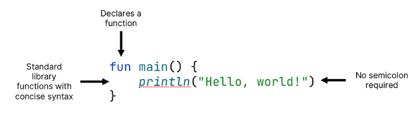
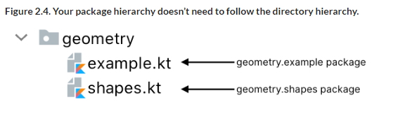

# 2 Kotlin basics

::: tip This chapter covers

- Declaring functions, variables, classes, enums, and properties Control structures in Kotlin
- Smart casts
- Throwing and handling exceptions

:::

::: details 在本章中，您将学习编写第一个可运行的 Kotlin 程序所需的 Kotlin 语言基础知识。其中包括您在整个 Kotlin 程序中遇到的基本构建块，例如变量和函数。您还将熟悉 Kotlin 中通过枚举表示数据的不同方式，以及类及其属性。

In this chapter, you'll learn the basics of the Kotlin language required to write your first working Kotlin programs. These include basic building blocks that you encounter all throughout Kotlin programs, like variables and functions. You'll also get acquainted with different ways of representing data in Kotlin, via enum, as well as classes and their properties.

:::

::: details 您将在本章中学习的不同控制结构将为您提供在程序中使用条件逻辑以及使用循环进行迭代所需的工具，并将了解与 Java 等其他语言相比，这些结构有何特殊之处。

The different control structures you'll learn throughout this chapter will give you the tools needed to use conditional logic in your programs, as well as iterate using loops, and will learn what makes these constructs special when compared to other languages like Java.

:::

We'll also introduce the basic mechanics of types in Kotlin, starting with the concept of a _smart cast_, an operation that combines a type check and a cast into one operation. You'll see how this helps you remove redundancy from your code without sacrificing safety. We'll also briefly talk about exception handling, and Kotlin's philosophy behind it.

By the end of this chapter, you'll already be able to combine these basic bits and pieces of the Kotlin language to write your own working Kotlin code, even if it might not be the most _idiomatic_.

::: info What's "idiomatic Kotlin"?

When discussing Kotlin code, a certain phrase often reoccurs: idiomatic Kotlin. You'll certainly hear this phrase throughout this book, but you might also hear it when talking to your colleagues, when attending community events, or at conferences. Clearly, it's worth understanding what is meant by it.

Simply said, idiomatic Kotlin is how a "native Kotlin speaker" writes code, using language features and syntactic sugar where appropriate. Such code is made up of idioms—recognizable structures that address problems you're trying to solve in "the Kotlin way". Idiomatic code fits in with the programming style generally accepted by the community, and follows the recommendations of the language designers.

Like any skill, learning to write idiomatic Kotlin takes time and practice. As you progress through this book, inspect the provided code samples, and write your own code, you will gradually develop an intuition to what idiomatic Kotlin code looks and feels like, and will gain the ability to independently apply these learnings in your own code.

:::

## 2.1 Basic elements: functions and variables

This section introduces you to the basic elements that every Kotlin program consists of: functions and variables. You'll write your very first Kotlin program, see how Kotlin lets you omit many type declarations and how it encourages you to avoid using mutable data where possible—and why that's a good thing.

### 2.1.1 Writing your first Kotlin program: Hello, world!

Let's start our journey into the world of Kotlin with a classical example: a program that prints "Hello, world!". In Kotlin, it's just one function:

::: info Figure 2.1. "Hello World!" in Kotlin



:::

We can observe a number of features and parts of the language syntax in this simple code snippet already:

- The `fun` keyword is used to declare a function. Programming in Kotlin is lots of fun, indeed!
- The function can be declared at the top level of any Kotlin file; you don't need to put it in a class.
- You can specify the `main` function as the entrypoint for your application at the top level, and without additional arguments (other languages may require you to always accept an array of command line parameters, for example).
- Kotlin emphasizes conciseness: You just write `println` to get your text to be displayed in the console. The Kotlin standard library provides many wrappers around standard Java library functions (such as `System.out.println`), with more concise syntax, and `println` is one of them.
- You can (and should) omit the semicolon from the end of a line, just as in many other modern languages.

So far, so good! We'll discuss some of these topics in more detail later. Now, let's explore the function declaration syntax.

### 2.1.2 Declaring functions with parameters and return values

The first function you wrote didn't actually return any meaningful values. However, the purpose of functions is often to compute and subsequently return some kind of result. 
For example, you may want to write a simple function `max` that takes two integer numbers `a` and `b` and returns the larger of the two. So, what would that look like?

The function declaration starts with the `fun` keyword, followed by the function name: `max`, in this case.
It's followed by the parameter list in parentheses. Here, we declare two parameters, `a` and `b`, both of type `Int`. 
In Kotlin, you first specify the parameter name, and then specify the type, separated by a colon. 
The return type comes after the parameter list, separated from it by a colon.

```kotlin
fun max(a: Int, b: Int): Int {
    return if (a > b) a else b
}
```

2.2 shows you the basic structure of a function. Note that in Kotlin, `if` is an expression with a result value. You can think of `if` returning a value from either of its branches. This makes it similar to the ternary operator in other languages like Java, where the same construct might look like `(a > b) ? a : b`.

::: info Figure 2.2. A Kotlin function is introduced with the `fun` keyword. Parameters and their types follow in parentheses, each one of them annotated with a name and a type, separated by a colon. Its return type is specified after the end of the parameter list. Functions just like this one are a basic building block of any Kotlin program.


:::

You can then call your function by using its name, providing the arguments in parentheses (you'll learn about different ways for calling Kotlin functions in 3.2.1.)

```kotlin
fun main() {
    println(max(1, 2))
    // 2
}
```

::: info Parameters and return type of the `main` function

As you already saw in the "Hello, World" example, the entry point of every Kotlin program is its `main` function. This function can either be declared with no parameters, or with an array of strings as its arguments (`args: Array<String>`). In the latter case, each element in the array corresponds to a command line parameter passed to your application. In any case, the `main` function does not return any value.

:::

::: info The difference between expressions and statements

In Kotlin, `if` is an expression, not a statement. The difference between an expression and a statement is that an expression has a value, which can be used as part of another expression, whereas a statement is always a top-level element in its enclosing block and doesn't have its own value. In Kotlin, most control structures, except for the loops (`for`, `while`, and `do`/`while`) are expressions, which sets it apart from other languages like Java. Specifically, the ability to combine control structures with other expressions lets you express many common patterns concisely, as you'll see later in the book. As a sneak peek, here are some snippets that are valid in Kotlin:

```kotlin
val x = if(myBoolean) 3 else 5
val direction = when(inputString) {
    "u" -> UP
    "d" -> DOWN
}
val number = try {
    inputString.toInt()
} catch(nfe: NumberFormatException) {
    -1
}
```

On the other hand, Kotlin enforces that assignments are always statements in Kotlin—that is, when assigning a value to a variable, this assignment operation doesn't itself return a value.

This helps avoid confusion between comparisons and assignments, which is a common source of mistakes in languages that treat them as expressions, such as Java or C/C++. That means the following isn't valid Kotlin code:

```kotlin
val number: Int
val alsoNumber = i = getNumber()
// ERROR: Assignments are not expressions,
// and only expressions are allowed in this context
```

:::

### 2.1.3 Making function definitions more concise by using expression bodies

In fact, you can make your max function even more concise. Since its body consists of a single expression (`if (a > b) a else b`), you can use that expression as the entire body of the function, removing the curly braces and the `return` statement. Instead, you can place the single expression right after an equals sign `=`:

```kotlin
fun max(a: Int, b: Int): Int = if (a > b) a else b
```

If a function is written with its body in curly braces, we say that this function has a block body. If it returns an expression directly, it has an expression body.

::: tip Convert between expression body and block body in IntelliJ IDEA and Android Studio

IntelliJ IDEA and Android Studio provide intention actions to convert between the two styles of functions: "Convert to expression body" and "Convert to block body." You can find them via the lightbulb icon when your cursor is placed on the function, or via the `Alt + Enter` (or `Option + Return` on macOS) keyboard shortcut.

:::

Functions that have an expression body are a frequent occurence in Kotlin code. You've already seen that they are quite convenient when your function happens to a trivial one-liner that intends to give a conditional check or an often-used operation a memorable name. But they also find use when functions evaluate a single, more complex expression, such as `if`, `when`, or `try`. You'll see such functions later in this chapter, when we talk about the `when` construct.

You could simplify your max function even more and omit the return type:

```kotlin
fun max(a: Int, b: Int) = if (a > b) a else b
```

At first sight, this might seem puzzling to you. How can there be functions without return-type declarations? You've already learned that Kotlin is a statically typed language—so doesn't it require for every expression to have a type at compile time?

Indeed, every variable and every expression has a type, and every function has a return type. But for expression-body functions, the compiler can analyze the expression used as the body of the function and use its type as the function return type, even when it's not specified explicitly. This type of analysis is usually called type inference.

Note that omitting the return type is allowed only for functions with an expression body. For functions with a block body that return a value, you have to specify the return type and write the `return` statements explicitly. That's a conscious choice. A real-world function often is long and can contain several `return` statements; having the return type and the `return` statements written explicitly helps you quickly grasp what can be returned.

::: info Keep your return types explicit when writing a library

If you are authoring libraries that other developers depend upon, you may want to, you may want refrain from using inferred return types for functions that are part of your public API. By explicitly specifying the types of your functions, you can avoid accidental signature changes that could cause errors in the code of your library's consumers. In fact, Kotlin provides tooling in the form of compiler options that can automatically check that you're explicitly specifying return types. You'll learn more about this explicit API mode in 4.1.3.

:::

Let's look at the syntax for variable declarations next.

### 2.1.4 Declaring variables to store data

Another basic building block which you'll commonly use in all your Kotlin programs are variables, which allow you to store data. A variable declaration in Kotlin starts with a keyword (`val` or `var`), followed by the name for the variable. While Kotlin lets you omit the type for many variable declarations (thanks to its powerful type inference that you've already seen in 2.1.3), you can always explicitly put the type after the variable name. For example, if you need to store one of the most famous questions and its respective answer in a Kotlin variable, you could do so by specifying two variables `question` and `answer` with their explicit types—`String` for the textual question, and `Int` for the integer answer:

```kotlin
val question: String =
    "The Ultimate Question of Life, the Universe, and Everything"
val answer: Int = 42
```

You can also omit the type declarations, making the example a bit more concise:

```kotlin
val question =
    "The Ultimate Question of Life, the Universe, and Everything"
val answer = 42
```

Just as with expression-body functions, if you don't specify the type, the compiler analyzes the initializer expression and uses its type as the variable type. In this case, the initializer, `42`, is of type `Int`, so the variable `answer` will have the same type.

If you use a floating-point constant, the variable will have the type `Double`:
`val yearsToCompute = 7.5e6`

The number types, along other basic types, are covered in more depth in 8.1.

If you're not initializing your variable immediately, but only assigning it at a later point, the compiler won't be able to infer the type for the variable. In this case, you need to specify its type explicitly:

```kotlin
fun main() {
    val answer: Int
    answer = 42
}
```

### 2.1.5 Marking a variable as read-only or reassignable

To control when a variable can be assigned a new value, Kotlin provides you with two keywords, `val` and `var`, for declaring variables:

1. `val` (from value) declares a read-only reference. A variable declared with val can be assigned only once. After it has been initialized, it can't be reassigned a different value. (For comparison, in Java, this would be expressed via the final modifier.)
2. `var` (from variable) declares a reassignable reference. You can assign other values to such a variable, even after it has been initialized. (This behavior is analogous to a regular, non-final variable in Java)

By default, you should strive to declare all variables in Kotlin with the `val` keyword. Change it to `var` only if necessary. Using read-only references, immutable objects, and functions without side effects allows you to take advantage of the benefits offered by the functional programming style. We touched briefly on its advantages in 1.2.3, and we'll return to this topic in 5.

A `val` variable must be initialized exactly once during the execution of the block where it's defined. But you can initialize it with different values depending on some condition, as long as the compiler can ensure that only one of the initialization statements will be executed.

You may find yourself in the situation where you want to assign the the contents of a `result` variable depending on the return value of another function, like `canPerformOperation`. Because the compiler is smart enough to know that exactly one of the two potential assignments will be executed, you can still specify `result` as a read-only reference using the `val` keyword:

```kotlin
fun canPerformOperation(): Boolean {
    return true
}

fun main() {
    val result: String
    if (canPerformOperation()) {
        result = "Success"
    } else {
        result = "Can't perform operation"
    }
}
```

Note that, even though a val reference is itself read-only and can't be changed once it has been assigned, the object that it points to may be mutable. For example, adding an element to a mutable list, which is referenced by a read-only reference, is perfectly okay:

```kotlin
fun main() {
    val languages = mutableListOf("Java")
    languages.add("Kotlin")
}
```

In 8.2.2, we'll discuss mutable and read-only objects in more detail.

Even though the var keyword allows a variable to change its value, its type is fixed. For example, if you decided mid-program that the answer variable

should store a string instead of an integer, you would be met with a compile error:

```kotlin
fun main() {
    var answer = 42
    answer = "no answer"
}
```

There's an error on the string literal because its type (String) isn't as expected (Int). The compiler infers the variable type only from the initializer and doesn't take subsequent assignments into account when determining the type.

If you need to store a value of a mismatching type in a variable, you must manually convert or coerce the value into the right type. We'll discuss number conversions in 8.1.4.

Now that you know how to define variables, it's time to see some new tricks for referring to values of those variables. Specifically, you'll see how you can provide some nicer and structured outputs for your first Kotlin programs.

### 2.1.6 Easier string formatting: string templates

Let's get back to the "Hello World" example that opened this section, and extend it with some extra features that occur commonly in all kinds of Kotlin programs.

You'll add a bit of personalization, by having the program greet people by name. If the user specifies a name via the standard input, then your program uses it in the greeting. In case the user doesn't actually provide any input, you'll just have to greet all of Kotlin instead. Such a greeting program could look as follows, and showcases a few features you haven't seen before:

::: info Listing 2.1. Using string templates

```kotlin
fun main() {
    val input = readln()
    val name = if (input.isNotBlank()) input else "Kotlin"
    println("Hello, $name!")
}
```
:::

This example introduces a feature called string templates, and also briefly shows an example of how you could read simple user input. In the code, you read `input` from the standard input stream via the `readln()` function (which is available in any Kotlin file, alongside others). You then declare a variable `name` and initialize its value using an if-expression. If the standard input exists and is not blank, `name` is assigned the value of `input`. Otherwise it's assigned a default value `"Kotlin"`. Finally, you use it in the string literal passed to `println`.

Like many scripting languages, Kotlin allows you to refer to local variables in string literals by putting the `$` character in front of the variable name. This is equivalent to Java's string concatenation `("Hello, " + name + "!")` but is more compact and just as efficient.[1] And of course, the expressions are statically checked, and the code won't compile if you try to refer to a variable that doesn't exist.

If you need to include the `$` character in a string, you escape it with a backslash:

```kotlin
fun main() {
    println("\$x")
    // $x
}
```

String templates in Kotlin are quite powerful, since they don't limit you to referencing individual variables. If you want your greeting to be a bit more adventurous, and greet your user by the length of their name, you can also provide a more complex expression in the string template. All it takes is putting curly braces around the expression:

```kotlin
fun main() {
    val name = readln()
    if (name.isNotBlank()) {
        println("Hello, ${name.length}-letter person!")
    }
}
```

Now that you know that you can include arbitrary expressions inside string templates, and you already knew that `if` is an expression in Kotlin. Combining the two, you can now rewrite your greeting program to include the conditional directly inside the string template:

```kotlin
fun main() {
    val name = readln()
    println("Hello, ${if (name.isBlank()) "someone" else name}!")
}
```

Notice how you can even use an expression that itself contains double quotes within a string template!

Later, in 3.5, we'll return to strings and talk more about what you can do with them.

Now you already know a few of the most basic building blocks to write your own Kotlin programs—functions and variables. Let's go one step up in the hierarchy and look at classes and how they help you encapsulate and group related data in an object-oriented fashion. This time, you'll use the Java-to- Kotlin converter to help you get started using the new language features.

[1]For JVM 1.8 targets, the compiled code creates a StringBuilder and appends the constant parts and variable values to it. Applications targeting JVM 9 or above compile string concatenations into more efficient dynamic invocations via `invokedynamic`.

## 2.2 Encapsulating behavior and data: classes and properties

Just like other object-oriented programming languages, Kotlin provides the abstraction of a class. Kotlin's concepts in this area will be familiar to you, but you'll find that many common tasks can be accomplished with much less code compared to other object-oriented languages. This section will introduce you to the basic syntax for declaring classes. We'll go into more detail in 4.

To begin, let's look at a simple POJO ("Plain Old Java Object") `Person` class that so far contains only one property, `name`.

::: info Listing 2.2. Simple Java class Person

```kotlin
/* Java */
public class Person {
    private final String name;

    public Person(String name) {
        this.name = name;
    }

    public String getName() {
        return name;
    }
}
```
:::

You can see that in Java, this requires quite some code. The constructor body is entirely repetitive, as it only assigns the parameters to the fields that have the corresponding names. As per convention, to access the `name` field, the `Person` class should also provide a getter function `getName`, which also just returns the contents of the field. This kind of repetition often happens in Java. In Kotlin, this logic can be expressed without so much boilerplate.

In section **For Java developers: move code automatically with the Java-to-Kotlin converter**, we introduced the Java-to-Kotlin converter: a tool that automatically replaces Java code with Kotlin code that does the same thing. Let's look at the converter in action and convert the `Person` class to Kotlin.

::: info Listing 2.3. Person class converted to Kotlin

```kotlin
class Person(val name: String)
```
:::

Looks good, doesn't it? If you've tried another modern object-oriented language, you may have seen something similar. As you can see, Kotlin offers a concise syntax for declaring classes, especially classes that contain only data but no code. We'll discuss their relationship to a very similar concept in Java 14 and above, Records, in section **Data classes and immutability: the copy() method**.

Note that the modifier `public` disappeared during the conversion from Java to Kotlin. In Kotlin, `public` is the default visibility, so you can omit it.

### 2.2.1 Associating data with a class and making it accessible: properties

The idea of a class is to encapsulate data and code that works on that data into a single entity. In Java, the data is stored in fields, which are usually private. If you need to let clients of the class access that data, you provide accessor methods: a getter and possibly a setter. You saw an example of this in the `Person` class. The setter can also contain additional logic for validating the passed value, sending notifications about the change and so on.

In Java, the combination of the field and its accessors is often referred to as a property, and many frameworks make heavy use of that concept. In Kotlin, properties are a first-class language feature, which entirely replaces fields and accessor methods. You declare a property in a class the same way you declare a variable: with the `val` and `var` keywords. A property declared as `val` is read-only, whereas a `var` property is mutable and can be changed.

For example, you could expand your `Person` class, which already contained a read-only `name` property, with a mutable `isStudent` property:

::: info Listing 2.4. Declaring a mutable property in a class

```kotlin
class Person(
    val name: String,
    var isStudent: Boolean
)
```
:::

Basically, when you declare a property, you declare the corresponding accessors (a getter for a read-only property, and both a getter and a setter for a writable one). By default, the implementation of these accessors is trivial: a field is created to store the value, the getter returns the value of this field, and the setter updates its value. But if you want to, you may declare a custom accessor that uses different logic to compute or update the property value.

The concise declaration of the `Person` class in 2.4 hides the same underlying implementation as the original Java code: it's a class with private fields that is initialized in the constructor and can be accessed through the corresponding getter. That means you can use this class from Java and from Kotlin the same way, independent of where it was declared. The use looks identical. Here's how you can use the Kotlin class `Person` from Java code, creating a new `Person` object with the name `Bob` who is a student—until he graduates:

::: info Listing 2.5. Using the Person class from Java

```kotlin
public class Demo {
    public static void main(String[] args) {
        Person person = new Person("Bob", true);
        System.out.println(person.getName());
        // Bob
        System.out.println(person.isStudent());
        // true
        person.setStudent(false); // Graduation!
        System.out.println(person.isStudent());
        // false
    }
}
```
:::

Note that this looks the same when `Person` is defined in Java and in Kotlin. Kotlin's `name` property is exposed to Java as a getter method called `getName`. The getter and setter naming rule has an exception: if the property name starts with `is`, no additional prefix for the getter is added and in the setter name, `is` is replaced with `set`. Thus, from Java, you can call `isStudent()` and `setStudent()` to access the `isStudent` property .

If you convert 2.5 to Kotlin, you get the following result.

::: info Listing 2.6. Using the Person class from Kotlin

```kotlin
fun main() {
    val person = Person("Bob", true)
    println(person.name)
    // Bob
    println(person.isStudent)
    // true
    person.isStudent = false // Graduation!
    println(person.isStudent)
    // false
}
```
:::

Now, instead of invoking the getter explicitly, you reference the property directly. The logic stays the same, but the code is more concise. Setters of mutable properties work the same way: while in Java, you use `person.setStudent(false)` to symbolize a graduation; in Kotlin, you use the property syntax directly, and write `person.isStudent = false`.

::: tip

You can also use the Kotlin property syntax for classes defined in Java. Getters in a Java class can be accessed as `val` properties from Kotlin, and getter/setter pairs can be accessed as `var` properties. For example, if a Java class defines methods called `getName` and `setName`, you can access it as a property called `name`. If it defines `isStudent` and `setStudent` methods, the name of the corresponding Kotlin property will be `isStudent`.

:::

In most cases, the property has a corresponding backing field that stores the property value (you'll learn more about backing fields in Kotlin in 4.2.4. But if the value can be computed on the fly—for example, by deriving it from other properties—you can express that using a custom getter.

### 2.2.2 Computing properties instead of storing their values: custom accessors

Let's see how you could provide a custom implementation of a property accessor. One common case for this is when a property is a direct result of some other properties in the object. If you have a `Rectangle` class that stores `width` and `height`, you can provide a property `isSquare` that is `true` when width and height are equal. Because this is a property you can check "on the go", computing it on access, you don't need to store that information as a separate field. Instead, you can provide a custom getter, whose implementation computes the square-ness of the Rectangle every time the property is accessed:

```kotlin
class Rectangle(val height: Int, val width: Int) {
    val isSquare: Boolean
        get() {
            return height == width
        }
}
```

Note that you don't have to use the full syntax with curly braces. Just like any other function, you can define the getter using expression body syntax we learned about in 2.1.3, and write `val isSquare get() = height == width`, as well. As you can see, the expression body syntax also allows you to omit explicitly specifying the property type, having the compiler infer the type for you instead.

Regardless of the syntax you choose, the invocation of a property like `isSquare` stays the same:

```kotlin
fun main() {
    val rectangle = Rectangle(41, 43)
    println(rectangle.isSquare)
    // false
}
```

If you need to access this property from Java, you call the `isSquare` method as before.

You might ask whether it's better to declare a property with a custom getter, or define a function inside the class (referred to as a member function or method in Kotlin). Both options are similar: There is no difference in implementation or performance; they only differ in readability. Generally, if you describe the characteristic (the property) of a class, you should declare it as a property. If you are describing the behavior of a class, choose a member function instead.

In 4, you'll take a look at more examples that use classes, properties, and member functions, and also look at the syntax to explicitly declare constructors. If you're impatient and happen to know the equivalents of these topics in Java, you can always use the Java-to-Kotlin converter in the meantime to peek ahead.

Before we move on to discuss other language features, let's briefly examine how code in Kotlin projects is generally structured.

### 2.2.3 Kotlin source code layout: directories and packages

As your programs grow in complexity, consisting of more and more functions, classes, and other language constructs, you'll inevitably need to start thinking about how to organize your source code in order for your project to stay maintainable and navigable. Let's examine how Kotlin projects are typically structured.

Kotlin has the concept of packages to organize classes (similar to what you may be familiar with from Java.) Every Kotlin file can have a `package` statement at the beginning, and all declarations (classes, functions, and properties) defined in the file will be placed in that package.

Here's an example of a source file showing the syntax for the package declaration statement.

::: info Listing 2.7. Putting a class and a function declaration in a package

```kotlin
package geometry.shapes

class Rectangle(val height: Int, val width: Int) {
    val isSquare: Boolean
        get() = height == width
}

fun createUnitSquare(): Rectangle {
    return Rectangle(1, 1)
}
```
:::

Declarations defined in other files can be used directly if they're in the same package; they need to be imported if they're in a different package. This happens using the `import` keyword at the beginning of the file, placed directly below the `package` directive.

Kotlin doesn't make a distinction between importing classes or functions, and it allows you to import any kind of declaration using the `import` keyword. If you are writing a demo project in the `geometry.example` package, then you can use the class `Rectangle` and the function `createUnitSquare` from the `geometry.shapes` package by simply importing them by name:

::: info Listing 2.8. Importing the function from another package

```kotlin
package geometry.example

import geometry.shapes.Rectangle
import geometry.shapes.createUnitSquare

fun main() {
    println(Rectangle(3, 4).isSquare)
    // false
    println(createUnitSquare().isSquare)
    // true
}
```
:::

You can also import all declarations defined in a particular package by putting `.*` after the package name. Note that this star import (also called wildcard import) will make everything defined in the package visible—not only classes, but also top-level functions and properties. In 2.8, writing `import geometry.shapes.*` instead of the explicit import makes the code compile correctly as well.

In Java, you put your classes into a structure of files and directories that matches the package structure. For example, if you have a package named `shapes` with several classes, you need to put every class into a separate file with a matching name and store those files in a directory also called `shapes`. 2.3shows how the `geometry` package and its subpackages could be organized in Java. Assume that the `createUnitSquare` function is located in a separate file, `RectangleUtil`.

::: info Figure 2.3. In Java, the directory hierarchy duplicates the package hierarchy.


:::

In Kotlin, you can put multiple classes in the same file and choose any name for that file. Kotlin also doesn't impose any restrictions on the layout of source files on disk; you can use any directory structure to organize your files. For instance, you can define all the content of the package geometry.shapes in the file shapes.kt and place this file in the geometry folder without creating a separate shapes folder (see 2.4).

::: info Figure 2.4. Your package hierarchy doesn't need to follow the directory hierarchy.


:::

In most cases, however, it's still a good practice to follow Java's directory layout and to organize source files into directories according to the package structure. Sticking to that structure is especially important in projects where Kotlin is mixed with Java, because doing so lets you migrate the code gradually without introducing any surprises. But you shouldn't hesitate to pull multiple classes into the same file, especially if the classes are small (and in Kotlin, they often are).

Now you know how programs are structured. Let's return to our journey through the basic concepts of Kotlin, and let's have a look at how to handle different choices in Kotlin beyond the `if` expression.

## 2.3 Representing and handling choices: enums and "when"

In this section, we'll look at an example of declaring enums in Kotlin, and talk about the `when` construct. The latter can be thought of a more powerful and often-used replacement for the `switch` construct in Java. We will also discuss the concept of smart casts, which combine type checks and casts.

### 2.3.1 Declaring enum classes and enum constants

It's time we add a splash of color to this book! Given manufacturing constraints, you'll have to rely on your imagination to visualise them in all their glory—here, you'll have to realize them as Kotlin code, specifically, an enum of color constants:

::: info Listing 2.9. Declaring a simple enum class

```kotlin
package ch02.colors

enum class Color {
    RED, ORANGE, YELLOW, GREEN, BLUE, INDIGO, VIOLET
}
```
:::

This is a rare case when a Kotlin declaration uses more keywords than the corresponding Java one: `enum class` versus just `enum` in Java.

::: tip `enum` is a soft keyword

In Kotlin, `enum` is a so-called soft keyword: it has a special meaning when it comes before `class`, but you can use it as a regular name, e.g. for a function, variable name, or parameter, in other places. On the other hand, `class` is a hard keyword, meaning you can't use it as an identifier, and have to use an alternate spelling or phrasing, like `clazz` or `aClass`.

:::

Having colors stored in an enum is already useful, but we can do better. Color values are often represented using their red, green, and blue components. Enum constants use the same constructor and property declaration syntax as you saw earlier for regular classes. You can use this to expand your `Color` enum: You can associate each enum constant with its `r`, `g`, and `b` values. You can also declare properties, like `rgb` that creates a combined numerical color value from the components, and methods, like `printColor`, using familiar syntax:

::: info Listing 2.10. Declaring an enum class with properties

```kotlin
package ch02.colors

enum class Color(
    val r: Int,
    val g: Int,
    val b: Int
) {
    RED(255, 0, 0),
    ORANGE(255, 165, 0),
    YELLOW(255, 255, 0),
    GREEN(0, 255, 0),
    BLUE(0, 0, 255),
    INDIGO(75, 0, 130),
    VIOLET(238, 130, 238);
    val rgb = (r * 256 + g) * 256 + b
    fun printColor() = println("$this is $rgb")
}

fun main() {
    println(Color.BLUE.rgb)
    // 255
    Color.GREEN.printColor()
    // GREEN is 65280
}
```
:::

Note that this example shows the only place in the Kotlin syntax where you're required to use semicolons: if you define any methods in the enum class, the semicolon separates the enum constant list from the method definitions.

Now that we have a fully fledged `Colors` enum, let's see how Kotlin lets you easily work with these constants.

### 2.3.2 Using "when" to deal with enum classes

Do you remember how children use mnemonic phrases to memorize the colors of the rainbow? Here's one: "Richard Of York Gave Battle In Vain!" Imagine you need a function that gives you a mnemonic for each color (and you don't want to store this information in the enum itself). In Java, you can use a `switch` statement or, since Java 13, a `switch` expression for this. The corresponding Kotlin construct is `when`.

Like `if`, `when` is an expression that returns a value, so you can write a function with an `expression` body, returning the `when` expression directly. When we talked about functions at the beginning of the chapter, we promised an example of a multiline function with an expression body. Here's such an example.

::: info Listing 2.11. Using `when` for choosing the right enum value

```kotlin
fun getMnemonic(color: Color) =
    when (color) {
        Color.RED -> "Richard"
        Color.ORANGE -> "Of"
        Color.YELLOW -> "York"
        Color.GREEN -> "Gave"
        Color.BLUE -> "Battle"
        Color.INDIGO -> "In"
        Color.VIOLET -> "Vain"
    }

fun main() {
    println(getMnemonic(Color.BLUE))
    // Battle
}
```
:::

The code finds the branch corresponding to the passed `color` value. Note that you don't need to write `break` statements for each branch. (In Java, a missing `break` in a `switch` statement is often a cause for bugs.) If a match is successful, only the corresponding branch is executed. You can also combine multiple values in the same branch if you separate them with commas.

So, to use different branches based on the "warmth" of the color, you could group your enum constants accordingly in your `when` expression:

::: info Listing 2.12. Combining options in one `when` branch

```kotlin
fun measureColor() = Color.ORANGE
// as a stand-in for more complex measurement logic

fun getWarmthFromSensor(): String {
    val color = measureColor()
    return when(color) {
        Color.RED, Color.ORANGE, Color.YELLOW -> "warm (red = ${color.r})"
        Color.GREEN -> "neutral (green = ${color.g})"
        Color.BLUE, Color.INDIGO, Color.VIOLET -> "cold (blue = ${color.b})"
    }
}

fun main() {
    println(getWarmthFromSensor())
    // warm (red = 255)
}
```

These examples use enum constants by their full name, specifying the `Color` enum class name every time one of the enum's constants is referenced. By importing the constant values, you can simplify this code, and save yourself some repetition:

::: info Listing 2.13. Importing enum constants to access without qualifier

```kotlin
import ch02.colors.Color
import ch02.colors.Color.*
fun measureColor() = ORANGE

fun getWarmthFromSensor(): String {
    val color = measureColor()
    return when (color) {
        RED, ORANGE, YELLOW ->
            "warm (red = ${color.r})"
        GREEN ->
            "neutral (green = ${color.g})"
        BLUE, INDIGO, VIOLET ->
            "cold (blue = ${color.b})"
    }
}
```
:::

### 2.3.3 Capturing the subject of a "when" expression in a variable

In the previous examples, the subject of the `when` expression was the `color` variable, which you obtained by invoking the `measureColor()` function. To avoid cluttering the surrounding code with extraneous variables, like `color` in this case, the `when` expression can also capture its subject in a variable. In this case, the captured variable's scope is restricted to the body of the `when` expression, while still providing access to its properties inside the branches of the `when` expression:

::: info Listing 2.14. Assigning the subject of a when to a variable scoped to the body of the expression

```kotlin
import ch02.colors.Color
import ch02.colors.Color.*

fun measureColor() = ORANGE

fun getWarmthFromSensor() =
    when (val color = measureColor()) {
        RED, ORANGE, YELLOW -> "warm (red = ${color.r})"
        GREEN -> "neutral (green = ${color.g})"
        BLUE, INDIGO, VIOLET -> "cold (blue = ${color.b}"
    }
```
:::

In future examples we'll use the short enum names but omit the explicit imports for simplicity.

Note that whenever `when` is used as an expression (meaning that its result is used in an assignment or as a return value) the compiler enforces the construct to be exhaustive. This means that all possible paths must return a value.

In the previous example, we cover all enum constants, making the `when` construct exhaustive. Instead, we could also provide a default case using the `else` keyword. In cases where the compiler can't deduce whether all possible paths are covered, it forces us to provide a default case. We'll look at such an example in the next section.

### 2.3.4 Using "when" with arbitrary objects

The `when` construct in Kotlin is actually more flexible than you might be used to from other languages: you can use any kind of object as a branch condition. Let's write a function that mixes two colors if they can be mixed in this small palette. You don't have a lot of options, and you can easily enumerate them all.

::: info Listing 2.15. Using different objects in `when` branches

```kotlin
fun mix(c1: Color, c2: Color) =
        when (setOf(c1, c2)) {
            setOf(RED, YELLOW) -> ORANGE
            setOf(YELLOW, BLUE) -> GREEN
            setOf(BLUE, VIOLET) -> INDIGO
            else -> throw Exception("Dirty color")
        }

fun main() {
    println(mix(BLUE, YELLOW))
    // GREEN
}
```
:::

If colors `c1` and `c2` are `RED` and `YELLOW` (or vice versa), the result of mixing them is `ORANGE`, and so on. To implement this, you use set comparison. The Kotlin standard library contains a function `setOf` that creates a `Set` containing the objects specified as its arguments. A set is a collection for which the order of items doesn't matter; two sets are equal if they contain the same items. Thus, if the sets `setOf(c1, c2)` and `setOf(RED, YELLOW)` are equal, it means either `c1` is `RED` and `c2` is `YELLOW`, or vice versa. This is exactly what you want to check.

The `when` expression matches its argument against all branches in order until some branch condition is satisfied. Thus `setOf(c1, c2)` is checked for equality: first with `setOf(RED, YELLOW)` and then with other sets of colors, one after another. If none of the other branch conditions is satisfied, the `else` branch is evaluated.

Since the Kotlin compiler can't deduce that we have covered all possible combinations of color sets, and the result of the `when` expression is used as the return value for the `mix` function, we're forced to provide a default case to guarantee that the `when` expression is indeed exhaustive.

Being able to use any expression as a `when` branch condition lets you write concise and beautiful code in many cases. In this example, the condition is an equality check; next you'll see how the condition may be any Boolean expression.

### 2.3.5 Using "when" without an argument

You may have noticed that 2.15 is somewhat inefficient. Every time you call this function, it creates several Set instances that are used only to check whether two given colors match the other two colors. Normally this isn't an issue, but if the function is called often, it's worth rewriting the code in a different way to avoid creating many short-lived objects which need to be cleaned up by the garbage collector. You can do it by using the `when` expression without an argument. The code is less readable, but that's the price you often have to pay to achieve better performance.

::: info Listing 2.16. Using when without an argument

```kotlin
fun mixOptimized(c1: Color, c2: Color) =
    when {
        (c1 == RED && c2 == YELLOW) ||
        (c1 == YELLOW && c2 == RED) ->
            ORANGE

        (c1 == YELLOW && c2 == BLUE) ||
        (c1 == BLUE && c2 == YELLOW) ->
            GREEN

        (c1 == BLUE && c2 == VIOLET) ||
        (c1 == VIOLET && c2 == BLUE) ->
            INDIGO

        else -> throw Exception("Dirty color")
    }

fun main() {
    println(mixOptimized(BLUE, YELLOW))
    // GREEN
}
```
:::

If no argument is supplied for the `when` expression, the branch condition is any Boolean expression. The `mixOptimized` function does the same thing as `mix` did earlier. Its advantage is that it doesn't create any extra objects, but the cost is that it's harder to read.

Let's move on and look at examples of the `when` construct in which smart casts come into play.

### 2.3.6 Smart casts: combining type checks and casts

Now that you've successfully mixed a few colors with Kotlin, let's move on to a bit more complex example. You'll write a function that evaluates simple arithmetic expressions like `(1 + 2) + 4`. The expressions will contain only one type of operation: the sum of two numbers. Other arithmetic operations (subtraction, multiplication, division) can be implemented in a similar way, and you can do that as an exercise. In the process, you'll learn about how smart casts make it much easier to work with Kotlin objects of different types.

First, how do you encode the expressions? Traditionally, you store them in a tree-like structure, where each node is either a sum (`Sum`) or a number (`Num`). `Num` is always a leaf node, whereas a `Sum` node has two children: the arguments of the `sum` operation. 2.17 shows a simple structure of classes used to encode the expressions: an interface called `Expr` and two classes, `Num` and `Sum`, that implement it. Note that the `Expr` interface doesn't declare any methods; it's used as a marker interface to provide a common type for different kinds of expressions. To mark that a class implements an interface, you use a colon (`:`) followed by the interface name (you'll take a closer look at interfaces in 4.1.1):

::: info Listing 2.17. Expression class hierarchy

```kotlin
interface Expr
class Num(val value: Int) : Expr
class Sum(val left: Expr, val right: Expr) : Expr
```
:::

::: info Figure 2.5. Class diagram showing the relationship between `Expr`, `Num` and `Sum`. `Num` and `Sum` both realize the marker interface `Expr`. `Sum` also has an association with the `left` and `right` operands, which are once again of type `Expr`.


:::

`Sum` stores references to the `left` and `right` arguments of type `Expr`. In the case of your example, that means they can be either `Num` or `Sum`. To store the expression `(1 + 2) + 4` mentioned earlier, you create a structure of `Expr` objects, specifically `Sum(Sum(Num(1), Num(2)), Num(4))`. 2.6 shows its tree representation.

::: info Figure 2.6. A representation of the expression `Sum(Sum(Num(1), Num(2)), Num(4))` describing the mathematical expression `(1 + 2) + 4`. We use this codification as the input for our evaluation function.


:::

Your goal is to evaluate this kind of expression consisting of `Sum` and `Num` objects, computing the resulting value. Let's take a look at that next.

The `Expr` interface has two implementations, so you have to try two options in order to evaluate a result value for an expression:

1. If an expression is a number, you return the corresponding value.
2. If it's a sum, you have to evaluate the left and right expressions recursively, and return their sum.

First we'll look at an implementation of this function written in a style similar to what you might see in Java code. Then, we'll refactor it to reflect idiomatic Kotlin.

At first, you might write a function reminiscent of the style you may see in other languages, using a sequence of `if` expressions to check the different subtypes of `Expr`. In Kotlin, you check whether a variable is of a certain type by using an `is` check, so an implementation might look like this:

::: info Listing 2.18. Evaluating expressions with an if-cascade

```kotlin
fun eval(e: Expr): Int {
    if (e is Num) {
        val n = e as Num
        return n.value
    }
    if (e is Sum) {
        return eval(e.right) + eval(e.left)
    }
    throw IllegalArgumentException("Unknown expression")
}

fun main() {
    println(eval(Sum(Sum(Num(1), Num(2)), Num(4))))
    // 7
}
```
:::

The `is` syntax might be familiar to you if you've programmed in C#, and Java developers might recognize it as the equivalent of `instanceof`.

Kotlin's `is` check provides some additional convenience: If you check the variable for a certain type, you don't need to cast it afterward; you can use it as having the type you checked for. In effect, the compiler performs the cast for you: something we call a smart cast. (This is more ergonomic than in Java, where after checking the type of a variable, you still need to add an explicit cast.)

In the `eval` function, after you check whether the variable `e` has `Num` type, the compiler smartly interprets it as a variable of type `Num`. You can then access the `value` property of `Num` without an explicit cast: `e.value`. The same goes for the `right` and `left` properties of `Sum`: you write only `e.right` and `e.left` in the corresponding context. In IntelliJ IDEA and Android Studio, these smart-cast values are emphasized with a background color, so it's easy to grasp that this value was checked beforehand (see 2.7.)

::: info Figure 2.7. The IDE highlights smart casts with a background color.


:::

The smart cast works only if a variable couldn't have changed after the `is` check. When you're using a smart cast with a property of a class, as in this example, the property has to be a `val` and it can't have a custom accessor. Otherwise, it would not be possible to verify that every access to the property would return the same value.

An explicit cast to the specific type is expressed via the `as` keyword:

```kotlin
val n = e as Num
```

But, as you may have guessed, this implementation isn't yet considered idiomatic Kotlin. Let's look at how to refactor the `eval` function.

### 2.3.7 Refactoring: replacing "if" with "when"

In 2.1.2, you have already seen that if `is` an expression in Kotlin. This is also why there is no ternary operator in Kotlin—the `if` expression can already return a value.

That means you can rewrite the `eval` function to use the expression-body syntax, removing the `return` statement and the curly braces and using the `if` expression as the function body instead.

::: info Listing 2.19. Using `if`-expressions that return values

```kotlin
fun eval(e: Expr): Int =
    if (e is Num) {
        e.value
    } else if (e is Sum) {
        eval(e.right) + eval(e.left)
    } else {
        throw IllegalArgumentException("Unknown expression")
    }

fun main() {
    println(eval(Sum(Num(1), Num(2))))
    // 3
}
```
:::

And you can make this code even more concise: The curly braces are optional if there's only one expression in an `if` branch—for an `if` branch with a block, the last expression is returned as a result. A shortened version of the `eval` expression using cascading `if` expressions could look like this:

```kotlin
fun eval(e: Expr): Int =
    if (e is Num) e.value
    else if (e is Sum) eval(e.right) + eval(e.left)
    else throw IllegalArgumentException("Unknown expression")
```

But you've already gotten to know an even better language construct for expressing multiple choices in 2.3.2—let's polish this code even more and rewrite it using `when`.

The `when` expression isn't restricted to checking values for equality, which is what you saw earlier. Here you use a different form of `when` branches, allowing you to check the type of the `when` argument value. Just as in the `if` example in 2.19, the type check applies a smart cast, so you can access members of `Num` and `Sum` without extra casts:

::: info Listing 2.20. Using when instead of if-cascade

```kotlin
fun eval(e: Expr): Int =
    when (e) {
        is Num -> e.value
        is Sum -> eval(e.right) + eval(e.left)
        else -> throw IllegalArgumentException("Unknown expr")
    }
```
:::

Compare the last two Kotlin versions of the `eval` function, and think about how you can apply `when` as a replacement for sequences of `if` expressions in your own code as well. For branch logic containing multiple operations, you can use a block expression as a branch body. Let's see how this works.

### 2.3.8 Blocks as branches of "if" and "when"

Both `if` and `when` can have blocks as branches. In this case, the last expression in the block is the result. Let's say you want to gain a deeper understanding of how your `eval` function computes the result. One way to do so is to add some `println` statements that log what the function is currently calculating. You can add them in the block for each branch in your `when` expression. The last expression in the block is what will be returned:

::: info Listing 2.21. Using `when` with compound actions in branches

```kotlin
fun evalWithLogging(e: Expr): Int =
    when (e) {
        is Num -> {
            println("num: ${e.value}")
            e.value
        }
        is Sum -> {
            val left = evalWithLogging(e.left)
            val right = evalWithLogging(e.right)
            println("sum: $left + $right")
            left + right
        }
        else -> throw IllegalArgumentException("Unknown expression")
    }
```
:::

Now you can look at the logs printed by the `evalWithLogging` function and follow the order of computation:

```kotlin
fun main() {
    println(evalWithLogging(Sum(Sum(Num(1), Num(2)), Num(4))))
    // num: 1
    // num: 2
    // sum: 1 + 2
    // num: 4
    // sum: 3 + 4
    // 7
}
```

The rule "the last expression in a block is the result" holds in all cases where a block can be used and a result is expected. As you'll see in 2.5.2, the same rule works for the `try` body and `catch` clauses, and in 5.1.3, we'll discuss the application of this rule to lambda expressions. But as we mentioned in section 2.1.3, this rule doesn't hold for regular functions. A function can have either an expression body that can't be a block or a block body with explicit `return` statements inside.

By now, you've seen multiple ways of how you can choose the right things among many in your Kotlin code, so it seems now would be a good time to see how you can iterate over things.

## 2.4 Iterating over things: "while" and "for" loops

Iteration in Kotlin is very similar to what you are probably used to from Java, C#, or other languages. The `while` loop takes the same traditional form it does in other languages, so you'll only take a brief look at it. You'll also find the `for` loop, which is written `for (<item> in <elements>)`, to be reminiscent of Java's `for-each` loop, for example. Let's explore what kind of looping scenarios you can cover with these two forms of loops.

### 2.4.1 Repeating code while a condition is true: the "while" loop

Kotlin has `while` and `do-while` loops, and their syntax are probably familiar to you from other programming languages. Let's briefly review it:

```kotlin
while (condition) {
    /*...*/
    if(shouldExit) break
}

do {
    if(shouldSkip) continue
    /*...*/
} while (condition)
```

For nested loops, Kotlin allows you to specify a label, which you can then reference when using `break` or `continue`. A label is an identifier followed by the `@` sign:

```kotlin
outer@ while (outerCondition) {
    while (innerCondition) {
        if (shouldExitInner) break
        if (shouldSkipInner) continue
        if (shouldExit) break@outer
        if (shouldSkip) continue@outer
        // ...
    }
    // ...
}
```

Let's move on to discuss the various uses of the `for` loop, and see how it covers not just the iteration over collection items, but over ranges as well.

### 2.4.2 Iterating over numbers: ranges and progressions

As we just mentioned, in Kotlin there's no C-style `for` loop, where you initialize a variable, update its value on every step through the loop, and exit the loop when the value reaches a certain bound (the classical `int i = 0; i < 10; i++`). To replace the most common use cases of such loops, Kotlin uses the concepts of ranges.

A range is essentially just an interval between two values, usually numbers: a start and an end. You write it using the `..` operator:

```kotlin
val oneToTen = 1..10
```

Note that these ranges in Kotlin are closed or inclusive, meaning the second value is always a part of the range.

The most basic thing you can do with integer ranges is loop over all the values. If you can iterate over all the values in a range, such a range is called a progression.

Let's use integer ranges to play the Fizz-Buzz game. It's a nice way to survive a long trip in a car and remember your forgotten division skills. Implementing this game is also a popular task for programming interviews!

To play Fizz-Buzz, players take turns counting incrementally, replacing any number divisible by three with the word fizz and any number divisible by five with the word buzz. If a number is a multiple of both three and five, you say "FizzBuzz."

2.22 prints the right answers for the numbers from 1 to 100. Note how you check the possible conditions with a `when` expression without an argument.

::: info Listing 2.22. Using `when` to implement the Fizz-Buzz game

```kotlin
fun fizzBuzz(i: Int) = when {
    i % 15 == 0 -> "FizzBuzz "
    i % 3 == 0 -> "Fizz "
    i % 5 == 0 -> "Buzz "
    else -> "$i "
}

fun main() {
    for (i in 1..100) {
        print(fizzBuzz(i))
    }
    // 1 2 Fizz 4 Buzz Fizz 7 ...
}
```
:::

Suppose you get tired of these rules after an hour of driving and want to complicate things a bit. Let's start counting backward from 100 and include only even numbers.

::: info Listing 2.23. Iterating over a range with a step

```kotlin
fun main() {
    for (i in 100 downTo 1 step 2) {
        print(fizzBuzz(i))
    }
    // Buzz 98 Fizz 94 92 FizzBuzz 88 ...
}
```
:::

Now you're iterating over a progression that has a step, which allows it to skip some numbers. The step can also be negative, in which case the progression goes backward rather than forward. In this example, `100 downTo 1` is a progression that goes backward (with step -1). Then `step` changes the absolute value of the step to 2 while keeping the direction (in effect, setting the step to -2).

As we mentioned earlier, the `..` syntax always creates a range that includes the end point (the value to the right of `..`). In many cases, it's more convenient to iterate over half-closed ranges, which don't include the specified end point. To create such a range, use `..<`. For example, the loop `for (x in 0..<size)` is equivalent to `for (x in 0..size-1)`, but it expresses the idea somewhat more clearly. Later, in section 3.4, you'll learn more about the syntax for `downTo`, `step` in these examples.

You can see how working with ranges and progressions helped you cope with the advanced rules for the FizzBuzz game. But the `for` loop in Kotlin can do more than that. Let's look at some other examples:

### 2.4.3 Iterating over maps

We've mentioned that the most common scenario of using a `for (x in y)` loop is iterating over a collection. You are most likely already familiar with its behavior—the loop is executed for each element in the input collection. In this case, you simply print each element from the collection of colors. Inside the loop, the individual colors can be addressed with `color`, since that is the name used in the `for` loop:

::: info Listing 2.24. Iterating over a range with a step

```kotlin
fun main() {
    val collection = listOf("red", "green", "blue")
    for(color in collection) {
        print("$color ")
    }
    // red green blue
}
```
:::

Instead of spending more time on this, let's see something more interesting instead: how you can iterate over a map.

As an example, we'll look at a small program that prints binary representations for characters—providing you with a simple look-up table that will help you decipher binary-encoded text like `1000100 1000101 1000011 1000001 1000110` by hand! You'll store these binary representations in a map (just for illustrative purposes).

The following code creates a map, fills it with binary representations of some letters, and then prints the map's contents. As you can see, the `..` syntax to create a range works not only for numbers, but also for characters. Here you use it to iterate over all characters from `A` up to and including `F`:

::: info Listing 2.25. Initializing and iterating over a map

```kotlin
fun main() {
    val binaryReps = mutableMapOf<Char, String>()
    for (char in 'A'..'F') {
        val binary = char.code.toString(radix = 2)
        binaryReps[char] = binary
    }

    for ((letter, binary) in binaryReps) {
        println("$letter = $binary")
    }
    // A = 1000001    D = 1000100
    // B = 1000010    E = 1000101
    // C = 1000011    F = 1000110
    // (output split into columns for conciseness)
}
```
:::

2.25 shows that the `for` loop allows you to unpack an element of a collection you're iterating over (in this case, a collection of key/value pairs in the map). You store the result of the unpacking in two separate variables: `letter` receives the key, and `binary` receives the value. Later, in section 9.4, you'll find out more about this destructuring syntax.

Another nice trick used in 2.25 is the shorthand syntax for getting and updating the values of a map by key. Instead of having to call functions like `get` and `put`, you can use `map[key]` to read values and `map[key] = value` to set them. That means instead of having to use the Java-style version of `binaryReps.put(char, binary)`, you can use the equivalent, but more elegant `binaryReps[char] = binary`.

You can use the same unpacking syntax to iterate over a collection while keeping track of the index of the current item. This lets you avoid creating a separate variable to store the index and incremeneting it by hand. In this case, you're printing the elements of a collection with their respective index using the `withIndex` function:

```kotlin
fun main() {
    val list = listOf("10", "11", "1001")
    for ((index, element) in list.withIndex()) {
        println("$index: $element")
    }
    // 0: 10
    // 1: 11
    // 2: 1001
}
```

We'll dig into the whereabouts of `withIndex` in 3.3.

You've seen how you can use the `in` keyword to iterate over a range or a collection. Beyond that, you can also use `in` to check whether a value belongs to the range or collection. Let's take a closer look.

### 2.4.4 Using "in" to check collection and range membership

You use the `in` operator to check whether a value is in a range, or its opposite, `!in`, to check whether a value isn't in a range. For example, when validating the input of a user, you often have to check that an input character is indeed a letter, or excludes digits. Here's how you could use `in` to write some small helper functions `isLetter` and `isNotDigit` that check whether a character belongs to a range of characters:

::: info Listing 2.26. Checking range membership using `in`

```kotlin
fun isLetter(c: Char) = c in 'a'..'z' || c in 'A'..'Z'
fun isNotDigit(c: Char) = c !in '0'..'9'

fun main() {
    println(isLetter('q'))
    // true
    println(isNotDigit('x'))
    // true
}
```
:::

This technique for checking whether a character is a letter looks simple. Under the hood, nothing tricky happens: you still check that the character's code is somewhere between the code of the first letter and the code of the last one. But this logic is concisely hidden in the implementation of the range classes in the standard library:

```kotlin
c in 'a'..'z'
```

The `in` and `!in` operators also work in `when` expressions, which becomes extra convenient when you have a number of different ranges that you want to check:

::: info Listing 2.27. Using in checks as when branches

```kotlin
fun recognize(c: Char) = when (c) {
    in '0'..'9' -> "It's a digit!"
    in 'a'..'z', in 'A'..'Z' -> "It's a letter!"
    else -> "I don't know..."
}

fun main() {
    println(recognize('8'))
    // It's a digit!
}
```
:::

Ranges aren't restricted to characters, either. If you have any class that supports comparing instances (by implementing the `kotlin.Comparable` interface that you'll learn more about in 9.2.2), you can create ranges of objects of that type. If you have such a range, you can't enumerate all objects in the range. Think about it: can you, for example, enumerate all strings between "Java" and "Kotlin"? No, you can't. But you can still check whether another object belongs to the range, using the `in` operator:

```kotlin
fun main() {
    println("Kotlin" in "Java".."Scala")
    // true
}
```

Note that the strings are compared alphabetically here, because that's how the `String` class implements the `Comparable` interface: In alphabetical sorting, `"Java"` comes before `"Kotlin"`, and `"Kotlin"` comes before `"Scala"`, so `"Kotlin"` is in the range between the two strings.

The same `in` check works with collections as well:

```kotlin
fun main() {
    println("Kotlin" in setOf("Java", "Scala"))
    // false
}
```

Later, in section 9.3.2, you'll see how to use ranges and progressions with your own data types and what objects in general you can use `in` checks with.

To round out our overview of basic building blocks of Kotlin programs, there's one more topic we want to look at in this chapter: dealing with exceptions.

## 2.5 Throwing and catching exceptions in Kotlin

Exception handling in Kotlin is similar to the way it's done in Java and many other languages. A function can complete in a normal way or throw an exception if an error occurs. The function caller can catch this exception and process it; if it doesn't, the exception is rethrown further up the stack.

You throw an exception using the `throw` keyword—in this case, to indicate that the calling function has provided an invalid percentage value:

```kotlin
if (percentage !in 0..100) {
    throw IllegalArgumentException(
        "A percentage value must be between 0 and 100: $percentage"
    )
}
```

This is a good point to remind yourself that Kotlin doesn't have a `new` keyword. Creating an exception instance is no different.

In Kotlin the `throw` construct is an expression, and can be used as a part of other expressions:

```kotlin
val percentage =
    if (number in 0..100)
        number
    else
        throw IllegalArgumentException(
            "A percentage value must be between 0 and 100: $number"
        )
```

In this example, if the condition is satisfied, the program behaves correctly, and the `percentage` variable is initialized with `number`. Otherwise, an exception is thrown, and the variable isn't initialized. We'll discuss the technical details of `throw` as a part of other expressions, in section 8.1.7, where we'll also discover more about its return type, among other things.

### 2.5.1 Handling exceptions and recovering from errors: "try", "catch", and "finally"

If you're on the other side—trying to recover from errors, rather than throw them—you use the `try` construct with `catch` and `finally` clauses to handle exceptions. You can see it in 2.28, which reads a line from the given file, tries to parse it as a number, and returns either the number or `null` if the line isn't a valid number.

::: info Listing 2.28. Using `try` the same way you would in Java

```kotlin
import java.io.BufferedReader
import java.io.StringReader

fun readNumber(reader: BufferedReader): Int? {
    try {
        val line = reader.readLine()
        return Integer.parseInt(line)
    } catch (e: NumberFormatException) {
        return null
    } finally {
        reader.close()
    }
}

fun main() {
    val reader = BufferedReader(StringReader("239"))
    println(readNumber(reader))
    // 239
}
```
:::

An important difference from Java is Kotlin doesn't have a `throws` clause: if you wrote this function in Java, you'd explicitly write `throws IOException` after the function declaration:

::: info Listing 2.29. In Java, checked exceptions are part of the method signature.

```kotlin
Integer readNumber(BufferedReader reader) throws IOException
```
:::

You'd need to do this because Java's `readLine` and `close` may throw an `IOException`, which is a checked exception. In the Java world, this describes a type of exception that needs to be handled explicitly. You have to declare all checked exceptions that your function can throw, and if you call another function, you need to handle its checked exceptions or declare that your function can throw them, too.

Just like many other modern JVM languages, Kotlin doesn't differentiate between checked and unchecked exceptions. You don't specify the exceptions thrown by a function, and you may or may not handle any exceptions.

This design decision is based on the practice of using checked exceptions in Java. Experience has shown that the Java rules often require a lot of meaningless code to rethrow or ignore exceptions, and the rules don't consistently protect you from the errors that can happen.

For example, in 2.28, `NumberFormatException` isn't a checked exception. Therefore, the Java compiler doesn't force you to catch it, and you can easily see the exception happen at runtime. This is unfortunate, because invalid input data is a common situation and should be handled gracefully. At the same time, the `BufferedReader.close` method can throw an `IOException`, which is a checked exception and needs to be handled. Most programs can't take any meaningful action if closing a stream fails, so the code required to catch the exception from the close method is boilerplate.

As a result of this design decision, you get to decide yourself which exceptions you want and don't want to handle. If you wanted to, you could implement the `readNumber` function without any `try-catch` constructs at all:

::: info Listing 2.30. In Kotlin, the compiler does not force you to handle exceptions:

```kotlin
fun readNumber(reader: BufferedReader): Int {
    val line = reader.readLine()
    reader.close()
    return Integer.parseInt(line)
}
```
:::

What about Java 7's `try-with-resources`? Kotlin doesn't have any special syntax for this; it's implemented as a library function. In **Chapter 10**, you'll see how this is possible.

### 2.5.2 "try" as an expression

So far, you've only seen the `try` construct used as a statement. But since `try` is an expression (just like `if` and `when`), you can modify your example a little to take advantage of that, and assign the value of your `try` expression to a variable. For brevity, let's remove the `finally` section (only because you've already seen how this works—don't use it as an excuse to not close your streams!) and add some code to print the number you read from the file.

::: info Listing 2.31. Using `try` as an expression

```kotlin
fun readNumber(reader: BufferedReader) {
    val number = try {
        Integer.parseInt(reader.readLine())
    } catch (e: NumberFormatException) {
        return
    }

    println(number)
}

fun main() {
    val reader = BufferedReader(StringReader("not a number"))
    readNumber(reader)
}
```
:::

It's worth pointing out that unlike with `if`, you always need to enclose the statement body in curly braces. Just as in other statements, if the body contains multiple expressions, the value of the `try` expression as a whole is the value of the last expression.

This example puts a `return` statement in the `catch` block, so the execution of the function doesn't continue after the `catch` block. If you want to continue execution, the `catch` clause also needs to have a value, which will be the value of the last expression in it. Here's how this works.

::: info Listing 2.32. Returning a value in `catch`

```kotlin
fun readNumber(reader: BufferedReader) {
    val number = try {
        Integer.parseInt(reader.readLine())
    } catch (e: NumberFormatException) {
        null
    }

    println(number)
}

fun main() {
    val reader = BufferedReader(StringReader("not a number"))
    readNumber(reader)
    // null
}
```
:::

If the execution of a `try` code block behaves normally, the last expression in the block is the result. If an exception is caught, the last expression in a corresponding `catch` block is the result. In 2.32, the result value is `null` if a `NumberFormatException` is caught.

Using `try` as an expression can help you make your code a bit more concise by avoiding the introduction of additional intermediate variables, and allows you to easily assign fallback values or return from the enclosing function outright.

At this point, if you're impatient, you can start writing programs in Kotlin by combining the basic building blocks you've seen so far. As you read this book, you'll continue to learn how to change your habitual ways of thinking and use the full power of the Kotlin!

## 2.6 Summary

1. The `fun` keyword is used to declare a function. The `val` and `var` keywords declare read-only and mutable variables, respectively.
2. String templates help you avoid noisy string concatenation. Prefix a variable name with `$` or surround an expression with `${}` to have its value injected into the string.
3. Classes can be expressed in a concise way in Kotlin.
4. The familiar `if` is now an expression with a return value.
5. The `when` expression is analogous to `switch` in Java but is more powerful.
6. You don't have to cast a variable explicitly after checking that it has a certain type: the compiler casts it for you automatically using a smart cast.
7. The `for`, `while`, and `do-while` loops are similar to their counterparts in Java, but the `for` loop is now more convenient, especially when you need to iterate over a map or a collection with an index.
8. The concise syntax `1..5` creates a range. Ranges and progressions allow Kotlin to use a uniform syntax and set of abstractions in `for` loops and also work with the `in` and `!in` operators that check whether a value belongs to a range.
9. Exception handling in Kotlin is very similar to that in Java, except that Kotlin doesn't require you to declare the exceptions that can be thrown by a function.
