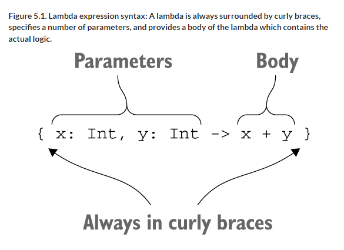
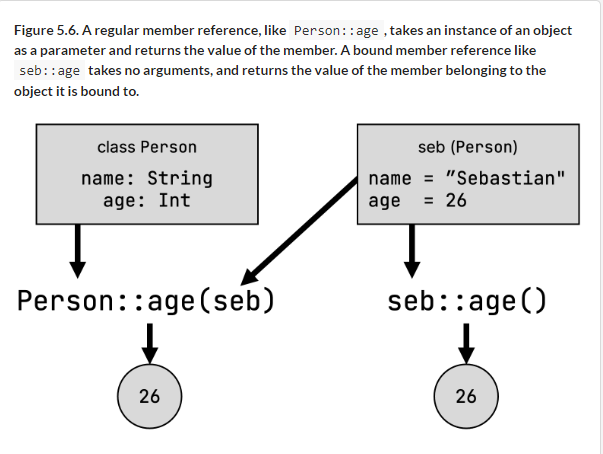
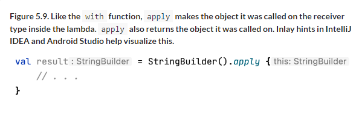
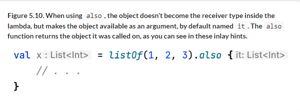

# 5 Programming with lambdas

::: tip This chapter covers

- Using lambda expressions and member references to pass snippets of code and behavior to functions
- Defining functional interfaces in Kotlin and using Java functional interfaces
- Using lambdas with receivers

:::

Lambda expressions, or simply lambdas, are essentially small chunks of code that can be passed to other functions. With lambdas, you can easily extract common code structures into library functions, allowing you to reuse more code and be more expressive while you’re at it. The Kotlin standard library makes heavy use of them. In this chapter, you’ll learn what a lambda is, see examples of some typical use cases for lambda functions, what they look like in Kotlin, and their relationship to member references.

You’ll also see how lambdas are fully interoperable with Java APIs and libraries—even those that weren’t originally designed with lambdas in mind—and how you can use functional interfaces in Kotlin to make code dealing with function types even more expressive. Finally, we’ll look at lambdas with receivers--a special kind of lambdas where the body is executed in a different context than the surrounding code.

## 5.1 Lambda expressions and member references

The introduction of lambdas to Java 8 was one of the longest-awaited changes in the evolution of the language. Why was it such a big deal? In this section, you’ll find out why lambdas are so useful and what the syntax of lambda expressions in Kotlin looks like.

### 5.1.1 Introduction to lambdas: blocks of code as values

Passing and storing pieces of behavior in your code is a frequent task. For example, you often need to express ideas like "When an event happens, run this handler" or "Apply this operation to all elements in a data structure." In older versions of Java, you could accomplish this through anonymous inner classes. While anonymous inner classes get the job done, they require verbose syntax.

There is another approach to solve this problem: the ability to treat functions as values. Instead of declaring a class and passing an instance of that class to a function, you can pass a function directly. With lambda expressions, the code is even more concise. You don’t need to declare a function: instead, you can, effectively, pass a block of code directly as a function parameter. This approach of treating functions as values and combining functions to express behavior is also one of the main pillars of functional programming.

::: info **A quick refresher on functional programming**

In 1.2.3, we already briefly talked about Kotlin’s nature as a multi-paradigm language, and the benefits that functional programming can bring to your projects: succinctness, a focus on immutability, and an even stronger power of abstraction. To refresh your memory, here are some of the hallmarks of functional programming again:

- First-class functions— Functions (pieces of behavior) are treated as values. You can store them in variables, pass them as parameters, or return them from other functions. Lambdas, as you will explore them in this chapter, is one of Kotlin’s language features that enables comfortably treating functions as first-class.
- Immutability—You design your objects in a way that guarantees their internal state can’t change after their creation: They cannot mutate.
- No side effects—You structure your functions to return the same result given the same inputs without modifying the state of other objects or the outside world. Such functions are called pure.

:::

Let’s look at an example to illustrate where the approach of using lambda expressions really shines. Imagine that you need to define the behavior for clicking a button. To do so, a Button object may require you to pass an instance of the corresponding OnClickListener interface that is responsible for handling the click. This interface specifies one method, onClick. In Kotlin, you could implement it by using an object declaration, as introduced in 4.4.1:

Listing 5.1. Implementing a listener with an object declaration.

```kotlin
button.setOnClickListener(object: OnClickListener {
    override fun onClick(v: View) {
        println("I was clicked!")
    }
})
```

The verbosity required to declare an object like this becomes irritating when repeated many times. A notation to express just the behavior—what should be done on clicking—helps you eliminate redundant code: You can rewrite the snippet above using a lambda.

Listing 5.2. Implementing a listener with a lambda.

```kotlin
button.setOnClickListener {
    println("I was clicked!")
}
```

This Kotlin code does the same thing as using an anonymous object, but is more concise and readable. We’ll discuss the details of this example (and why it can be used to implement an interface like OnClickListener) later in this section.

You saw how a lambda can be used as an alternative to an anonymous object with only one method. Let’s now continue and briefly explore another classical use of lambda expressions: working with collections.

### 5.1.2 Lambdas and collections

One of the main tenets of good programming style is to avoid duplication in your code. Most of the tasks we perform with collections follow a few common patterns. Lambdas enable Kotlin to provide a good, convenient standard library that provides powerful functionality to work with collections.

Let’s look at an example. You’ll use the Person class that contains information about a person’s name and age.

```kotlin
data class Person(val name: String, val age: Int)
```

Suppose you have a list of people, and you need to find the oldest of them. If you had no experience with lambdas, you might rush to implement the search manually. You’d introduce two intermediate variables—one to hold the maximum age and another to store the first found person of this age—and then iterate over the list, updating these variables.

Listing 5.3. Searching through a collection manually via a for-loop

```kotlin
fun findTheOldest(people: List<Person>) {
    var maxAge = 0
    var theOldest: Person? = null
    for (person in people) {
        if (person.age > maxAge) {
            maxAge = person.age
            theOldest = person
        }
    }
    println(theOldest)
}

fun main() {
    val people = listOf(Person("Alice", 29), Person("Bob", 31))
    findTheOldest(people)
    // Person(name=Bob, age=31)
}
```

With enough experience, you can bang out such loops pretty quickly. But there’s quite a lot of code here, and it’s easy to make mistakes. For example, you might get the comparison wrong and find the minimum element instead of the maximum.

In Kotlin, there’s a better way. You can use a function from the standard library, as shown next.

Listing 5.4. Searching through a collection by using the maxByOrNull function from the standard library with a lambda

```kotlin
fun main() {
    val people = listOf(Person("Alice", 29), Person("Bob", 31))
    println(people.maxByOrNull { it.age })
    // Person(name=Bob, age=31)
}
```

The `maxByOrNull` function can be called on any collection and takes one argument: the function that specifies what values should be compared to find the maximum element. The code in curly braces `{ it.age }` is a lambda implementing this "selector logic": It receives a collection element as an argument and returns a value to compare. Because the lambda only takes one argument (the collection item) and we don’t specify an explicit name for it, we refer to it using the implicit name `it`. In this example, the collection element is a `Person` object, and the value to compare is its age, stored in the `age` property.

If a lambda just delegates to a function or property, it can be replaced by a member reference.

Listing 5.5. Searching using a member reference

```kotlin
people.maxByOrNull(Person::age)
```

This code means the same thing as 5.4. 5.1.5 will cover the details.

Most of the things we typically do with collections can be concisely expressed with library functions taking lambdas or member references. The resulting code is much shorter and easier to understand, and often communicates your intent (that is, what your code is trying to achieve) more clearly than its loop-based counterpart. To help you start getting used to it, let’s look at the syntax for lambda expressions. Later, in 6, we will take a more detailed look at what functionality is available to you out for manipulating collections using lambdas.

### 5.1.3 Syntax for lambda expressions

As we’ve mentioned, a lambda encodes a small piece of behavior that you can pass around as a value. It can be declared independently and stored in a variable. But more frequently, it’s declared directly when passed to a function. 5.1 shows the syntax for declaring lambda expressions.

Figure 5.1. Lambda expression syntax: A lambda is always surrounded by curly braces, specifies a number of parameters, and provides a body of the lambda which contains the actual logic.



A lambda expression in Kotlin is always surrounded by curly braces. Note that there are no parentheses around the arguments. The arrow separates the argument list from the body of the lambda.

You can store a lambda expression in a variable and then treat this variable like a normal function (call it with the corresponding arguments):

```kotlin
fun main() {
    val sum = { x: Int, y: Int -> x + y }
    println(sum(1, 2))
    // 3
}
```

If you want to, you can call the lambda expression directly:

```kotlin
fun main() {
    { println(42) }()
    // 42
}
```

But such syntax isn’t readable and doesn’t make much sense (it’s equivalent to executing the lambda body directly). If you need to enclose a piece of code in a block, you can use the library function run that executes the lambda passed to it:

```kotlin
fun main() {
    run { println(42) }
    // 42
}
```

The run function becomes especially useful when you need to execute a block of several statements in a place where an expression is expected. Consider a declaration of a top-level variable that performs some setup or does some additional work:

```kotlin
val myFavoriteNumber = run {
    println("I'm thinking!")
    println("I'm doing some more work...")
    42
}
```

In Chapter 10, you’ll learn why such invocations—unlike the creation of a lambda expression and calling it directly via `{…}()`—have no runtime overhead and are as efficient as built-in language constructs. Let’s return to 5.4, which finds the oldest person in a list:

```kotlin
fun main() {
    val people = listOf(Person("Alice", 29), Person("Bob", 31))
    println(people.maxByOrNull { it.age })
    // Person(name=Bob, age=31)
}
```

If you rewrite this example without using any syntax shortcuts, you get the following:

```kotlin
people.maxByOrNull({ p: Person -> p.age })
```

It should be clear what happens here: the piece of code in curly braces is a lambda expression, and you pass it as an argument to the function. The lambda expression takes one argument of type Person and returns its age.
But this code is verbose. First, there’s too much punctuation, which hurts

readability. Second, the type can be inferred from the context and therefore omitted. Last, you don’t need to assign a name to the lambda argument in this case.

Let’s make these improvements, starting with the braces. In Kotlin, a syntactic convention lets you move a lambda expression out of parentheses if it’s the last argument in a function call. In this example, the lambda is the only argument, so it can be placed after the parentheses:

```kotlin
people.maxByOrNull() { p: Person -> p.age }
```

When the lambda is the only argument to a function, you can also remove the empty parentheses from the call:

```kotlin
people.maxByOrNull { p: Person -> p.age }
```

All three syntactic forms mean the same thing, but the last one is the easiest to read. If a lambda is the only argument, you’ll definitely want to write it without the parentheses. If a function takes several arguments, and only the last argument is a lambda, it’s also considered good style in Kotlin to keep the lambda outside the parentheses. If you want to pass two or more lambdas, you can’t move more than one out, so it’s usually better to keep all of them inside the parentheses.

Figure 5.2. You simplified your maxByOrNull call to get the oldest person from the people collection in six steps. You first moved the lambda out of the parentheses (1), removed the now empty pair of parentheses (2), used the Kotlin compiler’s type inference instead of specifying the parameter type for p explicitly (3), and used the implicit name for the only lambda parameter it (5). You also learned an additional shorthand in the form of member references (6).


To see what these options look like with a more complex call, let’s go back to the joinToString function that you used extensively in 3. It’s also defined in the Kotlin standard library, with the difference that the standard library version takes a function as an additional parameter. This function can be used to convert an element to a string differently than its toString function.
Here’s how you can use it to print names only.

Listing 5.6. Passing a lambda as a named argument

```kotlin
fun main() {
    val people = listOf(Person("Alice", 29), Person("Bob", 31))
    val names = people.joinToString(
        separator = " ",
        transform = { p: Person -> p.name }
    )
    println(names)
    // Alice Bob
}
```

And here’s how you can rewrite that call with the lambda outside the parentheses.

Listing 5.7. Passing a lambda outside of parentheses

```kotlin
people.joinToString(" ") { p: Person -> p.name }
```

5.6 uses a named argument to pass the lambda, making it clear what the lambda is used for. 5.7 is more concise, but it doesn’t express explicitly what the lambda is used for, so it may be harder to understand for people not familiar with the function being called.

::: info Moving lambda arguments in IntelliJ IDEA and Android Studio

IntelliJ IDEA and Android Studio allow you to automatically convert between the two syntactic forms of where to place a last-argument lambda.To convert one form to the other, place your cursor on the lambda. Press `Alt + Enter` (or `Option + Return` on macOS) or click the floating yellow lightbulb icon, and select "Move lambda argument out of parentheses" and "Move lambda argument into parentheses."

Figure 5.3. The "move lambda" intention actions allow you to


:::

Let’s move on with simplifying the syntax and get rid of the parameter type.

Listing 5.8. Omitting lambda parameter type: Often, the Kotlin compiler can infer the type of the variables accepted by the lambda.

```kotlin
people.maxByOrNull { p: Person -> p.age }
people.maxByOrNull { p -> p.age }
```

As with local variables, if the type of a lambda parameter can be inferred, you don’t need to specify it explicitly. With the maxByOrNull function, the parameter type is always the same as the collection element type. The compiler knows you’re calling maxByOrNull on a collection of Person objects, so it can understand that the lambda parameter will also be of type Person.
There are cases when the compiler can’t infer the lambda parameter type, but we won’t discuss them here. The simple rule you can follow is to always start without the types; if the compiler complains, specify them.

You can specify only some of the argument types while leaving others with just names. Doing so may be convenient if the compiler can’t infer one of the

types or if an explicit type improves readability.

The last simplification you can make in this example is to replace a parameter with the default parameter name: `it`. This name is generated if the context expects a lambda with only one argument, and its type can be inferred.

Listing 5.9. Using the default parameter name it

```kotlin
people.maxByOrNull { it.age }
```

This default name is generated only if you don’t specify the argument name explicitly.

::: warning Note

The `it` convention is great for shortening your code, but you shouldn’t abuse it. In particular, in the case of nested lambdas, it’s better to declare the parameter of each lambda explicitly; otherwise it’s difficult to understand which value the `it` refers to (and you will get a warning along the lines of "Implicit parameter `it` of enclosing lambda is shadowed"). It’s useful also to declare parameters explicitly if the meaning or the type of the parameter isn’t clear from the context.

:::

If you store a lambda in a variable, there’s no context from which to infer the parameter types, so you have to specify them explicitly:

```kotlin
val getAge = { p: Person -> p.age }
people.maxByOrNull(getAge)
```

So far, you’ve only seen examples with lambdas that consist of one expression or statement. But lambdas aren’t constrained to such a small size and can contain multiple statements. In this case, the last expression is the result—no explicit `return` statement needed:

```kotlin
fun main() {
    val sum = { x: Int, y: Int ->
       println("Computing the sum of $x and $y...")
       x + y
    }
    println(sum(1, 2))
    // Computing the sum of 1 and 2...
    // 3
}
```

Next, let’s talk about a concept that often goes side-by-side with lambda expressions: capturing variables from the context.

### 5.1.4 Accessing variables in scope

You know that when you declare an anonymous inner class in a function, you can refer to parameters and local variables of that function from inside the class. With lambdas, you can do exactly the same thing. If you use a lambda in a function, you can access the parameters of that function as well as the local variables declared before the lambda.

To demonstrate this, let’s use the forEach standard library function. It’s one of the most basic collection-manipulation functions; all it does is call the given lambda on every element in the collection. The forEach function is somewhat more concise than a regular for loop, but it doesn’t have many other advantages, so you don’t need to rush to convert all your loops to lambdas.

The following listing takes a list of messages and prints each message with the same prefix.

Listing 5.10. Using function parameters in a lambda: A lambda defined inside a function can access the parameters of that function, and all local variables that were declared before that lambda.

```kotlin
fun printMessagesWithPrefix(messages: Collection<String>, prefix: String) {
    messages.forEach {
        println("$prefix $it")
    }
}

fun main() {
    val errors = listOf("403 Forbidden", "404 Not Found")
    printMessagesWithPrefix(errors, "Error:")
    // Error: 403 Forbidden
    // Error: 404 Not Found
}
```

Figure 5.4. The forEach lambda can access the prefix variable defined in the surrounding scope, and any other variables defined in surrounding scopes—all the way up to the surrounding class and file scopes.


One important difference between Kotlin and Java is that in Kotlin, you aren’t restricted to accessing final variables: You can also modify variables from within a lambda. In the next listing, you’re counting the number of client and server errors in a given collection of response status codes. You do so by incrementing the clientErrors and serverErrors variables defined in the printProblemCounts functions from within the forEach lambda:

Listing 5.11. Changing local variables from a lambda

```kotlin
fun printProblemCounts(responses: Collection<String>) {
    var clientErrors = 0
    var serverErrors = 0
    responses.forEach {
        if (it.startsWith("4")) {
            clientErrors++
        } else if (it.startsWith("5")) {
            serverErrors++
        }
    }
    println("$clientErrors client errors, $serverErrors server errors")
}

fun main() {
    val responses = listOf("200 OK", "418 I'm a teapot",
                           "500 Internal Server Error")
    printProblemCounts(responses)
    // 1 client errors, 1 server errors
}
```

Kotlin, unlike Java, allows you to access non-final variables and even modify them in a lambda. External variables accessed from a lambda, such as prefix, clientErrors, and serverErrors in these examples, are said to be captured by the lambda.

Note that, by default, the lifetime of a local variable is constrained by the function in which the variable is declared. But if it’s captured by the lambda, the code that uses this variable can be stored and executed later. You may ask how this works. When you capture a final variable, its value is stored together with the lambda code that uses it. For non-final variables, the value is enclosed in a special wrapper that lets you change it, and the reference to the wrapper is stored together with the lambda.

::: info **Capturing a mutable variable: implementation details**

Java allows you to capture only final variables. When you want to capture a mutable variable, you can use one of the following tricks: either declare an array of one element in which to store the mutable value, or create an instance of a wrapper class that stores the reference that can be changed. If you used this technique explicitly in Kotlin, the code would be as follows:

```kotlin
class Ref<T>(var value: T)

fun main() {
    val counter = Ref(0)
    val inc = { counter.value++ }
}
```

In real code, you don’t need to create such wrappers. Instead, you can mutate the variable directly:

```kotlin
fun main() {
    var counter = 0
    val inc = { counter++ }
}
```

How does it work? The first example shows how the second example works under the hood. Any time you capture a final variable (`val`), its value is copied, as in Java. When you capture a mutable variable (`var`), its value is stored as an instance of a `Ref` class. The `Ref` variable is final and can be easily captured, whereas the actual value is stored in a field and can be changed from the lambda.

:::

An important caveat is that, if a lambda is used as an event handler or is otherwise executed asynchronously, the modifications to local variables will occur only when the lambda is executed. For example, the following code isn’t a correct way to count button clicks:

```kotlin
fun tryToCountButtonClicks(button: Button): Int {
    var clicks = 0
    button.onClick { clicks++ }
    return clicks
}
```

This function will always return 0. Even though the onClick handler will modify the value of clicks, you won’t be able to observe the modification, because the onClick handler will be called after the function returns. A correct implementation of the function would need to store the click count not in a local variable, but in a location that remains accessible outside the function—for example, in a property of a class.

We’ve discussed the syntax for declaring lambdas and how variables are captured in lambdas. Now let’s talk about member references, a feature that lets you easily pass references to existing functions.

### 5.1.5 Member references

You’ve seen how lambdas allow you to pass a block of code as a parameter to a function. But what if the code that you need to pass as a parameter is already defined as a function? Of course, you can pass a lambda that calls that function, but doing so is somewhat redundant. Can you pass the function directly?

In Kotlin, just like in Java 8, you can do so if you convert the function to a value. You use the `::` operator for that:

```kotlin
val getAge = Person::age
```

This expression is called member reference, and it provides a short syntax for creating a function value that calls exactly one method or accesses a property. A double colon separates the name of a class from the name of the member you need to reference (a method or property), as shown in 5.5.

Figure 5.5. Member reference syntax


This is a more concise expression of a lambda that does the same thing:

```kotlin
val getAge = { person: Person -> person.age }
```

Note that, regardless of whether you’re referencing a function or a property, you shouldn’t put parentheses after its name in a member reference. After all, you’re not invoking it, but working with a reference to it.

A member reference has the same type as a lambda that calls that function, so you can use the two interchangeably:

```kotlin
people.maxByOrNull(Person::age)
people.maxByOrNull { person: Person -> person.age }
```

You can have a reference to a function that’s declared at the top level (and isn’t a member of a class), as well:

```kotlin
fun salute() = println("Salute!")

fun main() {
    run(::salute)
    // Salute!
}
```

In this case, you omit the class name and start with `::`. The member reference
`::salute` is passed as an argument to the library function `run`, which calls the corresponding function.

When a lambda delegates to a function which takes several parameters, it’s especially convenient to provide a member reference—it lets you avoid repeating the parameter names and their types:

```kotlin
val action = { person: Person, message: String ->
    sendEmail(person, message)
}
val nextAction = ::sendEmail
```

You can store or postpone the action of creating an instance of a class using a constructor reference. The constructor reference is formed by specifying the class name after the double colons:

```kotlin
data class Person(val name: String, val age: Int)

fun main() {
    val createPerson = ::Person
    val p = createPerson("Alice", 29)
    println(p)
    // Person(name=Alice, age=29)
}
```

Note that you can also reference extension functions in the same way:

```kotlin
fun Person.isAdult() = age >= 21
val predicate = Person::isAdult
```

Although isAdult isn’t a member of the Person class, you can access it via reference, just as you can access it as a member on an instance: person.isAdult().

### 5.1.6 Bound callable references

```kotlin
fun main() {
    val seb = Person("Sebastian", 26)
    val personsAgeFunction = Person::age
    println(personsAgeFunction(seb))
    // 26
    val sebsAgeFunction = seb::age
    println(sebsAgeFunction())
    // 26
}
```

As you can see, the way we defined `sebsAgeFunction` in this example
—`seb::age`—is equivalent to writing the lambda `{ seb.age }` explicitly, but more concise.

Figure 5.6. A regular member reference, like `Person::age`, takes an instance of an object as a parameter and returns the value of the member. A bound member reference like seb::age takes no arguments, and returns the value of the member belonging to the object it is bound to.



In the following section, we’ll look at many library functions that work great with lambda expressions, as well as member references.

We’ve thoroughly discussed a frequently used application of lambda expressions: using them to simplify manipulating collections. Now let’s continue with another important topic: using lambdas with an existing Java API.

## 5.2 Using Java functional interfaces: Single Abstract Methods (SAM)

There are already a lot of libraries in the JVM ecosystem written in Kotlin, and those libraries can directly make use of Kotlin’s lambdas. However, there is a good chance you may want to use a library written in Java in your Kotlin project. The good news is that Kotlin lambdas are fully interoperable with Java APIs. In this section, you’ll see exactly how this works.

At the beginning of the chapter, you saw an example of passing a lambda to a Java method:

```kotlin
button.setOnClickListener {
    println("I was clicked!")
}
```

The Button class sets a new listener to a button via an setOnClickListener
method that takes an argument of type OnClickListener:

```kotlin
/* Java */
public class Button {
    public void setOnClickListener(OnClickListener l) { ... }
}
```

The OnClickListener interface declares one method, onClick:

```kotlin
/* Java */
public interface OnClickListener {
    void onClick(View v);
}
```

Depending on the Java version, implementing the OnClickListener interface can be quite involved: Prior to Java 8, you had to create a new instance of an anonymous class to pass it as an argument to the setOnClickListener method:

```kotlin
/* Before Java 8 */
button.setOnClickListener(new OnClickListener() {
    @Override
    public void onClick(View v) {
        ...
    }
}

/* Only since Java 8 */
button.setOnClickListener(view -> { ... });
```

In Kotlin, you simply pass a lambda:

```kotlin
button.setOnClickListener { view -> ... }
```

The lambda used to implement OnClickListener has one parameter of type
View, as in the onClick method. The mapping is illustrated in 5.7.

Figure 5.7. Parameters of the lambda correspond to method parameters.


This works because the OnClickListener interface has only one abstract method. Such interfaces are called functional interfaces, or SAM interfaces, where SAM stands for single abstract method. The Java API is full of functional interfaces like Runnable and Callable, as well as methods working with them. Kotlin allows you to use lambdas when calling Java methods that take functional interfaces as parameters, ensuring that your Kotlin code remains clean and idiomatic.

Let’s look in detail at what happens when you pass a lambda to a method that expects an argument of a functional interface type.

### 5.2.1 Passing a lambda as a parameter to a Java method

You can pass a lambda to any Java method that expects a functional interface. For example, consider this method, which has a parameter of type `Runnable`:

```kotlin
/* Java */
void postponeComputation(int delay, Runnable computation);
```

In Kotlin, you can invoke it and pass a lambda as an argument. The compiler will automatically convert it into an instance of `Runnable`:

```kotlin
postponeComputation(1000) { println(42) }
```

Note that when we say "an instance of Runnable," what we mean is "an instance of an anonymous class implementing Runnable." The compiler will create that for you and will use the lambda as the body of the single abstract method—the run method, in this case.

You can achieve the same effect by creating an anonymous object that implements Runnable explicitly:

```kotlin
postponeComputation(1000, object : Runnable {
    override fun run() {
        println(42)
    }
})
```

But there’s a difference. When you explicitly declare an object, a new instance is created on each invocation. With a lambda, the situation is different: if the lambda doesn’t access any variables from the function where it’s defined, the corresponding anonymous class instance is reused between calls:

```kotlin
postponeComputation(1000) { println(42) }
```

If the lambda captures variables from the surrounding scope, it’s no longer

possible to reuse the same instance for every invocation. In that case, the compiler creates a new object for every call and stores the values of the captured variables in that object. For example, in the following function, every invocation uses a new Runnable instance, storing the id value as a field:

```kotlin
fun handleComputation(id: String) {
    postponeComputation(1000) {
        println(id)
    }
}
```

Note that the discussion of creating an anonymous class and an instance of this class for a lambda is valid for Java methods expecting functional interfaces, but does not apply to working with collections using Kotlin extension methods. If you pass a lambda to a Kotlin function that’s marked inline, no anonymous classes are created. And most of the library functions are marked inline. Details of how this works are discussed in Chapter 10.
As you’ve seen, in most cases the conversion of a lambda to an instance of a functional interface happens automatically, without any effort on your part. But there are cases when you need to perform the conversion explicitly. Let’s see how to do that.

## 5.2.2 SAM constructors: explicit conversion of lambdas to functional interfaces

A SAM constructor is a compiler-generated function that lets you perform an explicit conversion of a lambda into an instance of an interface with a single abstract method. You can use it in contexts when the compiler doesn’t apply the conversion automatically. For instance, if you have a method that returns an instance of a functional interface, you can’t return a lambda directly; you need to wrap it into a SAM constructor. Here’s a simple example.

Listing 5.12. Using a SAM constructor to return a value

```kotlin
fun createAllDoneRunnable(): Runnable {
    return Runnable { println("All done!") }
}

fun main() {
    createAllDoneRunnable().run()
    // All done!
}
```

The name of the SAM constructor is the same as the name of the underlying functional interface. The SAM constructor takes a single argument—a lambda that will be used as the body of the single abstract method in the functional interface—and returns an instance of the class implementing the interface.

In addition to returning values, SAM constructors are used when you need to store a functional interface instance generated from a lambda in a variable.
Suppose you want to reuse one listener for several buttons, as in the following listing (in an Android application, this code can be a part of the `Activity.onCreate` method).

Listing 5.13. Using a SAM constructor to reuse a listener instance

```kotlin
val listener = OnClickListener { view ->
    val text = when (view.id) {
        R.id.button1 -> "First button"
        R.id.button2 -> "Second button"
        else -> "Unknown button"
    }
    toast(text)
}
button1.setOnClickListener(listener)
button2.setOnClickListener(listener)
```

listener checks which button was the source of the click and behaves accordingly. You could define a listener by using an object declaration that implements OnClickListener, but SAM constructors give you a more concise option.

::: info Lambdas and adding/removing listeners

Note that there’s no `this` in a lambda as there is in an anonymous object: there’s no way to refer to the anonymous class instance into which the lambda is converted. From the compiler’s point of view, the lambda is a

block of code, not an object, and you can’t refer to it as an object. The `this`
reference in a lambda refers to a surrounding class.

If your event listener needs to unsubscribe itself while handling an event, you can’t use a lambda for that. Use an anonymous object to implement a listener, instead. In an anonymous object, the `this` keyword refers to the instance of that object, and you can pass it to the API that removes the listener.

:::

Also, even though SAM conversion in method calls typically happens automatically, there are cases when the compiler can’t choose the right overload when you pass a lambda as an argument to an overloaded method. In those cases, applying an explicit SAM constructor is a good way to resolve the compilation error.

## 5.3 Defining SAM interfaces in Kotlin: "fun" interfaces

In Kotlin, you can often use function types to express behavior where you would otherwise have to use a functional interface. In Chapter 11, we’ll see a way to give more expressive names to function types in Kotlin through type aliases.

However, there may be a few cases where you want to be more explicit in your code. By declaring a fun interface in Kotlin, you can define your own functional interfaces.

Functional interfaces in Kotlin contain exactly one abstract method, but can also contain several additional non-abstract methods. This can help you express more complex constructs which you couldn’t fit into a function type’s signature.

In this example, you define a functional interface called IntCondition with an abstract method check. You define an additional, non-abstract method called checkString, which invokes check after converting its parameter to an integer. Like with Java SAMs, you use the SAM constructor to instantiate the interface with a lambda that specifies the implementation of check:

Listing 5.14. A functional interface in Kotlin contains exactly one abstract method, but may contain additional non-abstract methods.

```kotlin
fun interface IntCondition {
    fun check(i: Int): Boolean
    fun checkString(s: String) = check(s.toInt())
    fun checkChar(c: Char) = check(c.digitToInt())
}

fun main() {
    val isOdd = IntCondition { it % 2 != 0 }
    println(isOdd.check(1))
    // true
    println(isOdd.checkString("2"))
    // false
    println(isOdd.checkChar('3'))
    // true
}
```

When a function accepts a parameter whose type is defined as a `fun interface`, you may once again also just provide a lambda implementation directly, or pass a reference to a lambda, both of which dynamically instantiate the interface implementation.

In the following example, you’re defining a `checkCondition` function that takes an `IntCondition` as we previoulsy defined it. You then have multiple options of calling that function, for example by passing a lambda directly, or by passing a reference to a function that has the correct type (`(Int) → Boolean`):

Listing 5.15. Whether you pass a lambda directly or pass a reference to a function with the correct signature, the functional interface is dynamically instantiated.

```kotlin
fun checkCondition(i: Int, condition: IntCondition): Boolean {
    return condition.check(i)
}

fun main() {
    checkCondition(1) { it % 2 != 0 }
    // true
    val isOdd: (Int) -> Boolean =  { it % 2 != 0 }
    checkCondition(1, isOdd)
    // true
}
```

::: info Cleaner Java call sites with functional interfaces

If you’re writing code that you expect to be used from both Java and Kotlin code, using a `fun interface` can also improve the cleanliness of the Java call sites. Kotlin function types are translated as objects whose generic types are the parameters and return types. For functions that don’t return anything, Kotlin uses Unit as its analog to Java’s void (we will talk about neccessity and usefulness of the Unit type in more depth in 8.1.6).

That also means that when such a Kotlin function type is invoked from Java, the caller needs to explicitly return `Unit.INSTANCE`. Using a `fun interface` takes that requirement away, making the call site more concise. In this example, the functions `consumeHello` and `consumeHelloFunctional` do the same thing, but are defined once using a functional interface, and once using Kotlin functional types:

```kotlin
fun interface StringConsumer {
    fun consume(s: String)
}

fun consumeHello(t: StringConsumer) {
    t.consume("Hello")
}

fun consumeHelloFunctional(t: (String) -> Unit) {
    t("Hello")
}
```

When used from Java, the variant of the function using a `fun interface` can be called with a simple lambda, whereas the variant using Kotlin functional types requires the lambda to explicitly return Kotlin’s `Unit.INSTANCE`:

```kotlin
import kotlin.Unit;

public class MyApp {
    public static void main(String[] args) {
        /* Java */
        MainKt.consumeHello(s -> System.out.println(s.toUpperCase()));
        MainKt.consumeHelloFunctional(s -> {
            System.out.println(s.toUpperCase());
            return Unit.INSTANCE;
        });
    }
}
```

:::

As a general rule of thumb, simple functional types work well if your API can accept any function that takes a specific set of parameters and returns a specific type. When you need to express more complex contracts, or operations that you can’t express in a functional type signature, a functional interface is a good choice.

We’ll further discuss the use of function types in function declarations in
Chapter 10, and take a closer look at typealiases in Kotlin in Chapter 11.

To finish our discussion of lambda syntax and usage, let’s look at lambdas with receivers and how they’re used to define convenient library functions that look like built-in constructs.

## 5.4 Lambdas with receivers: "with", "apply", and "also"

This section demonstrates the with and apply functions from the Kotlin standard library. These functions are convenient, and you’ll find many uses for them even without understanding how they’re declared. Later, in Chapter 13, you’ll see how you can declare similar functions for your own needs. The explanations in this section, however, help you become familiar with a unique feature of Kotlin’s lambdas that isn’t available with Java: the ability to call methods of a different object in the body of a lambda without any additional qualifiers. Such lambdas are called lambdas with receivers. Let’s begin by looking at the with function, which uses a lambda with a receiver.

### 5.4.1 Performing multiple operations on the same object: "with"

Many languages have special statements you can use to perform multiple operations on the same object without repeating its name. Kotlin also has this facility, but it’s provided as a library function called with, not as a special language construct.

To see how it can be useful, consider the following example, which you’ll then refactor using `with`.

Listing 5.16. Building the alphabet

```kotlin
fun alphabet(): String {
    val result = StringBuilder()
    for (letter in 'A'..'Z') {
         result.append(letter)
    }
    result.append("\nNow I know the alphabet!")
    return result.toString()
}

fun main() {
    println(alphabet())
    // ABCDEFGHIJKLMNOPQRSTUVWXYZ
    // Now I know the alphabet!
}
```

In this example, you call several different methods on the result instance and repeating the result name in each call. This isn’t too bad, but what if the expression you were using was longer or repeated more often?

Here’s how you can rewrite the code using with.

Listing 5.17. Using with to build the alphabet

```kotlin
fun alphabet(): String {
    val stringBuilder = StringBuilder()
    return with(stringBuilder) {
        for (letter in 'A'..'Z') {
            this.append(letter)
        }
        this.append("\nNow I know the alphabet!")
        this.toString()
    }
}
```

The `with` structure looks like a special construct, but it’s a function that takes two arguments: `stringBuilder`, in this case, and a lambda. The convention of putting the lambda outside of the parentheses works here, and the entire invocation looks like a built-in feature of the language. Alternatively, you could write this as `with(stringBuilder, { … })`, but it’s less readable.

The with function converts its first argument into a receiver of the lambda that’s passed as a second argument. You can access this receiver via an explicit this reference. Alternatively, as usual for a this reference, you can omit it and access methods or properties of this value without any additional qualifiers.

Figure 5.8. Inside the lambda of the with function, the first argument is available as the receiver type this. IDEs like IntelliJ IDEA and Android Studio have the option to visualize this receiver type via an inlay hint after the opening parenthesis.


In 5.17, this refers to stringBuilder, which is passed to with as the first argument. You can access methods on stringBuilder via explicit this references, as in `this.append(letter)`; or directly, making your code even more concise:

Listing 5.18. You don’t need to specify this explicitly inside the with lambda.

```kotlin
fun alphabet(): String {
    val stringBuilder = StringBuilder()
    return with(stringBuilder) {
        for (letter in 'A'..'Z') {
            append(letter)
        }
        append("\nNow I know the alphabet!")
        toString()
    }
}
```

::: info Lambdas with receiver and extension functions

You may recall that you saw a similar concept with `this` referring to the function receiver. In the body of an extension function, `this` refers to the instance of the type the function is extending, and it can be omitted to give you direct access to the receiver’s members.

Note that an extension function is, in a sense, a function with a receiver. The following analogy can be applied:

| Regular function   | Regular lambda         |
|--------------------|------------------------|
| Extension function | Lambda with a receiver |

A lambda is a way to define behavior similar to a regular function. A lambda with a receiver is a way to define behavior similar to an extension function.

:::

Let’s refactor the initial alphabet function even further and get rid of the extra stringBuilder variable.

Listing 5.19. Using with and an expression body to build the alphabet

```kotlin
fun alphabet() = with(StringBuilder()) {
    for (letter in 'A'..'Z') {
        append(letter)
    }
    append("\nNow I know the alphabet!")
    toString()
}
```

This function now only returns an expression, so it’s rewritten using the expression-body syntax. You create a new instance of `StringBuilder` and pass it directly as an argument, and then you reference it without the explicit `this` in the lambda.

::: info Method-name conflicts

What happens if the object you pass as a parameter to with has a method with the same name as the class in which you’re using with? In this case, you can add an explicit label to the this reference to specify which method you need to call.

Imagine that the alphabet function is a method of the class OuterClass. If you need to refer to the toString method defined in the outer class instead of the one in StringBuilder, you can do so using the following syntax:

```kotlin
this@OuterClass.toString()
```

:::

The value that with returns is the result of executing the lambda code. The result is the last expression in the lambda. But sometimes you want the call to return the receiver object, not the result of executing the lambda. That’s where the apply library function can be of use.

### 5.4.2 Initializing and configuring objects: "apply"

The apply function works almost exactly the same as with ; the only difference is that apply always returns the object passed to it as an argument (in other words, the receiver object). Let’s refactor the alphabet function again, this time using apply.

Listing 5.20. Using apply to build the alphabet

```kotlin
fun alphabet() = StringBuilder().apply {
    for (letter in 'A'..'Z') {
        append(letter)
    }
    append("\nNow I know the alphabet!")
}.toString()
```

You can call the apply function as an extension function on any type – in this case, you’re calling it on your newly created StringBuilder instance. Its receiver becomes the receiver of the lambda passed as an argument. The result of executing apply is StringBuilder, so you call toString to convert it to String afterward.

Figure 5.9. Like the with function, apply makes the object it was called on the receiver type inside the lambda. apply also returns the object it was called on. Inlay hints in IntelliJ IDEA and Android Studio help visualize this.



One of many cases where this is useful is when you’re creating an instance of an object and need to initialize some properties right away. In Java, this is usually accomplished through a separate Builder object; and in Kotlin, you can use apply on any object without any special support from the library where the object is defined.

To see how apply is used for such cases, let’s look at an example that creates an Android TextView component with some custom attributes.

Listing 5.21. Using apply to initialize a TextView

```kotlin
fun createViewWithCustomAttributes(context: Context) =
    TextView(context).apply {
        text = "Sample Text"
        textSize = 20.0
        setPadding(10, 0, 0, 0)
    }
```

The apply function allows you to use the compact expression body style for the function. You create a new TextView instance and immediately pass it to apply. In the lambda passed to apply, the TextView instance becomes the receiver, so you can call methods and set properties on it. After the lambda is executed, apply returns that instance, which is already initialized; it becomes the result of the createViewWithCustomAttributes function.

The with and apply functions are basic generic examples of using lambdas with receivers. More specific functions can also use the same pattern. For example, you can simplify the alphabet function even further by using the buildString standard library function, which will take care of creating a StringBuilder and calling toString. The argument of buildString is a lambda with a receiver, and the receiver is always a StringBuilder.

Listing 5.22. Using buildString to build the alphabet

```kotlin
fun alphabet() = buildString {
    for (letter in 'A'..'Z') {
        append(letter)
    }
    append("\nNow I know the alphabet!")
}
```

The buildString function is an elegant solution for the task of creating a String with the help of StringBuilder. The Kotlin standard library also comes with collection builder functions, which help you create a read-only , List, Set or Map while allowing you to treat the collection as mutable during the construction phase:

Listing 5.23. Using buildList and buildMap to create collections

```kotlin
val fibonacci = buildList {
    addAll(listOf(1, 1, 2))
    add(3)
    add(index = 0, element = 3)
}

val shouldAdd = true

val fruits = buildSet {
    add("Apple")
    if(shouldAdd) {
        addAll(listOf("Apple", "Banana", "Cherry"))
    }
}

val medals = buildMap<String, Int> {
    put("Gold", 1)
    putAll(listOf("Silver" to 2, "Bronze" to 3))
}
```

### 5.4.3 Performing additional actions with an object: "also"

Just like `apply`, you can use the `also` function to take a receiver object, perform an action on it, and then return the receiver object. The main difference is that within the lambda of `also`, you access the receiver object as an argument – either by giving it a name, or by using the default name `it`. This makes `also` a good fit for running actions that take the original receiver object as an argument (as opposed to operations that work on the object’s properties and functions). When you see `also` in the code, you can interpret it as executing additional effects: "…and also do the following with the object."

Figure 5.10. When using `also`, the object doesn’t become the receiver type inside the lambda, but makes the object available as an argument, by default named `it`. The `also` function returns the object it was called on, as you can see in these inlay hints.



In the following example, you’re mapping a collection of fruits to their uppercased names, and also add the result of that mapping to an additional collection. You then filter for those fruits from the collection whose name is longer than five characters, and also print that result, before finally reversing the list:

Listing 5.24. Using also to perform additional effects

```kotlin
fun main() {
    val fruits = listOf("Apple", "Banana", "Cherry")
    val uppercaseFruits = mutableListOf<String>()
    val reversedLongFruits = fruits
        .map { it.uppercase() }
        .also { uppercaseFruits.addAll(it) }
        .filter { it.length > 5 }
        .also { println(it) }
        .reversed()
    // [BANANA, CHERRY]
    println(uppercaseFruits)
    // [APPLE, BANANA, CHERRY]
    println(reversedLongFruits)
    // [CHERRY, BANANA]
}
```

You’ll see more interesting examples for lambdas with receivers in Chapter 13, when we begin discussing domain-specific languages. Lambdas with receivers are great tools for building DSLs; we’ll show you how to use them for that purpose and how to define your own functions that call lambdas with receivers.

## 5.5 Summary

1. Lambdas allow you to pass chunks of code as arguments to functions, so you can easily extract common code structures.
2. Kotlin lets you pass lambdas to functions outside of parentheses to make your code clean and concise.
3. If a lambda only takes a single parameter, you can refer to it with its implicit name it. This saves you the effort of explicitly naming the only lambda parameter in short and simple lambdas.
4. Lambdas can capture external variables. That means you can, for example, use your lambdas to access and modify variables in the function containing the call to the lambda.
5. You can create references to methods, constructors, and properties by prefixing the name of the function with ::. You can pass such references to functions instead of lambdas as a shorthand.
6. To implement interfaces with a single abstract method (also known as SAM interfaces), you can simply pass lambdas instead of having to create an object implementing the interface explicitly.
7. Lambdas with receivers are lambdas that allow you to directly call methods on a special receiver object. Because the body of these lambdas is executed in a different context than the surrounding code, they can help with structuring your code.
8. The with standard library function allows you to call multiple methods on the same object without repeating the reference to the object. apply lets you construct and initialize any object using a builder-style API. also lets you perform additional actions with an object.
