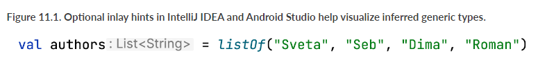
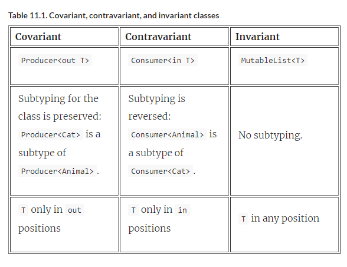

# 11 Generics

::: tip **This chapter covers**

- Declaring generic functions and classes
- Type erasure and reified type parameters
- Declaration-site and use-site variance
- Type aliases

:::

You’ve already seen a few code examples that use generics in this book. The basic concepts of declaring and using generic classes and functions in Kotlin are similar to Java, so the earlier examples should have been clear without a detailed explanation. In this chapter, we’ll return to some of the examples and look at them in more detail.

We’ll then go deeper into the topic of generics and explore new concepts introduced in Kotlin, such as reified type parameters and declaration-site variance. These concepts may be novel to you, but don’t worry; the chapter covers them thoroughly.

**_Reified type parameters_** allow you to refer at runtime to the specific types used as type arguments in an inline function call. (For normal classes or functions, this isn’t possible, because type arguments are erased at runtime.)

**_Declaration-site variance_** lets you specify whether a generic type with a type argument is a subtype or a supertype of another generic type with the same base type and a different type argument. For example, it regulates whether it’s possible to pass arguments of type `List<Int>` to functions expecting `List<Any>`.

**_Use-site variance_** achieves the same goal for a specific use of a generic type and therefore accomplishes the same task as Java’s wildcards.

Let’s discuss these topics in details, starting with generic type parameters in general.

## 11.1 Creating types with type arguments: Generic type parameters

Generics allow you to define types that have **_type parameters_**. When an instance of such a type is created, type parameters are substituted with specific types called **_type arguments_**. For example, if you have a variable of type `List`, it’s useful to know what kind of things are stored in that list. The type parameter lets you specify exactly that—instead of "This variable holds a list," you can say something like "This variable holds a list of strings." Kotlin’s syntax for saying "a list of strings" looks the same as in Java: `List<String>`. You can also declare multiple type parameters for a class. For example, the `Map` class has type parameters for the key type and the value type: class `Map<K, V>`. We can instantiate it with specific arguments: `Map<String, Person>`. So far, everything looks exactly as it does in Java.

Just as with types in general, type arguments can often be inferred by the Kotlin compiler:

```kotlin
val authors = listOf("Sveta", "Seb", "Dima", "Roman")
```

Because the two values passed to the `listOf` function are both strings, the compiler infers that you’re creating a `List<String>`.

Figure 11.1. Optional inlay hints in IntelliJ IDEA and Android Studio help visualize inferred generic types.



On the other hand, if you need to create an empty list, there’s nothing from which to infer the type argument, so you need to specify it explicitly. In the case of creating a list, you have a choice between specifying the type as part of the variable declaration and specifying a type argument for the function that creates a list. The following example shows how this is done:

```kotlin
val readers: MutableList<String> = mutableListOf()

val readers = mutableListOf<String>()
```

These declarations are equivalent. Note that collection-creation functions are covered in 8.2.

::: info **THERE’S NO RAW TYPES IN KOTLIN**

Unlike Java, Kotlin always requires type arguments to be either specified explicitly or inferred by the compiler. Because generics were added to Java only in version 1.5, it had to maintain compatibility with code written for older versions, so it allows you to use a generic type without type arguments—a so-called raw type. For example, in Java, you can declare a variable of type `ArrayList` without specifying what kind of things it contains:

```kotlin
List aList = new ArrayList();
```

Because Kotlin has had generics from the beginning, it doesn't support raw types, and the type arguments must always be defined. If your program receives a variable with a raw type from Java code, it’s treated as having a generic parameter of type `Any!`—a platform type, as you’ve gotten to know them in Platform types.

:::

### 11.1.1 Functions and properties that work with generic types

If you’re going to write a function that works with a list, and you want it to work with any list (a generic one), not a list of elements of a specific type, you need to write **_a generic function_**. A generic function has type parameters of its own. These type parameters must be replaced with the specific type arguments on each function invocation.

Most of the library functions working with collections are generic. For example, let’s look at the `slice` function declaration, shown in 11.2. This function returns a list containing only elements at indices in the specified range.

Figure 11.2. The generic function `slice` has the type parameter `T`, allowing it to work lists of arbitrary elements. This type parameter is used both in the receiver type of the extension function, and the return type of the function.


The function’s type parameter `T` is used in the receiver type and in the return type; both of them are `List<T>`. When you call such a function on a specific list, you can specify the type argument explicitly. But in almost all cases you don’t need to, because the compiler infers it, as shown next.

```kotlin
// Listing 11.1. Calling a generic function

fun main() {
    val letters = ('a'..'z').toList()
    println(letters.slice<Char>(0..2))
    // [a, b, c]
    println(letters.slice(10..13))
    // [k, l, m, n]
}
```

The result type of both of these calls is `List<Char>`. The compiler substitutes the inferred type `Char` for `T` in the function return type `List<T>`.

In 10.1, you saw the declaration of the `filter` function, which takes a parameter of the function type `(T) -> Boolean`. It had the following signature:

```kotlin
fun <T> List<T>.filter(predicate: (T) -> Boolean): List<T>
```

Let’s see how you can apply it to the `readers` and `authors` variables from the previous examples.

```kotlin
//Listing 11.2. Calling a generic higher-order function
fun main() {
    val authors = listOf("Sveta", "Seb", "Roman", "Dima")
    val readers = mutableListOf<String>("Seb", "Hadi")
    println(readers.filter { it !in authors })
    // [Hadi]
}
```

The type of the autogenerated lambda parameter `it` is `String` in this case. The compiler has to (and can) infer that: after all, in the declaration of the function, the lambda parameter has a generic type `T` (it’s the type of the function parameter in `(T) -> Boolean`). The compiler understands that `T` is `String`, because it knows the function should be called on `List<T>`, and the actual type of its receiver, `readers`, is `List<String>`.

You can declare type parameters on methods of classes or interfaces, top-level functions, and extension functions. In the last case, the type parameter can be used in the types of the receiver and the parameters, as in listings 11.1 and 11.2: the type parameter `T` is part of the receiver type `List<T>`, and it’s used in the parameter function type `(T) -> Boolean` as well.

You can also declare generic extension properties using the same syntax. For example, here’s an extension property that returns the penultimate element in a list—that is, the element before the last one:

```kotlin
val <T> List<T>.penultimate: T 
    get() = this[size - 2]

fun main() {
    println(listOf(1, 2, 3, 4).penultimate) 
    // 3
}
```

::: info **YOU CAN’T DECLARE A GENERIC NON-EXTENSION PROPERTY**

Regular (non-extension) properties can’t have type parameters. It’s not possible to store multiple values of different types in a property of a class, and therefore declaring a generic non-extension property doesn't make sense. If you try to do that, the compiler reports an error:

```kotlin
val <T> x: T = TODO()
// ERROR: type parameter of a property must be used in its receiver type
```

:::

Now let’s recap how you can declare generic classes.

### 11.1.2 Generic classes are declared with the angle bracket syntax

Just as in Java, you declare a Kotlin generic class or interface by putting angle brackets after the class name and the type parameters in the angle brackets. Once you do that, you can use the type parameters in the body of the class, just like any other types. Let’s look at how a basic interface like List, as you know it from the standard library, could be declared in Kotlin. To simplify it, we’ve omitted the majority of the methods:

```kotlin
interface List<T> {
    operator fun get(index: Int): T
    // ...
}
```

Later, in 11.3 when we get to the topic of variance, you’ll improve on this example and see how `List` is declared in the Kotlin standard library.

If your class extends a generic class (or implements a generic interface), you have to provide a type argument for the generic parameter of the base type. It can be either a specific type or another type parameter:

```kotlin
class StringList: List<String> {
    override fun get(index: Int): String = TODO()
    // . . .
}

class ArrayList<T> : List<T> {
    override fun get(index: Int): T = TODO()
    // ...
}
```

The `StringList` class is declared to contain only `String` elements, so it uses `String` as the type argument of the base type. Any function from the subclass substitutes this proper type instead of `T`. That means, instead of `fun get(Int): T`, you have a signature `fun get(Int): String`.

The `ArrayList` class defines its own type parameter `T` and specifies that as a type argument of the superclass. Note that `T` in `ArrayList<T>` is not the same as in `List<T>`—it’s a new type parameter, and it doesn't need to have the same name.

A class can even refer to itself as a type argument. Classes implementing the `Comparable` interface are the classical example of this pattern. Any comparable element must define how to compare it with objects of the same type:

```kotlin
interface Comparable<T> {
    fun compareTo(other: T): Int
}

class String : Comparable<String> {
    override fun compareTo(other: String): Int = TODO()
}
```

The `String` class implements the generic `Comparable` interface, providing the type `String` for the type parameter `T`.

So far, generics look similar to those in Java. We’ll talk about the differences later in the chapter, in 11.2 and 11.3. Now let’s discuss another concept that works similar to Java: the one that allows you to write useful functions for working with comparable items.

### 11.1.3 Restricting the type a generic class or function can use: Type parameter constraints

**_Type parameter constraints_** let you restrict the types that can be used as type arguments for a class or function. For example, consider a function that calculates the sum of elements in a list. It can be used on a `List<Int>` or a `List<Double>`, but not, for example, a `List<String>`. To express this, you can define a type parameter constraint that specifies that the type parameter of `sum` must be a number.

When you specify a type as an upper bound constraint for a type parameter of a generic type, the corresponding type arguments in specific instantiations of the generic type must be either the specified type or its subtypes. (For now, you can think of subtype as a synonym for subclass. 11.3.2 will highlight the difference.)

To specify a constraint, you put a colon after the type parameter name, followed by the type that’s the upper bound for the type parameter; see 11.3. In Java, you use the keyword `extends` to express the same concept: `<T extends Number> T sum(List<T> list)`.

Figure 11.3. Constraints are defined by specifying an upper bound after a type parameter. In this case, the `sum` function is constrained to lists of a type whose upper bound is `Number`.


This function invocation is allowed because the actual type argument (`Int` in the following example) extends the `Number` interface from the Kotlin standard library:

```kotlin
fun main() {
println(listOf(1, 2, 3).sum())
// 6
}
```

Once you’ve specified a bound for a type parameter `T`, you can use values of type `T` as values of its upper bound. For example, you can invoke methods defined in the class used as the bound:

```kotlin
fun <T : Number> oneHalf(value: T): Double {
return value.toDouble() / 2.0
}

fun main() {
println(oneHalf(3))
// 1.5
}
```

Now let’s write a generic function that finds the maximum of two items. Because it’s only possible to find a maximum of items that can be compared to each other, you need to specify that in the signature of the function. Here’s how you do that. You constrain the `max` function to accept parameters `first` and `second` of type `T`, and constrain `T` to implement `Comparable<T>`, which ensures that only objects that can be compared to `T` can be used:

```kotlin
//Listing 11.3. Declaring a function with a type parameter constraint
fun <T: Comparable<T>> max(first: T, second: T): T { 
    return if (first > second) first else second
}

fun main() {
    println(max("kotlin", "java"))
    // kotlin
}
```

When you try to call `max` on incomparable items, the code won’t compile:

```kotlin
println(max("kotlin", 42))
ERROR: Type parameter bound for T is not satisfied:
inferred type Any is not a subtype of Comparable<Any>
```

The upper bound for `T` is a generic type `Comparable<T>`. As you saw earlier, the `String` class extends `Comparable<String>`, which makes `String` a valid type argument for the max function.

Remember, the short form `first > second` is compiled to `first.compareTo(second) > 0`, according to the Kotlin operator conventions as you have seen them in 9.2.2. This comparison is possible because the type of `first`, which is `T`, extends from `Comparable<T>`, and thus you can compare `first` to another element of type `T`.

In the rare case when you need to specify multiple constraints on a type parameter, you use a slightly different syntax. For example, the following listing is a generic way to ensure that the given `CharSequence` has a period at the end. In this case, you specify that the type used as a type argument must implement both the `CharSequence` and `Appendable` interfaces. This means both the operations accessing the data (`endsWith`) as well as the operation modifying it (`append`) can be used with values of that type. One class that implements both `CharSequence` and `Appendable` is the `StringBuilder` class, which represents a mutable sequence of characters.

```kotlin
//Listing 11.4. Specifying multiple constraints for a type parameter
fun <T> ensureTrailingPeriod(seq: T)
        where T : CharSequence, T : Appendable {
    if (!seq.endsWith('.')) {
        seq.append('.')
    }
}

fun main() {
    val helloWorld = StringBuilder("Hello World")
    ensureTrailingPeriod(helloWorld)
    println(helloWorld)
    //Hello World.
}
```

Next, we’ll discuss another case when type parameter constraints are common: when you want to declare a non-`null` type parameter.

### 11.1.4 Excluding nullable type arguments by explicitly marking type parameters as non-null

If you declare a generic class or function, any type arguments, including nullable ones, can be substituted for its type parameters. In effect, a type parameter with no upper bound specified will have the upper bound of `Any?`. Consider the following example:

```kotlin
class Processor<T> {
    fun process(value: T) {
        value?.hashCode()
    }
}
```

In the `process` function, the parameter `value` is nullable, even though `T` isn’t marked with a question mark. This is the case because specific instantiations of the `Processor` class can use a nullable type for `T`—there are no constraints to forbid the type `T` to be nullable, e.g. `String?`:

```kotlin
val nullableStringProcessor = Processor<String?>()
nullableStringProcessor.process(null)
```

If you want to guarantee that a non-`null` type will always be substituted for a type parameter, you can achieve this by specifying a constraint. If you don’t have any restrictions other than nullability, you can use `Any` as the upper bound, replacing the default `Any?`:

```kotlin
class Processor<T : Any> {
    fun process(value: T) {
        value.hashCode()
    }
}
```

The `<T : Any>` constraint ensures that the `T` type will always be a non-nullable type. The code `Processor<String?>` won’t be accepted by the compiler, because the type argument `String?` isn’t a subtype of `Any` (it’s a subtype of `Any?`, which is a less specific type):

```kotlin
val nullableStringProcessor = Processor<String?>()
// Error: Type argument is not within its bounds: should be subtype of 'Any'
```

Note that you can make a type parameter non-`null` by specifying any non-null type as an upper bound, not only the type Any.

::: info **MARKING GENERIC TYPES AS "DEFINITELY NON-NULLABLE" WHEN INTEROPERATING WITH JAVA**

A special case worth pointing out is when implementing generic interfaces from Java that are annotated with nullability annotations as you’ve gotten to know them in 7.1.11. For example, this generic `JBox` interface allows the `put` method to only be called with a non-null parameter of type `T`. Note that the interface itself doesn't make such constraints on the type `T` in general, allowing other methods like `putIfNotNull` to accept nullable values:

```kotlin
import org.jetbrains.annotations.NotNull;

public interface JBox<T> {
/**
* Puts a non-null value into the box.
*/
void put(@NotNull T t);

    /**
    * Puts a value into the box if it is not null,
    * doesn't do anything for null values.
    */
    void putIfNotNull(T t);
}
```

With the syntax you have seen so far, you couldn't directly convert this constraint to Kotlin code. If a Kotlin implementation specifies the non-null constraint for the generic type via `T : Any`, nullable values can’t be used with the implementation at all anymore—which would differ from the constraint given by the Java interface:

```kotlin
class KBox<T : Any>: JBox<T> {
override fun put(t: T) { /* ... */ }
override fun putIfNotNull(t: T) { /* Problem! */ }
}
```

Now, `T` is non-nullable everywhere in the `KBox` implementation—not only in the `put` method.

To address this, Kotlin provides a way of marking a type as definitely non-nullable at its use site (rather than at the place where the generic parameter is first defined). Syntactically, it is expressed as `T & Any` (a form you may recognize from the notation of intersection types in other languages):

```kotlin
class KBox<T>: JBox<T> {
    override fun put(t: T & Any) { /* ... */ }
    override fun putIfNotNull(t: T) { /* ... */ }
}
```

Using definitely non-nullable types, you can now express the same nullability constraints defined in the Java code in Kotlin.

:::

So far, we’ve covered the basics of generics—the topics that are most similar to Java. Now let’s discuss another concept that may be somewhat familiar if you’re a Java developer: how generics behave at runtime.

## 11.2 Generics at runtime: erased and reified type parameters

From an implementation perspective, generics on the JVM are normally implemented through type erasure. This means the type arguments of an instance of a generic class aren’t preserved at runtime. In this section, we’ll discuss the practical implications of type erasure for Kotlin, and how you can get around its limitations by declaring a function as `inline`. You can declare an `inline` function so that its type arguments aren’t erased (or, in Kotlin terms, are reified). We’ll discuss reified type parameters in detail and look at examples when they’re useful.

### 11.2.1 Limitations to finding type information of a generic class at runtime: type checks and casts

Kotlin’s generics are erased at runtime. This means an instance of a generic class doesn't carry information about the type arguments used to create that instance. For example, if you create a `List<String>` and put a bunch of strings into it, at runtime you’ll only be able to see that it’s a `List` (an effect that you can also see in Java.) It’s not possible to identify which type of elements the list was intended to contain. (Of course, you can get an element and check its type, but that won’t give you any guarantees, because other elements may have different types.)

Consider what happens with these two lists when you run the code (shown in 11.4):

```kotlin
val list1: List<String> = listOf("a", "b")
val list2: List<Int> = listOf(1, 2, 3)
```

Even though the compiler sees two distinct types for the lists, at execution time they look exactly the same. Despite that, you can normally be sure that a `List<String>` contains only strings and a `List<Int>` contains only integers, because the compiler knows the type arguments and ensures that only elements of the correct type are stored in each list. (You can deceive the compiler through type casts or by using Java raw types to access the list, but you need to make a special effort to do that.)

Figure 11.4. At runtime, you don’t know whether `list1` and `list2` were declared as lists of strings or integers. Each of them is just `List`. This introduces additional constraints to working with type arguments.
typeErasure


Let’s talk next about the constraints that go with erasing the type information. Because type arguments aren’t stored, you can’t check them—for example, you can’t check whether a list is a list of strings rather than other objects. As a general rule, it’s not possible to use types with type arguments in is checks. This can prove to be a hurdle when you want to create a function that should exhibit different behavior based on the type argument of its parameter.

For example, you might have a function `readNumbersOrWords` which, depending on the user input, either returns a `List<String>` or `List<Int>`. Trying to discern between the list of numbers and words via `is` checks inside the `printList` function doesn't compile:

```kotlin
fun readNumbersOrWords(): List<Any> {
    val input = readln()
    val words: List<String> = input.split(",")
    val numbers: List<Int> = words.mapNotNull { it.toIntOrNull() }
    return numbers.ifEmpty { words }
}

fun printList(l: List<Any>) {
    when(l) {
        is List<String> -> println("Strings: $l")
        is List<Int> -> println("Integers: $l")
    }
}

fun main() {
    val list = readNumbersOrWords()
    printList(list)
}
```

Even though it’s perfectly possible to find out at runtime that value is a `List`, you can’t tell whether it’s a list of strings, persons, or something else: that information has been erased. Note that erasing generic type information has its benefits: the overall amount of memory used by your application is smaller, because less type information needs to be saved in memory.

As we stated earlier, Kotlin doesn't let you use a generic type without specifying type arguments. Thus you may wonder how to check that the value is a list, rather than a set or another object. You can do that by using the special star projection syntax:

```kotlin
if (value is List<*>) { /* ... */ }
```

Effectively, you need to include a `*` for every type parameter the type has. We’ll discuss the star projection in detail (including why it’s called a **_projection_**) in 11.3.6; for now, you can think of it as a type with unknown arguments (or an analogue of Java’s `List<?>`). In the previous example, you check whether a `value` is a `List`, and you don’t get any information about its element type.

Note that you can still use normal generic types in `as` and `as?` casts. But the cast won’t fail if the class has the correct base type and a wrong type argument, because the type argument isn’t known at runtime when the cast is performed. Because of that, the compiler will emit an "unchecked cast" warning on such a cast. It’s only a warning, so you can later use the value as having the necessary type, as shown next.

```kotlin
//Listing 11.5. Using a type cast with a generic type
fun printSum(c: Collection<*>) {
    val intList = c as? List<Int>
        ?: throw IllegalArgumentException("List is expected")
    println(intList.sum())
}
```

Everything compiles fine: the compiler only issues a warning, which means this code is legitimate. If you call the `printSum` function on a list or a set of integers, it works as expected: it prints a sum in the first case and throws an `IllegalArgumentException` in the second case:

```kotlin
fun main() {
    printSum(listOf(1, 2, 3))
    // 6
    printSum(setOf(1, 2, 3))
    // IllegalArgumentException: List is expected
}
```

But if you pass in a value of a wrong type, you’ll get a `ClassCastException` at runtime:

```kotlin
fun main() {
    printSum(listOf("a", "b", "c"))
    // ClassCastException: String cannot be cast to Number
}
```

Let’s discuss the exception that’s thrown if you call the `printSum` function on a list of strings. You don’t get an `IllegalArgumentException`, because you can’t check whether the argument is a `List<Int>`. Therefore the cast succeeds, and the function `sum` is called on such a list anyway. During its execution, an exception is thrown. This happens because the function tries to get `Number` values from the list and add them together. An attempt to use a `String` as a `Number` results in a `ClassCastException` at runtime.

Note that the Kotlin compiler is smart enough to allow `is` checks when the corresponding type information is already known at compile time.

```kotlin
//Listing 11.6. Using a type check with a known type argument
fun printSum(c: Collection<Int>) {
    when (c) {
        is List<Int> -> println("List sum: ${c.sum()}")
        is Set<Int> -> println("Set sum: ${c.sum()}")
    }
}

fun main() {
    printSum(listOf(1,2,3))
    // List sum: 6
    printSum(setOf(3,4,5))
    // Set sum: 12
}
```

In 11.6, the check whether `c` has type `List<Int>` is possible because you know at compile time that this collection (no matter whether it’s a list or another kind of collection) contains integer numbers—unlike the example you saw in 11.5, where no information about the type was available.

Generally, the Kotlin compiler takes care of letting you know which checks are dangerous (forbidding `is` checks and emitting warnings for `as` casts) and which are possible. You just have to know the meaning of those warnings and understand which operations are safe.

As we already mentioned, Kotlin does have a special construct that allows you to use specific type arguments in the body of a function, but that’s only possible for `inline` functions. Let’s look at this feature.

### 11.2.2 Functions with reified type parameters can refer to actual type arguments at runtime

As we discussed earlier, Kotlin generics are erased at runtime, which means if you have an instance of a generic class, you can’t find out the type arguments used when the instance was created. The same holds for type arguments of a function. When you call a generic function, in its body you can’t determine the type arguments it was invoked with:

```kotlin
fun <T> isA(value: Any) = value is T
// Error: Cannot check for instance of erased type: T
```

This is true in general, but there’s one case where this limitation can be avoided: inline functions. Type parameters of inline functions can be reified, which means you can refer to actual type arguments at runtime.

We discussed `inline` functions in detail in 10.2. As a reminder, if you mark a function with the `inline` keyword, the compiler will replace every call to the function with the actual code implementing the function. Making the function `inline` may improve performance if this function uses lambdas as arguments: the lambda code can be inlined as well, so no anonymous class will be created. This section shows another case when inline functions are helpful: their type arguments can be reified.

If you declare the previous `isA` function as `inline` and mark the type parameter as `reified`, you can check `value` to see whether it’s an instance of `T`.

Listing 11.7. Declaring a function with a reified type parameter
```kotlin
inline fun <reified T> isA(value: Any) = value is T

fun main() {
    println(isA<String>("abc"))
    // true
    println(isA<String>(123))
    // false
}
```

Let’s look at some less-trivial examples of the use of reified type parameters. One of the simplest examples where reified type parameters come into play is the `filterIsInstance` standard library function. The function takes a collection, selects instances of the specified class, and returns only those instances. Here’s how it can be used.

Listing 11.8. Using the `filterIsInstance` standard library function
```kotlin
fun main() {
    val items = listOf("one", 2, "three")
    println(items.filterIsInstance<String>())
    // [one, three]
}
```


You say that you’re interested in strings only, by specifying `<String>` as a type argument for the function. The return type of the function will therefore be `List<String>`. In this case, the type argument is known at runtime, and `filterIsInstance` uses it to check which values in the list are instances of the class specified as the type argument.

Here’s a simplified version of the declaration of `filterIsInstance` from the Kotlin standard library.

Listing 11.9. A simplified implementation of `filterIsInstance`
```kotlin
inline fun <reified T>
        Iterable<*>.filterIsInstance(): List<T> {
    val destination = mutableListOf<T>()
    for (element in this) {
        if (element is T) {
            destination.add(element)
        }
    }
    return destination
}
``` 

::: info WHY REIFICATION WORKS FOR INLINE FUNCTIONS ONLY

How does this work? Why are you allowed to write `element is T` in an `inline` function, but not in a regular class or function?

As we discussed in 10.2, the compiler inserts the bytecode implementing the inline function into every place where it’s called. Every time you call the function with a reified type parameter, the compiler knows the exact type used as the type argument in that particular call. Therefore, the compiler can generate the bytecode that references the specific class used as a type argument. In effect, for the `filterIsInstance<String>` call shown in 11.8, the generated code will be equivalent to the following:


```kotlin
for (element in this) {
    if (element is String) {
        destination.add(element)
    }
}
```

Because the generated bytecode references a specific class, not a type parameter, it isn’t affected by the type-argument erasure that happens at runtime.

Note that `inline` function with `reified` type parameters can’t be called from Java code. Normal inline functions are accessible to Java as regular functions—they can be called but aren’t inlined. Functions with reified type parameters require additional processing to substitute the type argument values into the bytecode, and therefore they must always be inlined. This makes it impossible to call them in a regular way, as the Java code does.

:::

An inline function can have multiple reified type parameters, and it can have non-reified type parameters in addition to the reified ones. Note that the `filterIsInstance` function is marked as `inline` even though it doesn't expect any lambdas as arguments. In 10.2.4, we discussed that marking a function as inline only has performance benefits when the function has function-type parameters and the corresponding arguments—lambdas—are inlined together with the function. But in this case, you aren’t marking the function as `inline` for performance reasons; instead, you’re doing it to enable the use of reified type parameters.

To ensure good performance, you still need to keep track of the size of the function marked as inline. If the function becomes large, it’s better to extract the code that doesn't depend on the reified type parameters into separate non-inline functions.


### 11.2.3 Avoiding `java.lang.Class` parameters by replacing class references with reified type parameters

One common use case for reified type parameters is building adapters for APIs that take parameters of type `java.lang.Class`. An example of such an API is `ServiceLoader` from the JDK. It takes a `java.lang.Class` representing an interface or an abstract class, and returns an instance of a service class implementing that interface based on a previously provided configuration. Let’s look at how you can use reified type parameters to make those APIs simpler to call.

To load a service using the standard Java API of `ServiceLoader`, you use the following call:

```kotlin
val serviceImpl = ServiceLoader.load(Service::class.java)
```

The `::class.java` syntax shows how you can get a `java.lang.Class` corresponding to a Kotlin class. This is an exact equivalent of `Service.class` in Java. We’ll cover this in much more detail in 12, in our discussion of reflection.

Now let’s rewrite this example using a function with a reified type parameter, specifying the class of the service to load as a type argument of the `loadService` function:

```kotlin
val serviceImpl = loadService<Service>()
```

Much shorter, isn’t it? Specifying a class as a type argument is easier to read because it’s shorter than the `::class.java` syntax you need to use otherwise.

Next, let’s see how this `loadService` function can be defined:

```kotlin
inline fun <reified T> loadService() {
    return ServiceLoader.load(T::class.java)
}
```

You can use the same `::class.java` syntax on reified type parameters that you can use on regular classes. Using this syntax gives you the `java.lang.Class` corresponding to the class specified as the type parameter, which you can then use normally.

::: info **SIMPLIFYING THE STARTACTIVITY FUNCTION ON ANDROID**

If you’re an Android developer, you may find another example to be more familiar: showing activities. Instead of passing the class of the activity as a `java.lang.Class`, you can also use a reified type parameter:

```kotlin
inline fun <reified T : Activity>
        Context.startActivity() {
    val intent = Intent(this, T::class.java)
    startActivity(intent)
}

startActivity<DetailActivity>()
```

:::

### 11.2.4 Declaring accessors with reified type parameters

Functions are not the only constructs in Kotlin that can be inlined and use reified type parameters. You already saw in 2.2.2 that property accessors can provide custom implementations for getters and setters. If a property accessor is defined on a generic type, marking the property as inline and the type parameter as `reified` allows you to reference the specific class used as the type argument.

In this example, you’re providing an extension property `canonical` which returns the canonical name of a generic class. Just like in 11.2.3, this provides a more convenient way of accessing the `canonicalName` property, wrapping the call to `T::class.java`:

```kotlin
inline val <reified T> T.canonical: String
    get() = T::class.java.canonicalName

fun main() {
    println(listOf(1, 2, 3).canonical)
    // java.util.List
    println(1.canonical)
    // java.lang.Integer
}
```

### 11.2.5 Reified type parameters come with restrictions

Even though reified type parameters are a handy tool, they have certain restrictions. Some are inherent to the concept, and others are determined by the current implementation and may be relaxed in future versions of Kotlin.

More specifically, here’s how you can use a reified type parameter:

- In type checks and casts (`is`, `!is`, `as`, `as?`)
- To use the Kotlin reflection APIs, as we’ll discuss in 12 (`::class`)
- To get the corresponding `java.lang.Class` (`::class.java`)
- As a type argument to call other functions

You can’t do the following:

- Create new instances of the class specified as a type parameter
- Call methods on the companion object of the type parameter class
- Use a non-reified type parameter as a type argument when calling a function with a reified type parameter
- Mark type parameters of classes or non-inline functions as `reified`

The last constraint leads to an interesting consequence: because reified type parameters can only be used in inline functions, using a reified type parameter means the function along with all the lambdas passed to it are inlined. If the lambdas can’t be inlined because of the way the inline function uses them, or if you don’t want them to be inlined for performance reasons, you can use the `noinline` modifier introduced in 10.2.2 to mark them as non-inlineable.

Now that we’ve discussed how generics work as a language feature, let’s explore the concepts of subtyping and variance. We’ll do so by taking a more detailed look at the most common generic types that come up in every Kotlin program: collections and their subclasses.

## 11.3 Variance describes the subtyping relationship between generic arguments

The concept of variance describes how types with the same base type and different type arguments relate to each other: for example, `List<String>` and `List<Any>`. First we’ll discuss why this relation is important in general, and then we’ll look at how it’s expressed in Kotlin. Understanding variance is essential when you write your own generic classes or functions: it helps you create APIs that don’t restrict users in inconvenient ways and don’t break their type-safety expectations.

### 11.3.1 Variance determines whether it is safe to pass an argument to a function

Imagine that you have a function that takes a `List<Any>` as an argument. Is it safe to pass a variable of type `List<String>` to this function? It’s definitely safe to pass a string to a function expecting `Any`, because the `String` class extends `Any`. But when `Any` and `String` become type arguments of the `List` interface, it’s not so clear anymore.

For example, let’s consider a function that prints the contents of the list.

```kotlin
fun printContents(list: List<Any>) {
    println(list.joinToString())
}

fun main() {
    printContents(listOf("abc", "bac"))
    / abc, bac
}
```

It looks like a list of strings works fine here. The function treats each element as `Any`, and because every string is `Any`, it’s totally safe.

Now let’s look at another function, which modifies the list (and therefore takes `MutableList` as a parameter):

```kotlin
fun addAnswer(list: MutableList<Any>) {
    list.add(42)
}
```

Can anything bad happen if you pass a list of strings to this function?

```kotlin
fun main() {
    val strings = mutableListOf("abc", "bac")
    addAnswer(strings)
    println(strings.maxBy { it.length })
    / ClassCastException: Integer cannot be cast to String
}
```

You declare a variable `strings` of type `MutableList<String>`. Then you try to pass it to the function. If the compiler accepted it (which it doesen’t), you’d be able to add an integer to a list of strings, which would then lead to a runtime exception when you tried to access the contents of the list as strings. For that reason, this call doesn't compile. This example shows that it’s not safe to pass a `MutableList<String>` as an argument when a `MutableList<Any>` is expected; the Kotlin compiler correctly forbids that.

Now you can answer the question of whether it’s safe to pass a list of strings to a function that expects a list of `Any` objects. It’s not safe if the function adds or replaces elements in the list, because this creates the possibility of type inconsistencies. It’s safe otherwise (we’ll discuss why in more detail later in this section). In Kotlin, this can be easily controlled by choosing the right interface, depending on whether the list is mutable. If a function accepts a read-only list, you can pass a `List` with a more specific element type. If the list is mutable, you can’t do that.

Later in this section, we’ll generalize the same question for any generic class, not only `List`. You’ll also see why the two interfaces `List` and `MutableList` are different with regard to their type argument. But before that, we need to discuss the concepts of type and subtype.

### 11.3.2 Understanding the differences between classes, types, and subtypes

As we discussed in 7.1.2, the type of a variable specifies the possible values for this variable. We’ve sometimes used the terms type and class interchangeably, but they aren’t, and now is the time to look at the difference.

In the simplest case, with a non-generic class, the name of the class can be used directly as a type. For example, if you write `var x: String`, you declare a variable that can hold instances of the `String` class. But note that the same class name can also be used to declare a nullable type: `var x: String?`. This means each Kotlin class can be used to construct at least two types.

The story becomes even more complicated with generic classes. To get a valid type, you have to substitute a specific type as a type argument for the class’s type parameter. `List` isn’t a type (it’s a class), but all of the following substitutions are valid types: `List<Int>`, `List<String?>`, `List<List<String>>`, and so on. Each generic class produces a potentially infinite number of types.

In order for us to discuss the relation between types, you need to be familiar with the term subtype. A type `B` is a subtype of a type `A` if you can use the value of the type `B` whenever a value of the type `A` is required. For instance, `Int` is a subtype of `Number`, but `Int` isn’t a subtype of `String`. This definition also indicates that a type is considered a subtype of itself. 11.5 illustrates this.


The term supertype is the opposite of subtype. If `A` is a subtype of `B`, then `B` is a supertype of `A`.

Why is it important whether one type is a subtype of the other? The compiler performs this check every time when you assign a value to a variable or pass an argument to a function. Consider the following example.

```kotlin
//Listing 11.10. Checking whether a type is a subtype of another

fun test(i: Int) {
    val n: Number = i

    fun f(s: String) { /*...*/ }
    f(i)
}
```

Storing a value in a variable is allowed only when the value type is a subtype of the variable type; for instance, the type `Int` of the variable initializer `i` is a subtype of the variable type `Number`, so the declaration of `n` is valid. Passing an expression to a function is allowed only when the type of the expression is a subtype of the function parameter type. In the example the type `Int` of the argument `i` isn’t a subtype of the function parameter `String`, so the invocation of the `f` function doesn't compile.

In simple cases, subtype means essentially the same thing as subclass. For example, the `Int` class is a subclass of `Number`, and therefore the `Int` type is a subtype of the `Number` type. If a class implements an interface, its type is a subtype of the interface type: `String` is a subtype of `CharSequence`.

Nullable types provide an example of when subtype isn’t the same as subclass; see 11.6.

Figure 11.6. A non-`null` type `A` is a subtype of nullable `A?`, but not vice versa: You can use an `Int` where an `Int?` is expected, but you can’t use an `Int?` where an `Int` is expected.


A non-`null` type is a subtype of its nullable version, but they both correspond to one class. You can always store the value of a non-null type in a variable of a nullable type, but not vice versa (null isn’t an acceptable value for a variable of a non-null type). That makes the non-null type a subtype of the nullable type:

```kotlin

val s: String  = "abc"
val t: String? = s
```

The difference between subclasses and subtypes becomes especially important when we start talking about generic types. The question from the previous section of whether it’s safe to pass a variable of type `List<String>` to a function expecting `List<Any>` now can be reformulated in terms of subtyping: is `List<String>` a subtype of `List<Any>`? You’ve seen why it’s not safe to treat `MutableList<String>` as a subtype of `MutableList<Any>`. Clearly, the reverse isn’t true either: `MutableList<Any>` isn’t a subtype of `MutableList<String>`.

A generic class—for instance, `MutableList`—is called invariant on the type parameter if, for any two different types `A` and `B`, `MutableList<A>` isn’t a subtype or a supertype of `MutableList<B>`. In Java, all classes are invariant (even though specific uses of those classes can be marked as non-invariant, as you’ll see soon).

In the previous section, you saw a class for which the subtyping rules are different: `List`. The `List` interface in Kotlin represents a read-only collection. If `A` is a subtype of `B`, then `List<A>` is a subtype of `List<B>`. Such classes or interfaces are called covariant. The next section discusses the concept of covariance in detail and explains when it’s possible to declare a class or interface as covariant.

### 11.3.3 Covariance preserves the subtyping relation

A covariant class is a generic class (we’ll use `Producer<T>` as an example) for which the following holds: `Producer<A>` is a subtype of `Producer<B>` if A is a subtype of `B`. We say that the subtyping is preserved. For example, `Producer<Cat>` is a subtype of `Producer<Animal>` because `Cat` is a subtype of `Animal`.


In Kotlin, to declare the class to be covariant on a certain type parameter, you put the `out` keyword before the name of the type parameter:

```kotlin
interface Producer<out T> {
    fun produce(): T
}
```

Marking a type parameter of a class as covariant makes it possible to pass values of that class as function arguments and return values when the type arguments don’t exactly match the ones in the function definition. For example, imagine a function that takes care of feeding a group of animals, represented by the `Herd` class. The type parameter of the `Herd` class identifies the type of the animal in the herd.

```kotlin
//Listing 11.11. Defining an invariant collection-like class

open class Animal {
    fun feed() { /* ... */ }
}

class Herd<T : Animal> {
    val size: Int get() = /* ... */
    operator fun get(i: Int): T { /* ... */ }
}

fun feedAll(animals: Herd<Animal>) {
    for (i in 0 until animals.size) {
        animals[i].feed()
    }
}
```

Suppose that a user of your code has a herd of cats and needs to take care of them.

```kotlin
//Listing 11.12. Using an invariant collection-like class

class Cat : Animal() {
    fun cleanLitter() { /* ... */ }
}

fun takeCareOfCats(cats: Herd<Cat>) {
    for (i in 0 until cats.size) {
        cats[i].cleanLitter()
    }
    // feedAll(cats)
}
```

Unfortunately, the cats will remain hungry: if you tried to pass the herd to the `feedAll` function, you’d get a type-mismatch error during compilation. Because you don’t use any variance modifier on the `T` type parameter in the `Herd` class, making it invariant, the herd of cats isn’t a subclass of the herd of animals. You could use an explicit cast to work around the problem, but that approach is verbose, error-prone, and almost never a correct way to deal with a type-mismatch problem.

Because the `Herd` class has an API similar to `List` and doesn't allow its clients to add or change the animals in the herd, you can make it covariant and change the calling code accordingly.


```kotlin
//Listing 11.13. Using a covariant collection-like class

class Herd<out T : Animal> {
   /* ... */
}

fun takeCareOfCats(cats: Herd<Cat>) {
    for (i in 0 until cats.size) {
        cats[i].cleanLitter()
    }
    feedAll(cats)
}
```

You can’t make any class covariant: it would be unsafe. Making the class covariant on a certain type parameter constrains the possible uses of this type parameter in the class. To guarantee type safety, it can be used only in so-called out positions, meaning the class can produce values of type `T` but not consume them.

Uses of a type parameter in declarations of class members can be divided into in and out positions. Let’s consider a class that declares a type parameter `T` and contains a function that uses `T`. We say that if `T` is used as the return type of a function, it’s in the `out` position. In this case, the function produces values of type `T`. If `T` is used as the type of a function parameter, it’s in the in position. Such a function consumes values of type `T`. 11.7 illustrates this.


The `out` keyword on a type parameter of the class requires that all methods using `T` have `T` only in `out` positions and not in `in` positions. This keyword constrains possible use of `T`, which guarantees safety of the corresponding subtype relation.

As an example, consider the `Herd` class. It uses the type parameter `T` in only one place: in the return value of the `get` method.

```kotlin
class Herd<out T : Animal> {
    val size: Int get() = /* ... */
    operator fun get(i: Int): T { /* ... */ }
}
```

This is an `out` position, which makes it safe to declare the class as covariant. Any code calling `get` on a `Herd<Animal>` will work perfectly if the method returns a `Cat`, because `Cat` is a subtype of `Animal`.

To reiterate, the `out` keyword on the type parameter `T` means two things:

- The subtyping is preserved (`Producer<Cat>` is a subtype of `Producer<Animal>`).
- `T` can be used only in `out` positions.

Now let’s look at the `List<T>` interface. `List` is read-only in Kotlin, so it has a method `get` that returns an element of type `T` but doesn't define any methods that store a value of type `T` in the list. Therefore, it’s also covariant.

```kotlin
interface List<out T> : Collection<T> {
   operator fun get(index: Int): T
   // ...
}
```

Note that a type parameter can be used not only as a parameter type or return type directly, but also as a type argument of another type. For example, the `List` interface contains a method `subList` that returns `List<T>`.

```kotlin
interface List<out T> : Collection<T> {
   fun subList(fromIndex: Int, toIndex: Int): List<T>
   // ...
}

```

In this case, `T` in the function `subList` is used in the `out` position. We won’t go deep into detail here; if you’re interested in the exact algorithm that determines which position is `out` and which is `in`, you can find this information in the Kotlin language documentation.

Note that you can’t declare `MutableList<T>` as covariant on its type parameter, because it contains methods that take values of type T as parameters and return such values (therefore, `T` appears in both in and `out` positions). The compiler enforces this restriction. The code below, which attempts to declare the interface as covariant via the `out` keyword, reports an error, `Type parameter T is declared as 'out' but occurs in 'in' position`:

```kotlin
interface MutableList<out T>
       : List<T>, MutableCollection<T> {
   override fun add(element: T): Boolean
}
```

Note that constructor parameters are `in` neither the in nor the `out` position. Even if a type parameter is declared as `out`, you can still use it in a constructor parameter declaration:

```kotlin
class Herd<out T: Animal>(vararg animals: T) { /* ... */ }
```

The variance protects the class instance from misuse if you’re working with it as an instance of a more generic type: you just can’t call the potentially dangerous methods. The constructor isn’t a method that can be called later (after an instance creation), and therefore it can’t be potentially dangerous.

If you use the `val` or `var` keyword with a constructor parameter, however, you also declare a getter and a setter (if the property is mutable). Therefore, the type parameter is used in the `out` position for a read-only property and in both `out` and `in` positions for a mutable property:

```kotlin
class Herd<T: Animal>(var leadAnimal: T, vararg animals: T) { /* ... */ }
```

In this case, `T` can’t be marked as `out`, because the class contains a setter for the `leadAnimal` property that uses `T` in the `in` position.

Also note that the position rules cover only the externally visible (`public`, `protected`, and `internal`) API of a class. Parameters of private methods are in neither the `in` nor the `out` position. The variance rules protect a class from misuse by external clients and don’t come into play in the implementation of the class itself:

```kotlin
class Herd<out T: Animal>(private var leadAnimal: T,
    vararg animals: T) { /* ... */ }
```

Now it’s safe to make `Herd` covariant on `T`, because the `leadAnimal` property has been made private.

You may ask what happens with classes or interfaces where the type parameter is used only in an `in` position. In that case, the reverse relation holds. The next section presents the details.


### 11.3.4 Contravariance reverses the subtyping relation

The concept of contravariance can be thought of as a mirror to covariance: for a contravariant class, the subtyping relation is the opposite of the subtyping relations of classes used as its type arguments. Let’s start with an example: the `Comparator` interface. This interface defines one method, `compare`, which compares two given objects:

```kotlin
interface Comparator<in T>  {
    fun compare(e1: T, e2: T): Int { /* ... */ }
}
```

You can see that the method of this interface only consumes values of type `T`. That means `T` is used only in `in` positions, and therefore its declaration can be preceded by the `in` keyword.

A comparator defined for values of a certain type can, of course, compare the values of any subtype of that type. For example, you might have a simple hierarchy of fruits—apples and oranges—that both share a common property, `weight`:

```kotlin
sealed class Fruit {
    abstract val weight: Int
}

data class Apple(
    override val weight: Int,
    val color: String,
): Fruit()

data class Orange(
    override val weight: Int,
    val juicy: Boolean,
): Fruit()
```

If you now create a `Comparator<Fruit>`, you can use it to compare values of any specific type:

```kotlin

fun main() {
    val weightComparator = Comparator<Fruit> { a, b ->
        a.weight - b.weight
    }
    val fruits: List<Fruit> = listOf(
        Orange(180, true),
        Apple(100, "green")
    )
    val apples: List<Apple> = listOf(
        Apple(50, "red"),
        Apple(120, "green"),
        Apple(155, "yellow")
    )
    println(fruits.sortedWith(weightComparator))
    // [Apple(weight=100, color=green), Orange(weight=180, juicy=true)]
    println(apples.sortedWith(weightComparator))
    // [Apple(weight=50, color=red), Apple(weight=120, color=green),
        Apple(weight=155, color=yellow)]
}
```

The `sortedWith` function expects a `Comparator<String>` (a comparator that can compare strings), and it’s safe to pass one that can compare more general types. If you need to perform comparisons on objects of a certain type, you can use a comparator that handles either that type or any of its supertypes. This means `Comparator<Any>` is a subtype of `Comparator<String>`, where `Any` is a supertype of `String`. The subtyping relation between comparators for two different types goes in the opposite direction of the subtyping relation between those types.

Now you’re ready for the full definition of contravariance. A class that is contravariant on the type parameter is a generic class (let’s consider `Consumer<T>` as an example) for which the following holds: `Consumer<A>` is a subtype of `Consumer<B>` if `B` is a subtype of `A`. The type arguments `A` and `B` changed places, so we say the subtyping is reversed. For example, `Consumer<Animal>` is a subtype of `Consumer<Cat>`.

11.8 shows the difference between the subtyping relation for classes that are covariant and contravariant on a type parameter. You can see that for the `Producer` class, the subtyping relation replicates the subtyping relation for its type arguments, whereas for the `Consumer` class, the relation is reversed.


The `in` keyword means values of the corresponding type are passed in to methods of this class and consumed by those methods. Similar to the covariant case, constraining use of the type parameter leads to the specific subtyping relation. The `in` keyword on the type parameter `T` means the subtyping is reversed and `T` can be used only in `in` positions. 11.1 summarizes the differences between the possible variance choices.



A class or interface can be covariant on one type parameter and contravariant on another. The classic example is the `Function` interface. The following declaration shows a one-parameter `Function`:

```kotlin
interface Function1<in P, out R> {
    operator fun invoke(p: P): R
}
```

The Kotlin notation `(P) -> R` is another, more readable form to express `Function1<P, R>`. You can see that `P` (the parameter type) is used only in the `in` position and is marked with the `in` keyword, whereas `R` (the return type) is used only in the `out` position and is marked with the `out` keyword. That means the subtyping for the function type is reversed for its first type argument and preserved for the second. For example, if you have a higher-order function that tries to enumerate your cats, you can pass a lambda accepting any animals.

```kotlin

fun enumerateCats(f: (Cat) -> Number) { /* ... */ }
fun Animal.getIndex(): Int = /* ... */

fun main() {
    enumerateCats(Animal::getIndex)
}
```

11.9 illustrates the subtyping relationships in the previous example.


Note that in all the examples so far, the variance of a class is specified directly in its declaration and applies to all places where the class is used. Java doesn't support that and instead uses wildcards to specify the variance for specific uses of a class. Let’s look at the difference between the two approaches and see how you can use the second approach in Kotlin.

### 11.3.5 Specifying variance for type occurrences via use-site variance

The ability to specify variance modifiers on class declarations is convenient because the modifiers apply to all places where the class is used. This is called declaration-site variance. If you’re familiar with Java’s wildcard types (`? extends` and `? super`), you’ll realize that Java handles variance differently. In Java, every time you use a type with a type parameter, you can also specify whether this type parameter can be replaced with its subtypes or supertypes. This is called use-site variance.

::: info DECLARATION-SITE VARIANCE IN KOTLIN VS. JAVA WILDCARDS

Declaration-site variance allows for more concise code, because you specify the variance modifiers once, and clients of your class don’t have to think about them. In Java, to create APIs that behave according to users' expectations, the library writer has to use wildcards all the time: `Function<? super T, ? extends R>`. If you examine the source code of the Java 8 standard library, you’ll find wildcards on every use of the `Function` interface. For example, here’s how the `Stream.map` method is declared:
 
```kotlin
/* Java */
public interface Stream<T> {
    <R> Stream<R> map(Function<? super T, ? extends R> mapper);
}
```

Specifying the variance once on the declaration makes the code much more concise and elegant.

:::

Kotlin supports use-site variance too, allowing you to specify the variance for a specific occurrence of a type parameter even when it can’t be declared as covariant or contravariant in the class declaration. Let’s see how that works.

You’ve seen that many interfaces, like `MutableList`, aren’t covariant or contravariant in a general case, because they can both produce and consume values of types specified by their type parameters. But it’s common for a variable of that type in a particular function to be used in only one of those roles: either as a producer or as a consumer. For example, consider this simple function.

```kotlin
//Listing 11.14. A data copy function with invariant parameter types
fun <T> copyData(source: MutableList<T>,
                 destination: MutableList<T>) {
    for (item in source) {
        destination.add(item)
    }
}
```

This function copies elements from one collection to another. Even though both collections have an invariant type, the source collection is only used for reading, and the destination collection is only used for writing. In this situation, elements of a specific type can be copied into a collection that stores a supertype of these elements. For example, it’s perfectly valid to copy a collection of strings into a collection with generic type `Any`.

To make this function work with lists of different types, you can introduce the second generic parameter.

```kotlin
//Listing 11.15. A data copy function with two type parameters

fun <T: R, R> copyData(source: MutableList<T>,
                       destination: MutableList<R>) {
    for (item in source) {
        destination.add(item)
    }
}
fun main() {
    val ints = mutableListOf(1, 2, 3)
    val anyItems = mutableListOf<Any>()
    copyData(ints, anyItems)
    println(anyItems)
    // [1, 2, 3]
}
```

You declare two generic parameters representing the element types in the source and destination lists. To be able to copy elements from one list to the other, the source element type should be a subtype of elements in the `destination` list, like `Int` is a subtype of `Any` in 11.16.

But Kotlin provides a more elegant way to express this. When the implementation of a function only calls methods that have the type parameter in the `out` (or only in the `in`) position, you can take advantage of it and add variance modifiers to the particular usages of the type parameter in the function definition.

```kotlin
//Listing 11.16. A data copy function with an out-projected type parameter

fun <T> copyData(source: MutableList<out T>,
                 destination: MutableList<T>) {
    for (item in source) {
        destination.add(item)
    }
}
```

You can specify a variance modifier on any usage of a type parameter in a type declaration: for a parameter type (as in listing 11.16), local variable type, function return type, and so on. What happens here is called type projection: we say that `source` isn’t a regular `MutableList`, but a projected (restricted) one. You can only call methods that return the generic type parameter or, strictly speaking, use it in the `out` position only. The compiler prohibits calling methods where this type parameter is used as an argument (in the `in` position):

```kotlin
fun main() {
    val list: MutableList<out Number> = mutableListOf()
    list.add(42)
    // Error: Out-projected type 'MutableList<out Number>' prohibits
    // the use of 'fun add(element: E): Boolean'
}
```

**_Don’t be surprised that you can’t call some of the methods if you’re using a projected type_**. If you need to call them, you need to use a regular type instead of a projection. This may require you to declare a second type parameter that depends on the one that was originally a projection, as in 11.15.

Of course, the right way to implement the function `copyData` would be to use `List<T>` as a type of the `source` argument, because we’re only using the methods declared in `List`, not in `MutableList`, and the variance of the `List` type parameter is specified in its declaration. But this example is still important for illustrating the concept, especially keeping in mind that most classes don’t have a separate covariant read interface and an invariant read/write interface, such as `List` and `MutableList`.

There is no sense to get an `out` projection of a type parameter that already has `out` variance, such as `List<out T>`. That would mean the same as `List<T>`, because `List` is declared as class `List<out T>`. The Kotlin compiler will warn that such a projection is redundant.

In a similar way, you can use the `in` modifier on a usage of a type parameter to indicate that in this particular location the corresponding value acts as a consumer, and the type parameter can be substituted with any of its supertypes. Here’s how you can rewrite 11.16 using an `in`-projection.

```kotlin
//Listing 11.17. A data copy function with an in-projected type parameter
fun <T> copyData(source: MutableList<T>,
                 destination: MutableList<in T>) { 
    for (item in source) {
        destination.add(item)
    }
}
```

::: warning NOTE

Use-site variance declarations in Kotlin correspond directly to Java bounded wildcards. `MutableList<out T>` in Kotlin means the same as `MutableList<? extends T>` in Java. The `in`-projected `MutableList<in T>` corresponds to Java’s `MutableList<? super T>`.

:::

Use-site projections can help to widen the range of acceptable types. Now let’s discuss the extreme case: when types with all possible type arguments become acceptable.

### 11.3.6 Star projection: using * to indicate a lack of information about a generic argument

While talking about type checks and casts earlier in this chapter, we mentioned the special star-projection syntax you can use to indicate that you have no information about a generic argument. For example, a list of elements of an unknown type is expressed using that syntax as `List<*>`. Let’s explore the semantics of star projections in detail.

First, note that `MutableList<*>` isn’t the same as `MutableList<Any?>` (it’s important here that `MutableList<T>` is invariant on `T`). A `MutableList<Any?>` is a list that you know can contain elements of any type. On the other hand, a `MutableList<*>` is a list that contains elements of a specific type, but you don’t know what type it is. The list was created as a list of elements of a specific type, such as `String` (you can’t create a new `ArrayList<*>`), and the code that created it expects that it will only contain elements of that type. Because you don’t know what the type is, you can’t put anything into the list, because any value you put there might violate the expectations of the calling code. But it’s possible to get the elements from the list, because you know for sure that all values stored there will match the type `Any?`, which is the supertype of all Kotlin types:

```kotlin
import kotlin.random.Random

fun main() {
    val list: MutableList<Any?> = mutableListOf('a', 1, "qwe")
    val chars = mutableListOf('a', 'b', 'c')
    val unknownElements: MutableList<*> =
            if (Random.nextBoolean()) list else chars
    println(unknownElements.first())
    // a
    unknownElements.add(42)
    // Error: Out-projected type 'MutableList<*>' prohibits
    // the use of 'fun add(element: E): Boolean'
}
```

Why does the compiler refers to `MutableList<*>` as an `out`-projected type? In this context, `MutableList<*>` is projected to (acts as) `MutableList<out Any?>`: when you know nothing about the type of the element, it’s safe to get elements of `Any?` type, but it’s not safe to put elements into the list. Speaking about Java wildcards, `MyType<*>` in Kotlin corresponds to Java’s `MyType<?>`.

::: warning NOTE

For contravariant type parameters such as `Consumer<in T>`, a star projection is equivalent to `<in Nothing>`. In effect, you can’t call any methods that have `T` in the signature on such a star projection. If the type parameter is contravariant, it acts only as a consumer, and, as we discussed earlier, you don’t know exactly what it can consume. Therefore, you can’t give it anything to consume. If you’re interested in more details, see the Kotlin online documentation (http://mng.bz/3Ed7).

:::

You can use the star-projection syntax when the information about type arguments isn’t important: you don’t use any methods that refer to the type parameter in the signature, or you only read the data and you don’t care about its specific type. For instance, you can implement the `printFirst` function taking `List<*>` as a parameter:

```kotlin
fun printFirst(list: List<*>) {
    if (list.isNotEmpty()) {
        println(list.first())
    }
}

fun main() {
    printFirst(listOf("Sveta", "Seb", "Dima", "Roman"))
    // Sveta
}
```

As in the case with use-site variance, you have an alternative—to introduce a generic type parameter:

```kotlin
fun <T> printFirst(list: List<T>) {
    if (list.isNotEmpty()) {
        println(list.first())
    }
}
```

The syntax with star projection is more concise, but it works only if you aren’t interested in the exact value of the generic type parameter: you use only methods that produce values, and you don’t care about the types of those values.

Now let’s look at another example of using a type with a star projection and common traps you may fall into while using that approach. Let’s say you need to validate user input, and you declare an interface `FieldValidator`. It contains its type parameter in `in` position only, so it can be declared as contravariant. And, indeed, it’s correct to use the validator that can validate any elements when a validator of strings is expected (that’s what declaring it as contravariant lets you do). You also declare two validators that handle `String` and `Int` inputs.

```kotlin
//Listing 11.18. Interfaces for input validation
interface FieldValidator<in T> {
    fun validate(input: T): Boolean
}

object DefaultStringValidator : FieldValidator<String> {
    override fun validate(input: String) = input.isNotEmpty()
}

object DefaultIntValidator : FieldValidator<Int> {
    override fun validate(input: Int) = input >= 0
}
```

Now imagine that you want to store all validators in the same container and get the right validator according to the type of input. Your first attempt might use a map to store them. You need to store validators for any types, so you declare a map from `KClass` (which represents a Kotlin class—chapter 12 will cover `KClass` in detail) to `FieldValidator<*>` (which may refer to a validator of any type):

```kotlin
import kotlin.reflect.KClass

fun main() {
    val validators = mutableMapOf<KClass<*>, FieldValidator<*>>()
    validators[String::class] = DefaultStringValidator
    validators[Int::class] = DefaultIntValidator
}
```

Once you do that, you may have difficulties when trying to use the validators. You can’t validate a string with a validator of the type `FieldValidator<*>`. It’s unsafe, because the compiler doesn't know what kind of validator it is:

```kotlin
validators[String::class]!!.validate("")
// Error: Out-projected type 'FieldValidator<*>' prohibits
// the use of 'fun validate(input: T): Boolean'
```

You saw this error earlier when you tried to put an element into `MutableList<*>`. In this case, this error means it’s unsafe to give a value of a specific type to a validator for an unknown type. One of the ways to fix that is to cast a validator explicitly to the type you need. It’s not safe and isn’t recommended, but we show it here as a fast trick to make your code compile so that you can refactor it afterward.

```kotlin
//Listing 11.19. Retrieving a validator using an explicit cast
val stringValidator = validators[String::class] as FieldValidator<String>
println(stringValidator.validate(""))
// false
```

The compiler emits a warning about the unchecked cast. Note, however, that this code will fail on validation only, not when you make the cast, because at runtime all the generic type information is erased.

```kotlin
//Listing 11.20. Incorrectly retrieving a validator
val stringValidator = validators[Int::class]
                        as FieldValidator<String>
stringValidator.validate("")
// java.lang.ClassCastException:
//   java.lang.String cannot be cast to java.lang.Number
//   at DefaultIntValidator.validate
```

This incorrect code and 11.19 are similar in a sense that in both cases, only a warning is emitted. It becomes your responsibility to cast only values of the correct type.

This solution isn’t type-safe and is error-prone. So, let’s investigate what other options you have if you want to store validators for different types in one place.


The solution in 11.21 uses the same `validators` map but encapsulates all the access to it into two generic methods responsible for having only correct validators registered and returned. This code also emits a warning about the unchecked cast (the same one), but here the object `Validators` controls all access to the map, which guarantees that no one will change the map incorrectly.

```kotlin
//Listing 11.21. Encapsulating access to the validator collection
object Validators {
    private val validators =
            mutableMapOf<KClass<*>, FieldValidator<*>>()

    fun <T: Any> registerValidator(
            kClass: KClass<T>, fieldValidator: FieldValidator<T>) {
        validators[kClass] = fieldValidator
    }

    @Suppress("UNCHECKED_CAST")
    operator fun <T: Any> get(kClass: KClass<T>): FieldValidator<T> =
        validators[kClass] as? FieldValidator<T>
                ?: throw IllegalArgumentException(
                "No validator for ${kClass.simpleName}")
}

fun main() {
    Validators.registerValidator(String::class, DefaultStringValidator)
    Validators.registerValidator(Int::class, DefaultIntValidator)

    println(Validators[String::class].validate("Kotlin"))
    // true
    println(Validators[Int::class].validate(42))
    // true
}
```

Now you have a type-safe API. All the unsafe logic is hidden in the body of the class; and by localizing it, you guarantee that it can’t be used incorrectly. The compiler forbids you to use an incorrect `validator`, because the Validators object always gives you the correct validator implementation:

```kotlin
println(Validators[String::class].validate(42))
// Error: The integer literal does not conform to the expected type String
```
This pattern can be easily extended to the storage of any custom generic classes. Localizing unsafe code in a separate place prevents misuse and makes uses of a container safe. Note that the pattern described here isn’t specific to Kotlin; you can use the same approach in Java as well.

Java generics and variance are generally considered the trickiest part of the language. In Kotlin, we’ve tried hard to come up with a design that is easier to understand and easier to work with, while remaining interoperable with Java.

### 11.3.7 Type aliases

When you’re working with types that combine multiple generics, it can sometimes be cumbersome to keep track of the meaning behind a type signature: It may not immediately be obvious what the purpose of a collection with the type `List<(String, Int) → String>` is, and you may want to avoid repeating the same complex combination of generic and functional types whenever you want to refer to it.

For cases like this, Kotlin allows you to define type aliases: alternative names for existing types. You introduce a type alias using the `typealias` keyword, followed by the alias. Then, after an `=` sign, specify the original, underlying type.

You may find type aliases specifically useful when looking to shorten long generic types. In this example, you decleare a function to combine the names of the four authors of this book, `combineAuthors`. The behavior of how the authors are combined can be passed in using a parameter of a functional type that takes four strings and returns a new, combined string. Since its type signature, `(String, String, String, String) → String`, may be somewhat cumbersome to repeat for every use. Using a type alias, you can give this functional type a new name, `NameCombiner`. This alias can then be used wherever you would’ve previously used the underlying type:

```kotlin
typealias NameCombiner = (String, String, String, String) -> String

val authorsCombiner: NameCombiner = { a, b, c, d -> "$a et al." }
val bandCombiner: NameCombiner = { a, b, c, d -> "$a, $b & The Gang" }

fun combineAuthors(combiner: NameCombiner) {
    println(combiner("Sveta", "Seb", "Dima", "Roman"))
}

fun main() {
    combineAuthors(bandCombiner)
    // Sveta, Seb & The Gang
    combineAuthors(authorsCombiner)
    // Sveta et al.
    combineAuthors { a, b, c, d -> "$d, $c & Co."}
    // Roman, Dima & Co.
}
```

By introducing a type alias, you managed to imbue the functional type with additional context that may aid in reading the code. However, it’s also worth keeping in mind that developers not familiar with your codebase might have to spend additional time mentally resolving the `NameCombiner` alias back to its underlying type when reading code or making changes. When to introduce typealiases in your code base is ultimately a trade-off you will have to decide for yourself.


It’s also worth noting that from the perspective of the compiler, type aliases don’t introduce any new constraints or changes—during compilation, aliases are expanded entirely to their underlying type. So, while they provide a useful shorthand, type aliases do not provide any additional typesafety.

::: info **INLINE CLASSES AND TYPE ALIASES: WHEN TO USE WHAT**

Type aliases provide a useful shorthand, but they do not provide any additional typesafety. That means they can’t be used for introducing additional safeguards that prevent accidentally using two types in each other’s stead. The following example illustrates this: Introducing a typealias `ValidatedInput` for `String` helps make the signature of the `save` function clearer by signalling a validated input is expected. However, the compiler will accept any `String` without complaint.

```kotlin
typealias ValidatedInput = String

fun save(v: ValidatedInput): Unit = TODO()

fun main() {
    val rawInput = "needs validating!"
    save(rawInput)
}
```

If added typesafety with minimized runtime overhead is your goal, make sure to use inline classes, as you’ve gotten to know them in 4.5. Since the types of inline classes are checked just like any other type, the example from above would not compile because of a type mismatch between `ValidatedInput` and `String`, forcing the user of the `save` function to make the conversion from `String` to `ValidatedInput` explicit, and thus catching potential bugs early:

```kotlin
@JvmInline
value class ValidatedInput(val s: String)

fun save(v: ValidatedInput): Unit = TODO()

fun main() {
val rawInput = "needs validating!"
save(rawInput)
}
```

:::

## 11.4 Summary

1. Kotlin’s generics are fairly similar to those in Java: you declare a generic function or class in the same way.
2. As in Java, type arguments for generic types only exist at compile time.
3. You can’t use types with type arguments together with the `is` operator, because type arguments are erased at runtime.
4. Type parameters of inline functions can be marked as reified, which allows you to use them at runtime to perform is checks and obtain `java.lang.Class` instances.
5. Variance is a way to specify whether one of two generic types with the same base class and different type arguments is a subtype or a supertype of the other one if one of the type arguments is the subtype of the other one.
6. You can declare a class as covariant on a type parameter if the parameter is used only in `out` positions.
7. The opposite is true for contravariant cases: you can declare a class as contravariant on a type parameter if it’s used only in `in` positions.
8. The read-only interface `List` in Kotlin is declared as covariant, which means `List<String>` is a subtype of `List<Any>`.
9. The function interface is declared as contravariant on its first type parameter and covariant on its second, which makes `(Animal) -> Int` a subtype of `(Cat) -> Number`.
10. Kotlin lets you specify variance both for a generic class as a whole (declaration-site variance) and for a specific use of a generic type (use-site variance).
11. The star-projection syntax can be used when the exact type arguments are unknown or unimportant.
12. Type aliases allow you to provide alternative or shortened names for types. They are expanded to their underlying type at compile time.
